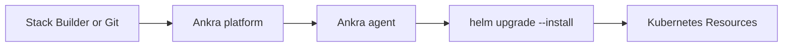
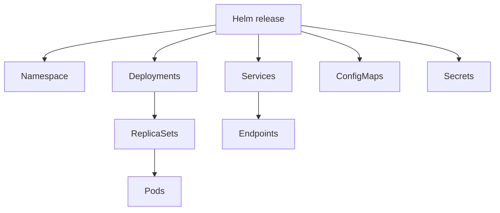

<Note>
Add-ons are Helm charts that Ankra deploys to your clusters and keeps reconciled. They provide a standardized way to extend your clusters with monitoring, networking, security, and custom applications.
</Note>

## What is an Add-on?

An add-on is a packaged application or tool that extends the functionality of your Kubernetes cluster. Add-ons are distributed as Helm charts and can include anything from monitoring tools and ingress controllers to security solutions and custom integrations. An add-on could even be your own application, integrated into the Ankra ecosystem for easy deployment and management.

---

## Architecture Overview

Understanding how add-ons flow from configuration to deployment helps you manage them effectively.

### Deployment Pipeline

**How it works:**

1. **Stack Builder or Git**: You configure add-ons with values and dependencies in the Stack Builder, or in a connected [GitOps repository](/concepts/gitops)
2. **Ankra platform**: Stores the desired state of the stack and dispatches the deploy
3. **Ankra agent**: Receives the deploy inside your cluster
4. **Helm release**: The agent runs `helm upgrade --install` with your values; the step succeeds once the release is healthy
5. **Kubernetes Resources**: The rendered manifests are applied to your cluster

This is the **native** engine, the default for new clusters. Clusters created before it may still use the ArgoCD engine, where an ArgoCD installation in the cluster applies the chart instead; the stack you build is the same either way. See [Deployment Engines](/concepts/deployment-engines).

### Add-on Status

An add-on's status in the dashboard shows whether its latest deploy succeeded and whether the release has drifted from the desired state. The agent reports drift to the platform, and an add-on whose settings enable self-heal is reconciled back. See [Deployment Engines](/concepts/deployment-engines) for how each engine detects and heals drift.

---

## Resource Hierarchy

Each add-on creates a hierarchy of Kubernetes resources. Understanding this hierarchy helps with troubleshooting and resource management.

### Typical Add-on Resource Structure

**Resource types commonly created by add-ons:**

| Category | Resources |
|----------|-----------|
| **Workloads** | Deployments, StatefulSets, DaemonSets, Jobs |
| **Networking** | Services, Ingresses, NetworkPolicies |
| **Configuration** | ConfigMaps, Secrets |
| **Storage** | PersistentVolumeClaims |
| **RBAC** | ServiceAccounts, Roles, RoleBindings |
| **Custom** | CRDs and custom resources |

Navigate to any installed add-on and open its [Resource Map](#resource-map) to see this hierarchy live for your cluster.

---

## Continuous Delivery Flow

<Steps>
  <Step title="Configuration Change">
    You modify add-on values in the Stack Builder, or update values in your connected Git repository.
  </Step>
  <Step title="Change detected">
    A change made in the Stack Builder is deployed when you deploy the stack. A change pushed to Git is picked up through the repository's webhook (or periodic polling).
  </Step>
  <Step title="Deploy">
    The agent applies the difference with Helm on the native engine, or through ArgoCD on a cluster still using that engine.
  </Step>
  <Step title="Health Check">
    The deploy is not marked successful until the release's resources are healthy.
  </Step>
</Steps>

### Sync Settings

Each add-on's settings control how it is kept in sync:

| Setting | Behavior |
|---------|----------|
| **Automated sync** | Changes to the desired state deploy to the cluster automatically |
| **Self-Heal** | Manual changes made in the cluster are reverted to match the desired state |
| **Prune** | Resources removed from the desired state are deleted from the cluster |

Both engines support these; see [Add-on Settings](/concepts/addon-settings).

---

## Manage Add-on Sources

An add-on source in Ankra is either a Helm repository URL or an OCI (Open Container Initiative) registry URL. These sources contain the Helm charts you want to use for deploying add-ons to your clusters. Helm charts are a standard way to package Kubernetes applications, making it easy to manage dependencies and versioning for complex workloads.

By connecting both public and private Helm repositories or OCI registries, you can access a wide range of Kubernetes add-ons. This lets you integrate open-source tools, vendor solutions, or your own custom charts - all from a single interface. Managing sources centrally ensures your team always has access to the latest and most secure versions of your preferred add-ons.

Setup steps live in one place: see [Registries](/guides/registries) for connecting a source, and [Create a Registry](/guides/create-a-registry) for hosting your own charts on GHCR.

---

## Stacks

To deploy an add-on onto your cluster, add it to a stack. You can add multiple add-ons and manifests to build a **Stack**, which is a repeatable, reusable set of components for your Kubernetes environments.
Stacks let you bundle everything your application or platform needs, from monitoring and logging to ingress controllers and security policies. You can version stacks, share them with your team, and deploy them to any cluster with a single action. This approach speeds up onboarding, reduces errors, and helps make sure every environment is production-ready.

[Learn more about Stacks →](/concepts/stacks)

---

## Install Add-ons

Add-ons in Ankra are installed through **Stacks**. This ensures your add-ons are bundled with their dependencies and can be managed as a cohesive unit.

<Steps>
  <Step title="Navigate to Stacks">
    Go to the **Stacks** section in your cluster and click **+ Create** (or edit an existing stack).
  </Step>
  <Step title="Add an Add-on">
    In the Stack Builder, click **Add Add-on**. Browse or search for charts from your connected registries.
  </Step>
  <Step title="Configure Values">
    Select the chart version and configure the values. Pin an exact chart version in production to avoid unexpected upgrades. You can use the AI Assistant (`⌘+J`) to help customize the configuration.
  </Step>
  <Step title="Deploy">
    For a new stack, click **Create Stack** to save and deploy it, installing the add-on on your cluster.
  </Step>
</Steps>

Ankra handles versioning, dependency management, and cluster targeting for you. This makes it easy to standardize tooling and services across all your environments, ensuring consistency and reducing operational overhead.

---

## Encrypting Sensitive Values with SOPS

When your add-on configuration contains sensitive data like passwords, API keys, or webhook URLs, use **SOPS** to encrypt them before storing in your GitOps repository.

<Steps>
  <Step title="Open the Add-on Editor">
    Edit an add-on within your stack by clicking on it in the Stack Builder.
  </Step>
  <Step title="Click the SOPS Button">
    In the values edit view, click the **SOPS** button in the toolbar to enable encryption.
  </Step>
  <Step title="Encrypt Sensitive Values">
    SOPS will encrypt sensitive values (like `adminPassword` or `slack_api_url`) while keeping keys readable for easier Git diffs.
  </Step>
  <Step title="Save">
    Save your add-on configuration. The encrypted values will be stored safely in your GitOps repository and decrypted automatically when deployed.
  </Step>
</Steps>

<Tip>
SOPS encryption requires initial setup. See [SOPS Encryption](/guides/sops) for configuration instructions.
</Tip>

---

## Operational Learnings with AGENTS.md

Every add-on can carry an **AGENTS.md** - a markdown document of operational learnings (upgrade gotchas, safe rollout order, values that must stay pinned) that teammates and Ankra's AI build up over time. Edit it from the **AGENTS.md** tab on the add-on in the Stack Builder; editing it never triggers a redeploy. See [Teach Your Agents with AGENTS.md](/platform/agents-md).

---

## Manifests

A **manifest** is a Kubernetes YAML file that defines resources or configuration, like namespaces, CRDs, or RBAC rules.
In Ankra, manifests help you:

- **Include manifests in stacks:** Make sure your clusters are ready for add-ons by setting up all prerequisites and custom resources first.
- **Automate environment setup:** Create the foundational resources your add-ons and workloads need, so your stacks are fully self-contained and repeatable.

Manifests are key for customizing clusters and making sure every deployment fits your team's needs.

[Learn more about Manifests →](/concepts/manifests)

---

## Viewing Installed Add-ons

Once deployed, you can monitor and manage add-ons from the Add-ons page.

### Add-ons List

Navigate to your cluster → **Add-ons** to see all installed add-ons with:

- **Name and Version**: The Helm chart name and deployed version
- **Status**: Current sync and health status
- **Namespace**: Where the add-on is deployed
- **Last Updated**: When the add-on was last modified

### Add-on Details

Click any add-on to view detailed information:

| Tab | Description |
|-----|-------------|
| **Overview** | Chart info, status, metadata, and deployment state |
| **Resource Map** | Visual hierarchy of all Kubernetes resources created by the add-on |
| **Values** | Current Helm values configuration |
| **Events** | Recent events related to the add-on's resources |

### Resource Map

The Resource Map provides a visual representation of all resources deployed by an add-on:

- **Hierarchical View**: See parent-child relationships (e.g., Deployment → ReplicaSet → Pod)
- **Quick Navigation**: Click any resource to view its details
- **Status Indicators**: Identify unhealthy or pending resources at a glance
- **Resource Types**: View all Kubernetes resource kinds in one place

<Tip>
Use the Resource Map when troubleshooting to quickly identify which resources are failing and their dependencies.
</Tip>

---

## Updating Add-ons

### Changing Values

1. Navigate to your stack in the Stack Builder
2. Click the add-on you want to modify
3. Update the Helm values as needed
4. Save and deploy the stack

### Upgrading Chart Versions

1. Edit the stack containing the add-on
2. Click the add-on and select a new chart version
3. Review any breaking changes in the chart changelog
4. Save and deploy to upgrade

<Warning>
Major version upgrades may include breaking changes. Review the chart's release notes and test in a non-production environment first.
</Warning>

### Rollback

If an upgrade causes issues:

1. Edit the stack and revert to the previous chart version
2. Or use GitOps: revert the commit in your Git repository
3. Ankra deploys the previous state again - from the stack when you deploy it, or from Git on its next sync

Add-on settings and Helm values are also readable and updatable through Ankra's AI and MCP clients, alongside sync, rollback, and uninstall - so routine add-on operations can run straight from chat or your editor. See the [MCP Tool Reference](/platform/mcp-tools#add-ons).

---

## Explore the Add-ons API

Want to automate add-on management or integrate with your CI/CD workflows?
Check out the [API Reference](/api-reference/introduction) for endpoints to list, install, and manage add-ons programmatically.

---

## Related

<CardGroup cols={2}>
  <Card title="Stacks" icon="cubes" href="/concepts/stacks">
    Build stacks with multiple add-ons.
  </Card>
  <Card title="Add-on Catalog" icon="box" href="/platform/addon-catalog">
    Browse available Helm charts.
  </Card>
  <Card title="GitOps" icon="git-alt" href="/concepts/gitops">
    Understand the GitOps workflow.
  </Card>
  <Card title="SOPS Encryption" icon="lock" href="/guides/sops">
    Encrypt sensitive add-on values.
  </Card>
</CardGroup>
