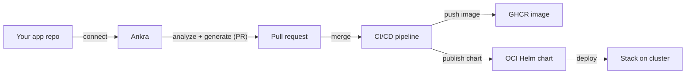

Applications take you from source code to a deployable, GitOps-managed workload. Connect an application's Git repository and Ankra analyzes it, generates the packaging it's missing - a Dockerfile, a Helm chart, and a CI/CD pipeline - and opens a pull request in your repo. Once merged, CI builds and publishes a container image and Helm chart, and you deploy the application as part of a [stack](/concepts/stacks).

<Warning>
**Closed beta.** Applications is in closed beta. The workflow is stable but the surface may still change, and it is enabled per organisation on request. [Contact support](/platform/support) to have it turned on for your organisation.
</Warning>

<Note>
Applications connect to **GitHub** repositories and use a [GitHub credential](/integrations/github). The generated CI/CD pipeline pushes the container image to GitHub Container Registry (GHCR) and publishes the Helm chart as an OCI artifact.
</Note>

---

## How it works



<Steps>
  <Step title="Connect a repository">
    Provide a name, a GitHub credential, and the repo owner, name, and branch (defaults to `main`).
  </Step>
  <Step title="Analyze and generate">
    Ankra inspects the repository, detects the language and framework, and generates the artifacts it needs - a Dockerfile, a Helm chart, and a CI/CD workflow - opening a pull request with the changes.
  </Step>
  <Step title="Merge the pull request">
    Review and merge the PR. Merging activates the CI/CD pipeline in your repository.
  </Step>
  <Step title="Build and publish">
    CI builds and pushes the container image to GHCR and publishes the Helm chart as an OCI artifact. Ankra surfaces the image URL, chart OCI URL, and the `helm repo add` command.
  </Step>
  <Step title="Deploy">
    Deploy the application onto a cluster as part of a [stack](/concepts/stacks). Ankra tracks its readiness from there.
  </Step>
</Steps>

---

## What Ankra tracks

For each application you see:

- **State** and **analysis status** - where the application is in the connect/analyze/generate/build lifecycle, with an error message if something needs attention.
- **Repository** - owner, name, branch, and URL.
- **Artifacts** - the container image URL, the Helm chart OCI URL, and a ready-to-copy `helm repo add` command.
- **Pull request** - a link to the generated PR.
- **Jobs** - the underlying platform jobs for the application, so you can follow analysis and generation as it runs.

### Security scanning

Applications include code and container security insights, so vulnerabilities surface alongside the build rather than in a separate tool. Pair this with [AI Insights](/platform/ai-insights) for proactive analysis.

---

## Preview demos

Before you merge, you can spin up a **throwaway demo** of a pull request or branch build to see it running. Each demo is deployed into its own isolated namespace (`ankra-demo-pr-<n>` or `ankra-demo-br-<branch>`) on the organisation's **staging cluster**, PodSecurity-hardened and quota-bounded, and is automatically torn down when its TTL expires - so it can never affect existing workloads.

<Steps>
  <Step title="Configure a staging cluster">
    An admin sets the organisation's staging cluster under **Organisation Settings → AI → Environment**. Optionally set a **demo base domain** (with an ingress class and TLS secret) there too - this is what gives demos a public URL.
  </Step>
  <Step title="Deploy a demo">
    Deploy a branch or PR demo from the application's **Demos** tab, from the CLI, or by asking the AI assistant. The demo pulls the image tag the PR/branch build pushed.
  </Step>
  <Step title="Open the preview">
    When a public host is available, Ankra returns a **preview URL** you can open directly. Otherwise the demo stays reachable in-cluster (service DNS + a `kubectl port-forward` command).
  </Step>
</Steps>

### The preview URL

Ankra resolves the demo's public hostname automatically, and every surface (portal, CLI, MCP, and automatic PR previews) uses the same rule:

1. **An organisation demo base domain**, if configured, wins outright - the host is `<namespace>.<demo-base-domain>`, served with your configured ingress class and TLS secret.
2. **Otherwise, the staging cluster's own delegated DNS zone**, but only when that zone is active - giving `<namespace>.<cluster-id>.<org-id>.ankra.cc`, a hostname the `external-dns` running on that cluster can resolve.
3. **Otherwise the demo stays in-cluster-only** - no ingress is created, and you reach it with the returned service DNS name and `kubectl port-forward`.

<Note>
A demo only gets a resolvable public URL when the organisation has a demo base domain configured **or** the staging cluster has an active Ankra DNS zone. Without either, the demo still deploys - it just stays in-cluster-only.
</Note>

### Deploying a demo

<Tabs>
  <Tab title="Portal">
    Open the application's **Demos** tab, pick a branch or enter a pull request number, and deploy. The tab shows active demos, the preview URL, and the remaining TTL.
  </Tab>
  <Tab title="CLI">
    ```bash
    # Deploy a branch demo
    ankra application demo deploy <application-id> --branch feature/login

    # Deploy a PR demo with an explicit TTL
    ankra application demo deploy <application-id> --pr-number 42 --ttl-hours 8

    # List active demos, then stop one
    ankra application demo list <application-id>
    ankra application demo stop <application-id> <workspace-id>
    ```
    The deploy response includes `preview_url` when a public host was resolved.
  </Tab>
  <Tab title="AI / MCP">
    Ask the AI assistant to demo a pull request, or call the `deploy_pr_demo` tool directly (it is allowed in **Ask** mode - the demo is isolated and self-expiring). The result carries the same `preview_url`. Tear down early with `demo_stop`.
  </Tab>
</Tabs>

Opening a pull request on a connected application also deploys a preview automatically and posts the URL back as a PR comment, once a staging cluster is configured.

---

## Managing applications

| Action | What it does |
|--------|--------------|
| **Retry** | Re-run analysis and generation after fixing an issue (for example, adding the right credential or repository permissions) |
| **Reconcile** | Re-evaluate the application against its repository and refresh its state |
| **Delete** | Disconnect the application from Ankra |

---

## Prerequisites

<Steps>
  <Step title="Connect GitHub">
    Add a [GitHub credential](/integrations/github) with access to the application's repository. The Ankra GitHub App needs permission to open pull requests and commit workflow files; the generated CI/CD pipeline then builds and pushes the image to GHCR using the repository's own GitHub Actions token. See the [GitHub integration](/integrations/github) for the exact scopes (including the optional permission that lets Ankra fix the Actions token so the first build can push to GHCR).
  </Step>
  <Step title="Have a target cluster">
    Make sure you have a [cluster](/guides/import-cluster) with the [agent](/concepts/cluster-agent) connected to deploy onto.
  </Step>
</Steps>

---

## API

Applications are available over the API for CLI and scripted use, under `/api/v1/org/applications` (bearer-token authenticated) - create, list, inspect, retry, reconcile, and delete. See the [API Reference](/api-reference/introduction) for endpoints and schemas.

The same lifecycle is available through Ankra's AI and MCP clients - connect, deploy, retry, reconcile, and delete applications, and follow their CI workflow runs - see the [MCP Tool Reference](/platform/mcp-tools#applications).

See the [CI/CD Pipeline guide](/guides/cicd-pipeline) for how the generated pipeline fits into GitOps.
