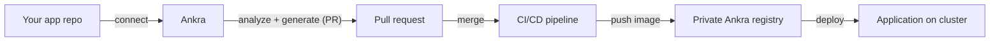

Applications take you from source code to a deployable workload. Connect an application's Git repository and Ankra analyzes it, generates the packaging it's missing, and opens a pull request in your repository. Once merged, CI builds and publishes a container image that you can deploy to a cluster.

<Warning>
**Closed beta.** Applications is in closed beta. The workflow is stable but the surface may still change, and it is enabled per organisation on request. [Contact support](/platform/support) to have it turned on for your organisation.
</Warning>

<Note>
Applications connect to **GitHub** repositories and use a [GitHub credential](/integrations/github). By default the generated CI/CD pipeline pushes the container image to your organisation's private Ankra registry; if you already run your own registry, [declare it](#using-your-own-registry) and Ankra publishes to and reads from it instead.
</Note>

---

## How it works


```mermaid
flowchart LR
    Repo[Your app repo] -->|connect| Ankra[Ankra]
    Ankra -->|"analyze + generate (PR)"| PR[Pull request]
    PR -->|merge| CICD[CI/CD pipeline]
    CICD -->|push image| Registry[Private Ankra registry]
    Registry -->|deploy| Cluster[Application on cluster]
```

<Steps>
  <Step title="Connect a repository">
    Provide a name and a GitHub credential, then pick the repository and a branch from the repository's own branch list - the default branch is preselected, and **Enter a different branch** lets you type one that does not exist yet.
  </Step>
  <Step title="Analyze and generate">
    Ankra inspects the repository, detects the language and framework, and generates the artifacts it needs: a Dockerfile, Kubernetes manifests, and a CI/CD workflow.
  </Step>
  <Step title="Merge the pull request">
    Review and merge the PR. Merging activates the CI/CD pipeline in your repository.
  </Step>
  <Step title="Build and publish">
    CI builds and pushes the container image to the organisation's private Ankra registry. Ankra surfaces the image URL and scans the published image.
  </Step>
  <Step title="Deploy">
    Deploy the application onto a cluster. Ankra verifies that the image was published and tracks the rollout.
  </Step>
</Steps>

---

## What Ankra tracks

For each application you see:

- **State** and **analysis status** - where the application is in the connect/analyze/generate/build lifecycle, with an error message if something needs attention.
- **Repository** - owner, name, branch, and URL.
- **Components** - the repository's deployable apps. An ordinary repository has one; a monorepo has one per app.
- **Artifacts** - the private container image URL and the latest published build, per component.
- **Pull request** - a link to the generated PR.
- **Jobs** - the underlying platform jobs for the application, so you can follow analysis and generation as it runs.

### Monorepos

A repository that builds more than one deployable app is onboarded as a **monorepo**: Ankra records one component per app, and each component gets its own packaging and its own image.

| Per component | Where it lives |
| --- | --- |
| Dockerfile | `<component-directory>/Dockerfile` |
| Kubernetes manifests | `.ankra/manifests/<component>-*.yaml` |
| Build workflow | `.github/workflows/<component>-build-and-publish.yml`, with a `paths:` filter scoped to the component's directory so touching one app does not rebuild the others |
| Container image | `<your-registry-project>/<repository>/<component>` |

Ankra decides the components from, in order: the per-component workflows the repository already carries (so re-running analysis never renames a component and orphans the images it has published), the apps the analysis proposed, then the repository's structure - two or more Dockerfiles in subdirectories and no Dockerfile at the root, or a workspace marker (`nx.json`, `turbo.json`, `lerna.json`, `pnpm-workspace.yaml`, `go.work`) plus two or more subdirectories with their own dependency manifest. **A Dockerfile at the repository root always means a single app**, whatever else the repository contains.

Build state, published images, deploys, demos, and container scanning are all reported per component, so an application whose API component built and whose frontend did not says exactly that.

### Using your own registry

An application publishes to your organisation's private Ankra registry unless you say otherwise. If you already operate a registry - the same Harbor whose OCI charts Ankra indexes, for instance - declare it on the application and Ankra publishes there, reads the published tags back from there, and pulls from there.

Declare it on an existing application from **Settings** → **Image registry**, from the CLI, or with `image_registry` when you create the application. The settings panel also reports the host and project the declaration resolved to and the image repository each component is expected to publish to, so you can compare them against where your builds actually push.

```bash
# Show the effective registry and the expected repositories
ankra application registry get <application-id>

# Declare a registry you operate
ankra application registry set <application-id> \
  --url oci://artifact.example.com/commerce-images \
  --credential example-harbor-pull

# Go back to your organisation's own Ankra registry
ankra application registry clear <application-id>
```

The same declaration at create time:

```json
{
  "name": "commerce",
  "app_repo_credential_name": "github",
  "app_repo_owner": "smartoptics-dwdm",
  "app_repo_name": "commerce",
  "image_registry": {
    "url": "oci://artifact.example.com/commerce-images",
    "credential_name": "example-harbor-pull",
    "pull_secret_name": "harbor-registry",
    "username_secret_name": "HARBOR_USERNAME",
    "password_secret_name": "HARBOR_PASSWORD"
  }
}
```

| Field | Meaning |
| --- | --- |
| `url` | The registry project images publish to, as `oci://<host>/<project>`. A deeper path becomes a prefix every component's repository nests under. |
| `credential_name` | An existing [registry credential](/integrations/helm-registries) of the organisation - the same credential resource your chart registries authenticate with. Ankra reads published tags and builds the cluster pull secret from it. |
| `api_url` | Optional. The registry's management API base; defaults to `https://<host>`, which is where a Harbor serves its own API. |
| `pull_secret_name` | Optional. The `kubernetes.io/dockerconfigjson` Secret the generated manifests reference through `imagePullSecrets`. Defaults to `ankra-registry-pull`. |
| `username_secret_name` / `password_secret_name` | Optional. The repository Actions secrets the build workflow logs in with. Default to `ANKRA_REGISTRY_USERNAME` / `ANKRA_REGISTRY_PASSWORD`. |
| `manage_actions_secrets` | Optional, default `false`. See below. |

**Ankra does not mint robots for a registry you operate.** With a declared registry, setup names the two Actions secrets the workflow reads and leaves them to you, rather than writing a credential Ankra happens to hold over a push robot you administer. Publish readiness reports whether those secrets exist and names them. Set `manage_actions_secrets: true` to have Ankra write the declared credential into them instead.

<Warning>
`credential_name` is what makes a declaration usable rather than merely descriptive. Without one Ankra records where the images live but cannot read their tags or pull them, so publish readiness, the demo build check and the deploy gate all keep reporting the application as never built - while it publishes healthily to a registry Ankra simply cannot see.
</Warning>

<Note>
On a monorepo, a component may declare its own `image_registry` to publish into a different project of the same registry - useful when each app has its own robot accounts and retention rules. A component's declaration wins over the application's; the application's applies to every component that declares none.
</Note>

Publish readiness, the deploy gate, image tag listings, container scanning, and preview demos all resolve the declared registry, so an application whose images live outside Ankra reports what is actually published rather than staying blocked on an artifact that was never going to appear in Ankra's own project.

### Security scanning

Applications include code and container security insights, so vulnerabilities surface alongside the build rather than in a separate tool. On a monorepo, the image tags and the scanned image reference follow the component you select; code and IaC findings cover the whole repository, because that is where those scanners run. Pair this with [AI Insights](/platform/ai-insights) for proactive analysis.

---

## Preview demos

Before you merge, you can spin up a **throwaway demo** of a pull request or branch build to see it running. Each demo is deployed into its own isolated namespace (`ankra-demo-pr-<n>` or `ankra-demo-br-<branch>`) on the organisation's **staging cluster**, PodSecurity-hardened and quota-bounded, and is automatically torn down when its TTL expires - so it can never affect existing workloads.

<Steps>
  <Step title="Configure a staging cluster">
    An admin sets the organisation's staging cluster under **AI** → **Settings** → **Workspaces**. Optionally set a **demo base domain** (with an ingress class and TLS secret) there too - this is what gives demos a public URL.
  </Step>
  <Step title="Deploy a demo">
    Deploy a branch or PR demo from the application's **Demos** tab, from the CLI, or by asking the AI assistant. The demo pulls the image tag the PR/branch build pushed.
  </Step>
  <Step title="Open the preview">
    When a public host is available, Ankra returns a **preview URL** you can open directly. Otherwise the demo stays reachable in-cluster (service DNS + a `kubectl port-forward` command).
  </Step>
</Steps>

Two guides cover the two ways a demo starts: [branch demos](/guides/branch-demos) walks the launch dialog field by field, and [PR preview environments](/guides/pr-preview-environments) covers the automatic per-pull-request flow.

### The preview URL

Ankra resolves the demo's public hostname automatically, and every surface (portal, CLI, MCP, and automatic PR previews) uses the same rule:

1. **An organisation demo base domain**, if configured, wins outright - the host is `<namespace>.<demo-base-domain>`, served with your configured ingress class and TLS secret.
2. **Otherwise, the staging cluster's own delegated DNS zone**, but only when that zone is active - giving `<namespace>.<cluster-id>.<org-id>.ankra.cc`, a hostname the `external-dns` running on that cluster can resolve.
3. **Otherwise the demo stays in-cluster-only** - no ingress is created, and you reach it with the returned service DNS name and `kubectl port-forward`.

<Note>
A demo only gets a resolvable public URL when the organisation has a demo base domain configured **or** the staging cluster has an active Ankra DNS zone. Without either, the demo still deploys - it just stays in-cluster-only.
</Note>

### Deploying a demo

A demo deploys **every component** of the application by default. A single-app application runs its one image; a monorepo runs one pod per component — the frontend and the API of a two-app repository both come up, wired together, instead of half an application answering where the other half belonged. You can still deselect components or demo a single one.

<Tabs>
  <Tab title="Portal">
    Open the application's **Demos** tab, pick a branch or enter a pull request number, and deploy. The tab shows active demos, the preview URL, and the remaining TTL. Each demo links to its own detail page - live provisioning progress read from the staging cluster, the namespace's bill of materials with manifests (grouped per component), Kubernetes events, and pod logs, plus the preview URL or port-forward command to reach it. On a monorepo the launch dialog lists every component with its own build status and tag, lets you include or exclude each, and marks the **web entry** — the component that owns the demo URL.
  </Tab>
  <Tab title="CLI">
    ```bash
    # Deploy a branch demo
    ankra application demo deploy <application-id> --branch feature/login

    # Deploy a PR demo with an explicit TTL
    ankra application demo deploy <application-id> --pr-number 42 --ttl-hours 8

    # List active demos, then stop one
    ankra application demo list <application-id>
    ankra application demo stop <application-id> <workspace-id>

    # Inspect a demo: record + provisioning steps, and a bounded log tail
    ankra application demo detail <application-id> <workspace-id>
    ankra application demo logs <application-id> <workspace-id> --tail 200

    # Read or edit the saved demo defaults
    ankra application demo config get <application-id>
    ankra application demo config set <application-id> \
      --database=true --env 'DATABASE_URL=${{ ankra.demo_database.url }}' \
      --migrate-command 'pnpm run db:migrate' --database-extension vector

    # Dispatch the AI pre-setup mission for a failed demo
    ankra application demo fix <application-id> <workspace-id>
    ```
    The deploy response includes `preview_url` when a public host was resolved. `config set` fetches the saved configuration first and applies only the flags you pass, so it never drops entries or dependency designations you did not name.
  </Tab>
  <Tab title="AI / MCP">
    Ask the AI assistant to demo a pull request, or call the `deploy_pr_demo` tool directly (it is allowed in **Ask** mode - the demo is isolated and self-expiring). The result carries the same `preview_url`, names the `entry_component`, and lists every deployed workload under `components[]` with its image, container port and ingress path - so a multi-component launch reports what it actually provisioned rather than only the component that owns the URL. Pass `entry_component` to choose which component serves `/`. Tear down early with `demo_stop`.
  </Tab>
</Tabs>

Opening a pull request on a connected application also deploys a preview automatically and posts the URL back as a PR status comment that updates in place - see the [PR preview environments guide](/guides/pr-preview-environments) for the comment lifecycle, requirements, and troubleshooting.

### Monorepo demos: every component, one URL

A monorepo demo deploys each component as its own Deployment and Service inside the demo namespace, and the demo only reports **ready** once every component accepts connections:

- **The web entry owns the demo URL.** Ankra picks the frontend-shaped component (a name or directory like `frontend`, `web`, `ui`, `portal`) as the entry serving `/` on the demo host; you can move the entry in the launch dialog or with `entry_component` on the API.
- **API components share the host under a path.** The single API-shaped component (`api`, `backend`, `server`) is published under `/api` on the same demo host, routed straight to its Service — so a browser calling `/api/...` reaches the API even when the frontend's own proxy target was baked for another environment. Override per component with `ingress_path`.
- **Save the routing when the guess is wrong.** The entry and the `/api` path above are heuristics, and the lanes with no human in the loop — the automatic PR previews and the MCP demo tools — have no launch dialog to correct them in. Declare the routing once in the demo configuration and every lane follows it:

  ```json
  {
    "routing": {
      "entry_component": "commerce-frontend",
      "components": [{ "name": "commerce-backend", "ingress_path": "/api/v1" }]
    }
  }
  ```

  A declaration is authoritative: the `/api` guess stops running, so a component you leave out of `components` stays reachable in-cluster only rather than picking up a path it never asked for. Per-launch `ingress_path` overrides still win over the declaration. Clear it with `"routing": null` to return every lane to the heuristics.
- **Components reach each other by name.** Every component's Service is named after it, so in-namespace URLs like `http://crm-api:8090` resolve. Env values can also use placeholders that resolve at deploy time:

| Placeholder | Resolves to |
|---|---|
| `${{ ankra.demo_component.<name>.url }}` | `http://<component>:<port>` inside the namespace |
| `${{ ankra.demo_component.<name>.host }}` | The component's Service name |
| `${{ ankra.demo_component.<name>.port }}` | The component's container port |

The saved [migration command](#environment-variables-and-a-throwaway-database) runs once per deploy, inside the image of the component that owns the schema (the primary component - usually the backend). Demo environment defaults and the throwaway database are shared by every component of the demo.

<Note>
Existing demos and single-app applications are unaffected: a demo recorded before multi-component support (or of an application with one component) keeps exactly the previous single-pod shape.
</Note>

### Environment variables and a throwaway database

Most real applications need configuration to boot — a database name, an API key, an SMTP host. Demos support both **per-application defaults** and **per-launch overrides**, so any codebase can run as a demo without changes:

- **Defaults** live behind the gear button on the **Demos** tab (*Demo settings*). Every demo of the application inherits them — manual launches, CLI/MCP deploys, and the automatic PR previews.
- **Overrides** are set per launch in the *Environment & database* section of the launch dialog (or via the `env` argument of `deploy_pr_demo`). Overrides win by name.

Values marked **secret** are stored as Ankra secret slots (Vault-backed) — the plaintext never persists and is mounted into the demo as a Kubernetes Secret at deploy time.

**Need a database?** Toggle **Attach a throwaway Postgres** and an ephemeral Postgres is provisioned inside the demo namespace with a random per-demo password, destroyed together with the demo. Because every codebase names its configuration differently, nothing is injected automatically — reference these placeholders in your env *values* and they resolve when the demo starts:

| Placeholder | Resolves to |
|---|---|
| `${{ ankra.demo_database.url }}` | Full `postgres://` connection string |
| `${{ ankra.demo_database.host }}` | In-namespace service host |
| `${{ ankra.demo_database.port }}` | `5432` |
| `${{ ankra.demo_database.name }}` | Database name |
| `${{ ankra.demo_database.user }}` | Database user |
| `${{ ankra.demo_database.password }}` | The per-demo random password |

<Note>
The throwaway database is ephemeral by design: it starts empty on every deploy and is wiped with the namespace. The database runs a pgvector-capable Postgres, so migrations using `CREATE EXTENSION vector` work. `.url` and `.password` references are always delivered through a Kubernetes Secret, never as plain env text.
</Note>

**Migrations.** If your image does not run its own migrations on boot, set a **migration command** in the demo configuration (`migrate_command`) — for example `pnpm run db:migrate` or `alembic upgrade head`. It runs inside your application image (`sh -c`) as an init container, after the database accepts connections and with the same environment the app sees, so a fresh demo database provisions its schema before the first request. Because every deploy starts the database empty, the command re-runs on every deploy — write migrations to be idempotent (every standard migration tool is).

<Note>
The command runs with your image's `WORKDIR` as the working directory **and** on `PYTHONPATH`. Python puts the *script's* directory on `sys.path`, not the working directory, so a migration entrypoint that is a script rather than a console script — `python scripts/bootstrap_database.py` — could not import the application package sitting beside it and died at import with `ModuleNotFoundError`. Setting `PYTHONPATH` yourself in the command still wins.
</Note>

**Extensions.** If your schema needs Postgres extensions beyond what migrations create themselves, list them in `database_extensions` (for example `["vector"]`) and the demo database creates them at initdb, before your migrations run.

Ankra detects both automatically when it analyses a repository: a Postgres client dependency, an ORM configuration, or a composed database marks the application as database-needing, its referenced connection variables are wired to the `${{ ankra.demo_database.* }}` placeholders, and a recognised migration script becomes the migration command — so the first demo of a database-backed application works without any manual configuration. Detection only ever seeds an application that has no demo configuration yet; it never overwrites what you or the pre-setup agent saved.

### The demo container port

The demo's readiness probe, Service, and preview route all target one container port, resolved in this order: the component's recorded port, the generated runtime Dockerfile's `EXPOSE`, the generated Deployment manifest's `containerPort`, the analysed `target_port` parameter, and only then the platform default. The launch dialog shows the resolved port and where it came from; a port you did not edit is left to the platform to resolve.

When the resolved port is still wrong — stale analysis, a hand-edited Dockerfile — the platform corrects itself at runtime: a demo whose container runs cleanly but never accepts connections has its logs read for the port the server actually announces (`Accepting connections at…`, `Listening on…`, and the other common startup banners). If the evidence is unambiguous, the demo is repointed at the announced port on the fly, the correction is recorded on the application so the next launch resolves it statically, and the demo detail page shows the correction. Ambiguous evidence never auto-corrects; it flows into the failure message ("Nothing accepted connections on port 3000. The container's logs say it listens on port 8001.") and dispatches the pre-setup agent instead.

### Automatic pre-setup when a demo crashes

An image that validates its environment on boot — refusing to start without a database URL, an auth secret, an API key — crash-loops when demoed with no configuration. Ankra now detects this and fixes it with an agent:

1. When a demo fails with a **startup crash** (CrashLoopBackOff or a container configuration error), a **failed migration command**, or a port-evidence timeout (the container announced a different port than the demo probed), Ankra dispatches a one-shot **pre-setup agent** for it automatically. The run appears on the **AI agents** page like any other mission.
2. The agent reads the crashed container's logs, works out which environment variables the application demands, and generates a **pre-setup**: missing database URLs become `${{ ankra.demo_database.* }}` references with the throwaway Postgres enabled, secrets get fresh random values, and mode flags get the value that avoids external side effects.
3. It saves the pre-setup as the application's demo defaults — so **every future demo inherits it** — and redeploys the failed demo to prove it boots.

The agent can also set the migration command and database extensions when the logs show schema or `CREATE EXTENSION` failures. It never weakens the application's own validation, never reuses values found in logs, and merges with existing demo settings rather than replacing what you configured. Dispatch is bounded to one run per demo per day; image-pull failures and provisioning timeouts never dispatch (no environment can fix those). You can also trigger it on demand with `POST /org/applications/{application_id}/demos/{workspace_id}/fix`, or just ask the AI assistant to fix the failed demo — the chat has the same `get_demo_diagnostics`, `update_application_demo_config`, and `redeploy_demo` tools the mission uses.

---

## Managing applications

| Action | What it does |
|--------|--------------|
| **Retry** | Re-run analysis and generation after fixing an issue (for example, adding the right credential or repository permissions) |
| **Reconcile** | Re-evaluate the application against its repository and refresh its state |
| **Delete** | Disconnect the application from Ankra |

Which Ankra AI lanes run on the application's repository - the pull request review, the organisation skills review, the automatic preview URL - is set per application under **Settings** → **Ankra AI**. See [Application AI settings](/platform/application-ai).

---

## Prerequisites

<Steps>
  <Step title="Connect GitHub">
    Add a [GitHub credential](/integrations/github) with access to the application's repository. The Ankra GitHub App needs permission to open pull requests, commit workflow files, and manage Actions secrets. Ankra installs the Ankra registry credentials on the repository automatically; for [your own registry](#using-your-own-registry) you set the login secrets yourself.
  </Step>
  <Step title="Have a target cluster">
    Make sure you have a [cluster](/guides/import-cluster) with the [agent](/concepts/cluster-agent) connected to deploy onto.
  </Step>
</Steps>

---

## API

Applications are available over the API for CLI and scripted use, under `/api/v1/org/applications` (bearer-token authenticated) - create, list, inspect, retry, reconcile, and delete. See the [API Reference](/api-reference/introduction) for endpoints and schemas.

The same lifecycle is available through Ankra's AI and MCP clients - connect, deploy, retry, reconcile, and delete applications, and follow their CI workflow runs - see the [MCP Tool Reference](/platform/mcp-tools#applications).

See the [CI/CD Pipeline guide](/guides/cicd-pipeline) for how the generated pipeline fits into GitOps.
