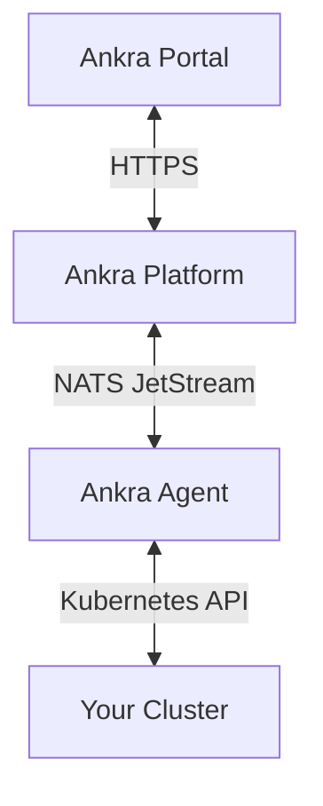

Ankra has to reach into your cluster to deploy Stacks, read resources and stream logs, but you should not have to open the cluster to the internet for that. The **Ankra Agent** solves this: it runs inside the cluster, opens an outbound connection to Ankra, and carries every request over it. [How Ankra Works](/concepts/how-ankra-works) shows where the agent sits in the overall model.

The agent ships as a single Go binary on the **2.x version track** (`2.0.x`), installed with a Helm chart into the `ankra` namespace. Whether the platform upgrades a cluster's agent for you depends on the auto-upgrade settings described in [Upgrading the Agent](#upgrading-the-agent).

<Note>
The agent requires **cluster-admin** permissions to manage all Kubernetes resources and deploy add-ons.
</Note>

## What the Agent Does

- **Resource browsing** - lists and watches Deployments, Pods, Services and other resource types for the portal, CLI and AI.
- **Pod logs** - streams container logs to Ankra.
- **Deployments** - installs and upgrades your Stacks' add-ons and manifests with the native Helm engine (the default) or through ArgoCD. See [Deployment Engines](/concepts/deployment-engines).
- **kubectl access** - proxies authenticated `kubectl` requests to the cluster API server with no inbound ports. See [Accessing Clusters with kubectl](/guides/kubeconfig).
- **Fleet map reporting** - optionally reports the cluster's public egress IP so it appears on the [Dashboard](/platform/dashboard) world map.

---

## Installation

When you import a cluster, Ankra generates a Helm install command with a unique token. It looks like this:

```bash
helm upgrade --install ankra-agent oci://registry.ankra.cloud/ankra/ankra-agent \
  --version <agent-version> \
  --set config.ankra_url=https://platform.ankra.app \
  --set config.token=<your-token> \
  --namespace=ankra --create-namespace
```

Copy the exact command from the Import dialog rather than typing this one: it pins the agent version and carries your cluster's token.

The agent will connect to the platform and your cluster will appear online within seconds.

### Verify Installation

Check the agent is running:

```bash
kubectl get pods -n ankra
```

View agent logs:

```bash
kubectl logs -n ankra -l app.kubernetes.io/name=ankra-agent -f
```

---

## Cluster States

Every cluster carries one status badge, shown on the clusters list, in the cluster's sidebar and in the activity drawer. It combines whether the agent is connected with the health of what runs on the cluster:

| Status | What it means |
|--------|---------------|
| **Healthy** | The agent is connected and nothing needs attention. |
| **Needs Attention** | At least one thing needs a person: the agent is offline, a resource is failing, the last operation failed, GitOps sync is failing or has a merge conflict, a resource is stuck pending, the kubelet version skew is unsupported, or there is an open AI insight. The badge is red when any of these is critical (agent offline, failing resources, a failed operation, failing GitOps sync, unsupported kubelet skew) and amber otherwise. |
| **Awaiting Connection** | An imported cluster whose agent has never connected. Run the install command to finish the import. |
| **Provisioning** | Ankra is building the cluster. The agent connects when setup completes. |
| **Stopped** | The cluster has been powered off on purpose. Start it to resume live data. |
| **Archived** | The cluster is parked and monitoring is paused. |
| **Destroying** | A playground cluster is being torn down. It leaves the list when the teardown finishes. |

The activity drawer lists the reasons behind a **Needs Attention** badge. A real failure always wins: a cluster that is provisioning, awaiting connection or stopped still shows **Needs Attention** if an operation failed or a resource is failing.

While the agent is offline, the cluster's workloads keep running, but Ankra cannot deploy to the cluster or show live resources and logs. Its configuration and history stay available. To bring it back, see [Agent Not Connecting](#agent-not-connecting).

---

## Configuration Reference

### Required Settings

| Parameter | Description |
|-----------|-------------|
| `config.token` | Authentication token (provided during cluster import) |
| `config.ankra_url` | Platform URL (default: `https://platform.ankra.app`) |

### Using an Existing Secret

For production environments, store the token in a Kubernetes secret:

```bash
kubectl create secret generic ankra-agent-secret \
  --namespace ankra \
  --from-literal=token=YOUR_UNIQUE_TOKEN
```

Then reference it in your Helm install:

```bash
helm upgrade --install ankra-agent oci://registry.ankra.cloud/ankra/ankra-agent \
  --namespace ankra \
  --set config.existing_secret_name=ankra-agent-secret \
  --set config.secret_key=token
```

### Performance Tuning

For large clusters (1000+ resources), adjust these settings:

| Parameter | Default | Description |
|-----------|---------|-------------|
| `nats_worker_max_workers` | `15` | Worker threads for command processing |
| `read_worker_count` | `5` | Concurrent worker slots for read jobs |
| `write_worker_count` | `5` | Concurrent worker slots for write jobs (create/update/delete) |
| `resources.limits.memory` | `512Mi` | Memory limit |
| `resources.requests.memory` | `256Mi` | Memory request |
| `replica_count` | `1` | Number of agent replicas |

Example for large clusters:

```bash
helm upgrade --install ankra-agent oci://registry.ankra.cloud/ankra/ankra-agent \
  --namespace ankra \
  --set config.token="YOUR_TOKEN" \
  --set nats_worker_max_workers=25 \
  --set resources.limits.memory=1Gi \
  --set resources.requests.memory=512Mi
```

### Fleet world map (public IP reporting)

To place an imported cluster on the [Dashboard](/platform/dashboard) world map when it has no recognisable cloud region, let the agent report its public egress IP on check-in:

```bash
helm upgrade --install ankra-agent oci://registry.ankra.cloud/ankra/ankra-agent \
  --namespace ankra \
  --set config.token="YOUR_TOKEN" \
  --set public_ip.reporting_enabled=true
```

When enabled, the agent performs an outbound HTTP lookup (to `public_ip.lookup_url`, default `https://api.ipify.org`) and reports the result. Leave it **disabled** (the default) for air-gapped clusters or where egress IP lookups are undesirable.

### All Helm Values

The complete value list - connection, workers, watch tuning, public IP reporting, image, security contexts, scheduling, and metrics - lives in the [Agent Helm Values reference](/reference/agent-helm-values).

<Note>
The agent runs as a **non-root** container by default (`runAsNonRoot: true`, UID/GID `1000`, `readOnlyRootFilesystem: true`, all Linux capabilities dropped, `seccompProfile: RuntimeDefault`). Because the root filesystem is read-only, the chart mounts writable `emptyDir` volumes for `/tmp`, `~/.cache`, and `~/.config` via `writable_volumes.enabled` (default `true`). Don't lower these security settings unless you are running a custom image.
</Note>

### Advanced tuning via `extra_env`

Less-common knobs are set as environment variables through `extra_env`:

| Env var | Default | Description |
|---------|---------|-------------|
| `KUBERNETES_HTTP2_ENABLED` | `false` | Enable HTTP/2 to the API server (only if the path supports it cleanly) |
| `KUBERNETES_REQUEST_MAX_ATTEMPTS` | `3` | List/get retry attempts on connection-terminated errors |
| `KUBE_PROXY_UNARY_CONCURRENCY` | `64` | Max concurrent unary requests through the kubectl proxy |
| `KUBE_PROXY_STREAM_CONCURRENCY` | `128` | Max concurrent streaming connections (watch/logs/exec) through the proxy |
| `DYNAMIC_API_DISCOVERY_ENABLED` | `false` | Discover and watch additional API groups dynamically |
| `RECONCILE_AUTO_HEAL_ENABLED` | `true` | Auto-heal native-engine releases stuck mid-operation |
| `FORWARD_SERVICE_REQUEST_MAX_TIMEOUT_SECONDS` | `120` | Upper bound for platform-requested forwarded-request timeouts (e.g. Prometheus) |

```yaml
extra_env:
  - name: KUBERNETES_REQUEST_MAX_ATTEMPTS
    value: "5"
```

---

## Architecture

The agent uses a NATS-based architecture for real-time communication:



**Key features:**
- **Outbound connections only** - The agent initiates all connections, no inbound ports required
- **Real-time streaming** - Resource data streams efficiently using pagination
- **Automatic reconnection** - Handles network interruptions gracefully
- **kubectl proxy** - Forwards authenticated `kubectl` requests (including `watch`, `logs -f`, and `exec`) from the platform to the cluster API server, so you can reach private clusters without inbound access. See [Accessing Clusters with kubectl](/guides/kubeconfig).
- **Health monitoring** - Exposes `/livez` and `/readyz` endpoints on port 8080

---

## Network Requirements

The agent requires outbound connectivity to:

| Endpoint | Port | Purpose |
|----------|------|---------|
| `platform.ankra.app` | 443 | API communication |
| `connect.ngs.global` | 4222 | NATS real-time streaming |

No inbound ports need to be opened on your cluster.

---

## Upgrading the Agent

New agent releases are published on the `2.0.x` version track. When auto-upgrade is on, the platform rolls clusters forward to the latest published version, a few clusters at a time. You can still trigger an upgrade yourself at any time.

- Organisations created since 7 September 2026 have **Auto-upgrade Agents** on by default. Older organisations turn it on in **Organisation Settings** → **General**.
- A single cluster can opt out with **Disable Auto-upgrade** in its own settings.

### From the Platform

In the cluster's **Settings** → **General**, click **Upgrade to v&lt;version&gt;**. The agent will self-upgrade using Helm.

### Manually

```bash
helm upgrade ankra-agent oci://registry.ankra.cloud/ankra/ankra-agent \
  --namespace ankra \
  --reuse-values
```

Check the current agent version:

```bash
kubectl get deployment -n ankra ankra-agent -o jsonpath='{.spec.template.spec.containers[0].image}'
```

---

## Troubleshooting

### Agent Not Connecting

1. **Check agent pods are running:**
   ```bash
   kubectl get pods -n ankra
   ```

2. **View agent logs:**
   ```bash
   kubectl logs -n ankra -l app.kubernetes.io/name=ankra-agent --tail=100
   ```

3. **Verify network connectivity:**
   ```bash
   kubectl run --rm -it --restart=Never debug --image=curlimages/curl -- \
     curl -s https://platform.ankra.app/health
   ```

4. **Check the token is set:**
   ```bash
   kubectl get secret -n ankra ankra-agent -o jsonpath='{.data.token}' | base64 -d
   ```

### Common Issues

| Issue | Cause | Solution |
|-------|-------|----------|
| Cluster shows **Needs Attention** with *Agent offline* | Agent not running or outbound network blocked | Check the agent pods and firewall rules |
| Cluster stays **Awaiting Connection** | The agent was never installed, or cannot reach Ankra | Run the install command from the Import dialog, then check the agent pods |
| Token invalid | Token expired or revoked | Go to Clusters → Your Cluster → Settings → Generate Command to get a new install command |
| Connection refused | Outbound network blocked | Allow connections to `platform.ankra.app:443` |
| Resources not loading | Agent memory limits too low | Increase `resources.limits.memory` |

### Health Checks

The agent exposes health endpoints:

```bash
kubectl port-forward -n ankra svc/ankra-agent 8080:8080
curl http://localhost:8080/livez
curl http://localhost:8080/readyz
```

---

## Uninstalling

To remove the agent from your cluster:

```bash
helm uninstall ankra-agent -n ankra
kubectl delete namespace ankra
```

<Warning>
Uninstalling the agent will disconnect your cluster from Ankra. You'll need to re-import it to reconnect.
</Warning>

---

## Security

### RBAC Requirements

The agent requires cluster-admin permissions to:
- Browse all Kubernetes resources
- Deploy Helm charts and manifests
- Manage add-ons via the native Helm engine or ArgoCD
- Stream pod logs and proxy authenticated `kubectl` requests

The Helm chart creates a `ClusterRoleBinding` with the necessary permissions.

### Token Security

- Tokens are unique per cluster
- Tokens can be revoked by deleting the cluster from Ankra
- Store tokens in Kubernetes secrets (not in Helm values) for production
