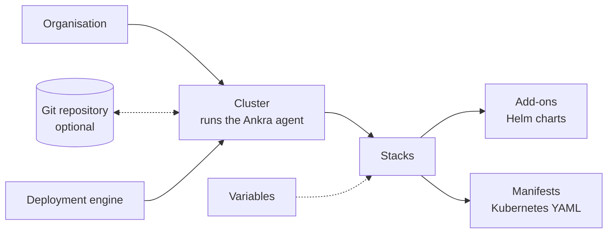

Every other page in this section describes one piece of Ankra. This page shows how the pieces connect, so you can read the rest in any order and know where each one sits.

## Organisation

An organisation is your team's account. It holds the members and their roles, the credentials Ankra uses for Git, registries and cloud providers, organisation-wide variables, and every cluster. See [Organisations](/concepts/organisations).

## Cluster and agent

A cluster is any Kubernetes cluster Ankra manages, whether you imported it or Ankra built it. Each one runs the [Ankra agent](/concepts/cluster-agent), installed with Helm into the `ankra` namespace. The agent opens the connection to Ankra itself, so the cluster needs no inbound ports and works behind a firewall or NAT. When the agent is not connected, the cluster shows as needing attention and nothing is deployed to it until it reconnects - see [Cluster states](/concepts/cluster-agent#cluster-states).

## Stack

A [Stack](/concepts/stacks) is what a cluster should run: a named set of components with the order they deploy in. A cluster usually has several Stacks, one per concern - monitoring, ingress, your application.

## Add-ons and manifests

A Stack contains two kinds of component. An [add-on](/concepts/addons) is a Helm chart with its values. A [manifest](/concepts/stacks#manifests) is your own Kubernetes YAML, such as a namespace, a Secret or a custom resource. Dependency edges between them decide what deploys first.

## Variables

[Variables](/concepts/variables) hold the values that differ between clusters, such as a domain name or a replica count. You write `${{ ankra.name }}` in values or YAML, and Ankra fills it in when it deploys. You can set a variable on the organisation, a cluster or a Stack, and the more specific one wins.

## Git (optional)

You do not need a repository. Ankra stores each cluster's Stacks itself and deploys from there. When you connect a repository, sync runs [both ways](/concepts/gitops): Ankra writes each cluster's Stacks to its own directory in the repository, and commits you push are applied to the cluster.

## Deployment engine

The [deployment engine](/concepts/deployment-engines) is what turns a Stack into running resources. New clusters use the native engine: the agent runs Helm on the cluster itself and keeps each add-on in line with its Stack. Clusters created before the native engine keep ArgoCD until you migrate them.

## Where to go next

Read the concept pages in order, starting with [Organisations](/concepts/organisations), or follow the [Quickstart](/get-started/quickstart) to see the whole chain work on a real cluster.
