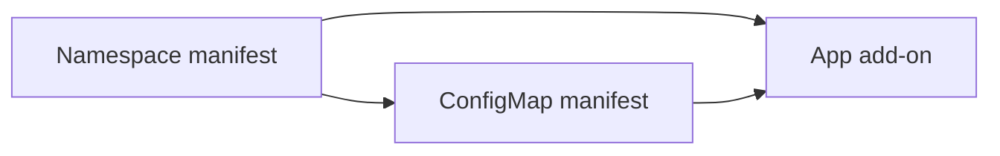

A cluster rarely needs just one chart. Monitoring needs a namespace, Prometheus, Grafana and an ingress rule, and they have to go on in the right order. A **Stack** is how you describe that set once in Ankra and deploy it as one unit, to one cluster or to many. [How Ankra Works](/concepts/how-ankra-works) shows where Stacks sit in the overall model.

## What a Stack contains

- **[Add-ons](/concepts/addons)** - Helm charts, each with a chart version and its values.
- **[Manifests](#manifests)** - your own Kubernetes YAML: namespaces, Secrets, CRDs, RBAC, custom resources.
- **[Variables](/concepts/variables)** - Stack-level values referenced as `${{ ankra.name }}`. A Stack variable overrides a cluster or organisation variable of the same name.
- **Dependency edges** - which component has to succeed before another one starts.

A cluster usually has several Stacks, one concern each, rather than one Stack that holds everything.

## Deployment order

Components that do not depend on anything deploy in parallel. A component with parents waits until they have succeeded, so a namespace manifest goes before the add-ons and resources that live in it, and an operator goes before the custom resources it reconciles.



Here the namespace deploys first, then the ConfigMap, then the add-on that reads both.

## Manifests

A manifest is a YAML document of Kubernetes resources, written by you, that Ankra applies as part of a Stack. Use one for anything a Helm chart does not create for you: the namespace a chart installs into, a Secret it reads, the RBAC your team needs, or the custom resources an operator add-on reconciles. Manifests always live inside a Stack, so they deploy in order with the add-ons that need them.

A single manifest can hold several resources separated by `---`:

```yaml
apiVersion: v1
kind: Namespace
metadata:
  name: monitoring
---
apiVersion: rbac.authorization.k8s.io/v1
kind: Role
metadata:
  namespace: monitoring
  name: monitoring-reader
rules:
  - apiGroups: [""]
    resources: ["pods", "services"]
    verbs: ["get", "list"]
```

**Secrets in manifests.** If a manifest carries a password or key and the cluster is connected to Git, list the key names under **Encrypted Keys (SOPS)** in the manifest editor, for example `password` or `stringData.admin-user`. Ankra encrypts those values with SOPS before it writes the manifest to Git and decrypts them when it deploys. SOPS needs a one-time setup for the organisation - see [SOPS](/guides/sops).

**Operational notes.** Every manifest and add-on has an **AGENTS.md** tab where you and Ankra's AI record what matters when changing it, such as upgrade order or fields that must stay pinned. Editing it never triggers a redeploy. See [Teach Your Agents with AGENTS.md](/platform/agents-md).

## Building a Stack

In the portal, open the cluster's **Stacks** and click **+ Create**. In the Stack Builder, **Add Add-on** adds a Helm chart and **Add Manifest** adds your own YAML. Drag from one component to another to add a dependency edge, and click a component to edit its values or YAML. The **Variables** tab holds the Stack's own variables. **Create Stack** saves the Stack and deploys it.

A Stack that has not been deployed yet shows a **Draft** badge in the list, or **AI draft** when Ankra's AI proposed it.

You can also describe what you need to Ankra's AI (`⌘J`) and let it propose the Stack, for example:

> I need a monitoring stack with Prometheus, Grafana and alerting for this cluster.

In chat every change needs your confirmation. The same Stack tools are available to MCP clients with the `mcp:write` scope - see the [MCP Tool Reference](/platform/mcp-tools#stacks).

## What a Stack Is Running

The Stack page shows what a Stack declares: its add-ons and manifests and the deployments that applied them. The **Runtime** tab shows what those components actually put on the cluster right now, in four panels: **Endpoints** (the hosts and paths its Ingresses publish), **Pods**, **Services** and **Events**.

Runtime scopes by ownership, not by namespace. Several Stacks can share a namespace and one Stack can span several, so Ankra follows the objects it recorded for the Stack and their owner references down to ReplicaSets, Jobs and Pods. When the cluster cannot answer a listing, the tab says so rather than showing an empty list. It reads the cluster only while it is open.

## Stacks in Git

When the cluster has a repository connected, each Stack is written to its own directory, by default `clusters/<cluster-name>-<short-id>/stacks/<stack>/`, with one `values.yaml` per add-on and one YAML file per manifest. Commits to those files are applied to the cluster. See [GitOps](/concepts/gitops).

## Reusing a Stack

- **Clone to Cluster** in a Stack's menu copies it to another cluster, including one in another organisation. Encrypted values are not copied. See [Clone Stacks](/guides/clone-stack).
- **Save as Profile** turns a deployed Stack into a versioned, parameterised template you can deploy on any cluster. See [Stack Profiles](/concepts/stack-profiles).

## Next

[Add-ons](/concepts/addons) explains how a Helm chart becomes an add-on and how its values are managed.
