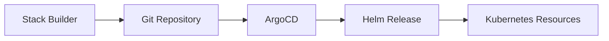
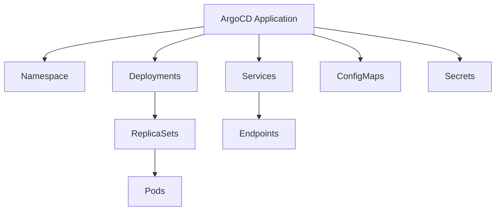

<Note>
Add-ons are Helm charts deployed through Ankra's GitOps pipeline. They provide a standardized way to extend your clusters with monitoring, networking, security, and custom applications, all managed through continuous delivery.
</Note>

## What is an Add-on?

An add-on is a packaged application or tool that extends the functionality of your Kubernetes cluster. Add-ons are distributed as Helm charts and can include anything from monitoring tools and ingress controllers to security solutions and custom integrations. An add-on could even be your own application, integrated into the Ankra ecosystem for easy deployment and management.

---

## Architecture Overview

Understanding how add-ons flow from configuration to deployment helps you manage them effectively.

### GitOps Deployment Pipeline

**How it works:**

1. **Stack Builder**: You configure add-ons with values and dependencies
2. **Git Repository**: Configuration is committed as Helm values files
3. **ArgoCD**: Detects changes and initiates deployment
4. **Helm Release**: ArgoCD renders the Helm chart with your values
5. **Kubernetes Resources**: The rendered manifests are applied to your cluster

### Add-on Lifecycle States

| State | Description |
|-------|-------------|
| **Pending** | Add-on is queued for deployment |
| **Deploying** | ArgoCD is applying the Helm release |
| **Synced** | All resources are deployed and healthy |
| **Degraded** | Some resources are unhealthy |
| **OutOfSync** | Git configuration differs from cluster state |
| **Unknown** | Status cannot be determined |

---

## Resource Hierarchy

Each add-on creates a hierarchy of Kubernetes resources. Understanding this hierarchy helps with troubleshooting and resource management.

### Typical Add-on Resource Structure

**Resource types commonly created by add-ons:**

| Category | Resources |
|----------|-----------|
| **Workloads** | Deployments, StatefulSets, DaemonSets, Jobs |
| **Networking** | Services, Ingresses, NetworkPolicies |
| **Configuration** | ConfigMaps, Secrets |
| **Storage** | PersistentVolumeClaims |
| **RBAC** | ServiceAccounts, Roles, RoleBindings |
| **Custom** | CRDs and custom resources |

### Resource Map

Navigate to any installed add-on and view its **Resource Map** to see the complete hierarchy of resources it created. This visual representation helps you:

- Understand the add-on's footprint in your cluster
- Navigate directly to any resource for inspection
- Identify dependencies between resources
- Troubleshoot deployment issues

---

## Continuous Delivery Flow

Add-ons in Ankra follow a GitOps continuous delivery model powered by ArgoCD.

### Sync Process

<Steps>
  <Step title="Configuration Change">
    You modify add-on values in the Stack Builder or update values in Git directly.
  </Step>
  <Step title="Git Commit">
    Changes are committed to your connected Git repository.
  </Step>
  <Step title="Webhook Trigger">
    Ankra detects the change via webhook (or periodic polling).
  </Step>
  <Step title="ArgoCD Sync">
    ArgoCD compares desired state (Git) with actual state (cluster) and applies differences.
  </Step>
  <Step title="Health Check">
    ArgoCD monitors resource health until all pods are running and endpoints are ready.
  </Step>
</Steps>

### Sync Strategies

| Strategy | Behavior |
|----------|----------|
| **Auto-Sync** | Changes in Git automatically deploy to the cluster |
| **Manual Sync** | Changes require explicit sync trigger |
| **Self-Heal** | ArgoCD reverts manual cluster changes to match Git |
| **Prune** | Resources removed from Git are deleted from cluster |

---

## Manage Add-on Sources

An add-on source in Ankra is either a Helm repository URL or an OCI (Open Container Initiative) registry URL. These sources contain the Helm charts you want to use for deploying add-ons to your clusters. Helm charts are a standard way to package Kubernetes applications, making it easy to manage dependencies and versioning for complex workloads.

By connecting both public and private Helm repositories or OCI registries, you can access a wide range of Kubernetes add-ons. This lets you integrate open-source tools, vendor solutions, or your own custom charts-all from a single interface. Managing sources centrally ensures your team always has access to the latest and most secure versions of your preferred add-ons.

**How to Add a Source:**

1. Go to the **Charts** page in the main navigation.
2. Click the **Manage Registries** button.
3. Click **Add** and enter the Helm repository or OCI registry URL you want to use.

Once you add a source, Ankra will begin indexing the available charts. You'll see a **Last Synced** timestamp update when indexing is complete. After that, your add-ons will be available for installation.

[Learn more about Helm Registries →](./registries)

---

## Stacks

To deploy an add-on onto your cluster, add it to a stack. You can add multiple add-ons and manifests to build a **Stack**, which is a repeatable, reusable set of components for your Kubernetes environments.
Stacks let you bundle everything your application or platform needs, from monitoring and logging to ingress controllers and security policies. You can version stacks, share them with your team, and deploy them to any cluster with a single action. This approach speeds up onboarding, reduces errors, and helps make sure every environment is production-ready.

[Learn more about Stacks →](../essentials/stacks)

---

## Install Add-ons

Add-ons in Ankra are installed through **Stacks**. This ensures your add-ons are bundled with their dependencies and can be managed as a cohesive unit.

<Steps>
  <Step title="Navigate to Stacks">
    Go to the **Stacks** section in your cluster and click **Create Stack** (or edit an existing stack).
  </Step>
  <Step title="Add an Add-on">
    In the Stack Builder, click **Add** and select **Add-on**. Browse or search for charts from your connected registries.
  </Step>
  <Step title="Configure Values">
    Select the chart version and configure the values. You can use the AI Assistant (`⌘+J`) to help customize the configuration.
  </Step>
  <Step title="Deploy">
    Save your stack and deploy it to install the add-on on your cluster.
  </Step>
</Steps>

Ankra handles versioning, dependency management, and cluster targeting for you. This makes it easy to standardize tooling and services across all your environments, ensuring consistency and reducing operational overhead.

Want to upload your own add-on? Add your registry to the Ankra Platform. Read more [here](./registries).

---

## Encrypting Sensitive Values with SOPS

When your add-on configuration contains sensitive data like passwords, API keys, or webhook URLs, use **SOPS** to encrypt them before storing in your GitOps repository.

<Steps>
  <Step title="Open the Add-on Editor">
    Edit an add-on within your stack by clicking on it in the Stack Builder.
  </Step>
  <Step title="Click the SOPS Button">
    In the values edit view, click the **SOPS** button in the toolbar to enable encryption.
  </Step>
  <Step title="Encrypt Sensitive Values">
    SOPS will encrypt sensitive values (like `adminPassword` or `slack_api_url`) while keeping keys readable for easier Git diffs.
  </Step>
  <Step title="Save">
    Save your add-on configuration. The encrypted values will be stored safely in your GitOps repository and decrypted automatically when deployed.
  </Step>
</Steps>

<Tip>
SOPS encryption requires initial setup. See [SOPS Encryption](/essentials/sops) for configuration instructions.
</Tip>

---

## Manifests

A **manifest** is a Kubernetes YAML file that defines resources or configuration, like namespaces, CRDs, or RBAC rules.
In Ankra, manifests help you:

- **Include manifests in stacks:** Make sure your clusters are ready for add-ons by setting up all prerequisites and custom resources first.
- **Automate environment setup:** Create the foundational resources your add-ons and workloads need, so your stacks are fully self-contained and repeatable.

Manifests are key for customizing clusters and making sure every deployment fits your team's needs.

[Learn more about Manifests →](../essentials/manifests)

---

With add-ons, manifests, and stacks, Ankra makes it easy to manage, scale, and standardize your Kubernetes infrastructure, no matter how complex your needs are.

---

## Viewing Installed Add-ons

Once deployed, you can monitor and manage add-ons from the Add-ons page.

### Add-ons List

Navigate to your cluster → **Add-ons** to see all installed add-ons with:

- **Name and Version**: The Helm chart name and deployed version
- **Status**: Current sync and health status
- **Namespace**: Where the add-on is deployed
- **Last Updated**: When the add-on was last modified

### Add-on Details

Click any add-on to view detailed information:

| Tab | Description |
|-----|-------------|
| **Overview** | Chart info, status, metadata, and ArgoCD application state |
| **Resource Map** | Visual hierarchy of all Kubernetes resources created by the add-on |
| **Values** | Current Helm values configuration |
| **Events** | Recent events related to the add-on's resources |

### Resource Map

The Resource Map provides a visual representation of all resources deployed by an add-on:

- **Hierarchical View**: See parent-child relationships (e.g., Deployment → ReplicaSet → Pod)
- **Quick Navigation**: Click any resource to view its details
- **Status Indicators**: Identify unhealthy or pending resources at a glance
- **Resource Types**: View all Kubernetes resource kinds in one place

<Tip>
Use the Resource Map when troubleshooting to quickly identify which resources are failing and their dependencies.
</Tip>

---

## Updating Add-ons

### Changing Values

1. Navigate to your stack in the Stack Builder
2. Click the add-on you want to modify
3. Update the Helm values as needed
4. Save and deploy the stack

### Upgrading Chart Versions

1. Edit the stack containing the add-on
2. Click the add-on and select a new chart version
3. Review any breaking changes in the chart changelog
4. Save and deploy to upgrade

<Warning>
Major version upgrades may include breaking changes. Review the chart's release notes and test in a non-production environment first.
</Warning>

### Rollback

If an upgrade causes issues:

1. Edit the stack and revert to the previous chart version
2. Or use GitOps: revert the commit in your Git repository
3. ArgoCD will automatically sync to the previous state

---

## Best Practices

<Tip>
**Start with stacks**: Always deploy add-ons through stacks for better organization, dependency management, and GitOps integration.
</Tip>

<Tip>
**Use variables**: Define configuration values as [Variables](/essentials/variables) rather than hardcoding them in Helm values.
</Tip>

<Tip>
**Enable SOPS for secrets**: Use [SOPS encryption](/essentials/sops) for sensitive add-on values like passwords and API keys.
</Tip>

<Tip>
**Monitor resource maps**: After deployment, check the Resource Map to verify all resources are healthy.
</Tip>

<Tip>
**Pin chart versions**: Specify exact chart versions in production to avoid unexpected upgrades.
</Tip>

---

## Explore the Add-ons API

Want to automate add-on management or integrate with your CI/CD workflows?
Check out the [API Reference](../../api-reference) for endpoints to list, install, and manage add-ons programmatically.

---

## Related

<CardGroup cols={2}>
  <Card title="Stacks" icon="cubes" href="/essentials/stacks">
    Build stacks with multiple add-ons.
  </Card>
  <Card title="Helm Charts" icon="box" href="/essentials/helm-charts">
    Browse available Helm charts.
  </Card>
  <Card title="GitOps" icon="git-alt" href="/essentials/cluster-gitops-multiple">
    Understand the GitOps workflow.
  </Card>
  <Card title="SOPS Encryption" icon="lock" href="/essentials/sops">
    Encrypt sensitive add-on values.
  </Card>
</CardGroup>
