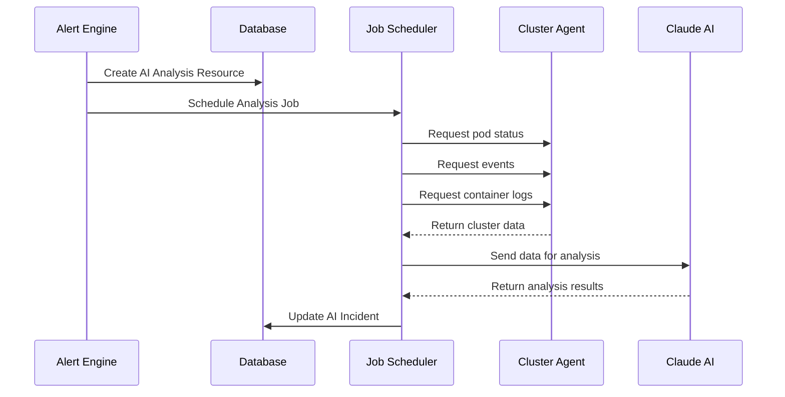
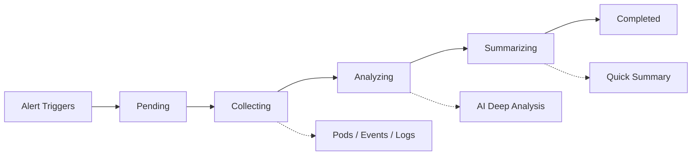

<Note>
When alerts trigger, Ankra's AI automatically analyzes your cluster to identify the root cause, affected resources, and recommended actions.
</Note>

## What are AI Incidents?

AI Incidents are automatically generated when an alert triggers. Ankra's AI system:

1. **Collects cluster data** - Gathers pods, events, logs, and resource status
2. **Analyzes the situation** - Uses AI to identify what went wrong and why
3. **Provides actionable insights** - Delivers a summary, root cause, and recommended fixes

This helps you diagnose issues faster without manually digging through logs and events.

---

## How AI Analysis Works

When an alert fires, Ankra automatically creates resources and jobs to analyze the issue.

### Resource and Job Creation

<Frame>

</Frame>

### Analysis Phases

The analysis progresses through these phases:

| Phase | Description | What's Happening |
|-------|-------------|------------------|
| **Pending** | Analysis is queued | AI Analysis Resource created, job scheduled |
| **Collecting** | Gathering cluster data | Agent fetching pods, events, logs from cluster |
| **Analyzing** | AI processing data | Claude AI identifying root cause and patterns |
| **Summarizing** | Generating overview | Creating quick summary and recommendations |
| **Completed** | Analysis ready | AI Incident available for review |

If something goes wrong during analysis, the status will show as **Failed** with an error message.

### Data Collected

During the **Collecting** phase, the analysis job gathers:

| Data Type | What's Collected | Why It's Useful |
|-----------|------------------|-----------------|
| **Pod Status** | Phase, restart count, container states | Identifies unhealthy pods and crash patterns |
| **Events** | Warning and error events | Shows recent failures and scheduling issues |
| **Container Logs** | Last 50 lines per container | Reveals application errors and stack traces |
| **Job Results** | Exit codes, error messages | Shows deployment/update failure details |
| **Node Status** | Conditions, capacity | Identifies resource constraints |

### AI Processing

During the **Analyzing** phase, Claude AI:

1. **Identifies patterns** - Recognizes common failures (CrashLoopBackOff, OOMKilled, ImagePullBackOff)
2. **Correlates data** - Connects events, logs, and status to find root cause
3. **Assesses severity** - Determines impact level (critical, warning, info)
4. **Generates recommendations** - Creates actionable steps with Ankra UI links

<Frame>

</Frame>

---

## Viewing AI Analysis

Click on any incident in the AI Incidents tab to open the analysis modal. The analysis includes:

### Quick Summary

A brief, AI-generated overview of the issue. This gives you the key information at a glance so you can quickly understand what happened.

### Root Cause

A detailed explanation of what caused the alert to trigger. This section identifies the underlying problem, not just the symptoms.

### Key Insights

Important observations about the incident, categorized by type:

- **Resource insights** - Issues with specific Kubernetes resources
- **Performance insights** - CPU, memory, or latency problems
- **Timing insights** - When issues started and patterns over time
- **Error insights** - Specific errors found in logs or events

### Affected Resources

A list of Kubernetes resources impacted by the incident. Click on any resource to navigate directly to it in your cluster view.

### Recommended Actions

An interactive checklist of steps to resolve the issue. Mark items as complete as you work through them to track your progress.

### Full Analysis

Expandable section containing the complete, detailed analysis. Use this when you need more context than the summary provides.

---

## Starting a Conversation with AI

After reviewing an analysis, click **Start Conversation with AI** to continue investigating. This opens the AI Assistant with the incident context already loaded, so you can:

- Ask follow-up questions about the root cause
- Get more specific remediation steps
- Explore related issues in your cluster
- Request help implementing the recommended actions

---

## Filtering and Searching Incidents

The AI Incidents tab provides filters to help you find specific incidents:

### Search

Search across alert names, rule names, cluster names, resource names, and root cause text.

### Severity Filter

Filter by incident severity:

| Severity | Description |
|----------|-------------|
| **Critical** | Severe issues requiring immediate attention |
| **Warning** | Issues that should be addressed soon |
| **Info** | Informational incidents for awareness |

### Status Filter

Filter by analysis status:

| Status | Description |
|--------|-------------|
| **Completed** | Analysis finished successfully |
| **Pending** | Waiting to start analysis |
| **Analyzing** | Analysis currently in progress |
| **Resolved** | Incident has been resolved |
| **Failed** | Analysis encountered an error |

---

## Incident Details

Each incident in the table shows:

| Column | Description |
|--------|-------------|
| **Alert** | The alert name and rule that triggered (links to alert detail) |
| **Resource** | The affected resource (links to resource in cluster) |
| **Cluster** | The cluster where the incident occurred (links to cluster) |
| **Severity** | Critical, Warning, or Info |
| **Status** | Current analysis status |
| **Created** | When the incident was created |

Click **View** on any incident to open the full analysis.

---

## Best Practices

<Tip>
**Review Critical incidents first:** Use the severity filter to prioritize your response to the most impactful issues.
</Tip>

<Tip>
**Use the checklist:** Work through recommended actions systematically and mark them complete to track progress.
</Tip>

<Tip>
**Continue with AI:** If the initial analysis doesn't fully explain the issue, start a conversation to dig deeper.
</Tip>

<Tip>
**Check affected resources:** Navigate to affected resources directly from the analysis to verify the current state.
</Tip>

---

## Related

- [Alerts](/essentials/alerts) - Configure alert rules that generate AI incidents
- [AI Assistant](/essentials/ai-assistant) - Learn more about Ankra's AI capabilities

---

Still have questions? [Join our Slack community](https://ankra.io/slack) and we'll help out.

