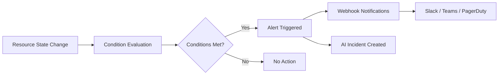
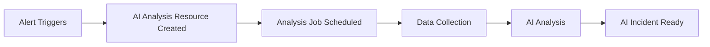
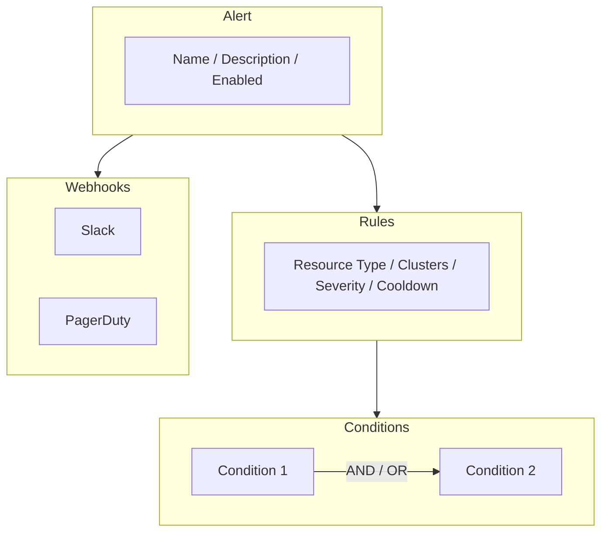

<Note>
Ankra Alerts help you stay informed about your cluster health, resource issues, and operational events with configurable notifications.
</Note>

## What are Alerts?

Alerts in Ankra let you define rules that automatically monitor your infrastructure and notify you when specific conditions are met. You can:

- **Monitor Cluster Health:** Get notified when clusters go offline or agents disconnect
- **Track Resource Status:** Watch for issues with GitOps repositories, add-ons, manifests, and stacks
- **Configure Conditions:** Set up multiple conditions with AND/OR logic for precise alerting
- **Receive Notifications:** Send alerts to any webhook-enabled service (Slack, Teams, PagerDuty, etc.)

### How Alerts Work

<Frame>

</Frame>

---

## Automatic AI Analysis

Every time an alert triggers, Ankra automatically starts an AI-powered analysis to help you understand what went wrong.

<Frame>

</Frame>

### What Happens Behind the Scenes

1. **AI Analysis Resource** - When conditions are met, Ankra creates an AI Analysis resource to track the investigation
2. **Analysis Job** - A background job is scheduled to collect and analyze data
3. **Data Collection** - The job gathers:
   - Pod status and container states
   - Kubernetes events (warnings, errors)
   - Container logs (recent output)
   - Job results and error messages
4. **AI Analysis** - Claude AI processes the data to identify:
   - Root cause of the issue
   - Severity assessment
   - Affected resources
   - Recommended actions
5. **AI Incident** - Results are saved as an AI Incident for review

<Note>
View all AI Incidents in the **Alerts → AI Incidents** tab. Each incident includes the full analysis, affected resources, and an interactive checklist of recommended actions.
</Note>

---

## Alerts Dashboard

The Alerts page displays key metrics at a glance:

| Metric | Description |
|--------|-------------|
| **Total Alerts** | Number of configured alert rules |
| **Active** | Alerts currently enabled and monitoring |
| **Rules** | Total number of individual rules across all alerts |
| **Triggers (24h)** | How many times alerts fired in the last 24 hours |

You can filter alerts by status (Active/Disabled) using the quick filter pills on the dashboard.

---

## Alert Structure

An alert consists of rules, conditions, and webhook integrations:

<Frame>

</Frame>

---

## Creating Alert Rules

<Steps>
  <Step title="Name & Details">
    Configure the basic alert settings:
    - **Alert Name:** A descriptive name (e.g., "Production Resources Down")
    - **Severity:** Choose Critical, Warning, or Info
    - **Cooldown:** Time in minutes before the alert can trigger again (prevents alert storms)
    - **Clusters:** Select "All Clusters" or choose specific clusters to monitor
  </Step>

  <Step title="What to Monitor">
    Select the resource type to monitor:

    <CardGroup cols={2}>
      <Card title="Cluster" icon="server">
        Monitor overall cluster health including:
        - Cluster connectivity state
        - Agent status and availability
      </Card>
      <Card title="Cluster Resource" icon="cubes">
        Monitor specific resource types:
        - **GitOps** - GitHub repository sync status
        - **Addon** - Add-on deployment health
        - **Manifest** - Raw manifest deployments
        - **Stack** - Stack deployment status
      </Card>
    </CardGroup>
  </Step>

  <Step title="When to Alert">
    Define one or more conditions that trigger the alert. Multiple conditions can be combined using **AND** or **OR** logic.

    **For Cluster monitoring:**
    - **Cluster State:** Alert when cluster goes offline/online
    - **Agent Status:** Alert on agent offline, online, upgrade available, or upgrading

    **For Cluster Resource monitoring:**
    - **Resource State:** Alert on state changes (up, down, creating, updating, stopping)
    - **Job Status:** Alert on job outcomes (failed, timeout, blocked, etc.)
    - **Stuck Duration:** Alert when resources remain in a state too long
    - **Failed Job Count:** Alert when failed jobs exceed a threshold
  </Step>
  <Step title="Notifications">
    Select which webhooks should receive notifications when this alert triggers. You can configure webhooks in the [Webhooks](/essentials/webhooks) section.
  </Step>
</Steps>

---

## Condition Types Reference

### Cluster Conditions

Use these when monitoring **Cluster** resource type:

| Condition | Description | Values |
|-----------|-------------|--------|
| **Cluster State** | Monitor cluster connectivity | `offline`, `online` |
| **Agent Status** | Monitor the cluster agent | `offline`, `online`, `upgrade_available`, `upgrading` |

### Cluster Resource Conditions

Use these when monitoring **Cluster Resource** types (GitOps, Addon, Manifest, Stack):

| Condition | Description | Values/Options |
|-----------|-------------|----------------|
| **Resource State** | Monitor resource health state | `all_up`, `up`, `creating`, `updating`, `stopping`, `down` |
| **Job Status** | Monitor job execution status | `blocked`, `failed`, `pending`, `running`, `success`, `timeout`, `cancelling`, `cancelled` |
| **Stuck Duration** | Alert when stuck in a state | Duration in minutes (e.g., 30) |
| **Failed Job Count** | Alert on failure threshold | Number of failed jobs (e.g., 5) |

### Condition Operators

For numeric conditions (Stuck Duration, Failed Job Count), you can use these operators:

| Operator | Description |
|----------|-------------|
| `eq` | Equals |
| `neq` | Not equals |
| `gt` | Greater than |
| `gte` | Greater than or equal |
| `lt` | Less than |
| `lte` | Less than or equal |

---

## Alert Severity Levels

| Level | Description | Use Case |
|-------|-------------|----------|
| **Critical** | Immediate action required | Production outages, service unavailable |
| **Warning** | Attention needed soon | Resource pressure, degraded performance |
| **Info** | Informational updates | Successful deployments, routine events |

---

## Viewing Alert History

Each alert tracks its trigger history. From the alert detail page, you can:

- **View Statistics:** Total triggers, last check time, last triggered time
- **Review History:** See when alerts triggered and what conditions matched
- **Analyze Patterns:** Identify recurring issues across your infrastructure

Navigate to **Alerts → [Alert Name] → View History** to access the full timeline.

---

## Best Practices

<Tip>
**Start Specific:** Begin with targeted alerts for critical resources, then expand coverage as you understand your baseline.
</Tip>

<Tip>
**Use Appropriate Cooldowns:** Set cooldown periods to prevent alert fatigue during incident recovery. 15-30 minutes is a good starting point.
</Tip>

<Tip>
**Combine Conditions Thoughtfully:** Use AND logic for alerts that require multiple signals, OR logic for alerts that should fire on any matching condition.
</Tip>

<Tip>
**Route by Severity:** Send Critical alerts to on-call channels (PagerDuty, Opsgenie), Warnings to team channels (Slack), and Info to logging systems.
</Tip>

<Tip>
**Review Regularly:** Periodically review alert triggers and tune thresholds based on actual incidents.
</Tip>

---

## Related

- [AI Incidents](/essentials/ai-incidents) - AI-powered root cause analysis for triggered alerts
- [Webhooks](/essentials/webhooks) - Configure notification endpoints for alerts

---

Still have questions? [Join our Slack community](https://ankra.io/slack) and we'll help out.
