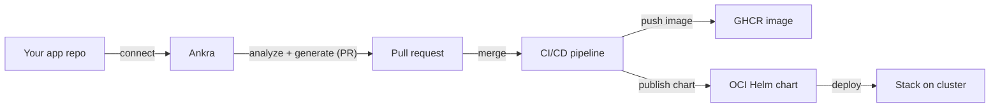

Applications take you from source code to a deployable, GitOps-managed workload. Connect an application's Git repository and Ankra analyzes it, generates the packaging it's missing - a Dockerfile, a Helm chart, and a CI/CD pipeline - and opens a pull request in your repo. Once merged, CI builds and publishes a container image and Helm chart, and you deploy the application as part of a [stack](/essentials/stacks).

<Note>
Applications connect to **GitHub** repositories and use a [GitHub credential](/integrations/github). The generated CI/CD pipeline pushes the container image to GitHub Container Registry (GHCR) and publishes the Helm chart as an OCI artifact.
</Note>

---

## How it works

<Steps>
  <Step title="Connect a repository">
    Provide a name, a GitHub credential, and the repo owner, name, and branch (defaults to `main`).
  </Step>
  <Step title="Analyze and generate">
    Ankra inspects the repository, detects the language and framework, and generates the artifacts it needs - a Dockerfile, a Helm chart, and a CI/CD workflow - opening a pull request with the changes.
  </Step>
  <Step title="Merge the pull request">
    Review and merge the PR. Merging activates the CI/CD pipeline in your repository.
  </Step>
  <Step title="Build and publish">
    CI builds and pushes the container image to GHCR and publishes the Helm chart as an OCI artifact. Ankra surfaces the image URL, chart OCI URL, and the `helm repo add` command.
  </Step>
  <Step title="Deploy">
    Deploy the application onto a cluster as part of a [stack](/essentials/stacks). Ankra tracks its readiness from there.
  </Step>
</Steps>

---

## What Ankra tracks

For each application you see:

- **State** and **analysis status** - where the application is in the connect/analyze/generate/build lifecycle, with an error message if something needs attention.
- **Repository** - owner, name, branch, and URL.
- **Artifacts** - the container image URL, the Helm chart OCI URL, and a ready-to-copy `helm repo add` command.
- **Pull request** - a link to the generated PR.
- **Jobs** - the underlying platform jobs for the application, so you can follow analysis and generation as it runs.

### Security scanning

Applications include code and container security insights, so vulnerabilities surface alongside the build rather than in a separate tool. Pair this with [AI Insights](/essentials/ai-insights) for proactive analysis.

---

## Managing applications

| Action | What it does |
|--------|--------------|
| **Retry** | Re-run analysis and generation after fixing an issue (for example, adding the right credential or repository permissions) |
| **Reconcile** | Re-evaluate the application against its repository and refresh its state |
| **Delete** | Disconnect the application from Ankra |

---

## Prerequisites

<Steps>
  <Step title="Connect GitHub">
    Add a [GitHub credential](/integrations/github) with access to the application's repository. The Ankra GitHub App needs permission to open pull requests and commit workflow files; the generated CI/CD pipeline then builds and pushes the image to GHCR using the repository's own GitHub Actions token. See the [GitHub integration](/integrations/github) for the exact scopes (including the optional permission that lets Ankra fix the Actions token so the first build can push to GHCR).
  </Step>
  <Step title="Have a target cluster">
    Make sure you have a [cluster](/essentials/cluster-create) with the [agent](/essentials/cluster-agent) connected to deploy onto.
  </Step>
</Steps>

---

## API

Applications are available over the API for CLI and scripted use, under `/api/v1/org/applications` (bearer-token authenticated).

| Method | Path | Purpose |
|--------|------|---------|
| `POST` | `/api/v1/org/applications` | Connect a repository and create an application |
| `GET` | `/api/v1/org/applications` | List applications (paginated, `search` supported) |
| `GET` | `/api/v1/org/applications/{application_id}` | Get an application's detail and artifacts |
| `GET` | `/api/v1/org/applications/{application_id}/jobs` | List the platform jobs for the application |
| `POST` | `/api/v1/org/applications/{application_id}/retry` | Retry analysis and generation |
| `POST` | `/api/v1/org/applications/{application_id}/reconcile` | Reconcile the application |
| `DELETE` | `/api/v1/org/applications/{application_id}` | Delete the application |

See the [CI/CD Pipeline guide](/guides/cicd-pipeline) for how the generated pipeline fits into GitOps, and the [API Reference](/api-reference/introduction) for full schemas.
