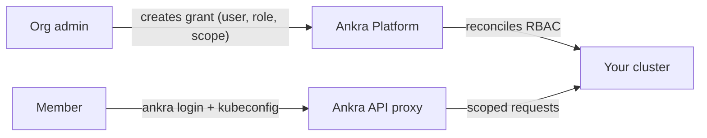

Cluster Access lets organisation admins grant teammates scoped Kubernetes access to a cluster. Instead of handing out long-lived kubeconfigs or shared service-account tokens, you create a **grant** that maps an Ankra user to a role and scope. Ankra reconciles that grant into native Kubernetes RBAC on the cluster, and the user reaches the cluster through Ankra's authenticated [kubeconfig and API proxy](/essentials/kubeconfig).

<Note>
Access is **SSO-backed and ephemeral**. Members authenticate as themselves (via `ankra login` or the portal), and the credentials their kubeconfig uses are short-lived tokens minted on demand - there are no static cluster secrets to leak or rotate.
</Note>

---

## How it works

1. An admin grants a member a role at a chosen scope.
2. Ankra reconciles the grant into Kubernetes RBAC (a `RoleBinding` or `ClusterRoleBinding`) on the cluster.
3. The member adds an Ankra context to their kubeconfig and runs `kubectl` - every request flows through the Ankra proxy and is bound by the RBAC the grant created.

---

## Roles and scopes

Each grant combines a **role** with a **scope**:

| Role | Kubernetes capability |
|------|----------------------|
| `view` | Read-only access |
| `edit` | Read/write to most namespaced resources |
| `admin` | Full control within the scope, including RBAC |
| `cluster-admin` | Full control of the cluster |

| Scope | Applies to |
|-------|-----------|
| `cluster` | The whole cluster (cluster-wide binding) |
| `namespace` | A single namespace (the `namespace` field is required and must be a valid DNS-1123 label) |

<Tip>
Grant the narrowest role and scope that gets the job done - for example `view` on a single `namespace` for someone triaging one team's workloads, rather than `cluster-admin`.
</Tip>

---

## Managing access

Open a cluster and go to its **Access** view. The page adapts to your role:

- **Admins** can list organisation members, view existing grants and their reconcile status, create new grants, and revoke them.
- **Members** see whether they have access and can generate a kubeconfig if they do.

### Grant access

<Steps>
  <Step title="Pick a member">
    Choose an active organisation member by email. The target must already be a member of the organisation.
  </Step>
  <Step title="Choose role and scope">
    Select a role (`view`/`edit`/`admin`/`cluster-admin`) and a scope (whole `cluster` or a single `namespace`).
  </Step>
  <Step title="Create the grant">
    Ankra records the grant and begins reconciling it onto the cluster.
  </Step>
  <Step title="Share the kubeconfig step">
    The member adds an Ankra context to their kubeconfig - see [Accessing clusters with kubectl](/essentials/kubeconfig).
  </Step>
</Steps>

### Reconcile status

Because RBAC is applied on the cluster by the agent, each grant carries a reconcile status:

| Status | Meaning |
|--------|---------|
| `pending` | The grant has been created and is waiting to be applied |
| `applied` | RBAC is live on the cluster |
| `failed` | Reconcile failed - see the grant's error detail |
| `cluster_offline` | The cluster is offline; the grant will apply once it reconnects |

### Revoke access

Delete an individual grant to remove that binding, or use **revoke all** to clear every grant and invalidate any tokens minted for the cluster in one action.

---

## Availability

- Cluster Access requires the access gateway to be enabled for your deployment. When it is not enabled, the access endpoints return `404` and the **Access** view reports the feature as unavailable.
- [Sandbox clusters](/essentials/cluster-sandbox) do not support Cluster Access.

---

## API

All endpoints are organisation-scoped and operate on a specific cluster. Managing grants requires organisation admin; write operations require a CSRF header for browser-originated requests.

| Method | Path | Purpose |
|--------|------|---------|
| `GET` | `/org/clusters/{cluster_id}/access/capabilities` | Whether access is enabled, and if the caller can manage / already has access |
| `GET` | `/org/clusters/{cluster_id}/access/members` | Organisation members eligible for a grant |
| `GET` | `/org/clusters/{cluster_id}/access/grants` | List existing grants and their reconcile status |
| `POST` | `/org/clusters/{cluster_id}/access/grants` | Create a grant |
| `DELETE` | `/org/clusters/{cluster_id}/access/grants/{grant_id}` | Delete a grant |
| `POST` | `/org/clusters/{cluster_id}/access/kubeconfig` | Generate a kubeconfig for the caller |
| `POST` | `/org/clusters/{cluster_id}/access/revoke-all` | Revoke all grants and tokens for the cluster |

See [Accessing clusters with kubectl](/essentials/kubeconfig) for how members consume their access, and the [API Reference](/api-reference/introduction) for full schemas.
