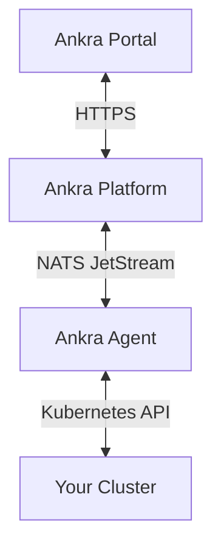

The Ankra Agent is a lightweight service that runs inside your Kubernetes cluster, enabling real-time communication with the Ankra platform. It provides secure, bidirectional connectivity for resource browsing, deployments, and cluster management.

The agent ships as a single, statically compiled **Go binary** on the **2.x version track** (`2.0.x`). It is a drop-in replacement for earlier agents - the same Helm chart, values, install command, and behaviour - with a smaller memory and CPU footprint and faster startup. Existing clusters are upgraded automatically by the platform; there is nothing to change in your install command.

<Note>
The agent requires **cluster-admin** permissions to manage all Kubernetes resources and deploy add-ons.
</Note>

---

## What the Agent Does

<CardGroup cols={2}>
  <Card title="Real-time Resource Streaming" icon="satellite-dish">
    Browse Deployments, Pods, Services, and 20+ resource types with live updates.
  </Card>
  <Card title="Pod Log Streaming" icon="terminal">
    View container logs in real-time directly from the Ankra dashboard.
  </Card>
  <Card title="Helm Management" icon="box">
    Deploy, upgrade, and manage Helm releases across your cluster, including history and rollback.
  </Card>
  <Card title="Add-on Deployment" icon="layer-group">
    Install stacks and add-ons using the native Helm engine (default) or ArgoCD. See [Deployment Engines](/integrations/deployment-engines).
  </Card>
  <Card title="kubectl Access" icon="terminal">
    Proxy authenticated `kubectl` requests to the cluster API server - no inbound ports. See [Accessing Clusters with kubectl](/essentials/kubeconfig).
  </Card>
  <Card title="Fleet Map Reporting" icon="location-dot">
    Optionally report the cluster's public egress IP so it appears on the [Dashboard](/essentials/dashboard) world map.
  </Card>
</CardGroup>

---

## Installation

When you import a cluster, Ankra generates a Helm install command with a unique token:

```bash
helm upgrade --install ankra-agent oci://ghcr.io/ankraio/ankra-agent/ankra-agent \
  --namespace ankra \
  --create-namespace \
  --set config.token="YOUR_UNIQUE_TOKEN"
```

The agent will connect to the platform and your cluster will appear online within seconds.

### Verify Installation

Check the agent is running:

```bash
kubectl get pods -n ankra
```

View agent logs:

```bash
kubectl logs -n ankra -l app.kubernetes.io/name=ankra-agent -f
```

---

## Configuration Reference

### Required Settings

| Parameter | Description |
|-----------|-------------|
| `config.token` | Authentication token (provided during cluster import) |
| `config.ankra_url` | Platform URL (default: `https://platform.ankra.app`) |

### Using an Existing Secret

For production environments, store the token in a Kubernetes secret:

```bash
kubectl create secret generic ankra-agent-secret \
  --namespace ankra \
  --from-literal=token=YOUR_UNIQUE_TOKEN
```

Then reference it in your Helm install:

```bash
helm upgrade --install ankra-agent oci://ghcr.io/ankraio/ankra-agent/ankra-agent \
  --namespace ankra \
  --set config.existing_secret_name=ankra-agent-secret \
  --set config.secret_key=token
```

### Performance Tuning

For large clusters (1000+ resources), adjust these settings:

| Parameter | Default | Description |
|-----------|---------|-------------|
| `nats_worker_max_workers` | `15` | Worker threads for command processing |
| `read_worker_count` | `5` | Concurrent worker slots for read jobs |
| `write_worker_count` | `5` | Concurrent worker slots for write jobs (create/update/delete) |
| `resources.limits.memory` | `512Mi` | Memory limit |
| `resources.requests.memory` | `256Mi` | Memory request |
| `replica_count` | `1` | Number of agent replicas |

Example for large clusters:

```bash
helm upgrade --install ankra-agent oci://ghcr.io/ankraio/ankra-agent/ankra-agent \
  --namespace ankra \
  --set config.token="YOUR_TOKEN" \
  --set nats_worker_max_workers=25 \
  --set resources.limits.memory=1Gi \
  --set resources.requests.memory=512Mi
```

### Fleet world map (public IP reporting)

To place an imported cluster on the [Dashboard](/essentials/dashboard) world map when it has no recognisable cloud region, let the agent report its public egress IP on check-in:

```bash
helm upgrade --install ankra-agent oci://ghcr.io/ankraio/ankra-agent/ankra-agent \
  --namespace ankra \
  --set config.token="YOUR_TOKEN" \
  --set public_ip.reporting_enabled=true
```

When enabled, the agent performs an outbound HTTP lookup (to `public_ip.lookup_url`, default `https://api.ipify.org`) and reports the result. Leave it **disabled** (the default) for air-gapped clusters or where egress IP lookups are undesirable.

### All Helm Values

| Parameter | Default | Description |
|-----------|---------|-------------|
| `config.ankra_url` | `https://platform.ankra.app` | Platform API URL |
| `config.token` | `""` | Agent authentication token |
| `config.existing_secret_name` | `""` | Name of existing K8s secret |
| `config.secret_key` | `""` | Key in existing secret containing token |
| `log_level` | `INFO` | Log level (DEBUG, INFO, WARNING, ERROR, CRITICAL) |
| `nats_worker_max_workers` | `15` | NATS worker threads |
| `read_worker_count` | `5` | Concurrent read job slots |
| `write_worker_count` | `5` | Concurrent write job slots |
| `replica_count` | `1` | Number of agent pods |
| `terminationGracePeriodSeconds` | `600` | Graceful shutdown timeout |
| `resources.limits.memory` | `512Mi` | Memory limit |
| `resources.requests.memory` | `256Mi` | Memory request |
| `resources.requests.cpu` | `200m` | CPU request |
| `public_ip.reporting_enabled` | `false` | Report public egress IP for the Fleet world map |
| `public_ip.lookup_url` | `https://api.ipify.org?format=json` | Endpoint used to discover the public IP |
| `public_ip.refresh_seconds` | `3600` | How often the cached public IP is refreshed |
| `public_ip.lookup_timeout_seconds` | `5` | Per-lookup HTTP timeout |
| `k8s_watch.enabled` | `true` | Stream live resource updates via the Kubernetes watch |
| `metrics.serviceMonitor.enabled` | `false` | Install a Prometheus Operator `ServiceMonitor` scraping `/metrics` |
| `extra_env` | `[]` | Extra environment variables for advanced tuning (see below) |

<Note>
The agent runs as a **non-root** container by default (`runAsNonRoot: true`, UID/GID `1000`, `readOnlyRootFilesystem: true`, all Linux capabilities dropped, `seccompProfile: RuntimeDefault`). Because the root filesystem is read-only, the chart mounts writable `emptyDir` volumes for `/tmp`, `~/.cache`, and `~/.config` via `writable_volumes.enabled` (default `true`). Don't lower these security settings unless you are running a custom image.
</Note>

### Advanced tuning via `extra_env`

Less-common knobs are set as environment variables through `extra_env`:

| Env var | Default | Description |
|---------|---------|-------------|
| `KUBERNETES_HTTP2_ENABLED` | `false` | Enable HTTP/2 to the API server (only if the path supports it cleanly) |
| `KUBERNETES_REQUEST_MAX_ATTEMPTS` | `3` | List/get retry attempts on connection-terminated errors |
| `KUBE_PROXY_UNARY_CONCURRENCY` | `64` | Max concurrent unary requests through the kubectl proxy |
| `KUBE_PROXY_STREAM_CONCURRENCY` | `128` | Max concurrent streaming connections (watch/logs/exec) through the proxy |
| `DYNAMIC_API_DISCOVERY_ENABLED` | `false` | Discover and watch additional API groups dynamically |
| `RECONCILE_AUTO_HEAL_ENABLED` | `true` | Auto-heal native-engine releases stuck mid-operation |
| `FORWARD_SERVICE_REQUEST_MAX_TIMEOUT_SECONDS` | `120` | Upper bound for platform-requested forwarded-request timeouts (e.g. Prometheus) |

```yaml
extra_env:
  - name: KUBERNETES_REQUEST_MAX_ATTEMPTS
    value: "5"
```

---

## Architecture

The agent uses a NATS-based architecture for real-time communication:



**Key features:**
- **Outbound connections only** - The agent initiates all connections, no inbound ports required
- **Real-time streaming** - Resource data streams efficiently using pagination
- **Automatic reconnection** - Handles network interruptions gracefully
- **kubectl proxy** - Forwards authenticated `kubectl` requests (including `watch`, `logs -f`, and `exec`) from the platform to the cluster API server, so you can reach private clusters without inbound access. See [Accessing Clusters with kubectl](/essentials/kubeconfig).
- **Health monitoring** - Exposes `/livez` and `/readyz` endpoints on port 8080

---

## Network Requirements

The agent requires outbound connectivity to:

| Endpoint | Port | Purpose |
|----------|------|---------|
| `platform.ankra.app` | 443 | API communication |
| `connect.ngs.global` | 4222 | NATS real-time streaming |

No inbound ports need to be opened on your cluster.

---

## Upgrading the Agent

New agent releases are published on the `2.0.x` version track. The platform rolls the fleet forward automatically to the latest published version, a few clusters at a time, so most clusters stay current without any action. You can still trigger an upgrade yourself at any time.

### From the Platform

Click **Upgrade Agent** in the cluster settings. The agent will self-upgrade using Helm.

### Manually

```bash
helm upgrade ankra-agent oci://ghcr.io/ankraio/ankra-agent/ankra-agent \
  --namespace ankra \
  --reuse-values
```

Check the current agent version:

```bash
kubectl get deployment -n ankra ankra-agent -o jsonpath='{.spec.template.spec.containers[0].image}'
```

---

## Troubleshooting

### Agent Not Connecting

1. **Check agent pods are running:**
   ```bash
   kubectl get pods -n ankra
   ```

2. **View agent logs:**
   ```bash
   kubectl logs -n ankra -l app.kubernetes.io/name=ankra-agent --tail=100
   ```

3. **Verify network connectivity:**
   ```bash
   kubectl run --rm -it --restart=Never debug --image=curlimages/curl -- \
     curl -s https://platform.ankra.app/health
   ```

4. **Check the token is set:**
   ```bash
   kubectl get secret -n ankra ankra-agent -o jsonpath='{.data.token}' | base64 -d
   ```

### Common Issues

| Issue | Cause | Solution |
|-------|-------|----------|
| Cluster shows Offline | Agent not running or network blocked | Check pods and firewall rules |
| Token invalid | Token expired or revoked | Go to Clusters → Your Cluster → Settings → Generate Command to get a new install command |
| Connection refused | Outbound network blocked | Allow connections to `platform.ankra.app:443` |
| Resources not loading | Agent memory limits too low | Increase `resources.limits.memory` |

### Health Checks

The agent exposes health endpoints:

```bash
kubectl port-forward -n ankra svc/ankra-agent 8080:8080
curl http://localhost:8080/livez
curl http://localhost:8080/readyz
```

---

## Uninstalling

To remove the agent from your cluster:

```bash
helm uninstall ankra-agent -n ankra
kubectl delete namespace ankra
```

<Warning>
Uninstalling the agent will disconnect your cluster from Ankra. You'll need to re-import it to reconnect.
</Warning>

---

## Security

### RBAC Requirements

The agent requires cluster-admin permissions to:
- Browse all Kubernetes resources
- Deploy Helm charts and manifests
- Manage add-ons via the native Helm engine or ArgoCD
- Stream pod logs and proxy authenticated `kubectl` requests

The Helm chart creates a `ClusterRoleBinding` with the necessary permissions.

### Token Security

- Tokens are unique per cluster
- Tokens can be revoked by deleting the cluster from Ankra
- Store tokens in Kubernetes secrets (not in Helm values) for production
