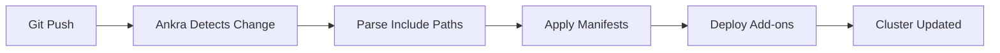

<Note>
Ankra makes it easy to manage clusters using GitOps. Define your cluster's configuration, manifests, and add-ons in YAML files, store them in Git, and let Ankra handle the automation.
</Note>

---

## What is GitOps?

GitOps is a way to manage your Kubernetes infrastructure using Git as the single source of truth. With Ankra:

- **Store configuration in Git** - Your cluster definitions, manifests, and add-ons live in your repository
- **Automatic sync** - Ankra detects changes and applies them to your clusters
- **Version control** - Track every change, roll back when needed, review via pull requests
- **Team collaboration** - Multiple team members can update configurations safely

---

## How It Works

Ankra uses **include paths** to let you split your configuration into multiple files or folders. This keeps your setup modular, maintainable, and easy to scale.

---

## Why Use Include Paths?

<CardGroup cols={2}>
  <Card title="CI/CD Integration" icon="rocket">
    Keep manifests and add-ons in separate files or folders for easy automation in your CI/CD pipelines. Update only what you need, and trigger deployments automatically.
  </Card>
  <Card title="Modularity & Reuse" icon="layer-group">
    Organize resources by team, environment, or feature. Reuse the same manifests or add-ons across different stacks or clusters.
  </Card>
  <Card title="Team Collaboration" icon="users">
    Let different teams own and update their own YAML files without merge conflicts. Everyone works from the same Git repository.
  </Card>
  <Card title="Scalability" icon="expand">
    Easily add new resources or stacks by dropping new YAML files into the right folder-no need to edit a giant config file.
  </Card>
</CardGroup>

---

## Repository Structure

Organize your Git repository with separate folders for manifests and add-ons:

```
my-repo/
  manifests/
    namespace.yaml
    rbac.yaml
  addons/
    ingress.yaml
    monitoring.yaml
  import-cluster.yaml
```

---

## Cluster Definition Example

Your `import-cluster.yaml` references files using `include` paths:

```yaml
apiVersion: v1
kind: ImportCluster
metadata:
  name: my-cluster
spec:
  git_repository:
    provider: github
    credential_name: my-credential
    branch: main
    repository: my-org/my-repo
  stacks:
  - name: platform-stack
    manifests:
    - include: manifests/
    addons:
    - include: addons/
```

Ankra will automatically load and apply all YAML files from the `manifests/` and `addons/` folders. You can also include individual files for more control:

```yaml
manifests:
- include: manifests/namespace.yaml
- include: manifests/rbac.yaml
```

---

## How Ankra Syncs Your Cluster

1. You update or add YAML files in your Git repository
2. Ankra detects the change and automatically syncs your cluster
3. All included manifests and add-ons are applied in the order you specify



---

## Best Practices

<Tip>
**Keep related resources together.** Group manifests and add-ons by environment, team, or feature.
</Tip>

<Tip>
**Use clear folder names.** Make it obvious what each folder contains (e.g., `manifests/`, `addons/`, `prod/`, `dev/`).
</Tip>

<Tip>
**Automate with CI/CD.** Trigger Ankra syncs on pull requests or merges to main.
</Tip>

<Tip>
**Review changes in Git.** Use pull requests to review and approve updates to your cluster configuration.
</Tip>

---

## Troubleshooting

If Ankra isn't syncing as expected:

| Issue | Solution |
|-------|----------|
| Sync not triggering | Check that Git credentials are valid and have repo access |
| Files not found | Verify all `include` paths exist in the repository |
| Invalid configuration | Ensure YAML files are syntactically correct |
| Wrong branch | Confirm the branch name in your cluster definition matches |

<Tip>
Use the Ankra WebUI to see sync status and any errors. The Operations page shows deployment history and helps identify issues.
</Tip>

---

## Global Helm Registries

Ankra comes with a curated index of preloaded Helm charts that are ready to use out of the box. These registries power the add-on catalog in the Ankra platform.

<Card title="Community Contributions" icon="github" href="https://github.com/ankraio/ankra-global-resources">
  Want to add a Helm chart that would benefit the entire Ankra community? Submit a pull request to the **ankra-global-resources** repository. Your contribution will be available to all Ankra users.
</Card>

The [ankra-global-resources](https://github.com/ankraio/ankra-global-resources) repository contains:

- **Helm Registries** - Preloaded chart repositories that appear in the Ankra add-on index
- **Global Resources** - Platform-wide resource definitions

### Contributing a Helm Registry

1. Fork the [ankra-global-resources](https://github.com/ankraio/ankra-global-resources) repository
2. Add your Helm registry definition to the `helm_registries/` folder
3. Submit a pull request with a description of the charts and their use cases
4. Once merged, your charts will be available to all Ankra users

<Note>
When contributing, ensure the Helm charts are well-maintained, secure, and provide value to the broader Kubernetes community.
</Note>

---

## Related

- [Stacks](/essentials/stacks) - Learn about organizing resources into stacks
- [Add-ons](/essentials/addons) - Install Helm charts as add-ons
- [Manifests](/essentials/manifests) - Deploy raw Kubernetes manifests

---

Still have questions? [Join our Slack community](https://ankra.io/slack) and we'll help out.
