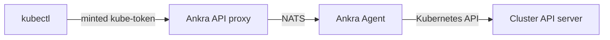

Once you have [Cluster Access](/essentials/cluster-access) to a cluster, you can use your existing `kubectl` against it through Ankra. Ankra mints a short-lived token and points your kubeconfig at the **Ankra API proxy**, which forwards your requests through the agent to the cluster's API server. You never need direct network access to the cluster, and there are no static credentials to manage.

<Note>
This works for clusters that have **no public API endpoint at all**. Because the agent dials out to Ankra (no inbound ports), the proxy reaches private clusters that `kubectl` could never hit directly.
</Note>

---

## Prerequisites

- **The access gateway is enabled** for your deployment. When it isn't, the token and proxy endpoints return `404`.
- **The cluster has a connected Ankra agent.** Every request flows through the agent, so `kubectl` stops working while the cluster is offline and resumes when it reconnects.
- **You have a [Cluster Access grant](/essentials/cluster-access) on the cluster.** Without one, `ankra cluster kubeconfig add` and `ankra cluster kube-token` fail with *"You do not have access to this cluster"*. This applies to **organisation admins too** - managing access does not itself include kubectl access, so admins must grant themselves a role first.
- **The grant has reconciled to `applied`.** A token can be minted as soon as the grant exists, but `kubectl` returns `Forbidden` until the RBAC is live on the cluster - check with `ankra cluster access list` or the cluster's **Access** view.
- **Ankra CLI v0.3.0 or later** for the `kubeconfig` and `kube-token` commands (run `ankra upgrade` to update).
- [Sandbox clusters](/essentials/cluster-sandbox) do not support Cluster Access and cannot be reached this way.

---

## How it works



- Your kubeconfig server URL points at `…/api/v1/clusters/{cluster_id}/k8s` on the Ankra API host - not at the cluster directly.
- Each request carries a short-lived token. Ankra authenticates it, checks your [access grant](/essentials/cluster-access), and forwards the call over NATS to the agent, which executes it against the API server.
- Standard `kubectl` behaviours work through the proxy, including `watch`, `kubectl logs -f`, and `kubectl exec` (these use streaming/websocket connections).

Your effective permissions are exactly the Kubernetes RBAC that your access grant created - a `view` grant can't mutate anything, a namespace-scoped grant can't see other namespaces.

---

## With the Ankra CLI (recommended)

The [CLI](/integrations/ankra-cli) manages the Ankra entries in your kubeconfig for you. By default it writes an **exec-based** context that fetches a fresh token on demand via `ankra cluster kube-token`, so credentials stay ephemeral and SSO-backed.

<Steps>
  <Step title="Log in once">
    ```bash
    ankra login
    ```
  </Step>
  <Step title="Add a cluster context">
    ```bash
    # Add the selected cluster and make it active
    ankra cluster kubeconfig add --cluster my-cluster --use

    # Or add every cluster you can access
    ankra cluster kubeconfig add --all
    ```
  </Step>
  <Step title="Use kubectl as normal">
    ```bash
    kubectl --context ankra-my-cluster get pods
    ```
  </Step>
</Steps>

The CLI only ever touches the Ankra-managed contexts - other clusters, users, and contexts already in your kubeconfig are left untouched. It writes to `--kubeconfig` if given, otherwise the first entry of `$KUBECONFIG`, otherwise `~/.kube/config`.

### `ankra cluster kubeconfig` commands

| Command | Description |
|---------|-------------|
| `add` | Add or update an Ankra context |
| `remove` | Remove Ankra-managed contexts |
| `list` | List Ankra-managed contexts in the kubeconfig |

### `add` flags

| Flag | Description |
|------|-------------|
| `--cluster <name\|id>` | Cluster to add (defaults to the selected cluster) |
| `--all` | Add every cluster you can access |
| `--use` | Set the added context as the active `current-context` (single cluster only) |
| `--namespace <ns>` | Default namespace for the context |
| `--print` | Print a standalone kubeconfig to stdout instead of writing the file |
| `--embed-token` | Embed a short-lived token instead of the auto-refreshing exec plugin |
| `--exec-command <bin>` | Executable kubectl invokes for credentials in exec mode (default `ankra`; use an absolute path if `ankra` isn't on `PATH`) |
| `--kubeconfig <path>` | Path to the kubeconfig file |
| `--insecure-skip-tls-verify` | Skip TLS verification (development only) |

<Tip>
Prefer the default **exec mode** for day-to-day use - kubectl transparently refreshes the token as it expires. Use `--embed-token` only when you need a self-contained file for a tool that doesn't support exec credential plugins; the embedded token is short-lived and you'll re-run the command to refresh it.
</Tip>

<Tip>
If your grant is **namespace-scoped**, add the context with `--namespace <ns>` set to that namespace. Otherwise plain `kubectl get pods` targets the `default` namespace and returns `Forbidden`, which looks like the grant is broken when it isn't.
</Tip>

### Remove a context

```bash
ankra cluster kubeconfig remove --cluster my-cluster
ankra cluster kubeconfig remove --all
```

---

## From the portal

You can also generate a kubeconfig from a cluster's **Access** view in the portal. Ankra mints a short-lived token and returns a ready-to-use kubeconfig document with the proxy server URL and token already filled in. Save it and point `kubectl` at it:

```bash
export KUBECONFIG=./ankra-my-cluster.yaml
kubectl get nodes
```

The downloaded kubeconfig embeds a short-lived token and stops working when the token expires - regenerate it when needed.

---

## Tokens, expiry, and rate limits

- **Short-lived tokens.** Both the exec-plugin token and the embedded kubeconfig token are time-boxed and expire automatically. The response includes an `expires_at`.
- **Rate limited.** Token and kubeconfig minting is rate limited per user; on large fleets prefer the default exec mode (which mints once) over `--embed-token --all` (which mints one token per cluster).
- **Revocable.** An admin can revoke a member's access at any time from [Cluster Access](/essentials/cluster-access) (delete the grant, or revoke all). Existing tokens stop working.

---

## API

| Method | Path | Purpose |
|--------|------|---------|
| `POST` | `/api/v1/clusters/{cluster_id}/k8s-token` | Mint a short-lived token (used by the kubectl exec credential plugin) |
| `POST` | `/api/v1/clusters/{cluster_id}/kubeconfig` | Generate a complete kubeconfig document |
| `*` | `/api/v1/clusters/{cluster_id}/k8s/...` | The Kubernetes API proxy endpoint your kubeconfig targets |

These are the **token-authenticated user-API** paths the CLI uses. The portal manages the same access through session-authenticated endpoints under `/org/clusters/{cluster_id}/access/...` - see the [Cluster Access API table](/essentials/cluster-access#api).

The proxy requires the access gateway to be enabled; when it isn't, these endpoints return `404`. See [Cluster Access](/essentials/cluster-access) for grants and the [CLI reference](/integrations/ankra-cli) for the full command set.
