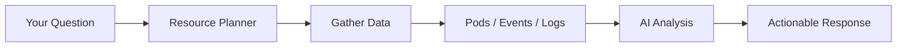

<Note>
Ankra's AI Assistant analyzes your cluster's real-time state—pods, events, logs, and configurations—to diagnose issues and provide actionable solutions without leaving the platform.
</Note>

---

## What is AI Troubleshooting?

AI Troubleshooting is an integrated assistant that helps you debug Kubernetes issues by:

- **Analyzing live cluster data** - Pods, events, logs, nodes, and resource configurations
- **Identifying root causes** - Not just symptoms, but why problems occur
- **Providing actionable steps** - Direct links to fix issues in the Ankra UI
- **Maintaining context** - Follow-up questions understand your conversation history

<CardGroup cols={2}>
  <Card title="Intelligent Analysis" icon="brain">
    AI understands Kubernetes patterns like CrashLoopBackOff, ImagePullBackOff, OOMKilled, and provides targeted solutions.
  </Card>
  <Card title="Real-Time Data" icon="clock">
    Fetches current pod status, container logs, events, and node conditions for accurate diagnosis.
  </Card>
  <Card title="Context Aware" icon="crosshairs">
    Knows what resource you're viewing and adapts responses accordingly—no need to repeat context.
  </Card>
  <Card title="Platform Integrated" icon="link">
    Provides clickable links to Ankra UI pages instead of kubectl commands.
  </Card>
</CardGroup>

---

## How It Works

When you ask a question, the AI Assistant:



### 1. Intelligent Resource Planning

The AI first determines what information to gather based on your question:

| Question Type | Resources Fetched |
|---------------|-------------------|
| "Why is my pod crashing?" | Pod status, container logs, events |
| "Are all deployments healthy?" | Deployments, pods, replica status |
| "What's wrong with ingress?" | Ingress config, services, endpoints |
| "Node issues" | Node conditions, capacity, pod distribution |

### 2. Data Collection

Based on the plan, Ankra fetches:

- **Pod information** - Phase, restart count, container states, conditions
- **Events** - Warning events, scheduling failures, image pull errors
- **Logs** - Container stdout/stderr (last 50 lines by default)
- **Node status** - Ready conditions, capacity, allocatable resources
- **Related resources** - Deployments, services, configmaps as needed

### 3. AI Analysis

Claude AI analyzes the collected data to:

- Identify the specific issue (e.g., exit code 137 = OOMKilled)
- Explain the root cause (e.g., memory limit too low for workload)
- Assess severity (critical, warning, info)
- Suggest fixes with direct Ankra UI links

---

## Accessing AI Troubleshooting

### AI Incidents (Alert-Triggered Analysis)

When alerts trigger, AI analysis results appear in:

**Alerts → AI Incidents** tab

This shows all automatically generated analyses with root cause, affected resources, and recommended actions. [Learn more about AI Incidents](/essentials/ai-incidents).

### Global AI Assistant (On-Demand)

Press <kbd>⌘</kbd> + <kbd>I</kbd> (Mac) or <kbd>Ctrl</kbd> + <kbd>I</kbd> (Windows/Linux) to open the AI Assistant from anywhere in the platform for on-demand troubleshooting.

### Resource Detail Pages

When viewing a specific resource (pod, deployment, etc.), the AI Assistant automatically knows what you're looking at:

- **Pod Details** → Ask "Why is this crashing?" without specifying the pod name
- **Logs Tab** → Ask "What do these errors mean?"
- **Events Tab** → Ask "What caused these warnings?"

### Dedicated Troubleshooting Page

Navigate to **Cluster → Troubleshooting** for a full-screen AI chat experience with conversation history.

---

## Example Questions

### Pod Issues

```
Why is my nginx-pod-xyz crashing?
```

The AI will analyze:
- Container exit codes and restart counts
- Recent warning events
- Container logs for error messages
- Memory/CPU limits vs actual usage

### Cluster Health

```
Are all pods healthy?
```

Response format:
```
Pod Health Summary: 43/46 pods healthy (3 with issues)

Pods with Issues:
- web-services/api-server-xyz: CrashLoopBackOff (11 restarts)
- monitoring/prometheus-abc: ImagePullBackOff
- database/postgres-def: Pending (insufficient memory)
```

### Resource Counting

```
How many namespaces are in my cluster?
```

The AI provides cluster-wide data, regardless of what page you're on.

### Debugging Specific Issues

```
Why is the customer-api deployment not starting?
```

The AI traces through:
1. Deployment replica status
2. ReplicaSet events
3. Pod scheduling attempts
4. Container startup errors

---

## Add-on Troubleshooting

For Helm add-ons, the AI provides specialized analysis:

<Accordion title="Add-on specific diagnostics">

When troubleshooting add-ons, the AI also checks:

- **ArgoCD sync status** - OutOfSync, Degraded, Healthy
- **Helm release state** - Deployed, Failed, Pending
- **Configuration values** - Misconfigurations in values.yaml
- **Latest job results** - Installation/update failures
- **CRD dependencies** - Missing Custom Resource Definitions

**Example:**
```
Why did cert-manager fail to install?
```

Response includes:
- Helm chart version compatibility
- Missing CRDs or prerequisites
- RBAC permission issues
- Specific error from the Helm job

</Accordion>

---

## Common Failure Patterns

The AI recognizes and explains these Kubernetes patterns:

| Pattern | Cause | AI Diagnosis |
|---------|-------|--------------|
| **CrashLoopBackOff** | App exits with error | Analyzes logs for exit code and error messages |
| **ImagePullBackOff** | Can't pull container image | Checks image name, registry, and credentials |
| **Pending** | Can't schedule pod | Reviews node resources, taints, tolerations |
| **OOMKilled** | Out of memory | Compares limits vs actual usage |
| **Evicted** | Node under pressure | Checks node conditions and pod priority |
| **CreateContainerError** | Container config issue | Examines volume mounts, secrets, configmaps |

---

## Response Format

AI responses follow a consistent structure:

### Problem Summary

Brief overview of what's happening.

### Root Cause

Technical explanation of why it's occurring, with specific details from logs/events.

### Impact Assessment

Severity indicator:
- 🔴 **Critical** - Service down, data loss risk
- ⚠️ **Warning** - Degraded performance, needs attention  
- ℹ️ **Info** - Informational, no action needed

### Suggested Actions

Numbered steps with **direct links to Ankra UI**:

1. View pod logs at [Pod Logs](/pods/xyz?tab=logs)
2. Check resource limits in pod configuration
3. Update memory limit to 512Mi
4. Restart the deployment

<Note>
The AI prioritizes Ankra UI actions over kubectl commands. You can fix most issues directly in the platform.
</Note>

---

## Conversation Context

The AI maintains context throughout your session:

```
You: Why is the api-server pod failing?

AI: The api-server-xyz pod is in CrashLoopBackOff due to missing 
    DATABASE_URL environment variable...

You: How do I add that variable?

AI: Since you're using the api-server deployment, you can add the 
    environment variable in the pod configuration:
    1. Navigate to the deployment at [link]
    2. Edit the container spec...
```

Follow-up questions reference the previous context automatically.

---

## Stack-Based Fixes

When the solution requires creating Kubernetes resources, the AI guides you through Stack-based creation:

<Accordion title="Why Stacks instead of kubectl?">

**Benefits of Stack-based resource creation:**

- **GitOps workflow** - Version controlled, auditable changes
- **Declarative management** - Resources defined as code
- **Rollback capability** - Easy to revert if needed
- **Dependency tracking** - Resources managed alongside related manifests

**Instead of:**
```bash
kubectl create secret generic db-creds --from-literal=password=xxx
```

**The AI suggests:**
1. Navigate to Stacks page
2. Create a new Stack or edit existing
3. Add the Secret manifest
4. Deploy the stack

</Accordion>

---

## Tips for Best Results

<Tip>
**Be specific** - "Why is nginx-pod-xyz crashing?" works better than "pods not working"
</Tip>

<Tip>
**Use context** - When on a resource detail page, ask "What's wrong with this?" instead of repeating the name
</Tip>

<Tip>
**Follow up** - Ask clarifying questions like "How do I fix that?" or "Show me the logs"
</Tip>

<Tip>
**Include logs** - For crash issues, the AI automatically fetches logs, but you can specify "include logs" for other queries
</Tip>

---

## Privacy & Data

- AI analysis happens on Ankra's secure infrastructure
- Logs and configurations are processed in real-time, not stored for AI training
- Conversation history is saved per-cluster for your convenience
- You can start a new conversation at any time to clear context

---

## Related

- [AI Assistant](/essentials/ai-assistant) - General AI capabilities in Ankra
- [AI Incidents](/essentials/ai-incidents) - AI-powered alert analysis
- [Kubernetes Insights](/essentials/kubernetes-insights) - Resource monitoring overview
- [Command Palette](/essentials/command-palette) - Quick access to AI and navigation

---

Need help? [Join our Slack community](https://ankra.io/slack) for support.
