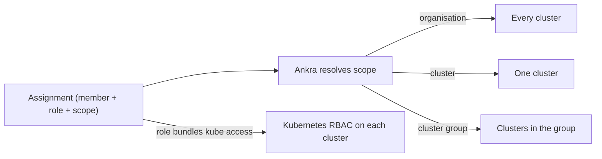

Ankra controls access with **roles** that you assign at a **scope**. A role is a set of permissions; a scope decides where those permissions apply - the whole organisation, a single cluster, or a **cluster group**. A role can also bundle Kubernetes access that Ankra provisions on every cluster in scope, so platform permissions and `kubectl` access are granted together.

<Note>
Roles and scoped assignments replace the earlier admin/member split. Existing members keep working: `admin` and `member` map onto the new model, and wider roles become available as you adopt them.
</Note>

---

## How access is decided



An **assignment** ties a member to a role at a scope. When the role includes Kubernetes access, Ankra reconciles the matching [Cluster Access](/essentials/cluster-access) grants onto every cluster the scope resolves to, and keeps them in sync as group membership changes.

---

## Built-in roles

| Role | Intended for |
|------|--------------|
| `owner` | Full control of the organisation, including billing and ownership transfer |
| `admin` | Manage members, roles, clusters, and settings |
| `operator` | Day-to-day operations across clusters and stacks |
| `member` | Use the platform; create and manage resources |
| `viewer` | Read-only access to organisation resources |
| `read-only` | Strict read-only |

You can also define **custom roles** that bundle a specific permission set and, optionally, a Kubernetes access level provisioned across the assignment's scope.

---

## Scopes

| Scope | Applies to |
|-------|-----------|
| **Organisation** | Every cluster and resource in the organisation |
| **Cluster** | A single named cluster |
| **Cluster group** | Every cluster that a group resolves to |

<Tip>
Assign the narrowest scope that fits. A support engineer who only triages one team's clusters gets a `viewer` (or `operator`) role on that team's **cluster group**, not the whole organisation.
</Tip>

---

## Cluster groups

A **cluster group** is a named set of clusters used as an assignment scope. Groups can be:

- **Static** - you pin specific clusters as members.
- **Dynamic** - a label selector evaluated against cluster labels, so clusters join and leave the group automatically as their labels change.

Manage groups under **Organisation → Settings → Cluster Groups**. A preview shows exactly which clusters a group currently resolves to before you use it in an assignment.

---

## Assigning a role

<Steps>
  <Step title="Open Roles & Access">
    Go to **Organisation → Settings** and open **Roles** (and **Cluster Groups** if you need a group scope).
  </Step>
  <Step title="Pick a member and role">
    Choose an organisation member, then a built-in or custom role.
  </Step>
  <Step title="Choose the scope">
    Assign at the organisation, a single cluster, or a cluster group.
  </Step>
  <Step title="Save">
    Ankra applies the assignment immediately. If the role bundles Kubernetes access, it reconciles the grants onto every cluster in scope.
  </Step>
</Steps>

From the [CLI](/integrations/ankra-cli#organisation-management):

```bash
# List built-in and custom roles
ankra org roles

# Manage cluster groups
ankra org cluster-groups list
ankra org cluster-groups create --name prod --selector env=production
ankra org cluster-groups preview prod

# Assign, list, and revoke roles at a scope
ankra org assign user@example.com --role operator --cluster-group prod
ankra org assignments user@example.com
ankra org unassign <assignment-id>
```

---

## Audit log

Every access change - invitations, role assignments, cluster-group edits, revocations - is recorded in the organisation **Audit Log** under **Organisation → Settings → Audit Log**, so you can see who changed what and when.

---

## Related

<CardGroup cols={2}>
  <Card title="Cluster Access" icon="key" href="/essentials/cluster-access">
    Scoped, SSO-backed kubectl access.
  </Card>
  <Card title="Organisations" icon="users" href="/essentials/organisations">
    Invite and manage members.
  </Card>
  <Card title="Organisation Settings" icon="gear" href="/essentials/organisation-settings">
    Configure organisation-wide behaviour.
  </Card>
  <Card title="API Tokens" icon="key" href="/essentials/tokens">
    Scope tokens to a permission allowlist.
  </Card>
</CardGroup>
