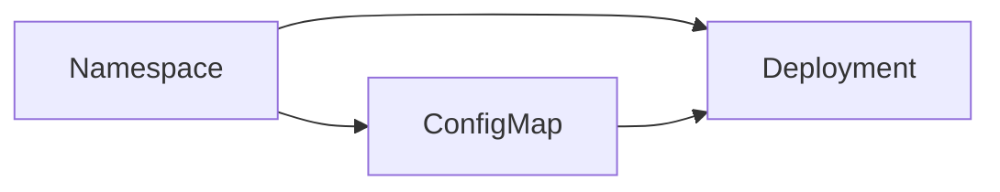

<Note>
Stacks let you bundle add-ons and manifests into a reusable, versioned package. This makes it easy to deploy consistent Kubernetes environments at scale.
</Note>

## What is a Stack?

A **Stack** in Ankra is a collection of add-ons and manifests grouped together to define a complete Kubernetes environment. Stacks are reusable and can be versioned, shared, and deployed to any cluster.

---

## Build Stacks with AI Assistance

The fastest way to plan a Stack is with the AI Assistant. Press `⌘+J` to open the chat and describe what you need:

<Steps>
  <Step title="Describe Your Goal">
    *"I need a monitoring stack with Prometheus, Grafana, and alerting for a production cluster"*
  </Step>
  <Step title="Get Recommendations">
    The AI suggests add-ons, dependencies, and best-practice configurations based on your cluster.
  </Step>
  <Step title="Refine Configuration">
    *"Set retention to 30 days and add PagerDuty integration"* - the AI provides updated configuration recommendations.
  </Step>
  <Step title="Build and Deploy">
    Add the recommended components to the Stack Builder, configure based on the guidance, and deploy with one click.
  </Step>
</Steps>

<Tip>
The AI knows your cluster's existing add-ons, resource limits, and Stack history-so recommendations are tailored, not generic.
</Tip>

---

## Why Use Stacks?

<CardGroup cols={2}>
  <Card title="Consistency Across Environments" icon="server">
    Deploy the same stack to dev, staging, and production to ensure every environment is configured identically.
  </Card>
  <Card title="Accelerate Onboarding" icon="user-plus">
    New clusters or teams can be up and running in minutes by applying a pre-built stack.
  </Card>
  <Card title="Simplify Updates" icon="gear">
    Update a stack and roll out changes to all clusters using it, reducing manual work and configuration drift.
  </Card>
  <Card title="Promote Best Practices" icon="shield-check">
    Share stacks across your organization to enforce standards and recommended configurations.
  </Card>
</CardGroup>

---

## Stack Builder

Ankra provides a visual **Stack Builder** interface that makes it easy to compose and manage your stacks.

### Visual Interface

The Stack Builder provides a drag-and-drop canvas where you can:

- **Add Components:** Drag add-ons and manifests onto the canvas
- **Define Dependencies:** Connect components to establish deployment order
- **Configure Values:** Click any component to edit its configuration
- **Preview Flow:** See how components will be deployed

### Creating a Stack

<Steps>
  <Step title="Open Stack Builder">
    Navigate to your cluster's **Stacks** section and click **Create Stack**. The Stack Builder canvas opens with an empty workspace.
  </Step>
  <Step title="Add Components">
    Click **+ Add** to browse available components:
    - **Add-ons:** Helm charts from your connected repositories
    - **Manifests:** Custom Kubernetes YAML resources

    Drag components onto the canvas or click to add them.
  </Step>
  <Step title="Configure Dependencies">
    Connect components to define deployment order. Ankra will deploy components in the correct sequence based on these connections.

    Example: Connect your namespace manifest to run before add-ons that depend on that namespace.
  </Step>
  <Step title="Edit Configuration">
    Click any component to:
    - View and edit values files (for add-ons)
    - Modify manifest content
    - Set namespace and other metadata
  </Step>
  <Step title="Save and Deploy">
    Click **Save** to store your stack. Then click **Deploy** to apply it to your cluster.
  </Step>
</Steps>

---

## Draft Stacks

Ankra supports **draft stacks** for work-in-progress configurations:

- **Auto-save:** Changes are saved automatically as you work
- **Preview:** See what will be deployed before committing
- **Validation:** Ankra validates your stack for common issues
- **Publish:** When ready, publish the draft to make it deployable

Draft stacks appear with a "Draft" badge in the stacks list.

---

## Stack Variables

Stacks support variables that let you parameterize your manifests and Helm values. Variables follow a hierarchy where stack-level variables override cluster and organisation variables.

### Using Variables in Stacks

1. Open your stack and click the **Variables** tab
2. Add key-value pairs for configuration values
3. Reference them in manifests using `${{ ankra.variable_name }}` syntax

```yaml
apiVersion: v1
kind: ConfigMap
metadata:
  name: app-config
data:
  API_URL: ${{ ankra.api_endpoint }}
  LOG_LEVEL: ${{ ankra.log_level }}
```

Stack variables have the highest precedence, overriding any cluster or organisation variables with the same name.

[Learn more about Variables →](./variables)

---

## Stack Components

### Add-ons

Add Helm charts to your stack:

1. Click **+ Add → Add-on**
2. Search or browse available charts
3. Select a chart version
4. Configure values (or use defaults)
5. Place on the canvas

Each add-on shows:
- Chart name and version
- Repository source
- Deployment status (after deploy)

### Manifests

Add custom Kubernetes YAML:

1. Click **+ Add → Manifest**
2. Enter a name for the manifest
3. Paste or write your YAML content
4. Place on the canvas

Manifests can contain any valid Kubernetes resources:
- Namespaces
- ConfigMaps and Secrets
- Custom Resource Definitions (CRDs)
- RBAC resources
- Any other Kubernetes objects

---

## Dependency Management

The Stack Builder lets you define deployment order through visual connections:

### Connecting Components

1. Hover over a component to see connection points
2. Click and drag from one component to another
3. The arrow indicates deployment order (source deploys before target)

### Dependency Rules

- Components without dependencies deploy first (in parallel if possible)
- Connected components wait for their dependencies to complete
- Failed dependencies stop downstream deployments

### Example Flow



In this example:
1. Namespace deploys first
2. ConfigMap deploys after namespace
3. Deployment deploys after both namespace and ConfigMap

---

## Stack Operations

### Editing a Stack

1. Go to **Stacks** and click on the stack
2. Click **Edit** to open the Stack Builder
3. Make changes and save
4. Re-deploy to apply changes

### Cloning a Stack

1. Click the stack's menu (⋯)
2. Select **Clone**
3. Edit the cloned stack as needed

### Deleting Components

1. Select a component on the canvas
2. Press **Delete** or click the remove button
3. Connections to that component are automatically removed

---

## Example Stack Composition

A typical production stack might include:

| Component Type | Example |
|---------------|---------|
| **Manifest** | Namespace definition |
| **Manifest** | RBAC roles and bindings |
| **Add-on** | Prometheus (monitoring) |
| **Add-on** | Grafana (dashboards) |
| **Add-on** | NGINX Ingress Controller |
| **Add-on** | Cert-Manager (TLS) |
| **Manifest** | Certificate resources |
| **Manifest** | Ingress rules |

---

## Best Practices

<Tip>
**Start with Namespaces:** Always include namespace manifests first to ensure add-ons have somewhere to deploy.
</Tip>

<Tip>
**Version Your Stacks:** Use descriptive names and keep track of changes for easier rollbacks.
</Tip>

<Tip>
**Test in Dev:** Deploy stacks to development clusters before applying to production.
</Tip>

<Tip>
**Keep Stacks Focused:** Create multiple smaller stacks rather than one massive stack for easier management.
</Tip>

---

## GitOps Integration

Stacks can be synced to a Git repository for version control and GitOps workflows:

1. Connect your GitHub repository in cluster settings
2. Stacks are exported as Helm values and manifests
3. Changes in Git can be synced back to Ankra
4. Full audit trail of all stack changes

[Learn more about GitOps →](./cluster-gitops)

---

## Explore the Stacks API

Want to automate stack management or integrate with your CI/CD workflows?
Check out the [API Reference](/api-reference) for endpoints to create, update, and apply stacks programmatically.