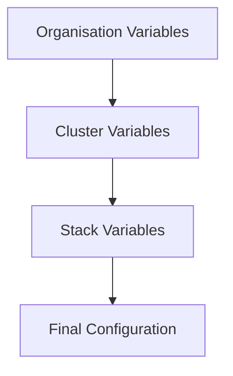

<Note>
Variables allow you to define reusable values that can be referenced across your stacks. Define them at the organisation, cluster, or stack level and use them in manifests and add-on configurations.
</Note>

## Overview

Ankra supports variables at three levels with a clear precedence hierarchy:



**Precedence Order** (highest to lowest):

1. **Stack variables** - Variables defined for a specific stack (highest precedence)
2. **Cluster variables** - Variables defined for a specific cluster
3. **Organisation variables** - Variables defined for the entire organisation (lowest precedence)

<Info>
Lower-level variables override higher-level ones. A stack variable with the same name as a cluster or organisation variable will take precedence for that stack.
</Info>

---

## Variable Syntax

Reference variables in your stacks using the following syntax:

```yaml
${{ ankra.variable_name }}
```

**Examples:**

```yaml
# In a manifest
apiVersion: v1
kind: ConfigMap
metadata:
  name: app-config
  namespace: default
data:
  domain: ${{ ankra.domain_name }}
  api_url: https://${{ ankra.domain_name }}/api
```

```yaml
# In Helm values
ingress:
  enabled: true
  hosts:
    - host: ${{ ankra.domain_name }}
```

---

## Organisation Variables

Organisation variables apply to all clusters and stacks within your organisation. Use them for values that are consistent across your entire infrastructure.

### Creating Organisation Variables

<Steps>
  <Step title="Navigate to Variables">
    Go to **Organisation Settings** → **Variables**.
  </Step>
  <Step title="Add a Variable">
    Click **Add Variable** to open the creation form.
  </Step>
  <Step title="Enter Variable Details">
    Fill in the required fields:
    - **Variable Name**: Must start with a letter, containing only letters, numbers, and underscores (e.g., `domain_name`, `api_key`)
    - **Value**: The variable's value
    - **Description** (optional): A brief description for documentation
    - **Secret**: Check this box to mask the value in the UI
  </Step>
  <Step title="Create">
    Click **Create Variable** to save.
  </Step>
</Steps>

### Common Organisation Variables

| Variable Name | Example Value | Use Case |
|---------------|---------------|----------|
| `domain_name` | `example.com` | Base domain for all services |
| `registry_url` | `ghcr.io/myorg` | Container registry URL |
| `environment` | `production` | Environment identifier |
| `alert_email` | `alerts@example.com` | Notification email address |
| `log_level` | `info` | Default logging level |

---

## Cluster Variables

Cluster variables apply to all stacks deployed to a specific cluster. Use them for cluster-specific configurations that differ between environments.

### Creating Cluster Variables

<Steps>
  <Step title="Navigate to Cluster Settings">
    Go to your cluster → **Settings** → **Variables**.
  </Step>
  <Step title="Add a Variable">
    Click **Add Variable** to open the creation form.
  </Step>
  <Step title="Enter Variable Details">
    Fill in the required fields:
    - **Variable Name**: Must start with a letter, containing only letters, numbers, and underscores
    - **Value**: The variable's value
    - **Description** (optional): A brief description
    - **Secret**: Check this box to mask the value in the UI
  </Step>
  <Step title="Create">
    Click **Create Variable** to save.
  </Step>
</Steps>

### Common Cluster Variables

| Variable Name | Example Value | Use Case |
|---------------|---------------|----------|
| `cluster_domain` | `prod.example.com` | Cluster-specific subdomain |
| `storage_class` | `gp3` | Default storage class |
| `node_selector` | `app=production` | Node selector labels |
| `replica_count` | `3` | Default replica count |
| `resource_quota` | `high` | Resource allocation tier |

---

## Stack Variables

Stack variables are specific to a single stack and have the highest precedence. Use them for stack-specific configurations that should override cluster and organisation variables.

### Creating Stack Variables

<Steps>
  <Step title="Open the Stack Builder">
    Navigate to your cluster → **Stacks** and open an existing stack or create a new one.
  </Step>
  <Step title="Go to Variables Tab">
    Click the **Variables** tab in the Stack Builder.
  </Step>
  <Step title="Add a Variable">
    Click **Add Variable** to create a new variable entry.
  </Step>
  <Step title="Enter Variable Details">
    Fill in the fields:
    - **Variable Name**: Must start with a letter, containing only letters, numbers, and underscores
    - **Value**: The variable's value
  </Step>
  <Step title="Save">
    Click **Save Variables** to persist the changes.
  </Step>
</Steps>

<Tip>
Stack variables are saved as part of the stack configuration. When you deploy the stack to GitOps, the variables are resolved before manifests are written.
</Tip>

### Common Stack Variables

| Variable Name | Example Value | Use Case |
|---------------|---------------|----------|
| `app_version` | `v2.1.0` | Application version tag |
| `replicas` | `5` | Stack-specific replica count |
| `feature_flag` | `enabled` | Feature toggles |
| `log_level` | `debug` | Stack-specific logging |
| `custom_config` | `{"key": "value"}` | JSON configuration |

### When to Use Stack Variables

Use stack variables when:

- A specific stack needs values that differ from cluster defaults
- You want to override cluster or organisation variables for one stack
- You're testing different configurations on the same cluster
- You need stack-specific feature flags or version tags

---

## Secret Variables

Mark variables as secrets when they contain sensitive values like API keys, passwords, or tokens.

<Warning>
Secret variables are masked in the UI but are still stored as-is on the server. For encrypted storage, use [SOPS encryption](/essentials/sops) instead.
</Warning>

### Secret Variable Features

- **Masked Display**: Values show as `••••••••` in the UI
- **Reveal Option**: Click the eye icon to temporarily reveal the value
- **Copy Protection**: Values can still be copied for use in configurations

### When to Use Secrets vs SOPS

| Feature | Secret Variables | SOPS Encryption |
|---------|------------------|-----------------|
| **UI Masking** | Yes | N/A |
| **Git Storage** | Plaintext | Encrypted |
| **Runtime Decryption** | No | Yes |
| **Best For** | UI-only protection | Full encryption at rest |

<Tip>
Use secret variables for convenience in the UI. Use SOPS when you need values encrypted in your Git repository.
</Tip>

---

## Using Variables in Stacks

### In Manifests

Reference variables anywhere in your Kubernetes manifests:

```yaml
apiVersion: apps/v1
kind: Deployment
metadata:
  name: myapp
spec:
  replicas: ${{ ankra.replica_count }}
  template:
    spec:
      containers:
        - name: app
          image: ${{ ankra.registry_url }}/myapp:latest
          env:
            - name: DOMAIN
              value: ${{ ankra.domain_name }}
```

### In Add-on Values

Use variables in Helm chart values:

```yaml
# Grafana add-on values
grafana:
  adminPassword: ${{ ankra.grafana_password }}
  ingress:
    enabled: true
    hosts:
      - grafana.${{ ankra.cluster_domain }}
```

### Variable Resolution

When you deploy a stack, Ankra resolves variables in this order:

1. Check for a matching stack variable (highest priority)
2. If not found, check for a matching cluster variable
3. If not found, check for a matching organisation variable
4. If still not found, the literal `${{ ankra.variable_name }}` is left in place (which will likely cause deployment errors)

<Info>
This precedence allows you to define sensible defaults at the organisation level, environment-specific overrides at the cluster level, and stack-specific customizations when needed.
</Info>

---

## Managing Variables

### Copying Variable Syntax

Click the **Copy** icon next to any variable to copy its full syntax:

```
${{ ankra.variable_name }}
```

This copies the ready-to-use syntax for pasting into your manifests.

### Deleting Variables

<Warning>
Deleting a variable that is in use by stacks will cause deployment failures. Review stack usage before deleting.
</Warning>

1. Click the **Delete** (trash) icon next to the variable
2. The variable is immediately removed

### Variable Naming Rules

Variable names must follow these rules:

- Start with a letter (a-z, A-Z)
- Contain only letters, numbers, and underscores
- Be unique within their scope (organisation or cluster)

**Valid names:** `domain_name`, `API_KEY`, `replica_count_v2`

**Invalid names:** `123_name`, `my-variable`, `name with spaces`

---

## Best Practices

<Tip>
**Use descriptive names**: Choose names that clearly indicate the variable's purpose. `prod_db_host` is better than `host1`.
</Tip>

<Tip>
**Document with descriptions**: Add descriptions to help team members understand each variable's purpose.
</Tip>

<Tip>
**Organize by scope**: Use organisation variables for global values, cluster variables for environment-specific values.
</Tip>

<Tip>
**Use consistent naming conventions**: Adopt a convention like `snake_case` and stick to it across your organisation.
</Tip>

---

## AI Prompts

Press `⌘+J` to open the AI Assistant and use these prompts:

<AccordionGroup>
  <Accordion title="Create Variables for a Stack">
    ```
    I need to deploy the same stack to dev and prod clusters with
    different domain names. Help me set up variables.
    ```
  </Accordion>
  <Accordion title="Migrate Hardcoded Values">
    ```
    Review my stack and suggest which values should be
    converted to variables.
    ```
  </Accordion>
</AccordionGroup>

---

## Related

<CardGroup cols={2}>
  <Card title="Stacks" icon="cubes" href="/essentials/stacks">
    Build stacks that use variables.
  </Card>
  <Card title="SOPS Encryption" icon="lock" href="/essentials/sops">
    Encrypt sensitive values in Git.
  </Card>
  <Card title="Organisation Settings" icon="building" href="/essentials/organisation-settings">
    Configure organisation-level settings.
  </Card>
  <Card title="Cluster Settings" icon="server" href="/essentials/cluster-settings">
    Configure cluster-level settings and variables.
  </Card>
</CardGroup>
