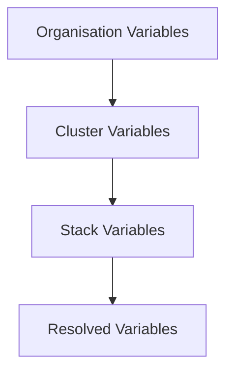

<Note>
Variables let you define reusable configuration values that can be referenced in your manifests and Helm add-on values. They support a hierarchical inheritance model where stack variables override cluster variables, which override organisation variables.
</Note>

## What are Variables?

Variables in Ankra are key-value pairs that you can reference in your Kubernetes manifests and Helm values files. Instead of hardcoding values like database URLs, API keys, or environment-specific settings, you define them as variables and reference them using Ankra's variable syntax.

---

## Variable Hierarchy

Ankra supports three levels of variables, each with increasing specificity:



| Level | Scope | Use Case |
|-------|-------|----------|
| **Organisation** | All clusters and stacks in your organisation | Shared values like company domain, default registry URL |
| **Cluster** | All stacks within a specific cluster | Environment-specific values like API endpoints, resource limits |
| **Stack** | Single stack only | Stack-specific values like application version, feature flags |

### Precedence Rules

When the same variable name exists at multiple levels, the most specific level wins:

1. **Stack variables** (highest priority)
2. **Cluster variables**
3. **Organisation variables** (lowest priority)

For example, if you define `DATABASE_URL` at the organisation level and also at the stack level, the stack value will be used when deploying that stack.

---

## Variable Syntax

Reference variables in your manifests and Helm values using this syntax:

```yaml
${{ ankra.variable_name }}
```

The variable name must:
- Start with a letter (a-z, A-Z)
- Contain only letters, numbers, and underscores
- Be case-sensitive

### Example Usage

**In a Kubernetes manifest:**

```yaml
apiVersion: v1
kind: ConfigMap
metadata:
  name: app-config
  namespace: ${{ ankra.app_namespace }}
data:
  DATABASE_URL: ${{ ankra.database_url }}
  API_ENDPOINT: ${{ ankra.api_endpoint }}
  LOG_LEVEL: ${{ ankra.log_level }}
```

**In Helm values:**

```yaml
replicaCount: 3

image:
  repository: ${{ ankra.registry_url }}/myapp
  tag: ${{ ankra.app_version }}

env:
  - name: DATABASE_HOST
    value: ${{ ankra.database_host }}
  - name: REDIS_URL
    value: ${{ ankra.redis_url }}
```

---

## Managing Organisation Variables

Organisation variables apply to all clusters and stacks within your organisation.

<Steps>
  <Step title="Open Organisation Settings">
    Click your profile icon in the bottom-left menu and select **Organisation**.
  </Step>
  <Step title="Navigate to Variables">
    Select your organisation, then go to **Settings** and click **Variables**.
  </Step>
  <Step title="Add a Variable">
    Click **Add Variable**, enter a name and value, and optionally add a description. Toggle **Secret** if the value should be masked in the UI.
  </Step>
  <Step title="Copy Reference">
    Click the copy icon next to any variable to copy its reference syntax for use in your manifests.
  </Step>
</Steps>

---

## Managing Cluster Variables

Cluster variables apply to all stacks within a specific cluster and override organisation variables with the same name.

<Steps>
  <Step title="Open Cluster Settings">
    Navigate to your cluster and click **Settings** in the sidebar.
  </Step>
  <Step title="Navigate to Variables">
    Click **Variables** in the settings menu.
  </Step>
  <Step title="Add a Variable">
    Click **Add Variable**, enter a name and value, and optionally add a description. Toggle **Secret** if the value should be masked.
  </Step>
</Steps>

<Tip>
Use cluster variables for environment-specific values. Define `DATABASE_URL` differently in your dev, staging, and production clusters while keeping the same manifests.
</Tip>

---

## Managing Stack Variables

Stack variables apply only to a specific stack and have the highest precedence.

<Steps>
  <Step title="Open Stack Editor">
    Navigate to your cluster, open a stack, and click **Edit**.
  </Step>
  <Step title="Open Variables Tab">
    Click the **Variables** tab in the stack editor.
  </Step>
  <Step title="Add Variables">
    Click **Add Variable** to create new variables. Enter the name and value for each.
  </Step>
  <Step title="Save Changes">
    Click **Save** to store the variables. Deploy the stack to apply changes.
  </Step>
</Steps>

---

## Variable Resolution Example

Consider this setup:

| Variable | Organisation | Cluster | Stack |
|----------|-------------|---------|-------|
| `log_level` | `info` | `debug` | - |
| `database_url` | `postgres://shared` | `postgres://staging` | `postgres://local` |
| `app_name` | `myapp` | - | - |

When deploying the stack, the resolved variables would be:

| Variable | Resolved Value | Source |
|----------|----------------|--------|
| `log_level` | `debug` | Cluster (overrides org) |
| `database_url` | `postgres://local` | Stack (overrides cluster and org) |
| `app_name` | `myapp` | Organisation |

---

## Best Practices

<CardGroup cols={2}>
  <Card title="Use Descriptive Names" icon="tag">
    Name variables clearly: `production_database_url` is better than `db_url`. Include context in the name.
  </Card>
  <Card title="Document with Descriptions" icon="file-lines">
    Add descriptions to variables explaining their purpose and expected format.
  </Card>
  <Card title="Leverage Hierarchy" icon="layer-group">
    Put shared defaults at the organisation level, environment overrides at cluster level, and app-specific values at stack level.
  </Card>
  <Card title="Mark Secrets Appropriately" icon="lock">
    Toggle the secret flag for sensitive values like API keys and passwords to mask them in the UI.
  </Card>
</CardGroup>

### Naming Conventions

| Convention | Example | Use For |
|------------|---------|---------|
| `UPPER_SNAKE_CASE` | `DATABASE_URL` | Environment-style variables |
| `lower_snake_case` | `app_version` | General configuration |
| `prefix_name` | `redis_host`, `redis_port` | Grouped related variables |

---

## Common Use Cases

### Multi-Environment Deployments

Define environment-specific values at the cluster level:

**Production Cluster:**
- `database_url` = `postgres://prod-db.internal:5432/app`
- `log_level` = `warn`
- `replicas` = `5`

**Staging Cluster:**
- `database_url` = `postgres://staging-db.internal:5432/app`
- `log_level` = `debug`
- `replicas` = `2`

Your manifests use `${{ ankra.database_url }}` and automatically get the correct value per environment.

### Shared Configuration

Define organisation-wide defaults:

- `registry_url` = `registry.company.com`
- `default_namespace` = `apps`
- `monitoring_endpoint` = `https://metrics.company.com`

Every cluster inherits these unless overridden.

### Application Versioning

Set version at the stack level for controlled rollouts:

```yaml
image:
  repository: ${{ ankra.registry_url }}/backend
  tag: ${{ ankra.backend_version }}
```

Update `backend_version` in the stack variables to deploy a new version.

---

## Troubleshooting

### Variable Not Substituted

If you see `${{ ankra.variable_name }}` in your deployed resources instead of the actual value:

1. Check the variable name matches exactly (case-sensitive)
2. Verify the variable is defined at the appropriate level
3. Ensure there are no typos in the syntax

### Unexpected Value

If a variable resolves to an unexpected value:

1. Check all three levels for the variable name
2. Remember that stack overrides cluster, which overrides organisation
3. Use the copy button in the UI to ensure you're using the correct syntax

