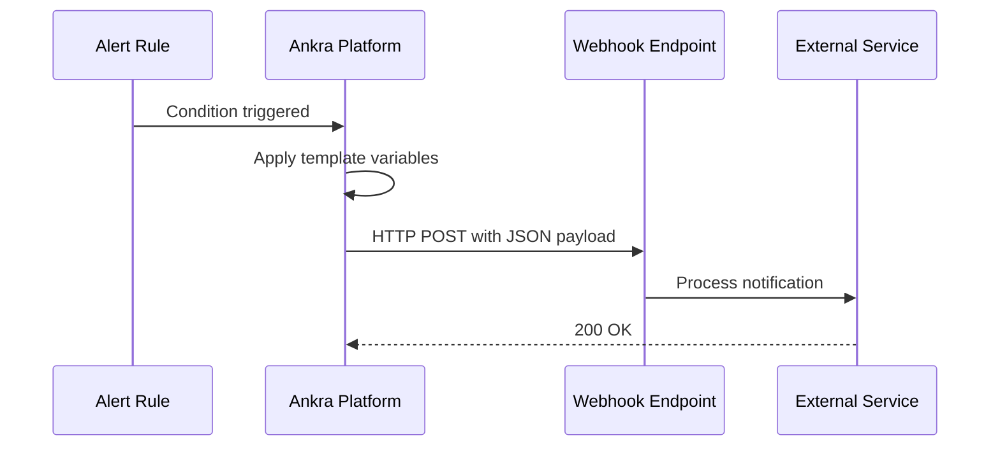

<Note>
Webhooks allow you to send alert notifications to any service that accepts HTTP POST requests - Slack, Microsoft Teams, Discord, PagerDuty, Opsgenie, Datadog, or your own custom endpoints.
</Note>

## What are Webhooks?

Webhooks are HTTP endpoints that receive alert notifications when your alert rules trigger. Ankra sends a POST request with alert details to your configured URL, allowing you to integrate with virtually any notification or incident management system.

Key features:
- **Universal compatibility** - Works with any service accepting webhooks
- **Custom payloads** - Full control over the JSON structure sent to your endpoint
- **Template variables** - Dynamic values like alert name, severity, and resource details
- **Pre-built templates** - Quick setup for popular services

### How Webhooks Work



---

## Creating a Webhook

<Steps>
  <Step title="Navigate to Webhooks">
    Go to **Alerts → Integrations → Webhooks** and click **Create Webhook**.
  </Step>
  
  <Step title="Configure Basic Settings">
    - **Webhook Name:** A descriptive name (e.g., "PagerDuty Production")
    - **Webhook URL:** The endpoint URL provided by your integration service
    - **Description:** Optional notes about this webhook's purpose
    - **Enabled:** Toggle to enable/disable the webhook
  </Step>
  
  <Step title="Select or Create Template">
    Choose a pre-built template for common services, or create a custom JSON payload:
    
    - **Slack** - Rich message blocks with buttons
    - **Microsoft Teams** - Adaptive card format
    - **Discord** - Embed format with fields
    - **Custom JSON** - Any JSON structure for other services
  </Step>
  
  <Step title="Save and Test">
    Save the webhook, then use the **Test** button to send a sample notification and verify your configuration.
  </Step>
</Steps>

---

## Template Variables

Use these variables in your custom templates. They are replaced with actual values when alerts trigger:

### Alert Information

| Variable | Description | Example |
|----------|-------------|---------|
| `{{alert_name}}` | Name of the alert | "Production Down Alert" |
| `{{alert_id}}` | Unique alert identifier | "abc123-def456" |
| `{{severity}}` | Alert severity level | "critical", "warning", "info" |
| `{{severity_color}}` | Hex color for severity | "#FF0000" |
| `{{condition_type}}` | Type of condition that triggered | "resource_state" |
| `{{triggered_at}}` | Human-readable trigger time | "Dec 15, 2024, 3:45 PM" |
| `{{triggered_at_iso}}` | ISO 8601 timestamp | "2024-12-15T15:45:00Z" |

### Resource Information

| Variable | Description | Example |
|----------|-------------|---------|
| `{{resource_name}}` | Name of the affected resource | "nginx-deployment" |
| `{{resource_type}}` | Type of resource | "addon", "manifest", "stack" |
| `{{job_name}}` | Related job name | "deploy-nginx" |
| `{{cluster_name}}` | Cluster where alert triggered | "production-us-east" |

### Action URLs

| Variable | Description |
|----------|-------------|
| `{{alert_url}}` | Direct link to the alert in Ankra |
| `{{dashboard_url}}` | Link to the Ankra dashboard |
| `{{acknowledge_url}}` | URL to acknowledge the alert |
| `{{snooze_url}}` | URL to snooze the alert |

---

## Integration Examples

### Slack

Slack webhooks use the Block Kit format for rich messages:

```json
{
  "blocks": [
    {
      "type": "header",
      "text": {
        "type": "plain_text",
        "text": "🚨 Alert: {{alert_name}}"
      }
    },
    {
      "type": "section",
      "text": {
        "type": "mrkdwn",
        "text": "*Severity:* `{{severity}}`\n*Triggered:* {{triggered_at}}"
      }
    },
    {
      "type": "section",
      "fields": [
        { "type": "mrkdwn", "text": "*Resource:*\n{{resource_name}}" },
        { "type": "mrkdwn", "text": "*Cluster:*\n{{cluster_name}}" }
      ]
    },
    {
      "type": "actions",
      "elements": [
        {
          "type": "button",
          "text": { "type": "plain_text", "text": "View Alert" },
          "url": "{{alert_url}}"
        }
      ]
    }
  ]
}
```

<Tip>
Create a Slack webhook at **Your Workspace → Apps → Incoming Webhooks**.
</Tip>

### Microsoft Teams

Teams uses MessageCard format:

```json
{
  "@type": "MessageCard",
  "@context": "http://schema.org/extensions",
  "themeColor": "{{severity_color}}",
  "summary": "Alert: {{alert_name}}",
  "sections": [
    {
      "activityTitle": "🚨 {{alert_name}}",
      "activitySubtitle": "Severity: {{severity}}",
      "facts": [
        { "name": "Resource", "value": "{{resource_name}}" },
        { "name": "Cluster", "value": "{{cluster_name}}" },
        { "name": "Triggered", "value": "{{triggered_at}}" }
      ]
    }
  ],
  "potentialAction": [
    {
      "@type": "OpenUri",
      "name": "View Alert",
      "targets": [{ "os": "default", "uri": "{{alert_url}}" }]
    }
  ]
}
```

### Discord

Discord uses the embed format:

```json
{
  "embeds": [
    {
      "title": "🚨 Alert: {{alert_name}}",
      "description": "**Severity:** `{{severity}}`",
      "color": 15158332,
      "fields": [
        { "name": "Resource", "value": "{{resource_name}}", "inline": true },
        { "name": "Cluster", "value": "{{cluster_name}}", "inline": true },
        { "name": "Triggered", "value": "{{triggered_at}}", "inline": false }
      ],
      "footer": { "text": "Ankra Alerts" },
      "timestamp": "{{triggered_at_iso}}"
    }
  ]
}
```

### PagerDuty

PagerDuty Events API v2 format:

```json
{
  "routing_key": "YOUR_INTEGRATION_KEY",
  "event_action": "trigger",
  "dedup_key": "{{alert_id}}",
  "payload": {
    "summary": "{{alert_name}} - {{severity}}",
    "severity": "{{severity}}",
    "source": "{{cluster_name}}",
    "component": "{{resource_name}}",
    "group": "{{resource_type}}",
    "class": "{{condition_type}}",
    "custom_details": {
      "resource_name": "{{resource_name}}",
      "resource_type": "{{resource_type}}",
      "cluster_name": "{{cluster_name}}",
      "triggered_at": "{{triggered_at}}"
    }
  },
  "links": [
    { "href": "{{alert_url}}", "text": "View in Ankra" }
  ]
}
```

<Tip>
Use PagerDuty's Events API v2 endpoint: `https://events.pagerduty.com/v2/enqueue`
</Tip>

### Opsgenie

Opsgenie Alert API format:

```json
{
  "message": "{{alert_name}}",
  "priority": "P1",
  "description": "Severity: {{severity}}\nResource: {{resource_name}}\nCluster: {{cluster_name}}",
  "tags": ["ankra", "{{severity}}", "{{resource_type}}"],
  "details": {
    "alert_id": "{{alert_id}}",
    "resource_name": "{{resource_name}}",
    "cluster_name": "{{cluster_name}}",
    "triggered_at": "{{triggered_at}}"
  }
}
```

### Custom/Generic

For any other service, create a JSON payload that matches their expected format:

```json
{
  "event_type": "alert",
  "alert": {
    "id": "{{alert_id}}",
    "name": "{{alert_name}}",
    "severity": "{{severity}}",
    "triggered_at": "{{triggered_at_iso}}"
  },
  "resource": {
    "name": "{{resource_name}}",
    "type": "{{resource_type}}",
    "cluster": "{{cluster_name}}"
  },
  "links": {
    "alert": "{{alert_url}}",
    "dashboard": "{{dashboard_url}}"
  }
}
```

---

## Testing Webhooks

After creating a webhook, use the **Test** button to:

1. Send a sample alert payload to your endpoint
2. Verify the message appears correctly in your target service
3. Confirm the JSON structure is valid for your integration

Test payloads use placeholder values so you can see how real alerts will appear.

---

## Managing Webhooks

### Enable/Disable

Toggle webhooks on or off without deleting them. Disabled webhooks won't receive any notifications but retain their configuration.

### Edit

Update webhook URLs, templates, or settings at any time. Changes take effect immediately for future alerts.

### Delete

Remove webhooks you no longer need. Alerts using deleted webhooks will no longer send to that destination.

---

## Best Practices

<Tip>
**Use descriptive names:** Name webhooks by service and purpose (e.g., "Slack #incidents", "PagerDuty On-Call").
</Tip>

<Tip>
**Test before deploying:** Always send a test notification to verify your template works correctly.
</Tip>

<Tip>
**Route by severity:** Create separate webhooks for different alert severities - Critical to PagerDuty, Warning to Slack.
</Tip>

<Tip>
**Include action URLs:** Add `{{alert_url}}` and `{{dashboard_url}}` so responders can quickly access details.
</Tip>

<Tip>
**Use dedup keys:** For incident management systems like PagerDuty, use `{{alert_id}}` as the dedup key to prevent duplicate incidents.
</Tip>

---

## Related

- [Alerts](/essentials/alerts) - Configure alert rules that trigger webhook notifications
- [AI Incidents](/essentials/ai-incidents) - AI-powered analysis of triggered alerts

---

Still have questions? [Join our Slack community](https://ankra.io/slack) and we'll help out.


