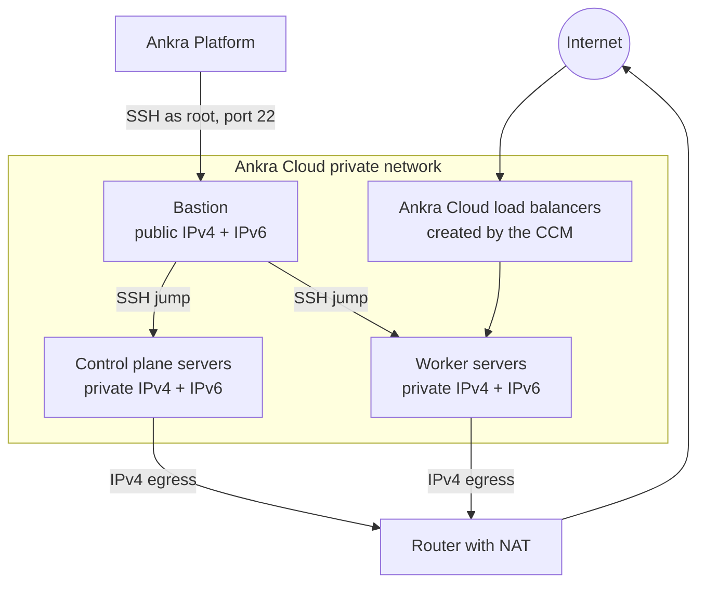

Ankra builds self-managed Kubernetes clusters on [Ankra Cloud](https://cloud.ankra.app) servers: a private network with a NAT router, a bastion server, control plane and worker servers on the private network, kubeadm or k3s installed over SSH, and the Ankra Cloud cloud controller manager and CSI driver deployed as a stack. You own the control plane and every server; Ankra provisions, upgrades and repairs them.

<Warning>
**Closed beta.** Ankra Cloud as a cluster provider is in closed beta. The workflow is stable but the surface may still change, and it is enabled per organisation on request - until it is, Ankra Cloud does not appear in the create-cluster dialog or among the credential providers, and its endpoints are not served. [Contact support](/platform/support) to have it turned on for your organisation.
</Warning>

This is the self-managed lane. If you want the Ankra team to run the control plane for you, use [Ankra Cloud Kubernetes](/guides/ankra-cloud-kubernetes) instead; the [comparison table](/guides/managed-kubernetes#managed-vs-self-managed) sets the two side by side.

---

## Prerequisites

<CardGroup cols={2}>
  <Card title="Ankra Cloud Credential" icon="key">
    An Ankra Cloud API token (`act_...`) from a user allowed to create servers, networks and routers. The same credential serves both self-managed clusters and Ankra Cloud Kubernetes. See [Ankra Cloud Credentials](/platform/credentials/ankra-cloud).
  </Card>
  <Card title="SSH Key Credential" icon="lock">
    An SSH public key for server access. You can provide your own or let Ankra generate one. See [SSH Key Credentials](/platform/credentials/ssh-key).
  </Card>
</CardGroup>

---

## Creating an Ankra Cloud cluster

### Via the Platform UI

<Steps>
  <Step title="Open the create dialog">
    Go to **Clusters** → **Create Cluster** and pick **Ankra Cloud** under **Ankra Managed** (kubeadm or k3s on Ankra Cloud servers).
  </Step>
  <Step title="Credentials & Zone">
    Pick the Ankra Cloud credential, or add one inline with **Add Ankra Cloud credential**. Choose the **Runtime credential** the in-cluster cloud controller and CSI driver use: the default reuses the provisioning credential, and a separate, dedicated credential limits what those components can reach. Pick an SSH key, then the zone. Zones, plans and templates load live from your Ankra Cloud account; a zone that runs no servers (a network-only location such as Stockholm) is refused.
  </Step>
  <Step title="Private Network & Bastion">
    Choose **Create a dedicated network** (Ankra creates and owns the network and its router; the wizard proposes `10.64.0.0/20`) or **Use an existing network** in the zone. Pick the bastion plan, and optionally restrict **Bastion allowed IPs** to the CIDRs that may reach the bastion over SSH; empty allows any address. **Storage retention on teardown** decides whether persistent volumes are kept (the default) or deleted when the cluster is deprovisioned.
  </Step>
  <Step title="Compute">
    Set the control-plane count (1, 3 or 5) and plan, then one or more worker node groups, each with its own plan, count, labels and taints. The cost summary prices every server from the live plan catalog, plus public IPv4. Storage, load balancers and transfer are not in the total.
  </Step>
  <Step title="Kubernetes">
    Choose the server template (default `debian-13`), the distribution and the Kubernetes version:
    - **kubeadm** (default) - vanilla Kubernetes with containerd and Cilium. Cilium is the only CNI kubeadm accepts on Ankra Cloud. etcd runs stacked on the control-plane nodes, or on 3 or 5 dedicated external etcd servers with their own plan.
    - **k3s** - a single binary with batteries included, with a choice of CNI.
  </Step>
  <Step title="GitOps">
    Optionally connect a Git repository, and Ankra commits the cluster's stacks to it. Two checkboxes are on by default:
    - **Include Networking Stack** - Traefik, cert-manager and a Let's Encrypt ClusterIssuer, with Traefik behind an Ankra Cloud load balancer.
    - **Include DNS Integration** - external-dns, so Ingress hostnames publish their DNS records automatically.

    Skipping GitOps still deploys the cloud controller manager and CSI driver; the `ankracloud-cloud-provider` stack is then not committed to Git.
  </Step>
  <Step title="Preflight & Review">
    Name the cluster and create it. Preflight checks run first against your account: the credential authenticates, the zone offers compute, every plan and the template exist, an existing network lives in the chosen zone, and kubeadm is paired with Cilium. Any failing check blocks creation and says why.

    A live progress view then tracks the network, router, firewall, bastion, servers, Kubernetes installation and Ankra Agent. The cluster shows **offline** until provisioning finishes, then **online**.
  </Step>
</Steps>

### Via the API

```bash
curl -X POST https://platform.ankra.app/api/v1/clusters/ankracloud \
  -H "Authorization: Bearer $ANKRA_API_TOKEN" \
  -H "Content-Type: application/json" \
  -d '{
    "name": "my-cluster",
    "credential_id": "<ankra-cloud-credential-id>",
    "ssh_key_credential_id": "<ssh-key-credential-id>",
    "zone": "de-fsn1",
    "bastion_plan": "<plan>",
    "control_plane_count": 1,
    "control_plane_plan": "<plan>",
    "worker_count": 2,
    "worker_plan": "<plan>",
    "distribution": "kubeadm"
  }'
```

Plans are account-wide; list them, and the zones, templates and networks the wizard offers, with `GET /api/v1/clusters/ankracloud/plans?credential_id=<id>` (and `/zones`, `/templates`, `/networks?zone=<zone>` alongside). `POST /api/v1/clusters/ankracloud/preflight` takes the same body and answers the checks without creating anything.

| Field | Default | Description |
|-------|---------|-------------|
| `zone` | | Ankra Cloud zone the servers are built in, for example `de-fsn1` |
| `template` | `debian-13` | Public server template: `debian-13`, `debian-12` or `ubuntu-24.04` |
| `distribution` | `kubeadm` | `kubeadm` or `k3s` |
| `kubernetes_version` | latest stable | Kubernetes version for the chosen distribution |
| `cni` | | CNI for k3s; kubeadm accepts only Cilium |
| `etcd_topology` | `stacked` | kubeadm only: `stacked` or `external`, with `etcd_node_count` (3 or 5) and `etcd_plan` |
| `network_ip_range` | a derived `/20` | RFC 1918 range, `/16` to `/29`, for the network Ankra creates |
| `private_network_id` | | Adopt an existing network in the zone instead; mutually exclusive with `network_ip_range` |
| `bastion_plan` | | Plan of the bastion server |
| `bastion_allowed_ips` | any | IPv4 or IPv6 addresses or CIDRs allowed to reach the bastion over SSH |
| `control_plane_count` | | 1 to 9 control-plane servers |
| `control_plane_plan` | | Plan of the control-plane servers |
| `worker_count`, `worker_plan` | | A single worker group; use `node_groups` (each with `name`, `instance_type`, `count`, labels and taints) for several |
| `runtime_credential_id` | the provisioning credential | Ankra Cloud credential the in-cluster CCM and CSI use |
| `retention_policy` | `retain` | `retain` or `delete` persistent volumes on deprovision |
| `include_networking`, `include_dns` | `true` | Networking stack and DNS integration |
| `gitops_credential_name`, `gitops_repository`, `gitops_branch` | branch `master` | Optional GitOps repository |

A cluster has at most 100 workers across its node groups.

---

## Network design



| Component | What Ankra creates |
|-----------|--------------------|
| **Private network** | An RFC 1918 network, named after the cluster, that every server joins. Kubernetes runs on it: each kubelet's node IP is its private IPv4 address. An adopted network is used as it is and left in place on deprovision. |
| **Router with NAT** | A router attached to the private network with NAT enabled. It is the nodes' IPv4 path to the internet, and only that - it is never an SSH hop. |
| **Bastion** | A plain server with a public IPv4 address. Ankra connects to it as `root` on port 22 and jumps through it to every other server to install Kubernetes, run upgrades and reconcile. |
| **Control plane and workers** | Servers on the private network. They keep the public IPv6 address every Ankra Cloud server gets, behind the firewall, and have no public IPv4 address. The Kubernetes API is not published: Ankra reaches it through the bastion, and the Ankra Agent in the cluster connects out to Ankra. |
| **Firewall** | Ankra Cloud has no security groups, so Ankra applies a firewall to each server: inbound traffic is dropped by default, the private network is trusted as a whole, and the bastion accepts SSH from `bastion_allowed_ips` (or anywhere when it is empty). |

Ankra Cloud servers are IPv6-first. Nodes do not rely on the per-server IPv4 translation (CLAT) Ankra Cloud offers IPv6-only servers; pod and node IPv4 traffic leaves through the router's NAT instead.

Every server Ankra creates carries the labels `platform.ankra.io/managed-by=ankra-platform`, `platform.ankra.io/cluster-id=<cluster-id>` and `platform.ankra.io/role`, so you can find a cluster's servers in the Ankra Cloud console.

### Cost

Servers are billed by Ankra Cloud at their plan price. A public IPv4 address costs €3 a month per address; the bastion holds one, and the nodes hold none. IPv6 is not billed. Load balancers the cloud controller creates, persistent volumes and transfer are billed by Ankra Cloud on top and are not part of the wizard's estimate.

---

## Cloud controller and storage

After the Ankra Agent is installed, Ankra deploys the `ankracloud-cloud-provider` stack into `kube-system`: the `ankra-cloud-ccm` and `ankra-cloud-csi` charts, sharing the runtime credential's token through the Secret `ankra-cloud` (SOPS-encrypted when the stack is committed to Git). Every kubelet runs with `--cloud-provider=external`, and the controller links each node to its server as `ankracloud://<zone>/<server-id>`.

**LoadBalancer Services.** `ankra-cloud-ccm` gives each Service of type `LoadBalancer` an Ankra Cloud load balancer on the cluster's private network, with the nodes' private addresses as members. The networking stack's Traefik uses one, with `externalTrafficPolicy: Local` so the client address is preserved.

**Persistent volumes.** `ankra-cloud-csi` provisions Ankra Cloud storages. It installs four StorageClasses:

| StorageClass | Tier | Use |
|--------------|------|-----|
| `ankra-standard` (default) | `standard` | General purpose, replicated |
| `ankra-maxiops` | `maxiops` | Databases and other latency-sensitive workloads |
| `ankra-hdd` | `hdd` | Bulk data |
| `ankra-local-nvme` | `local-nvme` | The compute node's own disks: fastest, single copy, pinned to one server |

Volumes are ReadWriteOnce and created in the zone of the node their pod is scheduled on.

---

## Managing an Ankra Cloud cluster

Once the cluster is online:

- **Node groups** - add, scale, re-plan, label and taint worker groups from **Nodes** → **Node groups** in the cluster sidebar.
- **Restart a node** - restart a single server from the node list.
- **Bastion and control plane** - resize the bastion or the control-plane servers from cluster settings.
- **Upgrade Kubernetes** - from cluster settings.
- **Stop and start** - a stop powers the servers off and keeps them, with their disks; a start powers them on again. See [Stop cluster](/platform/cluster-settings#stop-cluster).

---

## Deprovisioning

Deprovisioning deletes the servers, the bastion, the router, the firewall rules and the private network Ankra created, then removes the cluster from Ankra. A network you adopted with `private_network_id` is left in place. Persistent volumes follow the retention policy and are deleted only once you accept it - see [persistent volumes](/platform/cluster-settings#persistent-volumes).

<Warning>
This action is irreversible. All data on the cluster's servers is permanently deleted.
</Warning>

Go to your cluster → **Settings** → **General** → **Danger Zone** and click **Terminate**.

---

## Troubleshooting

| Issue | Solution |
|-------|----------|
| Preflight: `zone "..." is a network-only location and runs no servers` | Pick a zone that offers compute, for example `de-fsn1` |
| Preflight: `plan "..." is not available to this account` | Pick a plan from the live catalog in the wizard |
| Preflight: `template "..." is not a public Ankra Cloud template` | Use `debian-13`, `debian-12` or `ubuntu-24.04`; custom templates are not supported |
| Preflight: `kubeadm supports only Cilium on Ankra Cloud` | Choose Cilium, or switch to k3s for another CNI |
| Preflight: `network ... lives in zone ..., not ...` | Adopt a network in the cluster's zone, or let Ankra create one |
| Create fails with a quota error | Ankra Cloud enforces account quotas when servers are created; raise them in the Ankra Cloud console or pick smaller plans |
| Credential refused | Check the token in the Ankra Cloud console and [rotate it](/platform/credentials/ankra-cloud) |

## Related

- [Ankra Cloud Kubernetes](/guides/ankra-cloud-kubernetes)
- [Ankra Cloud Credentials](/platform/credentials/ankra-cloud)
- [Cluster settings](/platform/cluster-settings)
