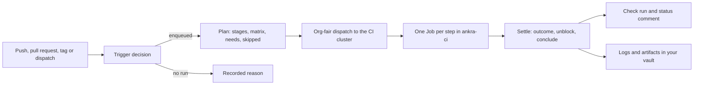

import { CliVersion } from "/snippets/cli-version.jsx";

<Note>
Ankra Pipelines runs a repository's CI as Kubernetes Jobs inside a cluster you already operate through Ankra. One file, `.ankra/pipeline.yaml`, declares the triggers and the stages; a push, a pull request or a tag starts a run, every stage runs as a hardened Job in the `ankra-ci` namespace of your CI cluster, and the result lands as an `Ankra pipeline` check on the commit, one section of the pull request's status comment, and a run you can follow with `ankra pipeline logs --follow`. There are no GitHub-hosted or self-hosted runners to keep alive.
</Note>

This page is for a platform engineer deciding whether to move CI onto Ankra. It says what the product does, exactly what is in place today, and what is not yet.

## Why CI belongs in your cluster

The generated GitHub Actions workflow Ankra Applications ship with works, and keeps working - see [Bring your own CI](#bring-your-own-ci-github-actions) below. Ankra Pipelines exists because of what that model cannot fix:

- **Runners are a second fleet.** GitHub-hosted runners are shared and rate limited; a self-hosted runner pool is one more set of machines to size, patch and pay for. A pipeline step is a Job on nodes you already have, scheduled under the quota and node selectors you set, and never at the expense of a deploy - the agent runs pipeline work in its own worker pool.
- **Credentials live in CI secrets.** A workflow needs registry logins, cloud credentials and deploy tokens as repository secrets, copied per repository and readable by any workflow that names them. In a pipeline definition those are *references* the platform resolves, and the sections that grant them are protected: a pull request can rewrite what a pipeline does, and cannot widen what it may touch.
- **Publish happens before the gate.** A workflow that pushes an image and scans it afterwards has already published a vulnerable image by the time the scan fails. The pipeline vocabulary separates `build`, `scan`, `gate` and `publish` so that nothing is published that the gate did not pass.
- **The evidence is somewhere else.** Run history, logs, scan artifacts and the check on the commit all lived on the CI provider. A pipeline run is an Ankra object: `ankra pipeline get`, live logs, artifacts in your own backup vault, and the same status on GitHub, GitLab or Bitbucket.

## What is in place today

Ankra Pipelines is landing in pieces, and this page is honest about the line. Everything in the first list is on the platform and the agent now; everything in the second is not, and is described in [What comes next](#what-comes-next).

**In place**

- The definition: `.ankra/pipeline.yaml` (`apiVersion: ankra.io/v1`, `kind: Pipeline`) with its parser, validator and dry-run planner - see the [pipeline.yaml reference](/guides/pipeline-reference).
- Conversion of an existing GitHub Actions, GitLab CI, Bitbucket Pipelines or CircleCI definition into a pipeline, from chat or the MCP server - see [Migrate from GitHub Actions](/guides/migrate-from-github-actions).
- The organisation's CI settings (which cluster runs pipelines, parallelism, image allow-list, retention, image gate) and its pipeline policy (the authority ceiling an administrator sets).
- The runs API and the `ankra pipeline` commands: dispatch, list, get, cancel, re-run, live step logs, artifacts, the stored definition, schedules.
- Triggers from push, pull request and tag deliveries on GitHub, GitLab and Bitbucket Cloud, deduplicated across redeliveries, with a recorded reason whenever nothing runs.
- In-cluster execution of `run` stages on the organisation's CI cluster: a hardened Job per step in `ankra-ci`, a per-run workspace volume, keyed cache volumes, service sidecars, network tiers, resource ceilings, timeouts, live logs, and one automatic retry of Ankra's own failures.
- SCM feedback: one `Ankra pipeline` check run per run on GitHub with a real conclusion and a Cancel button, a commit status on GitLab and Bitbucket, a comment fallback when the GitHub App lacks `checks:write`, and the pipeline section of the single status comment on the pull request.
- Step logs and declared artifacts stored in the organisation's backup vault, listed and downloaded through the API and CLI.

**Not in place yet**

- Connecting a repository to a pipeline. The lane that connects a repository and writes `.ankra/pipeline.yaml` through the setup pull request has not shipped. Until it does, a push to a repository records `repository_not_onboarded` and the by-application pipeline commands answer not found.
- Reading the committed file at each commit. The definition a run executes is the stored definition of record (`ankra pipeline definition put`); commit the same file so the two do not drift.
- The runners for `checkout`, `build`, `scan` and `verify` stages, and the platform-side settling of `gate`, `publish` and every other kind that does not run in the cluster. Today `run` is the stage kind that executes end to end.
- Delivering declared `secrets` and `credentials` into a step, and the run identity that `permissions` mints.
- Runs for pull requests from forks, schedules firing, and the user-declared `retry` block being applied.

## How a run happens



1. **Trigger.** A verified delivery from GitHub, GitLab or Bitbucket Cloud - a branch push, a pull request opened, synchronised or reopened, or a tag - is normalised into one event and decided in a fixed order: is the repository connected, is the head trusted, is there a cluster to run on, is there a definition, does the definition's `on:` block accept the event. A dispatch from the CLI, the API or an agent goes through the same decision. Every answer is recorded, so a push that started nothing still says why ([the reason tokens](/guides/pipeline-reference#triggers-and-reasons)).
2. **Plan.** The planner turns the definition and the event into the step DAG: which stages survive the trigger and stage filters, how a matrix fans out (at most 64 legs per stage), what each step depends on, which `if:` conditions can be settled now. Nothing is dropped silently - a filtered stage is recorded with a reason code, and a run whose every stage is filtered out is recorded as concluded with outcome `skipped`.
3. **Dispatch.** Steps are claimed org-fairly, never global FIFO: organisations are served in order of how many steps they already have running, inside each organisation's own parallelism cap. The dispatcher resolves the cluster per step - the organisation's CI cluster, otherwise the staging cluster it already nominated for AI work - and probes that the cluster's agent advertises the `run_pipeline_step` job before sending anything.
4. **Run.** The agent renders the step's own Kubernetes objects from the signed payload - it never applies what the platform sent verbatim - and runs a hardened batch/v1 Job. Output streams live while the step runs; the complete log and the declared artifacts are uploaded to your backup vault when it concludes.
5. **Settle.** The settle loop records the verdict, unblocks the steps that waited on it and concludes the run when nothing is left. Only Ankra's own failures are retried, once; a non-zero exit is the step's verdict and is final.
6. **Report.** The `Ankra pipeline` check run (or commit status) is updated on every change, and the pipeline section of the pull request's status comment with it.

Deploying the result is unchanged: Ankra Applications deploy the image your CI published, and push-to-deploy, previews and rollback read that same observation. Once the `build` and `publish` stages run in the cluster, the pipeline is what publishes the digest they read.

## Prerequisites

- **A connected repository.** The repository is connected through the [Ankra GitHub App](/integrations/github), GitLab, or [Bitbucket Cloud](/integrations/bitbucket-cloud), so Ankra receives its webhooks. Pipelines are repository-scoped with an optional link to an [Application](/concepts/applications); a repository with nothing to build can have a pipeline too.
- **A CI cluster.** An organisation administrator sets `ci_cluster_id` in the organisation's CI settings. Without one, the staging cluster the organisation nominated for AI work is used; with neither, a provider event records `no_ci_cluster` and nothing runs.
- **The agent's `ci` worker pool.** The cluster's agent runs pipeline steps in a third scheduler that is off by default. Set the chart value `ci_worker_count` above zero (`AGENT_CI_WORKER_COUNT`); an agent with the pool disabled does not advertise the pipeline job names, and the platform refuses a step for that cluster up front instead of dispatching it.
- **Optionally, a backup vault.** Step logs and artifacts are stored as objects in the organisation's oldest ready [backup vault](/concepts/backup-vaults). An organisation without one still runs its steps; it keeps no durable log or artifact, and the step's own outcome is unaffected.
- **For check runs, `checks:write`.** Without it the GitHub App cannot create a check run, and the run's status is carried by a comment on the pull request instead - the comment says so and names the permission.

## Your first green run

<Warning>
Steps 4 to 6 address a repository that is connected to a pipeline. Connecting one is [not self-service yet](#what-is-in-place-today): until that lane ships, `ankra pipeline validate --application` and `ankra pipeline definition put` answer that no pipeline repository exists for the application. Steps 1 to 3 can be done now, and the validation in step 3 works without any repository.
</Warning>

<Steps>
  <Step title="Choose the cluster that runs pipelines">
    An organisation administrator sets the CI cluster. Any member can read the settings; changing them answers `403` for everyone else.

    <CodeGroup>
    ```bash cURL
    curl -X PUT https://platform.ankra.app/api/v1/org/ci-settings \
      -H "Authorization: Bearer <your-token>" \
      -H "Content-Type: application/json" \
      -d '{"ci_cluster_id": "<cluster-id>"}'
    ```
    </CodeGroup>

    The same request takes the rest of the CI settings - see [Organisation CI settings](#organisation-ci-settings). Leave `ci_cluster_id` unset and the organisation's AI staging cluster is used instead.
  </Step>
  <Step title="Enable the agent's ci pool on that cluster">
    Set `ci_worker_count` on the `ankra-agent` chart - the number of pipeline steps the agent runs at once, in slots separate from its read and write pools. For a cluster whose agent you installed yourself:

    ```bash
    helm upgrade ankra-agent oci://ghcr.io/ankraio/ankra-agent/ankra-agent \
      --namespace ankra \
      --reuse-values \
      --set ci_worker_count=2
    ```

    The agent creates the `ankra-ci` and `ankra-ci-build` namespaces on first use, with their Pod Security admission labels, a `ResourceQuota` and a `LimitRange`. `ci_storage_class` names the StorageClass for cache volumes and for a workspace claim that names none; leave it empty for the cluster default. See the [agent Helm values](/reference/agent-helm-values).
  </Step>
  <Step title="Write and validate .ankra/pipeline.yaml">
    Start with `run` stages, the kind that executes end to end today. A public repository can fetch its own source over the `egress-https` tier; the `checkout` stage kind is declared in the vocabulary but its runner has not shipped.

    ```yaml
    apiVersion: ankra.io/v1
    kind: Pipeline
    metadata:
      name: "my-service"
    on:
      push:
        branches:
          - "main"
      pull_request:
        branches:
          - "main"
    concurrency:
      group: "my-service-${{ ankra.ref }}"
      cancel_in_progress: true
    workspace:
      size: "10Gi"
      access: "rwo"
    defaults:
      image: "golang:1.26"
      timeout: "20m"
      network: "egress-https"
    stages:
      - name: "fetch"
        kind: "run"
        run: |-
          set -eu
          git clone --depth 1 https://github.com/my-org/my-repo.git .
          git fetch --depth 1 origin "$ANKRA_HEAD_SHA"
          git checkout --detach "$ANKRA_HEAD_SHA"
      - name: "test"
        kind: "run"
        run: "go test ./..."
        needs:
          - "fetch"
        resources:
          cpu: "2"
          memory: "4Gi"
    ```

    Ask Ankra AI to validate it - in the portal chat or through the [MCP server](/platform/mcp-server), the `cicd_validate_pipeline_yaml` tool answers with a severity (`ok`, `warn` or `fatal`) and every violation with its key. A `fatal` definition cannot be planned; fix it before committing. Every stage inherits `defaults`, and `$ANKRA_HEAD_SHA`, `$ANKRA_REF` and `$ANKRA_WORKSPACE` are among the variables every step carries.
  </Step>
  <Step title="Dry-run it against the platform">
    <CliVersion since="0.15.0" />

    ```bash
    ankra pipeline validate --application my-service
    ```

    The command reads `.ankra/pipeline.yaml` from the current directory (or the file you name), validates it, and plans it for a synthetic push and a synthetic pull request: which steps would run, which stages would be skipped and why, and every diagnostic. The exit code is non-zero when the definition has a fatal violation.
  </Step>
  <Step title="Store the definition of record and commit the file">
    ```bash
    ankra pipeline definition put .ankra/pipeline.yaml --application my-service
    git add .ankra/pipeline.yaml && git commit -m "Add the Ankra pipeline" && git push
    ```

    `definition put` needs the `pipelines.manage` permission and stores the definition server-side; it does not touch the repository. The stored definition is what every run executes today, so keep the committed file identical to it.
  </Step>
  <Step title="Run it, follow it, read the check">
    The push you just made triggers a run if the repository is connected. To dispatch one by hand, name the commit - a run that names no commit is refused rather than run against whatever the platform stored last:

    ```bash
    ankra pipeline run --application my-service --sha "$(git rev-parse HEAD)" --wait
    ankra pipeline list --application my-service
    ankra pipeline logs <run-id> --application my-service --step test --follow
    ```

    `--wait` follows the run to its conclusion and exits non-zero on anything but `success`, the way a CI step should. On GitHub the commit carries an `Ankra pipeline` check with a step table; on a pull request the pipeline section of Ankra's status comment shows the same.
  </Step>
</Steps>

## Organisation CI settings

`GET` and `PUT /api/v1/org/ci-settings` (and `/org/ci-settings` in the portal session) carry the organisation-level settings every pipeline runs under. Reading them is open to every member; changing them is an organisation administrator's act.

| Setting | Default | Meaning |
|---------|---------|---------|
| `ci_cluster_id` | none | The cluster pipeline steps execute on. Unset, the organisation's AI staging cluster is used. |
| `ci_build_fallback` | `platform_builders` | Whether the Ankra-operated build cluster may build when your own cluster cannot; `none` refuses the build instead, for source that may not leave your infrastructure. |
| `ci_max_parallel_runs` | `4` | Runs of this organisation in flight at once (1 to 64). |
| `ci_max_parallel_steps` | `8` | Steps of this organisation in flight at once (1 to 256). |
| `ci_allowed_image_prefixes` | empty | Image prefixes a step may name, matched at a path boundary (up to 50 prefixes of up to 200 characters). Empty means images are not checked, and each run records that. |
| `ci_artifact_retention_days` | `30` | How long step logs and artifacts are kept (1 to 365). |
| `ci_cache_retention_days` | `14` | How long an unused cache volume is kept (1 to 365). |
| `ci_image_gate` | `app` | Which image findings block a publish: `app` blocks on fixable CRITICAL and HIGH findings in your own dependencies, `all` also on what the base image carries, `none` on nothing. |

The pipeline *policy* (`/api/v1/org/pipeline-policy`, `pipelines.manage` for read and write) is the ceiling above these: allowed network tiers, credentials, node selectors, tolerations and runtime classes, maximum CPU, memory and GPU per step, the hosts a `webhook` stage may post to, and the external CI providers a pipeline may wait on.

## Logic is open, authority is closed

Anyone who can push can change what a pipeline *does*: add stages, rewrite scripts, pick any image the organisation's policy allows, change conditions, matrices, `needs`, caches, artifacts and timeouts. What a run may *touch* is not the pull request's to decide. These sections are protected - they are resolved from the organisation's policy and the definition on the default branch, never from a pull request's copy of the file:

- `permissions` - the API scopes the run identity is minted with.
- `secrets` and `credentials` - each declared binding, by name, source and key.
- `on.pull_request.fork_policy`.
- `defaults.network` and a stage's `network` when it is above `egress-https`.
- `runs_on` on every stage - cluster, node selector, tolerations, runtime class - and `resources.gpu`.
- A `gate` stage's approval roles and required stages, an `approval` stage's roles and minimum approvals, an `agent` stage in `agent` mode and its tool profile, a `webhook` stage's URL, an `external` stage's provider and workflow.
- The `environments` block - data policy, verification, rollout and gate per environment.

A stage the default-branch definition does not have gets no authority at all: adding a stage is free, adding a privileged stage is impossible. On the default branch, a definition that declares no authority runs as written; one that does runs with its logic and without its authority until an administrator approves that exact protected hash for that repository (`POST /api/v1/org/applications/{application_id}/pipeline/approve-definition`, `pipelines.manage`). An administrator narrowing the image allow-list later does not invalidate an approval, because the policy is applied at plan time and is not part of the hash.

<Note>
Today every run executes the stored definition of record. Resolving a pull request head's logic against the default branch's authority, and the `protected_hash` the definition reports, are part of the lane that connects repositories and are not applied yet - `protected_hash` is `null` in the definition response until then.
</Note>

### What a step runs as

Every step is a hardened batch/v1 Job in the `ankra-ci` namespace, which enforces the Pod Security Standards' Restricted profile: uid and gid 65532, the `RuntimeDefault` seccomp profile, no privilege escalation, a read-only root filesystem, every capability dropped, no service account token, no service links, one attempt, an explicit deadline and a TTL. A pipeline cannot ask for host privilege, host namespaces, host paths or control-plane placement; the request is refused at plan time. The one relaxation is the rootless BuildKit pod a `build` stage runs, in its own `ankra-ci-build` namespace under the Baseline profile - never privileged, never root, and no pipeline can name its own build image.

Beyond containment:

- **Network tiers.** `none` (the default) denies all egress. `egress-https` permits outbound port 443 to every destination except the cloud metadata endpoint. `services` is deny-all plus the run's own pods; the sidecars a step declares are containers in its own pod, reached over loopback by name. A step that needs both outbound HTTPS and a separate service pod has no tier to name yet.
- **Image policy.** A `run` stage's image is checked against `ci_allowed_image_prefixes` on the platform and again by the agent before anything runs.
- **Resources.** A step requests exactly what it limits. It may ask for at most 8 CPU cores, 32 GiB of memory and 4 GPU devices, and a GPU step must name a `runs_on.node_selector`, so it is refused here rather than left Pending until it times out.
- **Reserved names.** A step may not set environment variables beginning `ANKRA_`, the loader and `PATH` variables, or the image builder's own `BUILDKIT*`, `BUILDCTL`, `ROOTLESSKIT` and `DOCKER_CONFIG`.
- **Forks.** A pull request whose head lives in a fork - or whose provenance the delivery could not establish - is refused with `fork_policy_pending` until the fork policy lane ships. The default `fork_policy` is `read_only`: a run with no secrets, no credentials and no identity beyond reading itself.
- **Permissions.** `pipelines.read` covers listing and reading runs, logs, artifacts, the stored definition, schedules and validation; `pipelines.operate` covers dispatch, cancel and re-run; `pipelines.manage` covers replacing the stored definition, creating, changing and deleting schedules, the pipeline policy and its approvals, and a dispatch with a `--spec-file` override.

## When something fails

Every failed step carries an error class, and the class decides whose failure it is.

- **Yours, never retried automatically.** `step_failed` (the script exited non-zero), `step_refused` (the definition asked for something the policy or the renderer refuses - an image outside the allow-list, a missing script, too much compute), and `timeout`. A step that ran out of time did run; running it again is a retry policy to declare. The `retry:` block is validated and carried to the agent but not applied yet, so today a non-zero exit is final.
- **Ankra's, retried once.** `agent_infra` (the cluster could not create the namespace, bind the volume or pull the image), `worker_lost` (the agent claimed the step and stopped reporting), `result_malformed`, `agent_offline`, `agent_never_started` (no agent claimed the step inside its timeout - check that the cluster is connected and `ci_worker_count` is above zero), `execution_vanished` and `stranded`. Each of these writes the next attempt instead of a conclusion, up to two attempts in total; the second failure concludes the step as `infra_error`, and the check run settles as `action_required` naming the class - Ankra failing never reads as your code failing.
- **Timeouts.** A stage runs under its `timeout`, or `defaults.timeout`, or 30 minutes; the ceiling is 6 hours and a longer value is clamped and recorded. The agent stops a step at its deadline with a 60-second grace, and a reaper on the platform sweeps every 30 seconds for steps two watchdogs missed - a step five minutes past its deadline, an agent that has not checked in for ten.
- **Cancel.** `ankra pipeline cancel <run>`, `POST …/pipeline-runs/{run_id}/cancel`, or the **Cancel** button on the check run while the run is live. A run that is cancelled concludes with outcome `cancelled`.
- **Re-run.** `ankra pipeline rerun <run>` (add `--failed-only` to re-run only the steps that did not succeed and whatever depends on them), `POST …/pipeline-runs/{run_id}/rerun`, or GitHub's own **Re-run** button on the check. A re-run is a new run with `rerun_of_run_id` pointing at the old one; the old run's outcome stays the record of what happened.

A run's outcome is one of `success`, `failure`, `cancelled`, `timed_out`, `skipped` or `infra_error`, and its status is `queued`, `running` or `concluded`; `ankra pipeline get <run>` shows both, with the per-step table.

## Limits and defaults

| Limit | Value |
|-------|-------|
| Step timeout | 30 minutes when neither the stage nor `defaults` sets one; at most 6 hours, longer values are clamped |
| Automatic retry | One, for Ankra's own failure classes only; two attempts in total |
| User-declared retry | `retry.max_attempts` at most 5; not applied yet |
| Matrix | At most 64 legs per stage after exclusions; a larger matrix is refused, not truncated |
| Step compute | Default 500m CPU and 1Gi memory; at most 8 cores, 32 GiB and 4 GPUs; requests equal limits |
| `shm_size` | 64Mi unless the stage sets it |
| Workspace | One volume per run, shared by every step; `rwo` pins the run to one node. `rwx` is refused at dispatch today: the claim must name a StorageClass that serves it, and nothing sets one yet |
| Caches | One volume per cache path, 5Gi each, reused by key across runs |
| Parallelism | 4 runs and 8 steps per organisation at once by default, up to 64 and 256; org-fair claiming |
| Artifacts | 512 MiB per object, 2 GiB per run, 20 uploads per step; download links are valid for 5 minutes |
| Retention | Artifacts and step logs 30 days by default, caches 14 days, each 1 to 365 |
| Step outputs | `$ANKRA_OUTPUT` takes `key=value` lines, at most 64 KiB, recorded on the step |
| Live log | 1,024 lines are queued; when the reader falls behind the agent blocks for 250 ms and then drops, writing a `… N lines dropped` marker where the loss happened; the uploaded log keeps the last 8 MiB |
| Log history | The live stream has no replay: `ankra pipeline logs` shows output from the moment it connects; the complete log is the `step.log` artifact |
| Expressions | A template of at most 8,192 bytes with at most 64 expressions, each at most 2,048 bytes and 24 levels deep |

## Bring your own CI (GitHub Actions)

Nothing about your existing CI has to change to try Ankra Pipelines. The [generated GitHub Actions workflow](/guides/cicd-pipeline) keeps building, scanning and publishing images to your registry, and Ankra keeps reading its results for publish readiness, push-to-deploy and previews. A pipeline run on the same commit is a second, independent check - `Ankra pipeline` beside the workflow's own - so the two coexist on every pull request until you trust the pipeline enough to retire the workflow. Retirement is deliberate: Ankra will not delete a workflow for you; when it does propose one, it will be a reviewable pull request.

Until the `build` and `publish` stages run in the cluster, keep the workflow as the thing that publishes your image. [Migrate from GitHub Actions](/guides/migrate-from-github-actions) explains how a converted pipeline maps onto it and what to review.

## Commands and API

Every command addresses one pipeline with `--application <name-or-id>` or `--repository <repository-id>`; `ankra application pipeline …` is the same set of commands with a leading `<application-id>` argument. Tables by default, `-o json` for the wire shape.

| Command | What it does |
|---------|--------------|
| `ankra pipeline run --sha <sha> [--ref <ref>] [--input k=v] [--reason <text>] [--wait]` | Dispatch a manual run at a commit; `--spec-file` runs a definition of your own for that run (`pipelines.manage`) |
| `ankra pipeline list [--status queued\|running\|concluded] [--trigger …] [--branch …] [--head-sha …] [--limit N] [--cursor …]` | List runs, newest first, keyset paginated |
| `ankra pipeline get <run>` | A run and its step table |
| `ankra pipeline logs <run> --step <key> [--follow]` | A step's live output; `--follow` reconnects through a dropped stream until the step concludes |
| `ankra pipeline cancel <run>` | Stop a run that has not concluded |
| `ankra pipeline rerun <run> [--failed-only] [--wait]` | Open a new run from a concluded one |
| `ankra pipeline artifacts <run>` and `artifacts download <artifact-id> [--out <file>]` | List a run's stored logs and artifacts, and fetch one through its presigned URL |
| `ankra pipeline validate [file]` | Validate and dry-run a definition without writing anything |
| `ankra pipeline definition get\|put <file>` | Read or replace the stored definition of record |
| `ankra pipeline schedules list\|create\|update\|delete` | Manage cron schedules (`--cron`, `--timezone`, `--ref`, `--input`, `--enabled`) - stored and validated now, fired when the schedule loop ships |

The same operations are on the API under `/api/v1/org/applications/{application_id}/pipeline-runs` and `/api/v1/org/pipeline-repositories/{repository_id}/pipeline-runs` with a bearer [token](/reference/tokens): list and create runs, `…/{run_id}`, `…/{run_id}/rerun`, `…/{run_id}/cancel`, `…/{run_id}/steps/{step_id}/logs` (server-sent events, resumable with `from_seq`), `…/{run_id}/artifacts`, `…/artifacts/{artifact_id}/download` (a `302` to a presigned URL), and beside them `…/pipeline` (`GET`, `PUT`), `…/pipeline/validate` and `…/pipeline/schedules`. Creating a run answers `202` with the run id and its number.

## What comes next

These are on the plan of record and not available yet. None of them is usable today, and this page will say so when that changes.

- Connecting a repository and writing `.ankra/pipeline.yaml` from the setup pull request; reading the committed file at each commit; retiring a generated workflow through a reviewable pull request.
- The runners for `checkout`, `build` (rootless BuildKit by digest), `scan` and `verify`; the platform-settled `gate` over persisted findings and `publish` as a re-tag of the digest the gate approved; previews deployed by digest.
- Secrets and credentials delivered into steps; the per-run identity that `permissions` mints, so a step can call the `ankra` CLI with exactly the authority the default branch granted.
- The built-in `ankra/*` step library behind `uses:`, organisation step templates, and `custom_tool/<name>` steps.
- The `agent`, `approval`, `webhook`, `automation`, `ankra` and `external` stage kinds; `on.webhook` inbound dispatch tokens.
- Fork policy - `read_only` runs with no secrets, no push and no egress - so public repositories can accept contributions safely.
- Schedules firing, the user-declared `retry` block, cache retention sweeps, and a run page in the portal.
- Environments hydrated from restore points, verification stages (HTTP probes, smoke scripts, k6 load tests, PromQL assertions, restore verification), promotions with approvals, and canary rollouts through Traefik weighted traffic.

## Next steps

<CardGroup cols={2}>
  <Card title="pipeline.yaml reference" icon="book" href="/guides/pipeline-reference">
    Every key, the expression language, the trigger table and the validator's diagnostics.
  </Card>
  <Card title="Migrate from GitHub Actions" icon="arrow-right-arrow-left" href="/guides/migrate-from-github-actions">
    Convert a workflow, GitLab CI file, Bitbucket pipeline or CircleCI config and review what changed.
  </Card>
  <Card title="Application CI/CD" icon="box" href="/guides/cicd-pipeline">
    The generated GitHub Actions workflow, registry authentication and image retention.
  </Card>
  <Card title="Backup vaults" icon="vault" href="/concepts/backup-vaults">
    Where pipeline logs and artifacts are kept.
  </Card>
</CardGroup>
