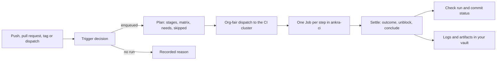

import { CliVersion } from "/snippets/cli-version.jsx";

<Note>
Ankra Pipelines runs a repository's CI as Kubernetes Jobs inside a cluster you already operate through Ankra. One file, `.ankra/pipeline.yaml`, declares the triggers and the stages; a push, a pull request or a tag starts a run, every in-cluster stage runs as a hardened Job in the `ankra-ci` namespace of your CI cluster, and the result lands as an `Ankra pipeline` check on the commit and a run you can follow with `ankra pipeline logs --follow`. There are no GitHub-hosted or self-hosted runners to keep alive.
</Note>

This page gets a repository connected, its first commit through a run, and the result on your pull request - then says exactly what is and is not in place yet, so nothing here claims more than the platform does today.

## Before your first run

The first four are preconditions, not preferences, and the failure modes differ: three of them stop a run before anything is dispatched, and one lets it run and then quietly strip every protected section out of it. The two vault entries at the end are not preconditions at all - they are where a run's logs and reports go if you do nothing, and why you might want somewhere else.

- **A connected repository.** The repository is connected through the [Ankra GitHub App](/integrations/github), GitLab, or [Bitbucket Cloud](/integrations/bitbucket-cloud), so Ankra receives its webhooks - and then connected to Ankra Pipelines itself, which is self-service: automatically when it backs an Ankra Application, or with one call for a bare repository (below). Pipelines are repository-scoped with an optional link to an [Application](/concepts/applications); a repository with nothing to build can have a pipeline too. A Bitbucket Cloud repository gets its webhook when you connect it to Ankra Pipelines with a Bitbucket credential, and its pull requests start runs only once that credential grants Bitbucket's `pullrequest` scope - see [Granting the pull request permission](/integrations/bitbucket-cloud#granting-the-pull-request-permission).
- **A CI cluster.** An organisation administrator sets `ci_cluster_id` in the organisation's CI settings. Without one, the staging cluster the organisation nominated for AI work is used; with neither, a provider event records `no_ci_cluster` and nothing runs.
- **An agent that advertises pipeline steps.** The CI cluster's agent runs pipeline steps in a third scheduler that is off by default - `ci_worker_count` (`AGENT_CI_WORKER_COUNT`) is `0` on every cluster until someone raises it. An agent with the scheduler off does not advertise the pipeline job names at all, so the platform refuses a step for that cluster up front instead of dispatching it. Set the count through Ankra, per cluster, and Ankra re-renders that agent's own release; never `helm upgrade` the agent by hand (below).
- **An approved definition.** A pipeline's protected sections - its `secrets`, `credentials`, `permissions`, network tier, placement, resources, timeout, caches, `services` and a `gate` stage's `with:` - carry no authority until an organisation administrator approves the definition on the default branch. Until one does, a run still executes, with **none** of them: the check run and the pull request comment carry "No administrator has approved any authority for this repository yet, so this run executes with none." Approve before the first run that needs any of it (below).
- **For check runs, `checks:write`.** Without it the GitHub App cannot create a check run, and the run's status is carried by a comment on the pull request instead - the comment says so and names the permission.
- **Somewhere to keep the objects - and you already have it.** A `scan` stage's reports, the findings a `gate` reads, the complete step log and every declared artifact are objects, and they need a bucket. An organisation with no ready [backup vault](/concepts/backup-vaults) of its own is lent one: Ankra keeps them in a vault the platform owns, under a key prefix of your organisation's own, with the same retention, the same per-object download links and the same reaper. Nothing to provision before a first run.
- **A vault of your own, when where the objects live matters.** Register one for data residency, for a bucket only your own credentials reach, or simply because cluster backups, restore points and `ankra migrate` data need one - those never use the platform's vault. A ready vault of your own takes precedence automatically, from the next step onward (below).

## Connect a repository, push, see the run

<Steps>
  <Step title="Connect the repository">
    Two paths, both self-service:

    - **An Ankra Application.** Creating or reconciling an Application connects its repository and decides its pipeline automatically. For a genuinely new application, the setup pull request now commits `.ankra/pipeline.yaml` instead of a generated GitHub Actions workflow - unless the repository already carries an Ankra-authored workflow (which keeps healing rather than switching underneath you) or you asked for `github_actions` explicitly. A monorepo gets one file with each component's stages suffixed by its name, not one workflow per app. Ankra AI's proposal tool on the [MCP server](/platform/mcp-server) takes the same choice as `target: "ankra_pipeline"` or `"github_actions"`.
    - **A bare repository** - nothing to build, or you'd rather write the file yourself:

      <CodeGroup>
      ```bash cURL
      curl -X POST https://platform.ankra.app/api/v1/org/pipelines/repositories \
        -H "Authorization: Bearer <your-token>" \
        -H "Content-Type: application/json" \
        -d '{
          "provider": "github",
          "owner": "my-org",
          "name": "my-repo",
          "default_branch": "main"
        }'
      ```
      </CodeGroup>

      Needs `pipelines.manage`. For a **GitHub** repository, Ankra reads `.ankra/pipeline.yaml` at `default_branch` itself, through the organisation's stored Git credential, and stores a valid file as the definition of record in the same call - connect a repository that already commits one and the first webhook after connecting has something to run. GitLab and Bitbucket Cloud repositories connect the same way but need `ankra pipeline definition put` afterwards (step three, below): reading the committed file at connect time is GitHub-only today. `default_branch` defaults to `main`; `credential_name` is optional for a public repository. Connecting a repository the organisation already connected answers `409` with the existing repository's id, not a second row.

      For a **Bitbucket Cloud** repository, send `"provider": "bitbucket_cloud"`, the workspace as `owner`, the repository slug as `name`, and the Bitbucket credential as `credential_name`, public repository or not: once the connect commits, Ankra registers the repository's webhook with that credential, unless the organisation already has one on it. Connected without a credential, it gets no webhook from the connect, so unless the organisation already has one on the repository, no push, tag or pull request reaches its pipeline.

      Two more fields on the same call, both optional and both addressed by id rather than name: `application_id` links the repository to an existing Ankra Application without changing what that application deploys, and `cluster_id` overrides the organisation's CI cluster for this repository alone, instead of the organisation-wide `ci_cluster_id` (below). Disconnect a repository with `DELETE /org/pipelines/repositories/{id}` - `pipelines.manage`, `204` on success, `409` while a run is still live; it is a soft delete, so reconnecting the same identity later revives the row rather than creating a second one.

    `GET /org/pipelines/repositories` lists what is connected, keyset paginated; `GET /org/pipelines/repositories/{id}` reads one. The CLI verbs (`ankra pipeline repositories connect|list|get|disconnect`) are in an open pull request ([ankra-cli#229](https://github.com/ankraio/ankra-cli/pull/229)), not merged yet - use the API or the portal's **Settings → Pipelines** page, which lists connected repositories today.
  </Step>
  <Step title="Optionally, give the organisation a vault of its own">
    Every report a `scan` stage writes, every finding a `gate` reads, every step log archive and every declared artifact is a presigned upload into the organisation's oldest ready [backup vault](/concepts/backup-vaults) - or, for an organisation that has none, into the Ankra-managed default vault. So this step is optional: skip it and the first run still keeps its logs and its reports. Do it when the objects should live in a bucket you own, or when you want cluster backups and `ankra migrate` as well, which never use the platform's vault. One vault serves the whole organisation, and one it already uses for cluster backups serves pipelines too - if `ankra backup vaults list` already shows a `ready` row, this step is done.

    <CliVersion since="0.15.0" />

    Let Ankra create the bucket from a Hetzner, UpCloud, DigitalOcean or Scaleway credential:

    ```bash
    ankra backup vaults provision ci-artifacts --credential upcloud-main --region europe-1 --wait
    ```

    Every argument is an override: `ankra backup vaults provision` on its own names the vault, picks the only credential it can provision from and takes that provider's usual region, printing all three before it creates anything. A Hetzner credential is the one exception - Hetzner issues Object Storage keys in its Cloud Console (**Object Storage > Manage credentials**) and its API cannot mint them, so the command prompts for the pair.

    Or register a bucket you already run, on any S3-compatible service:

    ```bash
    ankra backup vaults create ci-artifacts --endpoint https://s3.example.com --bucket ankra-ci
    ```

    Either way the vault has to reach `ready` before it counts: a vault still provisioning, or one whose last verification failed, has no bucket a presigned URL would reach, so the platform treats it as absent and keeps using its own default vault. Registering a vault changes nothing about what is already stored - objects stay where they were written, and are still downloadable and still reaped; the *next* step's objects go to yours. `ankra backup vaults get ci-artifacts` shows the status, and [Backups](/guides/backups) covers the rest.
  </Step>
  <Step title="Choose the cluster that runs pipelines, and turn on its agent's pipeline-step workers">
    An organisation administrator sets the CI cluster. Any member can read the settings; changing them answers `403` for everyone else.

    <CodeGroup>
    ```bash cURL
    curl -X PUT https://platform.ankra.app/api/v1/org/ci-settings \
      -H "Authorization: Bearer <your-token>" \
      -H "Content-Type: application/json" \
      -d '{"ci_cluster_id": "<cluster-id>"}'
    ```
    </CodeGroup>

    The same request takes the rest of the CI settings - see [Organisation CI settings](#organisation-ci-settings). Leave `ci_cluster_id` unset and the organisation's AI staging cluster is used instead.

    Then raise that cluster's pipeline-step worker count above zero - the number of pipeline steps its agent runs at once, in slots separate from its read and write pools. It is `0` on every cluster until you change it, and an agent at zero does not advertise the pipeline job names at all, so a step for that cluster is refused before it is dispatched.

    <CodeGroup>
    ```bash cURL
    curl -X PUT https://platform.ankra.app/api/v1/org/clusters/<cluster-id>/agent/ci-settings \
      -H "Authorization: Bearer <your-token>" \
      -H "Content-Type: application/json" \
      -d '{"ci_worker_count": 2}'
    ```
    </CodeGroup>

    <CliVersion since="0.15.0-rc3" command="cluster agent ci set" note="Until that release, the cURL call above is the way to set it." />

    ```bash
    ankra cluster agent ci set --workers 2 --cluster <cluster-name>
    ```

    This is a setting Ankra owns on the agent's behalf, not a chart value you apply yourself: the write is stored, and Ankra hands it to the agent through the agent's own upgrade lane so the running release re-renders with it. An online agent new enough to take chart values picks it up immediately, an older one at its next upgrade, and an offline one when it reconnects - the response says which. Never `helm upgrade` the agent by hand to set it: Ankra re-renders that release, so a hand-set value is overwritten by the next reconcile.

    `ci_storage_class` on the same call names the StorageClass for cache volumes and for a workspace claim that names none; leave it empty for the cluster default. The agent creates the `ankra-ci` and `ankra-ci-build` namespaces on first use, with their Pod Security admission labels, a `ResourceQuota` and a `LimitRange`. See the [agent Helm values](/reference/agent-helm-values) for what the release carries.
  </Step>
  <Step title="Write and validate .ankra/pipeline.yaml">
    This is the shape Ankra's own setup pull request commits for a new Go application - reuse it as a starting point. Every stage below now executes (see [What is in place today](#what-is-in-place-today)): `checkout` clones the commit, `test` runs your script, `build` produces a real digest in a rootless BuildKit pod, `scan` runs Trivy, Semgrep and Checkov against that digest and your source, `gate` judges what they found against your organisation's policy, and `publish` re-tags the one digest `gate` approved into your real repository. The image is never rebuilt and never a mutable tag until that last step - the same digest the whole way from `build` to the registry your application deploys from.

    ```yaml
    apiVersion: ankra.io/v1
    kind: Pipeline
    metadata:
      name: "orders-api"
    on:
      push:
        branches:
          - "main"
      pull_request:
        branches:
          - "main"
        fork_policy: "read_only"
    concurrency:
      group: "${{ ankra.repository.provider }}:${{ ankra.repository.owner }}/${{ ankra.repository.name }}-${{ ankra.ref }}"
      cancel_in_progress: true
    workspace:
      size: "10Gi"
      access: "rwo"
    defaults:
      image: "golang:1.26"
      timeout: "30m"
      network: "egress-https"
    permissions:
      contents: "read"
    stages:
      - name: "checkout"
        kind: "checkout"
      - name: "test"
        kind: "run"
        image: "golang:1.26"
        run: "go test ./..."
        needs:
          - "checkout"
        test_results:
          - format: "go-test"
            path: "test-results.json"
      - name: "build"
        kind: "build"
        needs:
          - "test"
        build:
          dockerfile: "Dockerfile"
          platforms:
            - "linux/amd64"
          build_args:
            - "VERSION"
          provenance: true
          sbom: true
      - name: "scan"
        kind: "scan"
        needs:
          - "build"
        scan:
          scanners:
            - "semgrep"
            - "checkov"
            - "trivy"
          fail_on:
            checkov: "none"
            semgrep: "error"
            trivy: "app"
      - name: "gate"
        kind: "gate"
        needs:
          - "scan"
        gate:
          require_stages:
            - "scan"
      - name: "publish"
        kind: "publish"
        with:
          image: "harbor.ankra.cloud/orders/orders-api"
        needs:
          - "gate"
        when:
          events:
            - "push"
    ```

    The `fail_on` map above reads per scanner and only ever tightens the gate: `semgrep: "error"` raises Semgrep's own floor to `error`, while `checkov: "none"` and `trivy: "app"` are not severities in those tools' vocabularies, so they carry no floor at all and leave the organisation's `ci_image_gate` policy to decide. Nothing a pull request writes here can loosen that policy.

    Ask Ankra AI to validate it - in the portal chat or through the [MCP server](/platform/mcp-server), the `cicd_validate_pipeline_yaml` tool answers with a severity (`ok`, `warn` or `fatal`) and every violation with its key. A `fatal` definition cannot be planned; fix it before committing. A `warn` is worth reading rather than skipping past: a stage whose `kind` has no executor on this build reports one, and that stage will be skipped.

    ```bash
    ankra pipeline validate --application my-service
    ```

    Reads `.ankra/pipeline.yaml` from the current directory (or the file you name), plans it for a synthetic push and a synthetic pull request, and prints the steps that would run, the stages that would be skipped and why, and every diagnostic - no repository connection required for this step alone. `--repository <repository-id>` validates for a bare repository instead of `--application`.
  </Step>
  <Step title="Store the definition, commit and push">
    ```bash
    ankra pipeline definition put .ankra/pipeline.yaml --application my-service
    git add .ankra/pipeline.yaml && git commit -m "Add the Ankra pipeline" && git push
    ```

    `definition put` needs `pipelines.manage` and stores the definition server-side; it does not touch the repository. On **GitHub**, a run no longer needs that stored copy to be current: the planner fetches `.ankra/pipeline.yaml` at the run's own head commit and plans the run's *logic* from it, so editing the file in a pull request takes effect on that pull request's next run. On **GitLab** and **Bitbucket Cloud** the stored definition is still what runs, so keep it identical to the committed file there. Either way the run's *authority* - the protected sections - still comes from the default branch's approved definition, never from the head file (see [Logic is open, authority is closed](#logic-is-open-authority-is-closed)).
  </Step>
  <Step title="Approve the definition's protected authority">
    An organisation administrator does this once per definition, and again whenever a protected section changes on the default branch. The id to approve is the repository's **current default-branch** definition, and the run's own status is where it is named: the check run summary and the pull request status comment carry it inside the approve command they suggest. `ankra pipeline get <run>` reports the authority state and says where to read the id, deliberately without guessing one - the definition a run drew its *current* authority from is rarely the one waiting to be approved, and approving that would answer `409`. With the id in hand, read what you are about to grant, then approve it:

    ```bash
    ankra pipeline definitions get <definition-id>
    ankra pipeline definitions approve <definition-id>
    ```

    `definitions get` prints the definition's protected hash and whether it is the approved one; when it is not, it names the exact `approve` command to run. `approve` needs `pipelines.manage` and a **human actor** - a service token or agent token is refused, because approving grants whatever permissions, credentials, secrets scope and network tier the definition declares. It confirms first; `--yes` skips the prompt for scripted use. Only the repository's *current* default-branch definition can be approved, and only once: a definition the default branch has since moved past, or one already approved, answers `409`. The same act is `POST /api/v1/org/pipelines/definitions/{definition_id}/approve` on the API; the portal reads a definition's approval state but has no approve action yet.

    Skipping this does not stop a run - it strips it. A pipeline whose default-branch definition declares any protected section executes with **none** of them until an administrator approves, and the check run and pull request comment say so verbatim: "No administrator has approved any authority for this repository yet, so this run executes with none." A definition that declares no protected section at all needs no approval, because there is nothing to grant.
  </Step>
  <Step title="Watch the run">
    The push you just made triggers a run on a connected repository. To dispatch one by hand, name the commit - and it has to be one of the repository's own. Ankra resolves `--ref` (or the repository's default branch when you name none) through the repository's own host before writing anything, and accepts your `--sha` only when it is that reference's current tip or - on GitHub, through a compare read - a provable ancestor of it. Anything else is refused by name, and so is a question the host could not answer at all. GitLab and Bitbucket Cloud have no compare read, so a commit you name there has to be the exact tip.

    ```bash
    ankra pipeline run --wait
    ankra pipeline list
    ankra pipeline logs <run-id> --step checkout --follow
    ```

    Run from inside the checkout, the CLI reads what it can see: the application is the one bound to the repository your `origin` remote points at, and the commit is your `HEAD`. It says which it used. Name them yourself with `--application` and `--sha` when you are outside a checkout, when the repository has more than one application, or when you mean a commit other than the one in front of you:

    ```bash
    ankra pipeline run --application my-service --sha "$(git rev-parse HEAD)" --wait
    ```

    `--wait` follows the run to its conclusion and exits non-zero on anything but `success`. Every stage runs for real: `checkout` clones the commit, `test` runs your script, `build` produces a digest in a rootless BuildKit pod, `scan` runs Trivy, Semgrep and Checkov against it, `gate` judges what they found, and `publish` re-tags the digest `gate` approved to `sha-<7>` in your real repository - nothing is published that was not scanned and gated first. Because `--wait` already blocked until the run concluded, the `logs --step checkout --follow` command above is reading `checkout`'s log back after the fact, not watching it live - from the CLI's next release that reads the step's complete, archived output; today it reads only whatever a fresh connection to the live relay happens to catch from an already-finished step, which for a step this far in the past is usually nothing. `--follow` earns its name against a step that is still running, which is the case whenever you check on a pipeline without also passing `--wait`. On GitHub the commit carries an `Ankra pipeline` check with a step table and a Cancel button, and on a pull request the same run populates the `pipeline` section of Ankra's one status comment; the portal's **Pipelines** section shows the same run with a timeline and an in-app log viewer, and **Settings → Pipelines** lists the repository you connected in step one.
  </Step>
  <Step title="Wait on a run a push or pull request started">
    Most runs are not dispatched by you: the push or pull request webhook starts them, so a CI job that has to wait for the result holds no run id. `ankra pipeline get` selects the run by what the job does know instead - `--head-sha` (the full sha), `--branch` and `--trigger` narrow it, and `--latest` takes the newest match (on its own, the pipeline's newest run). Several matches without `--latest` are refused and listed, exit `2`; no match is exit `3`.

    <CliVersion since="0.16.0" command="pipeline get --wait" note="Until then, poll the pipeline list command with the same head sha and read its status and outcome fields." />

    ```bash
    ankra pipeline get --head-sha "$(git rev-parse HEAD)" --trigger pull_request --latest --wait --timeout 45m
    ```

    `--wait` blocks until the run concludes, then prints its final detail, exactly as `pipeline run --wait` does. The webhook can land a moment after the job asks, so under `--wait` or `--watch` a selection that matches nothing yet waits for the run to appear, up to `--timeout` or ten minutes when none is set. `--timeout` takes a duration and bounds `pipeline run --wait` and `pipeline rerun --wait` the same way. On GitHub Actions, a `pull_request` job's checkout is a merge commit rather than the head the run was started for, so pass `${{ github.event.pull_request.head.sha }}` there instead of `git rev-parse HEAD`.

    To react while the run moves instead of only when it ends, `--watch` prints each run and step state change until it concludes:

    ```bash
    ankra pipeline get <run-id> --watch -o json
    ```

    With `-o json` that is one JSON object per line: `event` (`run` or `step`), `observed_at`, `pipeline_run_id`, `run_number`, `step_key`, `status`, `previous_status` (`null` the first time a run or step is seen), `outcome`, and the whole `run` or `step` object. The first lines are the full current state, and the run's conclusion is always the last line.

    With `--wait` or `--watch` the exit code is the verdict: `0` when the run succeeded, `1` when it concluded any other way or the platform could not be read, and `5` when `--timeout` ran out. A plain `get` still exits `0` whatever the outcome; add `--exit-code` to a single read to branch on it without waiting - `0` or `1` for a concluded run, `5` while it has not concluded yet.
  </Step>
</Steps>

That loop - webhook, trigger decision, plan, dispatch, a real checkout, your steps, a check run, the portal - is what the rest of this page documents in depth: the mechanics behind it, why CI belongs in your cluster at all, exactly which stage kinds execute today, what a pull request can and cannot change, and the limits every run is held to.

## How a run happens


```mermaid
flowchart LR
    Event[Push, pull request, tag or dispatch] --> Trigger[Trigger decision]
    Trigger -->|enqueued| Plan[Plan: stages, matrix, needs, skipped]
    Trigger -->|no run| Reason[Recorded reason]
    Plan --> Dispatch[Org-fair dispatch to the CI cluster]
    Dispatch --> Job[One Job per step in ankra-ci]
    Job --> Settle[Settle: outcome, unblock, conclude]
    Settle --> Check[Check run and commit status]
    Settle --> Vault[Logs and artifacts in your vault]
```

1. **Trigger.** A verified delivery from GitHub, GitLab or Bitbucket Cloud - a branch push, a pull request opened, synchronised or reopened, or a tag - is normalised into one event and decided in a fixed order: is the repository connected, is the head trusted, is there a cluster to run on, is there a definition, does the definition's `on:` block accept the event. A dispatch from the CLI, the API or an agent goes through the same decision, after one of its own: a delivery's commit arrives proven by the provider, a dispatch's does not, so the ref it names is resolved against the repository's own host and a caller-supplied `head_sha` is accepted only as that reference's tip or a provable ancestor of it. Every answer is recorded, so a push that started nothing still says why ([the reason tokens](/guides/pipeline-reference#triggers-and-reasons)).
2. **Plan.** The planner first decides *which* definition it is planning: on GitHub it fetches `.ankra/pipeline.yaml` at the run's own head commit and uses that for the run's logic, falling back to the stored definition (with a diagnostic) if the read fails, and recording which source won; on GitLab and Bitbucket Cloud the stored definition is always what runs. A dispatch that carried its own definition (`--spec-file`, `spec_yaml`) outranks both: the override is stored verbatim on the run, and the planner and the dispatcher both render from it. Protected authority is resolved separately and never from the head file - nor from an override, which is content nobody committed. It then turns that definition and the event into the step DAG: which stages survive the trigger and stage filters, how a matrix fans out (at most 64 legs per stage), what each step depends on, which `if:` conditions can be settled now, and - for a pull request that touches a protected section - which authority the run actually executes under (see [Logic is open, authority is closed](#logic-is-open-authority-is-closed)). Nothing is dropped silently - a filtered stage is recorded with a reason code, and a run whose every stage is filtered out is recorded as concluded with outcome `skipped`. A stage whose `kind` has no executor on this build - `preview`, `deploy`, `agent`, `approval`, `webhook`, `automation`, `ankra`, `external` and `verify` - is skipped right here, with reason `kind_unavailable` and a sentence naming the kind and the wave that ships its executor, so a run that declares one still concludes instead of holding itself and its concurrency group open forever.
3. **Dispatch.** Steps are claimed org-fairly, never global FIFO: organisations are served in order of how many steps they already have running, and a run already at its own step cap is passed over for the next run's step rather than holding the queue (see [Capacity and concurrency](#capacity-and-concurrency)). The dispatcher resolves the cluster per step - the organisation's CI cluster, otherwise the staging cluster it already nominated for AI work - and probes that the cluster's agent advertises the `run_pipeline_step` job before sending anything. Dispatch is also the point where a step's deferred `if:` is evaluated and its remaining `${{ steps.<key>.outputs.<name> }}` and `needs.<stage>.*` references are interpolated into `run`, `env`, `with`, `image`, `working_directory` and the stage's own `outputs:`, now that the steps it waited for have concluded: a condition that reads false concludes the step `skipped`, and a reference that still cannot be resolved concludes it `infra_error` naming the field, rather than handing a container a literal `${{ }}`. Both happen *before* anything is revealed, so a step about to be skipped spends no secret. Declared secrets and credentials are resolved into one-time, per-step reveal grants at this point, never written into the payload itself.
4. **Run.** The agent renders the step's own Kubernetes objects from the signed payload - it never applies what the platform sent verbatim - and runs a hardened batch/v1 Job. A `checkout` step clones the run's commit with a pinned public git image, reading a revealed credential only if the host it is cloning from matches; a `run` step executes your script. Output streams live while the step runs; the complete log and the declared artifacts are uploaded to your backup vault when it concludes, through presigned URLs minted at dispatch. The vault is the organisation's own oldest ready one, and an organisation with none is granted uploads into the Ankra-managed default vault instead; the step's execution says which - `pipeline_artifacts: "granted"` or `pipeline_artifacts: "granted (Ankra-managed default vault)"`. Only when there is no ready vault on either side does a step get no upload grants at all, recording `pipeline_artifacts: "unavailable: This organisation has no ready backup vault, so pipeline step logs and artifacts have nowhere to be stored"` - live output is unaffected, and everything archival is lost.
5. **Settle.** The settle loop records the verdict, unblocks the steps that waited on it and concludes the run when nothing is left. Each pass re-stamps the run's own heartbeat, so a build that legitimately takes hours is no longer failed out from under you by the platform's stale-run reaper at twenty minutes. Only Ankra's own failures are retried, once; a non-zero exit is the step's verdict and is final. A concluded `build` step's digest is stamped as the application's build observation, ranked below your own CI's, so push-to-deploy, previews and rollback already read a pipeline-built image. `gate` and `publish` settle in the same pass: `gate` reads the run's own persisted scan findings against your organisation's policy, tightened per scanner by the `fail_on` each required `scan` stage declared and recording the digest it actually judged, and `publish` re-tags that digest into your real repository as `sha-<7>` - refusing outright if the build's digest is a different one, or if the gate recorded none.
6. **Report.** The `Ankra pipeline` check run (or commit status) is updated on every change, naming the authority the run executed under when it differs from what the head asked for. On Bitbucket Cloud each kind of run keeps a commit status key of its own, so a tag, pull request or dispatched run on a commit no longer overwrites the branch run's result there: `ankra/pipeline` for a push, `ankra/pipeline/pull-request`, `ankra/pipeline/tag`, `ankra/pipeline/dispatch` for a manual, API or agent dispatch, and `ankra/pipeline/schedule`, and a re-run keeps its original's key. On a pull request the same run state and the same authority sentence populate the `pipeline` section of Ankra's one status comment. The run's outcome also leaves the pull request: `pipeline_run_failed`, `pipeline_run_succeeded`, `image_gate_blocked`, `preview_ready` and `preview_failed` are ordinary Ankra notification kinds, so they reach whichever Slack, Teams, PagerDuty or webhook destination your [routing rules](/guides/notification-routing) send them to.

Deploying the result follows straight from what `publish` just did: an Ankra Application deploys the `sha-<7>` image `publish` tagged into your real repository, exactly as it would deploy an image your own CI published. A pull request gets its own preview from the same pipeline, before `publish` ever runs (`publish` fires only on `push`, per the example above) - the application's preview deploys the digest `build` produced for that head, by digest, never a mutable tag, and GitLab and Bitbucket Cloud pull requests now get previews the same way GitHub ones always could. The [generated GitHub Actions workflow](#bring-your-own-ci-github-actions) still works and is still what an application with no pipeline connected uses; nothing forces you off it.

<Note>
**A build you start by hand does not go through the gate.** The two paths publish to different places, deliberately:

- a **pipeline** build stages the digest under `ankra-ci/<application>/<component>`, and `publish` re-tags it into `<application>/<component>` only after `gate` has judged it;
- **`ankra application build start`** publishes straight to `<application>/<component>` - no `scan`, no `gate`.

So a manual build writes directly to the repository your Application deploys from. That is what it is for: it is the recovery route for when the pipeline itself is broken, which is exactly when the gated path is unavailable. Use it knowing the image has not been scanned or gated, and let the pipeline publish anything you intend to keep.
</Note>

### Which component a build belongs to

A `kind: build` stage of an application's pipeline belongs to one of the application's components, and that decides where it pushes and where `publish` re-tags it. Ankra reads it in this order:

1. **`build.component`**, when the stage declares it. The value is the name of a component the application records.
2. **The stage name**, otherwise: a stage called `build-<component>` belongs to that component.
3. **The application's one component**, for a single-component application, whatever the stage is called.

Declare `build.component` when one component has more than one build, or when you want to name a stage for what it builds. A typical case is a component that ships both a container image and a release bundle:

```yaml
stages:
  - name: build-portal          # release bundle for host deploys, attributed by its name
    kind: build
    build:
      bundle:
        path: dist/portal
        manifest: deploy/portal/ankra-release.yaml
  - name: build-portal-image    # container image for Kubernetes, attributed explicitly
    kind: build
    build:
      component: portal
      dockerfile: portal/Dockerfile
      context: portal
  - name: build-node-agent      # release bundle that belongs to no component
    kind: build
    build:
      bundle:
        path: dist/node-agent
        manifest: deploy/node-agent/ankra-release.yaml
```

Each stage pushes to its own repository, so an image and a bundle of the same commit never overwrite each other's `sha-<7>` tag:

| The stage builds | It publishes to |
| --- | --- |
| an image of a component | the component's repository, `<application>/<component>` |
| a release bundle of a component | the component's bundle repository, `<application>/<component>-bundle` |
| a release bundle that belongs to no component | `<repository>/<stage suffix>`, for example `<repository>/node-agent` |

An image has to belong to a component, because a deploy of the application only reads component repositories. A pipeline that declares no `build.component` anywhere keeps working exactly as before. In a repository with no linked application, `build.component` has no effect, and every stage still publishes as `<repository>/<stage suffix>`.

`ankra pipeline validate` checks the stages against the application before a run. It reports a stage that belongs to no component, a `build.component` the application does not record, and two stages that would publish to the same repository. That last finding is fatal when both stages always run, because each run's commit tag would be overwritten by whichever stage publishes last, and a warning when one of them runs only under a condition. The components an application records come from its [`.ankra/ankra.yaml`](/reference/application-descriptor#components) when it declares them. When a run reaches a stage it cannot attribute, the step concludes `step_refused`, and the message lists the components the application records.

### Monorepo: PR-only checks, full builds on push

A monorepo usually wants a pull request to check only the components it touches, while a push to the default branch builds everything. Write **one stage per component**, and give each stage an [event-scoped `when`](/guides/pipeline-reference#event-scoped-filters) block: the pull request filters on paths, and the push does not. Do not duplicate stages per event.

```yaml
on:
  push:
    branches: [main]
  pull_request:
    branches: [main]

stages:
  - name: checkout
    kind: checkout
  - name: test-web
    kind: run
    image: node:22
    run: pnpm -C web test
    needs: [checkout]
    when:
      pull_request:
        paths: ["web/**", "packages/ui/**", ".ankra/**"]
      push: {}
  - name: test-api
    kind: run
    image: golang:1.26
    run: go test ./...
    working_directory: api
    needs: [checkout]
    when:
      pull_request:
        paths: ["api/**", "go.work", ".ankra/**"]
      push: {}
  - name: report
    kind: run
    image: alpine:3
    run: ./scripts/summarise.sh
    needs: [test-web, test-api]
    if: always()
```

A pull request that touches only `web/` runs `checkout` and `test-web`. `test-api` is skipped as `path_filter` and recorded as skipped on the run. A push to `main` runs every stage. Put the pipeline file (`.ankra/**`) in each list so a change to the pipeline checks everything it touches.

- A pull request's changed files are read from your provider when the run is triggered, up to 300 paths. When they cannot be read, or the change is larger than that, no stage is skipped for its paths, and the run's `paths_unverified` says why.
- A stage that needs a component stage keeps the usual rule: it is skipped when that stage is left out. To run it anyway, name the stage in [`skippable_needs`](/guides/pipeline-reference#fields-common-to-every-stage), so it waits on what the skipped stage waited on, or give it an `if:` with a status function such as `always()` (above), so its condition decides and `needs.test-api.result` reads `skipped`.
- Check the shape before you commit it. `ankra pipeline validate --changed-file web/app.ts` prints each stage against push and pull request, so you can see the plan for that change.

### Newest commit wins

A `concurrency.group` decides which runs serialise. `cancel_in_progress` decides what happens when a newer one arrives: with it, the new commit supersedes the run it replaces; without it, the new run waits for the older one to finish - and on a group that varies per branch, that is a branch queueing behind itself while the older commit's run keeps your step slots.

```yaml
concurrency:
  group: "${{ ankra.repository.provider }}:${{ ankra.repository.owner }}/${{ ankra.repository.name }}-${{ ankra.ref }}"
  cancel_in_progress: true
```

Every pipeline Ankra generates ships exactly that. A definition you wrote keeps whatever it says - Ankra never flips the flag for you, because that would cancel runs your own file says should finish. What Ankra does instead is tell you:

- `ankra pipeline validate` (and `ankra application pipeline validate`) reports `pipeline_concurrency_queues_behind:` at severity `advice`, naming the group and the one line that changes it. Advice never blocks a run and never fails the command.
- A queued run whose `Waiting:` line names an older run of the *same* branch or pull request that will not be superseded carries the same recommendation. A holder on another branch does not - that is the group serialising across branches, which is what a group is for.
- A pipeline [converted from a GitHub Actions workflow](/guides/migrate-from-github-actions) keeps the workflow's own queue-behind behaviour, with a conversion note recommending the flag for a per-branch group on a `pull_request` trigger.

Superseding is a soft stop, not a failure. The older run concludes as cancelled and is shown as **Superseded** in grey rather than red, the commit status it leaves on GitHub, GitLab or Bitbucket is neutral rather than a failed check, and no failure notification is raised for it - attention follows the newest run of the branch.

## What a pull request gets

A connected pull request carries one comment, not several: a run, its preview and Ankra AI's own review each write into that comment's own `pipeline`, `preview` and `review` sections in place rather than posting separately - see [One status comment per pull request](/changelog#one-status-comment-per-pull-request). The pipeline section is the run's own state, plus the authority sentence whenever the run executed under anything but the plainly approved definition; the preview section is the throwaway environment deployed from the run's own digest; the review section is Ankra AI's verdict on the diff.

### The review reads your pipeline, not just GitHub Actions

Ankra's pull request review used to read a GitHub check run for its "is this commit passing" signal, so a repository already running on Ankra Pipelines still got a review that could not see its own pipeline. The review now resolves the newest pipeline run of the reviewed commit first, and falls back to GitHub's own check runs only for an application whose real build authority is still its own CI or the generated workflow, or for a head no pipeline run has touched yet. When a pipeline run answers, the review's prompt carries a bounded set of facts about it, each independently sourced so an absent one never reads as a clean one:

- the failing step's name, kind and error message, when the run is failing - not its log, which stays behind `ankra pipeline logs`
- the run's scan findings, by tool and severity, with the highest-severity individual findings named
- the `gate` step's own verdict and blocking count, once one has concluded
- the `build` step's reported image digest, once one has concluded
- the authority sentence, when the run executed under anything other than the plainly approved definition

The branch **Code review** lane (no pull request involved, see [Application AI Settings](/platform/application-ai)) does not read this block - only the pull request review does.

### A human can say "merge when green"

Mention **`@ankraai merge when green`** in a pull request comment, ask Ankra AI in chat, or call the API, and Ankra records the request and watches the pull request, merging it (squash) the moment every condition holds:

- the requester is an active member of your Ankra organisation holding **`pipelines.operate`**, and the binding's [AI mode](/integrations/github#ask-ankra-in-a-comment) is **Agent** - in **Ask** mode the request is refused, naming the setting to change
- the GitHub login that commented is linked to that member through an **OAuth-verified** identity. A login claimed by hand, or auto-filled from an Auth0 GitHub sign-in, proves the account exists and not that the commenter owns it, so it no longer counts as verified; the refusal says to link GitHub again. A service principal is refused outright - merging is a human act
- the requester still holds `pipelines.operate`, is still an active member and is still OAuth-verified when the sweep actually merges, not only when the comment was written. A request can wait up to 24 hours, and an administrator can revoke the permission inside that window
- the pull request's head is not a fork
- the newest pipeline run for the head concluded successfully, and its `gate` step, if the definition declares one, passed
- the run executed under plainly approved authority - one that fell back to an earlier approval, or none, is refused rather than merged under it
- Ankra's own review has not requested changes on that exact commit
- no human reviewer's most recent review is **Changes requested** - unlike the AI review's check, this one is not scoped to the current commit, so a changes-requested left on an earlier push still blocks until the same reviewer clears it with a later review

The request expires 24 hours after it is made, and a new push to the pull request invalidates it. Every refusal is posted once, naming the exact condition that failed. This works on GitHub only today: a request against GitLab or Bitbucket Cloud is accepted and then refused, because neither provider adapter reports the capability to merge yet.

### Chat watches a run, and a failed build gets a fix

Ask Ankra AI to watch a run - or dispatch one, which registers the watch itself - and the `watch_pipeline_run` tool wakes the same conversation the moment it concludes, with the failing step, a bounded tail of its log, the findings and the gate verdict already in the prompt. Separately and unattended, a failed `build` step (never `infra_error`, a stranded step, or one a protected policy refused - only a genuine script failure) on a **direct push** to the tracked branch, in **Agent** mode, dispatches the same auto-fix mission the generated GitHub Actions workflow's own failed-build webhook already dispatches, with a log excerpt as evidence. A failed build on a **pull request** never gets an unattended commit from this lane, in either mode - it gets its diagnosis (the failing step, its error class, a log excerpt) posted into the status comment's `pipeline` section instead, pointing at Agent mode's **Propose a fix** on the [pull request review](/integrations/github#ask-ankra-in-a-comment) as the actual route to a fix.

## Why CI belongs in your cluster

The generated GitHub Actions workflow Ankra Applications ship with works, and keeps working - see [Bring your own CI](#bring-your-own-ci-github-actions) below. Ankra Pipelines exists because of what that model cannot fix:

- **Runners are a second fleet.** GitHub-hosted runners are shared and rate limited; a self-hosted runner pool is one more set of machines to size, patch and pay for. A pipeline step is a Job on nodes you already have, scheduled under the quota and node selectors you set, and never at the expense of a deploy - the agent runs pipeline work in its own worker pool.
- **Credentials live in CI secrets.** A workflow needs registry logins, cloud credentials and deploy tokens as repository secrets, copied per repository and readable by any workflow that names them. In a pipeline definition those are *references* the platform resolves and delivers as a one-time, per-step reveal - never written into a job spec or a log - and the sections that grant them are protected: a pull request can rewrite what a pipeline does, and cannot widen what it may touch.
- **Publish happens before the gate.** A workflow that pushes an image and scans it afterwards has already published a vulnerable image by the time the scan fails. The pipeline vocabulary separates `build`, `scan`, `gate` and `publish` so that nothing is published that the gate did not pass - enforced end to end today: a `publish` step refuses by name when its run has no successful `gate` step immediately upstream, and it re-tags only the exact digest that gate evaluated.
- **The evidence is somewhere else.** Run history, logs, scan artifacts and the check on the commit all lived on the CI provider. A pipeline run is an Ankra object: `ankra pipeline get`, live logs, artifacts in a backup vault - the organisation's own, or the Ankra-managed default one - and the same status on GitHub, GitLab or Bitbucket.

## What is in place today

Ankra Pipelines is landing in pieces, and this page is honest about the line. Everything in the first list is on the platform and the agent now; everything in the second is not, and is described in [What comes next](#what-comes-next).

**In place**

- The definition: `.ankra/pipeline.yaml` (`apiVersion: ankra.io/v1`, `kind: Pipeline`) with its parser, validator and dry-run planner - see the [pipeline.yaml reference](/guides/pipeline-reference).
- Conversion of an existing GitHub Actions, GitLab CI, Bitbucket Pipelines or CircleCI definition into a pipeline, from chat or the MCP server - see [Migrate from GitHub Actions](/guides/migrate-from-github-actions).
- The organisation's CI settings (which cluster runs pipelines, parallelism, image allow-list, retention, the image gate) and its pipeline policy (the authority ceiling an administrator sets). The image gate is no longer only a setting: `gate` steps (below) evaluate every run against it.
- **Connecting a repository**, with an optional link to an application and a CI-cluster override, and **disconnecting** one. `POST /org/pipelines/repositories` connects a bare repository and, on GitHub, reads its committed `.ankra/pipeline.yaml` as the definition of record in the same call; `DELETE /org/pipelines/repositories/{id}` disconnects it, `409` while a run is still live. An Ankra Application connects and decides its own repository automatically on create and on every reconcile. A new application's setup pull request commits `.ankra/pipeline.yaml` by default instead of a generated workflow.
- **Migrating an existing application onto a pipeline with one call** - see [Migrate an existing application](/guides/migrate-from-github-actions#migrate-an-existing-application-with-one-call).
- The runs API and the `ankra pipeline` commands: dispatch, list, get, cancel, re-run, live step logs, artifacts, the stored definition, schedules.
- Triggers from push, pull request and tag deliveries on GitHub, GitLab and Bitbucket Cloud, deduplicated across redeliveries, with a recorded reason whenever nothing runs. A Bitbucket Cloud push that updates several branches or tags at once starts each branch's and each tag's pipelines, and a Bitbucket pull request's abbreviated head commit is resolved to the full commit through the repository's credential before its run is created; a head that cannot be resolved starts no run. A **private GitLab repository** builds through the organisation's stored source credential the same way GitHub and Bitbucket Cloud ones do, and a GitLab project under a **nested group** (`group/subgroup/project`) resolves to a clone URL instead of being refused by the owner grammar.
- **A stage kind nothing can run is skipped, not left pending.** The kinds this build has no executor for - `preview`, `deploy`, `agent`, `approval`, `webhook`, `automation`, `ankra`, `external` and `verify` - now report a validation **warning** naming the stage, its kind and the wave that ships its executor (severity `warn`, so the pipeline still plans and every other stage still runs), and the planner skips exactly those stages with reason `kind_unavailable`. A run that declares one concludes on its own; before this it sat `pending` forever, holding its concurrency group with it. A `pending` step whose run has outlived the sum of every step's `timeout` is additionally reaped as `infra_error` / `step_stranded`, so a step that stranded for a reason no static check can see - a cluster that never resolved, an agent that never advertised support - cannot pin a run open either.
- **`uses:` is refused by name, at validate time.** Any `uses:` reference - `ankra/*`, `custom_tool/*` or `repo:<owner>/<name>@<ref>#<path>`, however it is spelled - is fatal with one sentence, "Reusable steps are not available yet; write the step as `run:`", until the step library ships. That is deliberately louder than the old behaviour, where a `uses:` stage validated and then failed at dispatch with an error that read as "you forgot to write a script".
- **Step outputs and deferred conditions are resolved at dispatch.** A stage's `if:` that depends on a step's result, and every `${{ steps.<key>.outputs.<name> }}` or `needs.<stage>.*` reference in `run`, `env`, `with`, `image`, `working_directory` and `outputs:`, are evaluated once the steps they wait on have concluded - a false condition concludes the step `skipped` before any secret is revealed, and a reference dispatch cannot resolve concludes it `infra_error` naming the field rather than passing a literal `${{ }}` into a script.
- **In-cluster execution of `checkout` and `run` stages** on the organisation's CI cluster: a hardened Job per step in `ankra-ci`, a per-run workspace volume, cache volumes, service sidecars, network tiers, resource ceilings, timeouts, live logs, and one automatic retry of Ankra's own failures. `checkout` clones with a pinned public git image, a shallow fetch of the exact commit with a fallback to fetching its ref, and refuses an `lfs:` request by name rather than silently checking out pointer files.
- **Caches survive between runs, inside their own trust scope.** A stage's `cache:` block resolves to the same PersistentVolumeClaim on every run that declares the same key, scoped to the repository, cluster, cache path **and the trust of the run resolving it** - the second run's `test` stage mounts what the first run's left behind, not an empty volume. A miss on the exact key that matches a `restore_keys` prefix restores the most recently used claim under that prefix instead of starting cold, the same semantics as GitHub Actions' own cache action, and that prefix search stays inside the caller's own scope too. Retention is unchanged by any of this: a claim nothing has resolved to for `ci_cache_retention_days` (below) is still deleted by the same sweep, per claim.
- **A fork's run resolves no shared cache at all, and a branch never resolves the default branch's.** Two holes, closed together. A pull request from a fork that runs restricted - the ordinary `fork_policy: read_only` case - is refused a shared cache at dispatch, on the same predicate that already withholds its secrets and credentials: every declared cache degrades to the pod-lifetime volume a cluster with no usable StorageClass already gets, and the step's execution metadata carries `pipeline_caches: "caches are not shared with fork runs"` so an operator can see why the build was cold rather than guessing. Such a step never reaches the cache store at all. Separately, every claim now carries a **trust scope**: `default_branch` for a run on the repository's own recorded default branch, `branch` for everything else - a feature branch push, a pull request (fork or not), a tag, a manual dispatch of a non-default ref. The two scopes never share a claim, and neither an exact-key hit nor a `restore_keys` prefix match crosses between them, so a less-trusted ref can no longer poison what a production build restores. It is deliberately coarser than per-branch isolation: the threat is an untrusted ref writing into what a trusted one reads, not one feature branch reading another's warm cache. **Claims that existed before this deploy were backfilled into `branch`, the untrusted scope** - nothing on a row records which run wrote it, so the true value cannot be recovered, and defaulting the other way would have carried the hole forward for every cache written before the fix. The cost is one cold build per cache key on your default branch, once.
- **A restricted fork run is budgeted, not only restricted.** It is clamped to at most **8 matrix legs per stage**, a **60-minute timeout per step**, **2 CPU and 4Gi of memory per step**, **no sidecar services**, **no cache volumes** and **256 MiB of artifacts and logs across the whole run** - fractions of the platform-wide ceilings of 64 legs, 6 hours, 8 cores, 32 GiB and 2 GiB, because a drive-by pull request triggers this with nobody having reviewed it first. Matrix legs, timeout, compute and sidecars are clamped in the **planner**, so the plan `ankra pipeline validate`, the dry run and the pull request's status comment render is the run that actually executes, rather than one silently rendered smaller at dispatch; caches are refused at dispatch, and the artifact budget bounds what the run is granted, from the sizes its steps declare. The matching ceiling on what actually *arrived* - the one number a step cannot lie about - is written into the artifact store but has no settle lane calling it yet, so today the budget is enforced on the grant rather than on the upload. A `plan_fork_budget:` diagnostic states the ceilings once per run, plus one more for each stage that actually hit one, and a declared quantity the planner cannot read is clamped rather than given the benefit of the doubt. An organisation's own policy may lower these numbers further; nothing raises them for a fork.
- **`build` produces a real digest.** A rootless BuildKit pod in its own `ankra-ci-build` namespace resolves its own builder, source and push target at dispatch and pushes the image it builds, by digest, to the organisation's CI staging repository; a bare repository with no application link, or a component with no resolvable registry, gets a named refusal instead of a guess. `provenance: true` and `sbom: true` ask BuildKit to attest the digest it pushes.
- **Ankra platform builders build when your cluster cannot.** When the CI cluster cannot build, the organisation set `ci_build_fallback: platform_builders`, **and** Ankra has granted the organisation platform builds, a `build` step runs on Ankra platform builders instead - the same staging-repository push and the same `scan`/`gate`/`publish` downstream, with the step's `executor` recorded as whichever lane actually ran it. What "cannot build" covers, how to confirm and request the grant, and what a fallback build looks like from your side are all in [Ankra platform builders](#ankra-platform-builders) below. An application that publishes to [a registry you operate yourself](/concepts/applications#using-your-own-registry) is pushed by this lane with the push robot Ankra minted for it there, exactly as the in-cluster build is.
- **`scan` runs three tools for real, one step per tool.** Trivy (filesystem, a CycloneDX SBOM, and - once a build produced one - the image itself), Semgrep and Checkov, each from a pinned, digest-referenced public image the organisation's own `ci_allowed_image_prefixes` cannot turn off, writing the reports `gate` and the application's **Security** tab both read. `with.semgrep_config` names the registry packs to run (`p/default p/docker …`); undeclared, Semgrep runs its own `--config=auto`.
- **`gate` judges what `scan` found, and `scan.fail_on` is part of the judgement.** It reads the run's own persisted findings against the organisation's `ci_image_gate` policy (below), which a `gate` stage's own `with:` may only tighten, never loosen; a declared scanner that recorded nothing fails the gate by name rather than passing as clean. Each required `scan` stage's own `fail_on` is folded in on top, per scanner and **tighten-only**: a pull request head may add scrutiny to its own pipeline, never remove the organisation's. A `fail_on` value that is not that scanner's own severity vocabulary at all - Checkov's `none`, a Trivy image-gate word such as `app` - carries no floor rather than the loosest one.
- **`publish` re-tags only the digest `gate` approved, and proves it.** A `publish` step refuses by name when its run has no successful `gate` step; otherwise it re-tags the exact digest `build` pushed to staging as `sha-<7>` in the application's real repository - never rebuilt, never a different digest than the one `scan` and `gate` judged. The gate now records the digest it actually judged on its own step outputs, and `publish` refuses when the build's digest is anything else - **including when the gate recorded none at all**, because "no record" is unknown, not agreement. Before this the guarantee rested on ordering alone: a successful gate existed upstream, so surely it had judged this image.
- **A monorepo's components are tracked separately.** A `publish` step resolves the `build` and `gate` steps carrying its own stage suffix rather than whichever succeeded first, so `publish-web` can no longer re-tag `api`'s digest into web's repository, and a stage name following neither convention is refused by name instead of guessed at. A `scan` stage honours `working_directory`, so a component's scan reads the tree its build and test stages do rather than the whole checkout. Build observation is recorded per component, with only the primary component also moving the application-level record, so push-to-deploy, previews and rollback keep converging on the image they always did.
- **A run plans from `.ankra/pipeline.yaml` at its own commit** (GitHub). The planner fetches the file at the run's head sha and plans the run's logic from it, records which source won (`definition_source`: `head_file`, `stored` or `default`), and falls back to the stored definition with a diagnostic when GitHub is briefly unreachable - a transient read failure must never stop a push running its own pipeline. Only a head file that really was fetched and is then unparseable or fatally invalid refuses the run. Protected **authority** is unaffected: it still resolves from the default branch's approved definition, never from the head file. A **re-run** re-plans from the *original* run's definition, so re-running an old run reproduces it rather than silently executing whatever the pipeline has become since.
- **Previews deploy the pipeline's own digest.** An application whose pipeline source is `ankra_pipeline` gets its pull-request preview from the `build` step's own digest for that head - by digest, never a mutable tag - on GitHub, GitLab and Bitbucket Cloud alike; the gateway also re-drives a stalled preview the moment a pipeline run concludes, on top of the existing poll fallback.
- **Fork pull requests run, restricted.** `checkout` and `build` clone the fork's own head anonymously - never the pipeline's own repository - `build` renders with no push target so nothing it produces can reach a registry, and every stage but `checkout`, `build` and `scan` runs with no network at all regardless of what the fork's own copy of the definition asks for. Such a run also resolves no shared cache and is held to fixed matrix, timeout, compute and artifact budgets (above). See [Forks](#what-a-step-runs-as).
- **Secrets and credentials delivered into steps** as one-time, per-step reveal grants collected by the agent at step start: a `secrets` binding sourced `app_env_secret`, `org_variable` or `registry` resolves, and a `credentials` binding sourced `git` or `registry` resolves; `secrets: [{from: credential}]` validates but is not deliverable yet, and `cloud` and `object_storage` credentials are refused by name until the run gets its own scoped identity (below).
- **Schedules fire.** The cron trigger dispatches through the same trigger every push and pull request uses, advancing from a stored watermark so a loop that was down for a while does not replay every occurrence it missed.
- **Protected authority is enforced, not only modelled.** Whichever definition supplied a run's *logic*, its *authority* resolves from the default branch's admin-approved definition; a pull request that changes a protected section (below) executes under the last approved authority instead, and the check run, commit status, the definition response and the pull request's own status comment all say so. The last-approved fallback only ever offers a definition that was itself, at some point, the default branch's own head - proved from the repository's run history, never from the approval columns on the definition row alone.
- **One approval route, whichever id you hold.** The application-addressed approval (`POST /org/applications/{id}/pipeline/approve-definition`) is now an alias for the definition-addressed one, so both run the same checks - a human actor rather than a service principal, the definition must be the repository's *current* default-branch definition, a second approval of an already-approved definition is a conflict rather than a silent yes - and both write the same audit row. Before this the application-addressed route had none of them: a caller holding that application's `pipelines.manage` could approve any definition row belonging to its repository, including one sourced from a pull request head that never was, and might never be, the default branch's own content.
- **A dispatch proves its commit belongs to the repository.** `POST …/pipeline-runs` resolves the `ref` it was given - or the repository's default branch - through the repository's own host before anything is written, and accepts a caller-supplied `head_sha` only when it is that reference's current tip or, on GitHub, a provable ancestor of it through a compare read. Anything else is refused by name, and so is a transport failure that leaves the question unanswered: an unanswerable question is not a yes. GitLab and Bitbucket Cloud have no compare read, so a commit named there is held to the exact tip. **Re-runs keep working** and are deliberately exempt - a re-run's commit is one Ankra itself recorded when the original run was created, not a claim arriving with this call, which is what lets a fork pull request's run be repeated at all.
- **A dispatch's own definition is what actually runs.** `--spec-file` (`spec_yaml` on the API) is persisted verbatim on the run, and both the planner and the dispatcher render every step from it, instead of shaping the plan and then silently re-rendering each step from the stored definition. Only the *logic* moves: an override is content nobody committed, so its protected sections are compared against the default branch's approved authority exactly as a pull request head's are.
- **Five more sections are protected authority.** `services`, `cache`, `resources.cpu` and `resources.memory`, `timeout` and a stage's `with:` block now hash, resolve in both directions and surface by name, so a head can no longer ask for far more compute than the organisation meant to grant, remove its own or the trusted definition's timeout, change which run's output a cache restores into the workspace, or rewrite a `gate` stage's own scan-tool configuration. **This moves every definition's protected hash** - see the re-approval note under [Logic is open, authority is closed](#logic-is-open-authority-is-closed).
- **A sidecar is held to the step's own boundary.** A named `services:` entry's image goes through the organisation's image policy and its `env` through the reserved-name check, both as a refusal of the whole step rather than a diagnostic that runs it anyway; `ankra pipeline validate` names the same violation at `services[<name>].image`. A sidecar could previously pull any image and set `ANKRA_*`, the loader and `PATH` variables, or the image builder's own `BUILDCTL`, `BUILDKIT_HOST` and `DOCKER_CONFIG`.
- **Two organisation ceilings that nothing could set now bite.** `ci_ignore_unfixed` (below) is an organisation-wide floor a `gate` stage's own `with:` may only tighten, and `max_cache_size` on the pipeline policy is stored and enforced - every declared cache had been held to it since the ceiling was written, with nothing able to set it, so every organisation silently resolved "no ceiling".
- **`egress-https` reaches the public internet, and nothing private.** The tier's 443 rule now excludes RFC1918 (`10.0.0.0/8`, `172.16.0.0/12`, `192.168.0.0/16`), the whole of link-local `169.254.0.0/16` rather than only the `169.254.169.254` endpoint that used to be its single exception (AWS ECS serves task metadata at `169.254.170.2`), and carrier-grade NAT `100.64.0.0/10` (Alibaba Cloud answers at `100.100.100.200`, inside it). There is an IPv6 rule at all now, excluding `fd00::/8`, `fe80::/10` and AWS's `fd00:ec2::254`. DNS stopped being "port 53 to any pod in the cluster": it is the `kube-system` namespace plus `169.254.0.0/16` for a cluster running NodeLocal DNSCache, and the `services` tier - which carried no DNS rule at all - gained the same one. **This breaks a pipeline that reaches a private HTTPS endpoint**, and the symptom is a connection timeout rather than a refusal, so name the range in `ci_egress_allowed_cidrs` (below) *before* the step runs: a `build` that pushes to a registry on a private address - an in-cluster registry, a Harbor inside your VPC - cannot reach it until that entry exists. The agent renders a step's NetworkPolicy itself, so the tightened tier arrives with the agent release carrying [agent#120](https://github.com/ankraio/agent/pull/120), which shipped on 5 September 2026; a cluster still on an older agent keeps the previous tier until the fleet roll reaches it.
- **An image policy prefix ending in a separator means that separator.** An entry ending in `/`, `:` or `@` used to match nothing at all, because the matcher requires one of those three characters *after* the prefix - the boundary check that stops `ghcr.io/my-org` admitting `ghcr.io/my-org-evil/api`. Each now admits exactly its own boundary: `ghcr.io/my-org/` admits `ghcr.io/my-org/api` and refuses `ghcr.io/my-org` and `ghcr.io/my-org:v1`, `ghcr.io/my-org:` admits a tag and not a path, `ghcr.io/my-org@` admits a digest, and `registry.example.com/` admits paths on that host and never `registry.example.com:5000/anything`, which is a different endpoint. Trimming the separator away would have widened each of those rather than narrowing it, so that is not what happens, and an entry that is only separators - or ends in two of them - matches nothing rather than becoming the empty prefix every image starts with. The settings API refuses a trailing separator at write time and always has, so a stored `ci_allowed_image_prefixes` cannot carry one: this is defence in depth for the prefixes Ankra sets in code and for the copy of the policy a step's payload carries, not a change to what an administrator can store.
- SCM feedback: one `Ankra pipeline` check run per run on GitHub with a real conclusion and a Cancel button, a commit status on GitLab and Bitbucket, a comment fallback when the GitHub App lacks `checks:write`, and - on a pull request - the same run state and authority sentence in the `pipeline` section of Ankra's one status comment.
- **The AI review reads your pipeline, and a human can say "merge when green".** See [What a pull request gets](#what-a-pull-request-gets) above: a bounded pipeline-facts block in the review prompt, a `merge when green` pull request comment gated on the run, its gate, both reviews and its authority, and a `watch_pipeline_run` chat tool whose unattended fix loop reacts to a failed `build` step.
- Step logs and declared artifacts stored in the organisation's oldest ready backup vault - or, for an organisation with none, in the Ankra-managed default vault - listed and downloaded through the API today; `ankra pipeline artifacts` and `artifacts download` speak the same routes and read the same way from the CLI's next release (see [Commands and API](#commands-and-api)). **A vault is no longer something to arrange first** - a `scan` stage's reports travel the same path, so a fresh organisation records findings and passes its gate without provisioning a bucket; bringing your own decides where the objects live, not whether they are kept (see [Before your first run](#before-your-first-run)).
- **Long runs stay alive.** Every settle pass re-stamps the run's heartbeat, so the platform's twenty-minute stale-run reaper no longer fails a pipeline that is still working. A run whose steps genuinely stopped reporting is still reaped, and the reason is recorded.
- **Run history is retained by policy, not forever.** `ci_run_retention_days` (default 90, 7 to 365, below) bounds how long a concluded run is kept, and an hourly sweep deletes past the window in batches. It never deletes a live run, never a repository's own newest concluded run, and never a run still carrying an artifact the artifact reaper has yet to remove from the vault.
- **Run outcomes reach your destinations.** `pipeline_run_failed`, `pipeline_run_succeeded`, `image_gate_blocked`, `preview_ready` and `preview_failed` are notification kinds like any other, produced once per run (or once per gate verdict, or when the preview row itself flips), so [notification routing](/guides/notification-routing) sends them to Slack, Teams, PagerDuty or a webhook alongside everything else Ankra reports.
- **A truncated log says so, and the failing step names its own error.** The agent reports how many log lines it had to drop to backpressure; that count is recorded on the step and shown as a notice under its row on both the check run and the pull request status comment, so a step whose output was silently cut no longer looks like one whose log arrived whole. The check run's step table also carries the failing step's own error message (truncated to 200 characters) in its Outcome cell, instead of only the run's error in one blockquote at the end.
- **The portal.** The application's **Pipelines** section shows Ankra pipeline runs with a timeline and an in-app log viewer beside the GitHub Actions view; organisation **Settings → Pipelines** lists connected repositories; the application's **Security** section reads a pipeline's own findings once a run has concluded for its repository, falling back to the GitHub-artifact reader until one has.

**Not in place yet**

- **The runner for `verify`.** No runner image exists, so a `probe`, `smoke`, `load_test`, `assert_promql` or `restore_verify` sub-block never runs. The stage is skipped with `kind_unavailable` rather than dispatched into an image pull that cannot succeed, so it no longer holds the run open - but it also verifies nothing, and a pipeline that relies on it is not being verified.
- The executors for the remaining stage kinds - `preview` (a per-pull-request environment deployed from *inside* the pipeline DAG, not to be confused with an Application's own pull-request preview, which already deploys a pipeline's digest, above), `deploy`, `agent`, `approval`, `webhook`, `automation`, `ankra` and `external`. Each validates with a warning and is skipped, so a run containing one concludes; none of them does the work its name promises. In particular an `approval` stage does **not** block a run on a human today - it is skipped, and everything downstream of it runs.
- The per-run identity `permissions` mints, so a step can call the `ankra` CLI with exactly the authority the default branch granted - a converted `github.token` reference already diagnoses itself as "the run-scoped `ANKRA_TOKEN`", naming what does not exist yet rather than resolving to nothing; `cloud` and `object_storage` credentials wait on the same identity.
- The built-in `ankra/*` step library behind `uses:`, organisation step templates, and `custom_tool/<name>` steps. Until it ships, any `uses:` is fatal at validate time with one sentence telling you to write the step as `run:`.
- **Nothing pins the step keys an expression names.** `${{ steps.<key>.outputs.<name> }}` resolves at dispatch against the run's real steps, but a key that does not exist - a typo, or a matrix leg the writer guessed at - interpolates to empty text rather than being refused. The validator declares expression *roots*, not key sets, and a step key is a matrix-expansion product it cannot know; closing this belongs in the planner, which does know the expanded keys.
- **The user-declared `retry` block is validated and carried to the agent, not applied.** A step's own `retry:` is parsed and stored on the plan, but nothing dispatches a second attempt from it - only Ankra's own infrastructure failure classes retry automatically (see [When something fails](#when-something-fails)); a script that exits non-zero is final today regardless of `retry.max_attempts`. Dynamic matrices (`matrix: ${{ fromJSON(steps.plan.outputs.legs) }}`, fanning out over a previous step's own output) are not available either - every axis must be written out in the file.
- **Attestations and SBOM referrers on the image you actually deploy.** `build`'s `provenance`/`sbom` flags attest the digest it pushes to the CI staging repository; `publish`'s re-tag copies that one image manifest, not the attestation manifests beside it, so they are not on the digest your application deploys. Trivy's SBOM is an artifact in the vault today, not an OCI referrer on any image.
- **Merge-when-green and automatic disposition re-evaluation are GitHub only.** A GitLab or Bitbucket Cloud `merge when green` request is accepted and then refused, because neither provider adapter reports the capability to merge yet; a push to a GitLab or Bitbucket Cloud default branch that adds or removes `.ankra/pipeline.yaml` answers `insufficient evidence` rather than re-evaluating the application's pipeline source, because the raw-file read that evaluation needs has no GitLab or Bitbucket equivalent wired in yet.
- **A dedicated log stream for pipeline output, on the agent side.** The platform half is in place: the `pipeline_output` JetStream stream exists with its own capacity and retention, the agent is granted publish on its own cluster's subject, dispatch renders that subject onto every step, and the log relay reads the dedicated stream first and falls back to the shared one. What has not shipped is the agent release that actually publishes there, so live output still rides the platform-wide `execution_output` stream until your cluster's agent is upgraded to a release carrying that change. Nothing about `ankra pipeline logs` or the check run changes when it does - the relay already reads either.
- **Planning from the committed file is GitHub-only.** A GitLab or Bitbucket Cloud run plans from the stored definition permanently, because the bounded raw-file read the planner uses has no equivalent wired in for those providers yet; the run records `definition_source: stored` and says so in a diagnostic rather than pretending it read your commit.
- **Annotations and metrics.** A step's stdout can already carry `$ANKRA_OUTPUT` key=value lines, read back onto the step; the equivalent for check-run annotations (`::ankra::notice file=…,line=…::msg`) and custom metrics (`::ankra::metric name=…,value=…`) is not ingested anywhere yet. Test reports are: see [Test results](#test-results).
- Environments hydrated from restore points, verification stages, promotions with approvals, and canary rollouts - see [What comes next](#what-comes-next).

## Test results

A stage that runs tests can declare the reports its test command writes, and Ankra reads every test's outcome from them:

```yaml
  - name: "e2e"
    kind: "run"
    run: "pnpm test:e2e"
    test_results:
      - format: "junit"
        path: "reports/junit"        # a file, or a directory of report files
```

After the step, the agent uploads each report to your organisation's [backup vault](/concepts/backup-vaults) like an artifact (named `ankra-tests.<n>.<format>` in the run's artifact list), and Ankra parses it. The step's own exit code stays its verdict: a report Ankra cannot read never fails or passes the step.

**Formats.**

| `format` | What to point it at |
|---|---|
| `junit`, `pytest` | JUnit XML: `go-junit-report` and `gotestsum --junitfile`, pytest `--junitxml`, Jest's `jest-junit`, Vitest's `junit` reporter, Maven Surefire, Playwright's `junit` reporter. A directory is read for every `.xml` file in it. |
| `playwright` | Playwright's JSON reporter (`reporter: [['json', { outputFile: 'results.json' }]]`). |
| `go-test` | `go test -json` output, or `gotestsum --jsonfile`. |

**Flaky tests.** A test that failed and then passed on a retry is recorded as `flaky`, not passed, with the number of attempts. Ankra reads retries from Playwright's JSON reporter, from a JUnit file's Surefire `flakyFailure`/`rerunFailure` elements, and from a test that appears more than once in one report (`gotestsum --rerun-fails`). Playwright's `junit` reporter only writes retries with `includeRetries: true` (or `PLAYWRIGHT_JUNIT_INCLUDE_RETRIES=1`); without it a flaky test reads as passed, so use the JSON reporter or turn that on.

**What you get.**

- The run page's **Tests** section: failed tests first, then flaky ones, then the slowest, each with its duration, attempts and failure message. A report that was declared but not uploaded or could not be read is listed with the reason.
- `GET …/pipeline-runs/{run_id}/tests`: the same summary over the API.
- `GET …/pipeline-tests/history?test_key=…`: one test's outcomes in the newest runs of your default branch (or `branch=`), with its flaky rate.
- `GET …/pipeline-tests/timings?stage=…&group_by=file|test`: each file's or test's mean recorded duration on the default branch, to balance shards by time. `runs_sampled: 0` means there is no data yet; fall back to an even split.

All three need `pipelines.read` and answer on `/api/v1/org/pipeline-repositories/{repository_id}/…` and `/api/v1/org/applications/{application_id}/…`.

**When a report is missing.** If your test command never wrote the report (the suite crashed before its reporter ran), the step is not failed for it on an agent that supports optional uploads. On an older agent, Ankra uploads a report only when the stage also lists the same path under `artifacts:`, so declaring `test_results` can never fail a step that passed; otherwise the run's test summary says the report was not uploaded and why, and upgrading the agent fixes it.

**Limits.** A report is at most 32 MiB, and a directory at most 256 report files and 64 MiB unpacked. At most 100,000 tests are read from one report, and 20,000 per report and 50,000 per run are stored, failed and flaky ones first; the counts always cover every test read. Failure messages are kept to 2,000 characters, and anything that looks like a credential is redacted. A report with a `DOCTYPE` is refused. Test results are kept as long as the run they belong to.

## Organisation CI settings

`GET` and `PUT /api/v1/org/ci-settings` (and `/org/ci-settings` in the portal session) carry the organisation-level settings every pipeline runs under. Reading them is open to every member; changing them is an organisation administrator's act.

| Setting | Default | Meaning |
|---------|---------|---------|
| `ci_cluster_id` | none | The cluster pipeline steps execute on. Unset, the organisation's AI staging cluster is used. |
| `ci_build_fallback` | `platform_builders` | Whether [Ankra platform builders](#ankra-platform-builders) may build when your own cluster cannot. `none` refuses the build instead, for source that may not leave your infrastructure. The setting is necessary but not sufficient: the fallback also needs the grant `platform_builds_enabled` reports. |
| `platform_builds_enabled` | `true` | Read-only, and not a setting: whether platform builds are on for your organisation. They are on for every organisation unless Ankra has switched them off for yours. `ankra org ci-settings get` prints it as `Platform builds enabled: yes` or `no` (CLI v0.17.0 or newer). While it reads `false`, a build `ci_build_fallback: platform_builders` would route to it is refused as `build_fallback_none` with a sentence saying the fallback is not enabled for this organisation yet. A `PUT` naming it is refused, because only Ankra can change it. |
| `ci_max_parallel_runs` | `16` | Runs of this organisation in flight at once (1 to 64). |
| `ci_max_parallel_steps` | `8` | Steps of **one run** in flight at once (1 to 256). It is not an organisation-wide total; see [Capacity and concurrency](#capacity-and-concurrency). |
| `ci_allowed_image_prefixes` | empty | Image prefixes a step may name, matched at a path boundary (up to 50 prefixes of up to 200 characters). Empty means images are not checked, and each run records that. |
| `ci_artifact_retention_days` | `30` | How long step logs and artifacts are kept (1 to 365). |
| `ci_cache_retention_days` | `14` | How long a cache nothing restored is kept (1 to 365). |
| `ci_run_retention_days` | `90` | How long a concluded run and its steps are kept (7 to 365 - a longer floor than artifacts and caches, because run history is what a person reads back after the fact). An hourly sweep deletes past the window; it never removes a live run, a repository's newest concluded run, or a run whose artifacts the vault still holds. |
| `ci_image_gate` | `app` | Which image findings block a `publish`: `app` blocks on fixable CRITICAL and HIGH findings in your own dependencies, `all` also on what the base image carries, `off` on nothing - the scan still runs and still reports either way. Only the built image is gated: what Trivy finds scanning the checkout itself (`trivy-fs.json`, a lockfile entry or a build tool) is recorded and reported but never blocks a publish, because it is not in the image. A `gate` stage's own `with:` may only move this stricter for its one pipeline, never looser. |
| `ci_ignore_unfixed` | `true` | Whether a finding with no published fix is excluded from blocking the gate - Trivy's own lenient default. Set it `false` and every unfixed finding keeps blocking whatever any pipeline asks for: like the two settings above, a `gate` stage's own `with.ignore_unfixed` may only move toward the strict direction from here, never back. |
| `ci_egress_allowed_cidrs` | empty | Private ranges a step on the `egress-https` tier may still reach on 443 (at most 32). Each entry is a CIDR written as its own network address - no host bits - sitting wholly inside `10.0.0.0/8`, `172.16.0.0/12`, `192.168.0.0/16` or `fd00::/8`, and covering no cloud metadata endpoint: AWS answers on `fd00:ec2::254`, which is inside `fd00::/8`, so `fd00::/8` itself is refused and you name your own pod or Service CIDR instead. Entries are trimmed and de-duplicated, and a refusal names which entry it refused by position. Empty - the default, and where every organisation starts - is strict. API only today; the portal has no field for it. |

Only the members you send are changed, so re-opening one private range is a single call that leaves the rest of the table alone:

```bash
curl -X PUT https://platform.ankra.app/api/v1/org/ci-settings \
  -H "Authorization: Bearer <your-token>" \
  -H "Content-Type: application/json" \
  -d '{"ci_egress_allowed_cidrs": ["10.42.0.0/16", "192.168.10.0/24"]}'
```

The pipeline *policy* (`/api/v1/org/pipeline-policy`, `pipelines.manage` for read and write) is the ceiling above these: allowed network tiers, credentials, node selectors, tolerations and runtime classes, maximum CPU, memory and GPU per step, the largest a declared cache volume may ask for (`max_cache_size`, which the route now stores and every declared cache is held to), the hosts a `webhook` stage may post to, and the external CI providers a pipeline may wait on.

### Capacity and concurrency

How much pipeline work runs at once is decided by two organisation limits and one property of the cluster the steps run on. The narrowest one wins.

| Limit | Bounds | Default | Range | Read it | Change it |
|-------|--------|---------|-------|---------|-----------|
| `ci_max_parallel_runs` | Runs of the organisation in flight at once | `16` | 1 to 64 | `ankra org ci-settings get` | `ankra org ci-settings set --max-parallel-runs N` |
| `ci_max_parallel_steps` | Steps of **one run** in flight at once | `8` | 1 to 256 | `ankra org ci-settings get` | `ankra org ci-settings set --max-parallel-steps N` |
| `ci_worker_count` | CI slots: steps the CI cluster's agent runs at once, across every run on that cluster | `0` (pipelines off) | 0 to 128 (0 to 32 on older agents) | `ankra cluster agent ci get --cluster <name>` | `ankra cluster agent ci set --workers N --cluster <name>` |

The two organisation limits need an organisation administrator, and the portal's **Pipelines** settings page edits both. The same page edits the pipeline cluster's CI slots and workspace storage class in its **Workers and step placement** card. The run limit is the one that caps throughput: every run past it waits as `queued`. The step limit only shapes how wide one run fans out. It is not an organisation-wide total (it was until 14 September 2026), so raising it never drains a queue of other runs.

**A CI slot is not a node.** A slot is one step the agent on the CI cluster watches at once, from the moment it creates the step's Job until the step concludes. Nodes are a separate question, answered by the cluster's node-group autoscaler: when steps ask for more CPU and memory than the current nodes have free, it adds nodes, up to the group's autoscaling maximum. So the slot count is how many steps may be live, and the node group is whether there is room to place them. A cluster with plenty of slots and a node group at its maximum still queues, and so does a large node group behind a small slot count.

**Changing the slot count.** An agent new enough to resize live applies a new `ci_worker_count` within a few seconds, without a restart, and takes up to 128 slots; `ankra cluster agent ci set` says it was applied live. An older agent takes up to 32, and a change re-renders its release instead: at once when it is online, at its next upgrade otherwise, and the command says which happened. Turning pipelines on or off (to or from `0`) always re-renders the agent.

**Ankra does not over-fill a cluster.** Ankra stops handing a cluster steps once its agent has as many in flight as it has slots, so the extra steps wait in Ankra's own queue, where organisations are served fairly and the run can say why it is waiting. Time spent waiting for a slot is not time spent running: a step's timeout starts when the agent begins it, and the step's duration on the run page and in `ankra pipeline get` counts from the same moment. The run page shows the wait separately as the step's queue wait, and `ankra pipeline get` prints it beside the step.

**Steps of one run share a node.** A run's workspace is one `rwo` volume (see [Limits and defaults](#limits-and-defaults)), so every step of one run, and the helpers that restore and save its caches and upload its artifacts, is pinned to the node that volume is attached to. A step that cannot fit there waits for its siblings to finish and is then queued again, rather than landing on another node and waiting for the volume to detach and re-attach. When the node is gone, cordoned or not Ready the pin is dropped and the step log says so; when a step does wait on a volume held by another node, its log names that node. That node's free CPU and memory against what each step reserves is a physical limit of its own: more nodes elsewhere do not widen one run, while a larger node does, and so does a stage that declares what it needs rather than a round number. When a run fans out, its first step prefers the emptiest node so its siblings have room beside it.

A step reserves half of its `resources.cpu` and all of its `resources.memory` (250m and 1Gi when the stage sets no `resources`). The CPU figure is a ceiling the step grows into while its node has CPU free, so a lint step that declares two cores and uses a fraction of one does not keep a build off the node; when every step on a node is busy at once, the node's CPU is shared in proportion to what the stages declared and the steps run slower instead of waiting. Memory is different: a node cannot take memory back from a running step without killing it, so each step's memory is set aside in full, and on most nodes memory is what decides how many steps fit. A stage whose `memory` is padded costs you a step's worth of concurrency; one whose `memory` is too low is killed with exit status 137.

**A step that cannot fit beside its run goes back to the queue.** When the node holding a run's workspace is full, a step that has to run there would otherwise sit waiting on that node while holding a CI slot. After a minute of that, the agent gives the slot back and Ankra returns the step to the queue; it is handed out again once the run's other live steps have finished and the node has room. The run page says how many times a step was returned to the queue, and `ankra pipeline get` prints the count.

**A step that can never be scheduled fails fast.** If no node the step may run on is large enough for what it asks for, and the autoscaler cannot add one that is, the step fails after about two minutes with the scheduler's own reason, instead of holding a slot until its timeout and reporting a timeout for a step that never ran. Lower the stage's `resources`, or add a node group with larger nodes.

#### Why a run is waiting

A queued run says which limit it is behind. The run page shows it under the run's status, `ankra pipeline get` prints a `Waiting:` line (CLI v0.17.0 or newer), and the run detail carries it as `queue_reason` with a sentence in `queue_reason_message`:

| `queue_reason` | What it means | What moves it |
|----------------|---------------|---------------|
| `planning` | Ankra has not planned the run's steps yet. Clears within a few seconds | Nothing to do |
| `waiting_on_concurrency_group` | Another run holds the run's concurrency group, and the message names it | `cancel_in_progress: true` (see [Newest commit wins](#newest-commit-wins)), or wait |
| `waiting_on_run_cap` | The organisation already has `ci_max_parallel_runs` runs in flight | Raise `ci_max_parallel_runs` |
| `waiting_on_step_cap` | The run already has `ci_max_parallel_steps` steps running | Raise `ci_max_parallel_steps` if one run should fan out wider |
| `waiting_on_ci_workers` | The CI cluster's agent runs no pipeline steps, is offline, or is missing | The message names the fix, usually `ankra cluster agent ci set --workers N` |
| `waiting_on_ci_slots` | Every CI slot on the cluster is taken; the message says how many slots it has and how many steps hold them | Raise `ci_worker_count`, and check the node group can grow to match |
| `waiting_on_capacity` | The run's steps are queued behind other work on the cluster | They start as slots free up |

Once a run's first step has started it shows no `Waiting:` line, whichever of these limits holds its next step back: its pending steps start as the limit frees up. A step that Ankra has handed to the agent and that is waiting for a free slot shows as waiting for a CI slot on the run page.

#### Seeing and raising capacity

The **Capacity** panel on the portal's **Pipelines** settings page shows, refreshed every 15 seconds: the CI slots on your pipeline cluster, the steps in flight there, your organisation's queued runs, its runs in flight against `ci_max_parallel_runs`, its pending steps, and how much of its work is waiting for a CI slot. It also names the limit that is full.

To raise capacity, change the limit that is full:

- **Runs queue as `waiting_on_run_cap`.** `ankra org ci-settings set --max-parallel-runs N` (up to 64).
- **Runs queue as `waiting_on_ci_slots`.** `ankra cluster agent ci set --workers N --cluster <name>` (up to 128 on current agents).
- **Steps are slow to start although slots are free.** The cluster has no room for the pods: raise the node group's autoscaling maximum (`ankra cluster node-group autoscaling get` shows it), or use larger nodes. More slots without more nodes only means more steps waiting for a node.

The panel also says what is stopping each CI cluster from running your waiting steps, as a code and the one thing to do about it: a node the cloud provider refused for a quota, a node group at its maximum, no node type big enough for the step, an image the registry refused. `ankra org ci-settings get -o json` carries the same list per pool member as `scale_up_blockers`, with `scale_up_blockers_state` saying whether an empty list means nothing is wrong (`none_observed`) or the cluster's events could not be read (`unknown`). The codes are listed in [Diagnosis codes](#diagnosis-codes).

Ankra also watches every pipeline cluster for you. When a cluster's steps in flight have stayed at or above its CI slots for fifteen minutes, Ankra raises a saturation alert for that cluster: pipelines there are queueing for slots while everything else reads healthy. The remedy is the same as above, more slots, or a larger node group maximum when the nodes are what is full.

### Step placement

By default a pipeline pod runs on any node of the CI cluster that will take it. To keep CI on nodes of its own, for example a dedicated node group tainted so nothing else lands there, give the cluster a **step placement**:

```bash
ankra cluster agent ci set --cluster so-upcloud-infrastructure --node-group pipelines
```

Every pipeline pod of that cluster then carries it: the step pods, their cache restore and save helpers, the artifact uploader, and image builds in `ankra-ci-build`. Naming a node group is enough on a cluster Ankra built: the pods select the group's nodes by the `ankra.cloud/node-group` label every node Ankra spawns carries (or by the labels the group declares, on a group from before that label), and tolerate every taint the group has. A group the cluster does not have is refused, and the refusal lists the groups it does have. On a cluster without Ankra node groups, name the nodes yourself:

```bash
ankra cluster agent ci set --node-selector pool=ci --toleration dedicated=ci:NoSchedule
```

`--node-selector key=value` and `--toleration key[=value]:Effect` repeat, and add to `--node-group` when you give both. A toleration without a value tolerates any value of the key; the effect is `NoSchedule`, `PreferNoSchedule` or `NoExecute`.

| Mode | What the pods do |
|------|------------------|
| `required` (default) | Run only on nodes carrying the selector. When none has room they wait, and the group's autoscaler adds a node if it can. |
| `preferred` | Favour those nodes, and run elsewhere when they have no room. The tolerations are carried either way, so the group's nodes stay open to them. |

Set the mode with `--placement required|preferred`, and remove the placement with `--clear-placement`. A placement flag replaces the whole placement; the worker count and storage class are left alone, and `--workers` is not needed to change only the placement. The change applies to the next step Ankra sends the cluster, with no agent restart. `ankra cluster agent ci get` prints the placement and how many Ready nodes it admits right now, so a placement no node matches is visible before a run waits on it. The portal's **Workers and step placement** card on the **Pipelines** settings page edits the same setting, with the cluster's node groups to choose from.

The placement is set by whoever may manage the cluster's agent, outside any pipeline definition, so it needs no [authority approval](#logic-is-open-authority-is-closed) and is not held to the pipeline policy's node selector and toleration allow-lists - those bound what a pipeline's own `runs_on` may ask for. A stage's `runs_on` still applies on top of it: its node selector is merged with a `required` placement's, and a stage asking for a different value of a key the placement sets is refused before it runs, naming both. On a cluster where a Kyverno or Gatekeeper policy mutated pipeline pods onto a dedicated group, the placement replaces that policy, and unlike it also covers the helper pods.

To create such a group, `ankra cluster node-group add <cluster> --name pipelines --instance-type <type> --taints dedicated=ci:NoSchedule` taints it from its first node.

An agent that predates the placement ignores it and places pods by each stage's own `runs_on` alone, so upgrade the cluster's agent (`ankra cluster agent upgrade`) before relying on it.

### Ankra platform builders

Ankra platform builders are the Ankra-operated build lane a `build` step falls back to when the pipeline cluster cannot build it. The fallback covers two causes, and nothing else:

- **The cluster's agent does not run pipeline steps.** It predates the capability, or no agent has checked in at all. Every stage of the run is affected; `build` is the one kind that has somewhere else to go.
- **The cluster's node runtime confines the rootless image builder.** Typical for AppArmor on k3s or Ubuntu nodes, and for a kubelet that defaults seccomp to `RuntimeDefault`. Every other stage runs in-cluster as normal and only `build` is routed away; [`build_runtime_confined`](#when-something-fails) has the mechanics.

Three things have to hold for the fallback to build: `ci_build_fallback` reads `platform_builders` (the default), platform builds are on for the organisation (the default), and the stage is one the lane can accept (below). With platform builds switched off, the step concludes `build_fallback_none` with a sentence saying Ankra's platform-operated build fallback is not enabled for this organisation yet, whatever the setting says.

**Confirm the grant.** `ankra org ci-settings get` prints `Platform builds enabled: yes` or `no` (CLI v0.17.0 or newer; `-o json` carries it as `platform_builds_enabled`), and when the answer is `no` while the fallback reads `platform_builders`, the command says the grant is what is missing, not the setting. `GET /api/v1/org/ci-settings` returns the same field as `platform_builds_enabled`. Any member of the organisation can read it; nobody in the organisation can write it.

**If the grant reads no.** Platform builds are on for every organisation unless Ankra has switched them off for yours. [Open a support ticket](/platform/support) naming the organisation and the pipeline cluster (`ci_cluster_id`, or the cluster's name) whose builds should fall back, and the next run uses the grant once it is back on, with no change on your side.

**Sharing the pool.** Ankra platform builders are shared by every organisation, so one organisation runs at most three builds on them at a time. A fallback build beyond that waits in order and starts when one of your running builds finishes; it is not failed and does not use the step's retry. [Waiting for a builder](/concepts/applications#waiting-for-a-builder) has the details.

**Cost.** Platform builds carry no charge. Nothing about the grant or the setting changes your billing: no usage is metered for a build that runs on Ankra platform builders, and a build that runs in-cluster costs what your cluster already costs.

**What you see during a fallback build.** The step's `executor` records `platform_builders`, and the run's step table shows the step running on Ankra platform builders rather than on your cluster. There is no live log stream to tail, because the step was never dispatched to an agent: `ankra pipeline logs --follow` has nothing to attach to while the build runs, and the archived log appears when the build concludes. The image is pushed by digest to the organisation's CI staging repository, exactly where an in-cluster build pushes, so the pipeline's own `scan`, `gate` and `publish` steps still decide whether it is promoted.

**What the lane refuses.** Ankra platform builders build what the in-cluster pod would have, from the same stage, but two things about a stage's layout have to be right, or the step concludes without a build and its sentence names the fix:

- In a multi-component (monorepo) application, a build stage must belong to a component the application records: either it declares `build.component`, or it is called `build-<component>` ([which component a build belongs to](#which-component-a-build-belongs-to)). A stage that does neither, or that declares a component the application does not record (a typo, or a component renamed since the run was planned), is refused as `platform_build_unavailable`, and the message lists the components the application knows. A single-component application's build stage may be called anything. A repository with no linked application is refused the same way, because it has nowhere to push whoever builds it.
- Every `build_args` entry must carry a literal value, written `NAME=value`. In-cluster, a bare `NAME` lets BuildKit read the argument from the build pod's own environment; the platform builder has no such environment, so a bare entry is refused as `build_fallback_unsupported` rather than built silently without the argument.

## Logic is open, authority is closed

Anyone who can push can change what a pipeline *does*: add stages, rewrite scripts, pick any image the organisation's policy allows, change conditions, matrices, `needs`, caches, artifacts and timeouts. What a run may *touch* is not the pull request's to decide. These sections are protected - they are resolved from the organisation's policy and the definition on the default branch, never from a pull request's copy of the file:

- `permissions` - the API scopes the run identity is minted with.
- `secrets` and `credentials` - each declared binding, by name, source and key.
- `on.pull_request.fork_policy`.
- `defaults.network` and a stage's `network` when it is above `egress-https`.
- `runs_on` on every stage - cluster, node selector, tolerations, runtime class - and the whole of `resources`: `gpu`, `cpu` and `memory`, so a head cannot ask for far more compute than the organisation meant to grant.
- A stage's `timeout`, so a head cannot remove its own or the trusted definition's and let a step run far past what was approved.
- A stage's `cache` block - `key`, `paths`, `size`, `restore_keys` and `fallback` - which decides whose earlier output is restored into this run's workspace.
- A stage's `with:` block, which is where a `gate` stage's own scan-tool configuration lives.
- The `services` block - each sidecar's image, environment and ports.
- A `gate` stage's approval roles and required stages, an `approval` stage's roles and minimum approvals, an `agent` stage in `agent` mode and its tool profile, a `webhook` stage's URL, an `external` stage's provider and workflow.
- The `environments` block - data policy, verification, rollout and gate per environment.

A stage the default-branch definition does not have gets no authority at all: adding a stage is free, adding a privileged stage is impossible.

Every run plans under one trusted authority, resolved in a fixed order: the default branch's own definition, once it declares no protected section at all (there is nothing to approve) or an administrator has approved that exact protected hash; failing that, the newest authority an administrator ever did approve on this repository; failing that, none. A pull request's *logic* always executes as written - its stages, scripts and images run - but its *authority* is whichever of those three the resolution landed on, never the pull request's own copy:

- **`approved`** - the head declares exactly the trusted authority. An ordinary pull request that changed no protected section reads this way.
- **`unapproved`** - a push to the default branch itself changed a protected section nobody has approved yet; the run executes under the last approved authority (or none) until an administrator does.
- **`changed_on_head`** - a pull request added a credential, widened its egress, or moved a step onto another node pool. The change is ignored for this run and surfaced, never silently granted because a commit landed.

The check run's summary and the commit status description lead with the authority sentence whenever a run is not `approved`, naming what changed and what to do about it; `GET /org/pipelines/definitions/{id}` reports the definition's `protected_hash` and whether it is the currently approved one. An administrator approves a repository's current protected sections with:

```bash
curl -X POST https://platform.ankra.app/api/v1/org/pipelines/definitions/<definition-id>/approve \
  -H "Authorization: Bearer <your-token>" \
  -H "Content-Type: application/json"
```

Needs `pipelines.manage` and a human actor - a service token cannot approve. Answers `409` rather than silently agreeing when the definition is no longer the repository's current default-branch definition (a later push replaced it) or is already approved. `POST /org/applications/{id}/pipeline/approve-definition` is the same act addressed by the application whose repository owns the definition, for a caller who holds the application's id and not the definition's; it resolves that address form and then runs exactly the checks above, mapping their three refusals onto the same `403` and `409`. `ankra pipeline definitions get <id>` and `ankra pipeline definitions approve <id>` are the CLI form of the same two acts, and are the ones the platform's own call to action names when a run executes under anything but plainly approved authority. The portal reads a definition's approval state; it has no approve action yet, so the CLI or the API is the route. Narrowing the image allow-list afterwards does not invalidate an approval, because the policy is applied at plan time and is not part of the hash.

<Warning>
**This release moves every definition's protected hash, so re-approve.** `services`, `cache`, `resources.cpu`/`resources.memory`, `timeout` and a stage's `with:` became protected in the same deploy, so the hash is now computed over more of the document and moves for every definition - including ones whose content did not change. Three consequences, all deliberate:

- **Existing approvals keep applying, and still need re-approving.** A stored approval is read from the approval columns rather than re-derived, so it keeps granting authority and its own content supplies the trusted values for the newly protected sections too - an administrator did approve a committed file, and those sections were in the file they read. But the stored hash no longer describes what it fingerprints, and nothing backfills it, because re-stamping would assert an administrator reviewed five sections they have never seen. Approve the repository's current default-branch definition again to make the column true.
- **A run planned before the deploy and dispatched after it refuses.** The dispatcher re-derives the trusted definition's hash and compares it against the hash the run recorded when it was planned, so a run whose steps were still pending across the restart concludes with an authority-hash mismatch and has to be re-run. The window is one restart wide; no compatibility shim carries the old form, deliberately, because the form will move again as more sections become authority.
- **An old approval whose proving runs were pruned stops counting.** The last-approved fallback answers from the run history, so an approval with no surviving default-branch run to prove it is no longer a candidate. It fails closed and says so rather than silently: the run resolves to the baseline and its own status carries "No administrator has approved any authority for this repository yet" with the approve action beside it. Re-approving fixes it, because only the current default-branch definition can be approved and that definition is the newest default-branch run's own.
</Warning>

### What a step runs as

Every step is a hardened batch/v1 Job in the `ankra-ci` namespace, which enforces the Pod Security Standards' Restricted profile: uid and gid 65532, the `RuntimeDefault` seccomp profile, no privilege escalation, a read-only root filesystem, every capability dropped, no service account token, no service links, one attempt, an explicit deadline and a TTL. A pipeline cannot ask for host privilege, host namespaces, host paths or control-plane placement; the request is refused at plan time. The one relaxation is the rootless BuildKit pod a `build` stage runs, in its own `ankra-ci-build` namespace under the Baseline profile - never privileged, never root, and no pipeline can name its own build or checkout image: both are Ankra's own, pinned by digest. That build pod names no seccomp or AppArmor profile at all, which is the only spelling of "leave the builder alone" Baseline admits, and nothing can change it to `Unconfined`. On nodes whose runtime reads that as a confining default the builder cannot start, and the build is routed to Ankra's own builders instead ([`build_runtime_confined`](#when-something-fails)).

With the root filesystem read-only, a step can write to three places, and they differ in size and lifetime:

- **`/workspace`** is the run's shared volume: the checkout lands there, and it carries files from one step to the next. Anything large belongs here.
- **`/tmp`** is a 256 MiB memory-backed tmpfs, private to the step's pod and empty again at the next step. It counts against the step's memory, and a compiler or linker that stages intermediate files in `/tmp` runs out of space long before the workspace would. Point `TMPDIR` into the workspace for anything that writes big temporary files, with `export TMPDIR=/workspace/.tmp && mkdir -p "$TMPDIR"` at the top of the step's `run` script.
- **`/dev/shm`** is 64 MiB unless the stage sets `shm_size`.

uid 65532 has no `/etc/passwd` entry in most images, so every step gets `USER` and `LOGNAME` set to `ankra`, which is what lets `getpass.getuser()`, git and similar lookups resolve. `HOME` is the image's own, and on most images that is a path on the read-only root, so a tool that writes a per-user cache or config under `HOME` needs it pointed at `/workspace` or `/tmp`. `HOME` and `TMPDIR` cannot be set in a stage's `env` (see reserved names below), so export them in the `run` script instead, where the change is visible in the step you wrote.

Beyond containment:

- **Network tiers.** `none` denies all egress, and is what a stage gets when neither it nor the pipeline's `defaults` names a tier - except for `checkout`, `build` and `scan`, whose only job is outside the cluster and which default to `egress-https` instead ([the tier a stage gets by default](/guides/pipeline-reference#the-tier-a-stage-gets-by-default)). `egress-https` permits 53/UDP and 53/TCP to the cluster's own DNS - the `kube-system` namespace, plus `169.254.0.0/16` for a cluster running NodeLocal DNSCache - and 443/TCP to public addresses only: RFC1918, `169.254.0.0/16`, `100.64.0.0/10`, `fd00::/8`, `fe80::/10` and AWS's `fd00:ec2::254` are all excluded, so a step on it reaches neither your private networks nor any cloud metadata endpoint that hands out the node's identity. A `checkout`, `build` or `scan` stage that explicitly declares `network: "none"` is honoured rather than widened back - the tier is clamped only on a restricted fork run (below) - but the validator warns what that stage loses, because a step with no way to reach its source, its base images or its vulnerability database is not one broken step, it is a pipeline that cannot run at all. `services` is deny-all plus the run's own pods and that same DNS rule; the sidecars a step declares are containers in its own pod, reached over loopback by name. A private destination a pipeline legitimately needs is named in [`ci_egress_allowed_cidrs`](#organisation-ci-settings), which renders as an extra peer on the 443 rule of the `egress-https` tier alone, is re-validated when the step is rendered rather than trusted from the settings row (an entry that fails that check is dropped and the rest of the list is still honoured), and rides on the step's payload so the agent renders the same policy. The **agent** is what renders that policy in your cluster, so until the release carrying [agent#120](https://github.com/ankraio/agent/pull/120) reaches it, a step still gets the previous tier - 443 to every address but `169.254.169.254`, and 53 to any pod.
- **Image policy.** A `run` or `scan` stage's image is checked against `ci_allowed_image_prefixes` on the platform and again by the agent before anything runs; `checkout` and `build` always run Ankra's own pinned images regardless of the organisation's list. A named service's image goes through the same check, and a sidecar outside the policy refuses the whole step rather than running beside it. The **platform's** check is the one matched at a path boundary, and an entry ending in `/`, `:` or `@` admits exactly that boundary rather than matching nothing (above). The agent's own fallback check is still a plain textual prefix match, so a neighbouring registry path can satisfy it and a separator-terminated entry is read as plain text rather than as the boundary it names, until the release carrying [agent#119](https://github.com/ankraio/agent/pull/119) and [agent#122](https://github.com/ankraio/agent/pull/122) reaches your cluster.
- **Resources.** A stage's `cpu` and `memory` are the step's limits. The step reserves half of the CPU (never under 100m, or the whole figure when the stage declares 100m or less) and all of the memory on its node, so it can use CPU up to its ceiling when the node has it free and can never take memory another step was given. It may ask for at most 8 CPU cores, 32 GiB of memory and 4 GPU devices, and a GPU step must name a `runs_on.node_selector`, so it is refused here rather than left Pending until it times out.
- **Reserved names.** A step may not set environment variables beginning `ANKRA_`, the loader and `PATH` variables, `HOME`, `TMPDIR`, `XDG_RUNTIME_DIR` and `XDG_CACHE_HOME`, or the image builder's own `BUILDKIT*`, `BUILDCTL`, `ROOTLESSKIT` and `DOCKER_CONFIG`. A service the step names may not set them either - those variables decide what a container actually executes, and a sidecar's process is no exception.
- **Secrets and credentials.** A declared binding is revealed once, to a file under `/run/agent-secrets` named after the binding, by the agent calling back with its own session token - never written into the step's payload or a log line. A `checkout` step's own git credential is granted the same way and read by a credential helper that answers only for the host it was minted for, so a malicious submodule URL cannot walk off with it.
- **Forks.** A pull request whose head lives in a fork - or whose provenance the delivery could not establish - runs with no secrets, no credentials and no identity beyond reading itself (`fork_policy: read_only`, the default). `checkout` and `build` both clone the fork's own head anonymously - never the pipeline's own repository - reading the head repository the trigger recorded on the run; `checkout` refuses outright, rather than guessing a remote, on the rare delivery whose fork head repository could not be established at all. `build` still runs (so a maintainer can see whether a contributor's change compiles) but renders with no push target, so nothing it produces can reach a registry; `scan` may still pull the image it built to report on, never a private one. Every stage but `checkout`, `build` and `scan` runs with no network at all, regardless of what the fork's own copy of the definition asks for - the tier is clamped, not merely left alone, so a fork-controlled `network: egress-https` on some other stage is not honoured just because these three need it. Beyond what such a run may *touch*, it is bounded in what it may *spend*: at most 8 matrix legs per stage, a 60-minute step timeout, 2 CPU and 4Gi per step, no sidecar services, no shared cache volumes, and 256 MiB of artifacts and logs for the whole run. The first four are imposed when the run is planned, so the plan a reviewer reads is the run that executes; caches are withheld at dispatch, and the artifact budget bounds what the run is granted from its declared sizes (the same ceiling on what actually arrived is in the artifact store, waiting on the settle lane that will call it). A `plan_fork_budget:` diagnostic names the ceilings, and one more diagnostic names each stage that hit one.
- **Permissions.** `pipelines.read` covers listing and reading runs, logs, artifacts, the stored definition, schedules and validation; `pipelines.operate` covers dispatch, cancel and re-run; `pipelines.manage` covers connecting a repository, replacing the stored definition, creating, changing and deleting schedules, the pipeline policy and its approvals, and a dispatch with a `--spec-file` override.

## When something fails

Every failed step carries an error class, and the class decides whose failure it is.

- **Yours, never retried automatically.** `step_failed` (the script exited non-zero), `step_refused` (the definition asked for something the policy or the renderer refuses - an image outside the allow-list, a missing script, too much compute, or a `build` step whose push target cannot be resolved: no application link, a component with no resolvable registry, or a stage that belongs to no component of the application), and `timeout`. A step that ran out of time did run; running it again is a retry policy to declare. The `retry:` block is validated and carried to the agent but not applied yet, so today a non-zero exit is final.
- **Ankra's, retried once.** `agent_infra` (the cluster could not create the namespace, bind the volume or pull the image), `worker_lost` (the agent claimed the step and stopped reporting), `result_malformed`, `agent_offline`, `agent_never_started` (no agent claimed the step inside its timeout - check that the cluster is connected and `ci_worker_count` is above zero), `build_runtime_confined` (below), `execution_vanished` and `stranded`. Each of these writes the next attempt instead of a conclusion, up to two attempts in total; the second failure concludes the step as `infra_error`, and the check run settles as `action_required` naming the class - Ankra failing never reads as your code failing.
- **`build_runtime_confined`: your nodes confine the image builder, and no setting relaxes it.** A `build` stage runs rootless BuildKit in a pod that deliberately names **no** seccomp or AppArmor profile, because the Pod Security Baseline profile the `ankra-ci-build` namespace enforces forbids `Unconfined` - naming it would leave the pod refused by the very namespace admitting it. On a node whose runtime resolves "names none" to a *confining* profile - containerd on an Ubuntu host applying its default AppArmor profile, or a kubelet with seccomp defaulting applying `RuntimeDefault` - rootlesskit cannot make its mount namespace private, and the builder dies before BuildKit starts and before anything in your Dockerfile is read. The pod exits non-zero, so the agent reports it as your failure; it is not, and the settle loop re-classes it. **There is no cluster, organisation or pipeline setting that renders the build pod `Unconfined`**, and that is by design rather than an omission - nothing about a pod spec can defeat the node's own default from inside Baseline. The supported answer is [Ankra platform builders](#ankra-platform-builders), which takes two things: `ci_build_fallback: platform_builders`, which is the default, and the platform builds grant, which Ankra makes per organisation on request (that section says how to confirm it and how to ask). With both, the retry, and every later build on that cluster, is routed to Ankra platform builders and the step's `executor` records it. The verdict is remembered per cluster against the agent version and builder image it was observed under, so a cluster pays this failure once rather than on every run - and re-probes by itself when either moves. With the fallback set to `none` the build is refused instead, naming the containment and telling you to set the fallback or run the pipeline on a cluster whose runtime leaves the builder unconfined. With the fallback already `platform_builders` but the grant not yet made, the retry concludes `build_fallback_none` with a sentence saying Ankra's platform-operated build fallback is not enabled for this organisation yet: no setting of yours changes that, so ask Ankra for the grant, then re-run. Every other stage kind is unaffected: `checkout`, `test`, `scan` and `gate` run in-cluster on a confining node exactly as anywhere else.
- **Ankra's, never retried.** `step_stranded` - a step still `pending` after its run has outlived the sum of every step's own `timeout` (capped at the same 6-hour ceiling one step is held to, plus a grace window). It concludes as `infra_error` with a sentence saying it never started and pointing at the cluster's agent and its `ci_worker_count`. A fresh attempt is not written, because it would face the identical exhausted budget; the value of the sweep is that the run concludes rather than sitting open forever. `report_unreadable` joins it: a `scan` step that concluded **successfully** but whose report Ankra could not download or parse is revised to `infra_error` carrying "Ankra could not read the *`<report>`* report this step produced, so its findings were not recorded." Ankra failing to read what a scanner said is not the same fact as the scanner having passed, so it is never recorded as clean. `report_unreadable` used to be what an organisation with no backup vault got on every scan step it ran; now that such an organisation's artifacts go to the [Ankra-managed default vault](#before-your-first-run), it means what it says - the object was never uploaded, or came back unparseable. The remaining causes are a run that had already spent its 2 GiB artifact budget before the report was due, and a vault whose bucket stopped answering. With no ready vault on either side, a `scan` step is refused before it runs instead, with error class `artifact_store_unavailable` and the sentence "This step's reports need a ready backup vault in the organisation, and there is none." A step that had already failed, timed out or hit `infra_error` keeps its own verdict - that is a more specific answer than this one.
- **Timeouts.** A stage runs under its `timeout`, or `defaults.timeout`, or 30 minutes; the ceiling is 6 hours and a longer value is clamped and recorded. The agent stops a step at its deadline with a 60-second grace, and a reaper on the platform sweeps every 30 seconds for steps two watchdogs missed - a step five minutes past its deadline, an agent that has not checked in for ten. The run itself is heartbeated while any of this is going on, so a long pipeline is not failed by the platform's own stale-run reaper for taking longer than twenty minutes.
- **Cancel.** `ankra pipeline cancel <run>`, `POST …/pipeline-runs/{run_id}/cancel`, or the **Cancel** button on the check run while the run is live. A run that is cancelled concludes with outcome `cancelled`.
- **Re-run.** `ankra pipeline rerun <run>` (add `--failed-only` to re-run only the steps that did not succeed, whatever depends on them, and the steps they build on), `POST …/pipeline-runs/{run_id}/rerun`, or GitHub's own **Re-run** button on the check. A re-run is a new run with `rerun_of_run_id` pointing at the old one; the old run's outcome stays the record of what happened. It re-plans from the **original run's own definition**, not from whatever the pipeline has become since, so re-running a month-old run reproduces it rather than quietly executing a different pipeline.
- **Failed-only re-runs start from an empty workspace.** A re-run gets a workspace of its own - the original's is removed once it concludes - so `--failed-only` re-runs the checkout and every upstream step whose output a repeated step reads (through `needs`, and for a `gate` the stages in its `require_stages`) together with the failed steps and their dependents. Steps that succeeded and that nothing repeated needs, such as a publish after the failure, are not repeated. A failed-only re-run that could not run a step that failed - a stage limited by `when.events` to `push`, which a re-run's `rerun` trigger filters out - is refused with the reason for each such step, rather than queued to pass without it.

### Diagnosis codes

A step that failed for a reason Ankra recognises, or that has waited more than two minutes for its pod to start, carries a `diagnosis`: a stable `code`, a `title`, a `next_step` and, where there is one, the cluster's or the provider's own words in `detail` (cleaned of hidden characters and anything that looks like a credential, and cut to 300 characters). The run carries the one a reader should act on first in its own `diagnosis`, and the run page shows it above the steps. A step that failed in its own script has no diagnosis, because its log is the answer. A running step whose cluster events could not be read says so in `diagnosis_unavailable` rather than showing nothing.

Ankra reads the evidence it already has, so nothing extra runs on your cluster: the step's error class and the agent's message, the Kubernetes events on the step's pod and its workspace volume, the Cluster Autoscaler's events, and, for node groups Ankra scales, its own record of the node create the provider refused. It reads only events of clusters your organisation owns.

**Why a step, or a CI cluster, is waiting**

| `code` | What it means | What to do |
|--------|---------------|------------|
| `provider_quota_exceeded` | The cloud provider refused a new node for a project or account limit, such as Hetzner's `403 resource_limit_exceeded: shared core limit exceeded`, an AWS vCPU limit or a GCP or Azure quota | Raise the limit with the provider. On Hetzner, open the Cloud console, the account menu, **Limits**, **Request change**; the `next_step` field names the shared or dedicated vCPU or server limit. Or add another CI cluster to the pool with `ankra org ci-settings pool add <cluster>` |
| `provider_volume_quota_exceeded` | The provider refused the step's workspace or cache volume for a volume limit | Delete detached volumes nothing uses, raise the volume limit, or add a pool member |
| `scale_up_failed` | The autoscaler asked for a node and it was not added, for a reason that is not a known quota | Check the CI cluster's node groups; the autoscaler tries again after its back-off. Or add a pool member |
| `node_group_at_max` | Every node group that could run the step is at its maximum size | Raise the node group's autoscaling maximum, or add a pool member |
| `no_node_group_fits` | No node group's node type has enough CPU or memory for the step, so adding nodes would not help | Lower the stage's `resources`, or add a node group with a larger node type |
| `insufficient_capacity` | No node has room for the step and nothing is adding one | Enable autoscaling on the CI node group, add nodes, or add a pool member |
| `run_node_full` | The step shares the run's workspace volume, so it must run on the node that holds it, and that node is full | It starts when the run's other steps finish. Lower the stage's `resources` to fit more steps on one node |
| `image_pull_auth` | The registry refused the step's image to the cluster's credentials | Check the image name, then add the registry's credential to the organisation, or use a public image |
| `image_pull_failed` | The cluster could not pull the image for another reason | Check that the image name and tag exist and that the registry is reachable from the cluster |
| `volume_unavailable` | The step's volume could not be provisioned, attached or mounted | Check the CI cluster's StorageClass and CSI driver. A volume still detaching from another node clears on its own |
| `scale_up_in_progress` | The autoscaler is adding a node for the step | Nothing; a new node usually joins in one to three minutes |

**Why a step or run failed**

| `code` | What it means | What to do |
|--------|---------------|------------|
| `out_of_memory` | The kernel killed the step at its memory limit; the `next_step` field names the limit | Raise the stage's `resources.memory`, or make the step use less. When the run did not take the stage's resources because the definition is not approved, approve it instead |
| `stage_exceeds_node_size` | The stage asks for more CPU or memory than any node of the CI cluster offers, so it can never start | Lower the stage's `resources`, or add a node group with a larger node type |
| `build_runtime_confined` | The cluster's node runtime stops the rootless image builder (see [When something fails](#when-something-fails)) | Keep `--build-fallback platform_builders`, or build on a cluster whose runtime allows the builder |
| `image_pull_auth`, `image_pull_failed` | As above, for a step that gave up on its image | As above |
| `deadline_exceeded` | The step ran longer than its `timeout` | Raise the stage's `timeout`, or make the step faster; caches help most |
| `deadline_exceeded_waiting` | The step's whole time budget went on waiting for its pod to start; when the agent's message quotes the cluster's reason, the `next_step` field names what held it | Fix that (see the waiting codes), then run the pipeline again |
| `no_ci_cluster` | The organisation has no CI cluster | `ankra org ci-settings set --cluster <cluster>`, then run again |
| `definition_needs_approval` | An administrator has not approved the pipeline definition, so the run did not execute its protected sections as written | Approve it on the run page or with `ankra pipeline definitions approve <id>`, then run again |

**A notice on a passing step**

| `code` | What it means | What to do |
|--------|---------------|------------|
| `cache_volume_fallback` | The step's caches ran without a persistent volume, so the next run starts cold. Its `category` is `notice`, not `failure` | Give the CI cluster a default StorageClass. Runs from forks and tags never share caches, by design |

The codes are a fixed vocabulary that monitoring and scripts can key on; the sentences may be reworded.

### Status is the lifecycle, outcome is the verdict

A run and each of its steps carry two fields, and only one of them says how the work ended. `status` is where the work is in its life; `outcome` is how it finished, and it is `null` until `status` is `concluded`. This is the same split as GitHub Actions' `status` / `conclusion`: a monitor that filters steps on `status == "failure"` matches nothing, because every finished step is `concluded` - read `outcome` for the verdict.

| Field | On a run | On a step |
|-------|----------|-----------|
| `status` | `queued` (created, no step has started), `running` (work in flight), `concluded` (finished; always carries an outcome) | `blocked` (waiting on its dependencies), `pending` (dependencies satisfied, not yet claimed by a worker), `running` (claimed and started), `concluded` (finished; always carries an outcome) |
| `outcome` | `null` until `concluded`, then one of the values below | `null` until `concluded`, then one of the same values |

The outcome vocabulary is one set for runs and steps alike:

| `outcome` | Meaning |
|-----------|---------|
| `success` | The work did what was asked |
| `failure` | Your own work failed - a non-zero exit, a refused definition, a gate that blocked. The error class says which |
| `cancelled` | Stopped on purpose - `ankra pipeline cancel`, the API, or the check run's **Cancel** button |
| `timed_out` | The work exceeded its `timeout` |
| `skipped` | The work never ran: a dependency did not succeed, an `if:` excluded it, or - for a run - the trigger's branch, tag or path filter excluded every stage |
| `infra_error` | Ankra failed, not your work - a retried `agent_infra` or `worker_lost` that failed twice, a `step_stranded`, a `report_unreadable` |

A run's outcome folds its steps' outcomes: `success` when every step succeeded or was skipped, otherwise the worst of what its steps reported. `ankra pipeline get <run>` prints the outcome in place of the status once there is one, with a glyph per state - `✓ success`, `✗ failure` / `timed_out` / `infra_error`, `⊘ cancelled`, `○ skipped`, and `⟳` only for a run or step that has not concluded (`○` for a blocked step) - and `-o json` carries both fields verbatim.

A run also records the protected authority it executed under, as `authority_state` (the `Authority:` line in `ankra pipeline get`):

| `authority_state` | Meaning |
|-------------------|---------|
| `approved` | The run executes the authority its head declares: the default-branch definition either declares no protected section, or an administrator approved exactly what it declares, and the head changes nothing |
| `unapproved` | A run of the default branch whose definition changed protected authority no administrator has approved yet. It executes under the last approved authority - or under none, when nothing was ever approved - until one does |
| `changed_on_head` | A run of a head that is not the default branch (a pull request, another branch) whose definition declares different authority. It executes under the default branch's; the head's change is ignored and surfaced on the check run and the pull request comment |
| `null` | The planner never resolved authority for this run: it is still `queued`, it concluded `skipped` because the trigger filter excluded every stage before planning ever ran, or it was planned before authority tracking existed. `null` means "not recorded", never "no authority" |

`authority_hash` and `authority_definition_id` sit beside it and are `null` in the same cases. See [Logic is open, authority is closed](#logic-is-open-authority-is-closed) for what each state means for the run's protected sections.

## Limits and defaults

| Limit | Value |
|-------|-------|
| Step timeout | 30 minutes when neither the stage nor `defaults` sets one; at most 6 hours, longer values are clamped |
| Automatic retry | One, for Ankra's own failure classes only; two attempts in total |
| User-declared retry | `retry.max_attempts` at most 5; not applied yet |
| Matrix | At most 64 legs per stage after exclusions; a larger matrix is refused, not truncated |
| Step compute | Default 500m CPU and 1Gi memory; at most 8 cores, 32 GiB and 4 GPUs. A step reserves half its CPU (at least 100m, or the whole figure when that is 100m or less) and all of its memory, and may use CPU up to the declared figure |
| `shm_size` | 64Mi unless the stage sets it |
| Workspace | One volume per run, shared by every step; `rwo` pins every step of the run to the node its volume is attached to. `rwx` is refused at dispatch today: the claim must name a StorageClass that serves it, and nothing sets one yet |
| Caches | Each cache path is kept per repository and trust scope, restored before a step and saved after it succeeds; at most 4 GiB per saved path and 10 GiB per repository, least recently used first. On an agent without cache archives, one 5Gi volume per path, or nothing with `fallback: none`. A restricted fork run and a tag run get none. See [Caches](/guides/pipeline-reference#caches) |
| Fork budgets | A restricted fork run: at most 8 matrix legs per stage, a 60-minute step timeout, 2 CPU and 4Gi per step, no sidecar services, no shared caches, and 256 MiB of artifacts and logs for the whole run |
| Parallelism | 16 runs per organisation and 8 steps per run at once by default, up to 64 and 256; the CI cluster's agent runs at most `ci_worker_count` steps at once (0 to 128, or 0 to 32 on older agents); org-fair claiming; a step waiting for a CI slot does not use up its timeout |
| Artifacts | 512 MiB per object, 2 GiB per run, 20 uploads per step; download links are valid for 5 minutes |
| Retention | Artifacts and step logs 30 days by default (1 to 365), caches 14 days (1 to 365), concluded runs 90 days (7 to 365) |
| Run budget | A `pending` step is reaped once its run outlives the sum of every step's `timeout`, capped at 6 hours plus a grace window; it concludes `infra_error` / `step_stranded` and is not retried |
| Secret and credential grants | At most 32 bindings per step; each revealed once, alive for the step's own timeout plus 15 minutes, capped at 7 hours |
| Step outputs | `$ANKRA_OUTPUT` takes `key=value` lines, at most 64 KiB, recorded on the step |
| Live log | 1,024 lines are queued; when the reader falls behind the agent blocks for 250 ms and then drops, writing a `… N lines dropped` marker where the loss happened; the uploaded log keeps the last 8 MiB. The dropped count is recorded on the step and shown under its row on the check run and the status comment |
| Log history | The live stream has no replay: a live connection shows output from the moment it connects; the complete log is the `step.log` artifact, which `ankra pipeline logs` reads automatically for a step that has already concluded, from the CLI's next release. `step.log` is an object in the organisation's ready backup vault, or in the Ankra-managed default vault when it has none, so history is kept either way; only with no ready vault on either side is there none - just what a live connection caught |
| Expressions | A template of at most 8,192 bytes with at most 64 expressions, each at most 2,048 bytes and 24 levels deep |

## Bring your own CI (GitHub Actions)

You do not have to delete your existing CI to try Ankra Pipelines - the [generated GitHub Actions workflow](/guides/cicd-pipeline) keeps building, scanning and publishing images to your registry, and a pipeline run on the same commit is a second, independent check, `Ankra pipeline` beside the workflow's own. But connecting the repository is not inert: the moment `.ankra/pipeline.yaml` is the definition of record and the organisation has a CI cluster, the application is read as pipeline-sourced and its pull-request **previews** switch to the pipeline's own digest from then on - not when you decide you trust it. A merge to your default branch is more forgiving, because your own CI's build observation always outranks the pipeline's for it, so the workflow stays what actually deploys production until the pipeline's `publish` catches up or you retire the workflow. Retirement is deliberate either way: Ankra will not delete a workflow for you; when it does propose one, it will be a reviewable pull request.

`build` and `publish` now run in the cluster, so a pipeline can publish your image on its own once you trust it - review [what to check after conversion](/guides/migrate-from-github-actions#what-to-review-after-conversion) first, and keep the workflow live until you have watched the pipeline publish correctly a few times. [Migrate from GitHub Actions](/guides/migrate-from-github-actions) explains how a converted pipeline maps onto it and what to review; an application already connected to Ankra can skip the manual conversion entirely and [migrate with one call](/guides/migrate-from-github-actions#migrate-an-existing-application-with-one-call).

## Commands and API

Every command addresses one pipeline with `--application <name-or-id>` or `--repository <repository-id>`. Run from inside a checkout, both are optional: the CLI resolves the application from the repository your `origin` remote points at, and says which one it used. It asks for the flag when the working directory answers nothing, or names the candidates when the repository carries more than one application. `ankra application pipeline …` is the same set of commands with a leading `<application-id>` argument. Tables by default, `-o json` for the wire shape.

| Command | What it does |
|---------|--------------|
| `ankra pipeline run [--sha <sha>] [--ref <ref>] [--input k=v] [--reason <text>] [--wait]` | Dispatch a manual run at a commit the repository owns - the sha is resolved against the repository's own host and refused when it is neither a reference's tip nor a provable ancestor of one. `--spec-file` runs a definition of your own (`pipelines.manage`): it is stored on the run and both the planner and the dispatcher render from it, while the run's authority still comes from the default branch's approved definition |
| `ankra pipeline list [--status queued\|running\|concluded] [--trigger …] [--branch …] [--head-sha …] [--limit N] [--cursor …]` | List runs, newest first, keyset paginated |
| `ankra pipeline get <run>` | A run and its step table |
| `ankra pipeline logs <run> --step <key> [--follow]` | A running step's live output, reconnecting through a dropped stream with `--follow` until it concludes; a concluded step's complete output from the CLI's next release, before that only what a live connection happened to catch |
| `ankra pipeline cancel <run>` | Stop a run that has not concluded |
| `ankra pipeline rerun <run> [--failed-only] [--wait]` | Open a new run from a concluded one |
| `ankra pipeline artifacts <run>` and `artifacts download <artifact-id> [--out <file>]` | List a run's stored logs and artifacts, and fetch one through its presigned URL |
| `ankra pipeline findings <run>` | List a run's persisted scan findings by tool and severity (CLI's next release) |
| `ankra pipeline validate [file]` | Validate and dry-run a definition without writing anything |
| `ankra pipeline definition get\|put <file>` | Read or replace the stored definition of record |
| `ankra pipeline schedules list\|create\|update\|delete` | Manage cron schedules (`--cron`, `--timezone`, `--ref`, `--input`, `--enabled`) - stored, validated and now fired |

`ankra pipeline repositories connect|list|get|disconnect`, `ankra pipeline definitions get|approve`, `ankra pipeline findings`, the concluded-step behaviour of `logs` and artifact listings that carry a status have all merged and ship in v0.15.0, which is a pre-release today - enable the [beta channel](/integrations/ankra-cli#beta-pre-release-channel) to get them, or use the API and the portal until v0.15.0 is stable. `ankra cluster agent ci get|set`, which turns a cluster's pipeline-step workers on, lands in `v0.15.0-rc3`; until then that setting is `PUT /api/v1/org/clusters/{cluster_id}/agent/ci-settings` on the API.

The same run and repository operations are on the API under `/api/v1/org/applications/{application_id}/pipeline-runs`, `/api/v1/org/pipeline-repositories/{repository_id}/pipeline-runs` and `/api/v1/org/pipelines/repositories` with a bearer [token](/reference/tokens): list and create runs, `…/{run_id}`, `…/{run_id}/rerun`, `…/{run_id}/cancel`, `…/{run_id}/steps/{step_id}/logs` (server-sent events, resumable with `from_seq`), `…/{run_id}/artifacts`, `…/artifacts/{artifact_id}/download` (a `302` to a presigned URL), and beside them `…/pipeline` (`GET`, `PUT`), `…/pipeline/validate`, `…/pipeline/schedules` and `…/pipelines/definitions/{id}[/approve]`. Creating a run answers `202` with the run id and its number; connecting a repository answers `201` with the repository and what happened to its committed definition, or `409` naming the one that already exists.

## What comes next

These are on the plan of record and not available yet. None of them is usable today, and this page will say so when that changes.

- The runner for `verify` (HTTP probes, smoke scripts, k6 load tests, PromQL assertions, restore verification).
- The per-run identity that `permissions` mints, so a step can call the `ankra` CLI with exactly the authority the default branch granted; `cloud` and `object_storage` credentials once it exists.
- The built-in `ankra/*` step library behind `uses:`, organisation step templates, and `custom_tool/<name>` steps.
- The executors for the `preview` (inside the pipeline DAG), `deploy`, `agent`, `approval`, `webhook`, `automation`, `ankra` and `external` stage kinds; `on.webhook` inbound dispatch tokens. Each of those stages validates with a warning and is skipped today, so declaring one costs you the stage, not the run.
- The user-declared `retry` block being applied; dynamic matrices that fan out over a previous step's output; a dedicated run page in the portal (the Pipelines section shows runs today; a standalone page with more depth is still to come).
- Attestations and SBOM referrers carried onto the digest `publish` re-tags into your real repository, not only the one `build` pushes to staging.
- Merge-when-green, automatic disposition re-evaluation, and planning from the committed file at a run's own commit, on GitLab and Bitbucket Cloud (GitHub only today).
- The agent release that publishes live step output on the dedicated `pipeline_output` stream the platform already reads. (The narrower `egress-https` with its `ci_egress_allowed_cidrs` allow-list, and the image-prefix boundary check, were listed here and have since shipped on both the platform and the agent - see [What is in place today](#what-is-in-place-today).)
- Environments hydrated from restore points, verification stages, promotions with approvals, and canary rollouts through Traefik weighted traffic.

## Next steps

<CardGroup cols={2}>
  <Card title="pipeline.yaml reference" icon="book" href="/guides/pipeline-reference">
    Every key, the expression language, the trigger table and the diagnostics the validator reports.
  </Card>
  <Card title="Migrate from GitHub Actions" icon="arrow-right-arrow-left" href="/guides/migrate-from-github-actions">
    Convert a workflow, GitLab CI file, Bitbucket pipeline or CircleCI config and review what changed.
  </Card>
  <Card title="Application CI/CD" icon="box" href="/guides/cicd-pipeline">
    The generated GitHub Actions workflow, registry authentication and image retention.
  </Card>
  <Card title="Backup vaults" icon="vault" href="/concepts/backup-vaults">
    Where pipeline logs, artifacts and scan reports are kept - a ready one is a precondition for a run.
  </Card>
</CardGroup>
