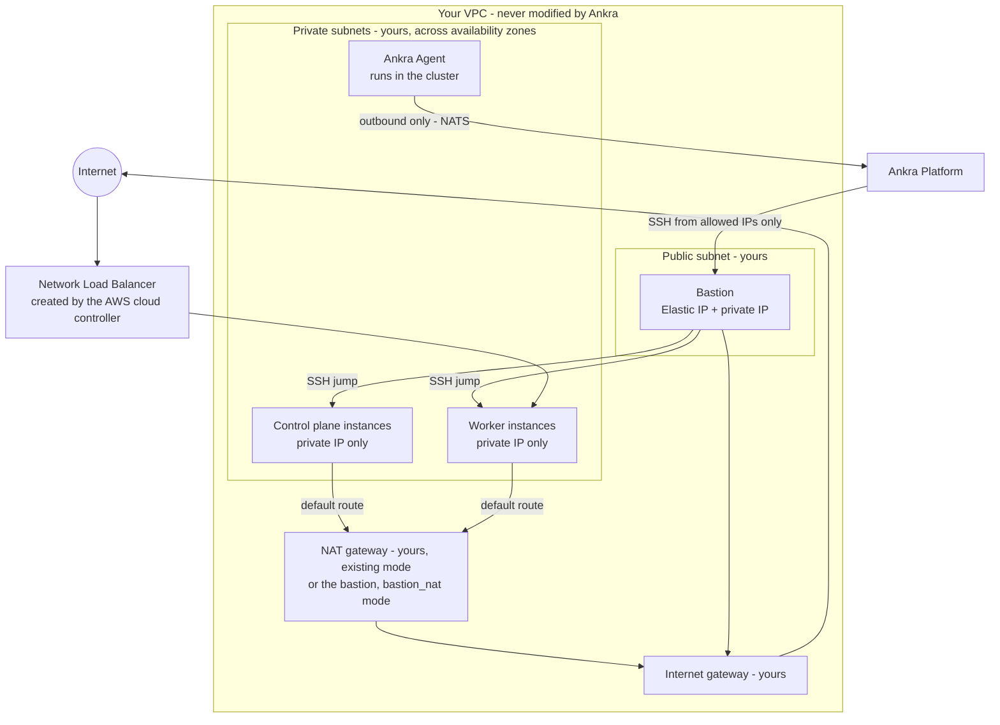

import { CliVersion } from "/snippets/cli-version.jsx";

Ankra provisions self-managed Kubernetes clusters on [Amazon EC2](https://aws.amazon.com/ec2/): a bastion in a public subnet, control plane and worker instances in private subnets you already own, k3s or kubeadm installed over SSH, and the AWS cloud controller manager and EBS CSI driver wired to per-cluster instance profiles. You keep the VPC; Ankra owns only what it creates inside it.

<Warning>
**Closed beta.** Self-managed AWS clusters are in closed beta. The workflow is stable but the surface may still change, and it is enabled per organisation on request - until it is, AWS offers only [Amazon EKS](/guides/eks-clusters) in the create wizard and the `aws` cluster commands and endpoints are not served. [Contact support](/platform/support) to have it turned on for your organisation.
</Warning>

This is the self-managed lane. If you want AWS to run the control plane, use [Amazon EKS](/guides/eks-clusters) instead; the [comparison table](/guides/managed-kubernetes#managed-vs-self-managed) sets the two side by side.

---

## Prerequisites

<CardGroup cols={2}>
  <Card title="AWS Credential (provisioning scope)" icon="key">
    An AWS credential whose role carries the **Provisioning** scope - the one write role for EKS and self-managed clusters - or the EC2-only **Self-managed** scope; access keys with the equivalent policy also work. A provisioning stack launched before the self-managed statements were added must be updated. See [AWS Credentials](/platform/credentials/aws#provisioning).
  </Card>
  <Card title="SSH Key Credential" icon="lock">
    An SSH public key for node access. You can provide your own or let Ankra generate one. See [SSH Key Credentials](/platform/credentials/ssh-key).
  </Card>
</CardGroup>

### A VPC and subnets you own

Ankra does not create a VPC in this release. Before you start, the target region needs:

| You provide | Requirements |
|---|---|
| **A VPC** | Any VPC in the region. Its DHCP options set, internet gateway and existing route tables are read, never changed. |
| **One or more node subnets** | Private subnets for the control plane and workers. Nodes never receive a public IP. Spread the subnets across availability zones for a multi-AZ cluster - Ankra places control planes one per zone and balances each node group across them. |
| **One bastion subnet** | A public subnet (a route to the internet gateway, and public IP assignment allowed) for the bastion. The bastion is the only instance Ankra gives a public address. |
| **Egress for the node subnets** | Nodes pull images, reach the Ankra platform and talk to AWS APIs, so their subnets need a default route somewhere. Choose one of the two egress modes below. |

### Egress modes

Nodes have no public IP, so every node subnet must route `0.0.0.0/0` through something. The `egress_mode` field on the create request decides what, and Ankra never mixes the two on one cluster:

- **`existing`** - your node subnets already route the default to a NAT gateway, a NAT instance or a transit path. Ankra checks the route and changes nothing. The bastion is then an SSH jump host only, and no node traffic passes through it. **Cost:** whatever you already pay for that path - AWS bills a NAT gateway per hour and per GB processed (see [VPC pricing](https://aws.amazon.com/vpc/pricing/)), and it is shared with everything else in the subnet.
- **`bastion_nat`** - the bastion becomes the NAT instance, as it is on Hetzner and DigitalOcean: source/destination checking is switched off and it forwards node traffic to the internet gateway. Because a default route has to point at the bastion's network interface, Ankra creates **one** tagged route table in your VPC with `0.0.0.0/0` to the bastion and associates the node subnets with it, recording each subnet's previous association so teardown restores it exactly. **Cost:** the bastion instance and its Elastic IP, nothing else - no NAT gateway. The trade is that node egress is capped by the bastion's network performance, shares its fate (a bastion resize interrupts it), and the bastion must stay running.

An omitted `egress_mode` is resolved by preflight: subnets that already have egress select `existing`; empty subnets without it select `bastion_nat`; subnets without egress that hold instances Ankra did not create are refused with a message naming them. `bastion_nat` is **always refused** when any node subnet carries a foreign instance, because re-pointing that subnet's default route would hijack its egress. Create the NAT gateway yourself and use `existing` in that case.

### What Ankra creates, and what it never touches

Every object Ankra creates is tagged `ankra.cloud/cluster-id=<id>`, `ankra.cloud/managed=true` and `kubernetes.io/cluster/<id>=owned`, and the credential's write permissions are scoped to those tags. Ankra creates, in your account: two security groups (nodes, bastion), an imported key pair, one Elastic IP, the bastion instance, the node instances with their network interfaces and encrypted gp3 root volumes, two IAM roles with instance profiles (`ankra-k3s-<cluster>-cp` and `ankra-k3s-<cluster>-node`), and in `bastion_nat` mode one route table. It never creates, modifies or deletes your VPC, subnets, internet gateway, NAT gateways, DHCP options or existing route tables. The full list, with tags and IAM scoping, is in the [AWS Reference](/reference/aws#what-ankra-creates).

---

## Creating an AWS Cluster

### Via the Platform UI

<Steps>
  <Step title="Navigate to Clusters">
    Go to **Clusters** in the Ankra dashboard and click **Create Cluster**.
  </Step>
  <Step title="Select AWS - Self-managed">
    Choose **AWS** as the provider and pick the **Self-managed** action (the other action, **Cloud Managed**, creates [EKS](/guides/eks-clusters)).
  </Step>
  <Step title="Select Credentials">
    Pick an AWS credential with the provisioning or self-managed scope and an SSH key credential. A read-only (cost) credential, or a provisioning role whose stack predates the self-managed statements, is listed but refused at preflight with the missing permission named. You can create either credential from the wizard.
  </Step>
  <Step title="Choose Region and Network">
    Select a region - the list loads live from your credential. Then pick the **VPC**, one or more **node subnets** and the **bastion subnet**; the wizard shows each subnet's availability zone and whether it has a public or private route, and offers only public subnets for the bastion.
  </Step>
  <Step title="Egress and Bastion Access">
    Choose the **egress mode** (or leave it on *Detect*, which lets preflight resolve it), and enter the **allowed IPs** that may reach the bastion on port 22 - at least one CIDR, and `0.0.0.0/0` is refused. Your current public address is offered as a starting point.
  </Step>
  <Step title="Configure Nodes">
    Set your cluster topology:
    - **Bastion** - instance type for the SSH bastion (a burstable type such as `t3.small` is enough for an SSH jump host; size it for bandwidth in `bastion_nat` mode)
    - **Control Plane** - count (1 to 9 - at least three when the node subnets span more than one availability zone) and instance type
    - **Workers** - one or more node groups, each with a name, instance type and count

    Instance types load live for the region with vCPUs, memory, architecture and hourly price. Only `amd64` types are offered in this release.
  </Step>
  <Step title="Distribution, CNI and Image">
    Keep **k3s** (the wizard's default) or pick **kubeadm**, which on AWS is Cilium only. The CNI defaults to Cilium for both distributions; a k3s cluster can pick Calico or flannel and the [advanced features](/guides/digitalocean-clusters#advanced-cni-features), but only Cilium and Calico can run the [IMDS guard](#instance-metadata-imds) that keeps pods away from the control-plane instance role, so flannel is accepted with a preflight warning. The Ubuntu series defaults to 24.04 and the root volume is an encrypted gp3 volume of 40 GiB whose size you can raise (up to 2000 GiB).

    <Note>
    The wizard and the CLI examples on this page create k3s clusters. An API request that omits `distribution` follows the platform default, `kubeadm`, like every other self-managed provider - set `"distribution": "k3s"` explicitly when you want k3s from the API.
    </Note>
  </Step>
  <Step title="GitOps, Networking & DNS">
    Optionally connect a GitHub repository for GitOps-driven deployment. Two checkboxes on this step are on by default:
    - **Include Networking Stack** - deploys Traefik, cert-manager and a Let's Encrypt ClusterIssuer. Traefik's Service asks for a Network Load Balancer, which the AWS cloud controller creates in your account.
    - **Include Public DNS** - gives the cluster its own delegated subdomain on `ankra.cc` and installs external-dns with its credentials already wired, so an ingress hostname under that subdomain gets its DNS record and TLS certificate automatically.
  </Step>
  <Step title="Preflight, Create & Track Progress">
    The wizard runs the [preflight](#preflight) before it submits and shows what it found - resolved egress mode, availability zones, the AMI it will use, and the vCPU, Elastic IP and security-group quotas it checked. Click **Create** to start provisioning. A live progress view tracks IAM roles and instance profiles, security groups, key pair, Elastic IP, bastion, route table (in `bastion_nat` mode), node instances, Kubernetes installation, cloud controller and CSI driver, and Ankra Agent setup. The cluster appears **offline** until provisioning completes, then transitions to **online**.
  </Step>
</Steps>

### Managing from the Dashboard

Once the cluster is online, day-2 operations live where they do for every self-managed provider:

- **Nodes** section - node groups, control plane, bastion health and resize, restart, diagnose and repair. See [Nodes](/platform/cluster-nodes).
- **Settings → General** - Kubernetes upgrade, stop and start, [power schedules](/platform/cluster-power-schedules), and the **Danger Zone** to deprovision.
- **Settings → Access** - SSH commands through the bastion and SSH key management.

### Via the CLI

<CliVersion since="0.17.0" />

Create the credentials first. The AWS credential is the same one EKS uses: the provisioning role (`AnkraProvisioning`) builds both EKS and self-managed clusters, and the [credential page](/platform/credentials/aws#provisioning) walks through it in the dashboard, including how to update a stack launched before the self-managed statements were added. From the terminal, `onboarding` prints the external ID, the trust principal, the quick-create link for the stack and the `create-role` command to run once the stack shows `CREATE_COMPLETE`:

```bash
# 1. Print the external ID and the CloudFormation launch link for the provisioning role
#    (--scope self_managed instead for the EC2-only role that grants nothing for EKS)
ankra credentials aws onboarding --scope provisioning

# 2. Launch the stack from that link, wait for CREATE_COMPLETE, copy the RoleArn output, then store it
ankra credentials aws create-role --name my-aws --role-arn <role-arn> --external-id <external-id> \
  --region eu-north-1 --scope provisioning

# Access keys instead of a role: the secret is asked for on a masked prompt, never passed as a flag
ankra credentials aws create-keys --name my-aws-keys --access-key-id <access-key-id> --region eu-north-1

ankra credentials aws list

# SSH key credential
ankra credentials hetzner ssh-key create --name my-ssh-key --generate   # provider-neutral; any SSH key credential works
```

The external ID `create-role` stores must be the one `onboarding` printed and the stack was launched with; a role created at the `cost` scope is refused at cluster create.

Then look up what the credential can reach:

```bash
ankra cluster aws regions --credential-id <aws-credential-id>
ankra cluster aws vpcs --credential-id <aws-credential-id> --region eu-north-1
ankra cluster aws subnets --credential-id <aws-credential-id> --region eu-north-1 --vpc-id <vpc-id>
ankra cluster aws availability-zones --credential-id <aws-credential-id> --region eu-north-1
ankra cluster aws instance-types --credential-id <aws-credential-id> --region eu-north-1
ankra cluster aws images --credential-id <aws-credential-id> --region eu-north-1
ankra cluster aws pricing --credential-id <aws-credential-id> --region eu-north-1 --instance-type t3.large
```

#### Preflight

`preflight` takes the same flags as `create` and runs every check the create runs, without creating anything: whether the VPC and subnets exist and sit in the region, which availability zones the node subnets cover, the resolved egress mode (and why `bastion_nat` is refused, if it is), the AMI resolved for the Ubuntu series and architecture, the vCPU quota for the chosen instance families, the Elastic IP quota, the security-groups-per-interface quota, and whether `bastion_allowed_ips` is valid. Every item is three-state - `ok`, `warning` (a read Ankra could not perform, or a caveat such as flannel not enforcing the IMDS guard) or `error` - and the result carries `can_proceed` and `resolved_egress_mode`, the mode the create will run under. Run it until there are no errors, then run `create` with the same flags.

```bash
ankra cluster aws preflight \
  --name my-cluster \
  --credential-id <aws-credential-id> \
  --ssh-key-credential-id <ssh-key-credential-id> \
  --region eu-north-1 \
  --vpc-id <vpc-id> \
  --node-subnet-ids <subnet-a>,<subnet-b>,<subnet-c> \
  --bastion-subnet-id <public-subnet> \
  --egress-mode existing \
  --bastion-allowed-ips 203.0.113.10/32 \
  --control-plane-count 3 \
  --control-plane-type t3.medium \
  --worker-count 3 \
  --worker-type t3.large
```

#### Create

```bash
ankra cluster aws create \
  --name my-cluster \
  --credential-id <aws-credential-id> \
  --ssh-key-credential-id <ssh-key-credential-id> \
  --region eu-north-1 \
  --vpc-id <vpc-id> \
  --node-subnet-ids <subnet-a>,<subnet-b>,<subnet-c> \
  --bastion-subnet-id <public-subnet> \
  --egress-mode existing \
  --bastion-allowed-ips 203.0.113.10/32 \
  --control-plane-count 3 \
  --control-plane-type t3.medium \
  --worker-count 3 \
  --worker-type t3.large \
  --distribution k3s \
  --retention-policy retain
```

`--cni` and `--cni-features` pick the CNI and its feature toggles (`kube_proxy_replacement`, `hubble`, `wireguard_encryption` for Cilium, `ebpf_dataplane` for Calico); `--environment` and `--criticality` classify the cluster as on every provider; `--gitops-repository`, `--gitops-credential-name` and `--gitops-branch` wire GitOps at create. The full flag list is in the [CLI reference](/reference/cli/cluster).

### Via the API

Preflight first - the endpoint takes the same body as create and answers with findings instead of a cluster:

```bash
curl -X POST https://platform.ankra.app/api/v1/clusters/aws/preflight \
  -H "Authorization: Bearer $ANKRA_API_TOKEN" \
  -H "Content-Type: application/json" \
  -d '{
    "name": "my-cluster",
    "credential_id": "<aws-credential-id>",
    "ssh_key_credential_id": "<ssh-key-credential-id>",
    "region": "eu-north-1",
    "vpc_id": "<vpc-id>",
    "node_subnet_ids": ["<subnet-a>", "<subnet-b>", "<subnet-c>"],
    "bastion_subnet_id": "<public-subnet>",
    "bastion_allowed_ips": ["203.0.113.10/32"],
    "control_plane_count": 3,
    "node_groups": [
      {"name": "default", "instance_type": "t3.large", "count": 3}
    ]
  }'
```

Then create. The response is `{"cluster_id", "name", "kind": "aws", "state": "creating", "operation_id"}`; the operation tracks provisioning.

```bash
curl -X POST https://platform.ankra.app/api/v1/clusters/aws \
  -H "Authorization: Bearer $ANKRA_API_TOKEN" \
  -H "Content-Type: application/json" \
  -d '{
    "name": "my-cluster",
    "credential_id": "<aws-credential-id>",
    "ssh_key_credential_id": "<ssh-key-credential-id>",
    "region": "eu-north-1",
    "vpc_id": "<vpc-id>",
    "node_subnet_ids": ["<subnet-a>", "<subnet-b>", "<subnet-c>"],
    "bastion_subnet_id": "<public-subnet>",
    "egress_mode": "existing",
    "bastion_allowed_ips": ["203.0.113.10/32"],
    "control_plane_count": 3,
    "control_plane_type": "t3.medium",
    "node_groups": [
      {"name": "default", "instance_type": "t3.large", "count": 3}
    ],
    "distribution": "k3s",
    "ubuntu_series": "24.04",
    "root_volume_gib": 40,
    "retention_policy": "retain"
  }'
```

Every request field, the defaults, the catalogs and the limits are in the [AWS Reference](/reference/aws). You can also ask Ankra's AI to create the cluster in chat - the `create_aws_cluster` [tool](/platform/mcp-tools#provisioning--nodes) takes the same fields and runs the preflight for you.

---

## Accessing the Cluster

The bastion is the only instance with a public address, and its security group admits SSH only from `bastion_allowed_ips`. The nodes admit SSH and the Kubernetes API from the bastion's security group, and everything from each other. **Settings → Access** shows copy-pasteable commands with the addresses filled in, and `ankra cluster aws access-info <cluster_id>` (`GET /api/v1/clusters/aws/{cluster_id}/access-info`) answers `bastion_host`, `bastion_port` (22), `bastion_user` and `target_user` (both `ubuntu`) and the control plane IPs:

```bash
# SSH to a control plane node through the bastion
ssh -J ubuntu@<bastion-ip> ubuntu@<control-plane-private-ip>

# Port-forward the Kubernetes API for local kubectl
ssh -L 6443:<control-plane-private-ip>:6443 -N -J ubuntu@<bastion-ip> ubuntu@<control-plane-private-ip>
```

The Ubuntu images log in as `ubuntu`. For everyday `kubectl` you do not need the tunnel - the [Kubernetes browser](/platform/kubernetes-workloads), `ankra cluster get` and the [kubeconfig](/guides/kubeconfig) route through the Ankra Agent, which needs no inbound access at all.

### Changing who may reach the bastion

`bastion_allowed_ips` is the bastion security group's SSH ingress. Update it from **Settings → Access** or the API and the rule is rewritten in place; the list must keep at least one entry and never widen to `0.0.0.0/0`. Ankra's own provisioning path is always admitted.

### Managing SSH keys

Add or remove SSH key credentials on a running cluster from **Settings → Access**, or with `ankra cluster ssh-keys set <cluster_id> --ssh-key-credential-ids <id>,<id>`. Changes are written to `authorized_keys` on every node on the next reconciliation; the key pair imported into EC2 at create is the Ankra-managed key and is never removed. `ankra cluster ssh-keys resync <cluster_id>` forces the write.

---

## Node Groups

Node groups organise workers into groups with independent instance types, counts, labels and taints, exactly as on the other self-managed providers. New nodes of a group are balanced across the cluster's node subnets - each node takes the availability zone with the fewest instances cluster-wide - unless the group is pinned to one zone with `availability_zone`. Pin a group that runs zonal storage: an EBS volume cannot attach from another availability zone.

<CodeGroup>

```bash CLI
ankra cluster node-group list <cluster_id>
ankra cluster node-group add <cluster_id> --name workers-large --instance-type m6i.xlarge --count 2
ankra cluster node-group add <cluster_id> --name database --instance-type r6i.large --count 1 --availability-zone eu-north-1a
ankra cluster node-group scale <cluster_id> default 4
ankra cluster node-group upgrade <cluster_id> default m6i.large
ankra cluster node-group delete <cluster_id> workers-large
```

```bash cURL
curl https://platform.ankra.app/api/v1/clusters/aws/<cluster_id>/node-groups \
  -H "Authorization: Bearer $ANKRA_API_TOKEN"

curl -X POST https://platform.ankra.app/api/v1/clusters/aws/<cluster_id>/node-groups \
  -H "Authorization: Bearer $ANKRA_API_TOKEN" \
  -H "Content-Type: application/json" \
  -d '{
    "name": "workers-large",
    "instance_type": "m6i.xlarge",
    "count": 2,
    "labels": {"tier": "backend"},
    "taints": [{"key": "dedicated", "value": "backend", "effect": "NoSchedule"}]
  }'

curl -X PUT https://platform.ankra.app/api/v1/clusters/aws/<cluster_id>/node-groups/default/scale \
  -H "Authorization: Bearer $ANKRA_API_TOKEN" \
  -H "Content-Type: application/json" \
  -d '{"count": 4}'
```

</CodeGroup>

An instance type change replaces every node of the group one at a time - the node is drained, terminated and recreated on the new type, because EC2 cannot resize an instance in place without a stop. Labels, taints and [autoscaling](/guides/cluster-autoscaling) bounds are edited with the same endpoints as every other provider; the full list is in the [Node Group API](/reference/aws#node-group-api-reference).

Every node carries `topology.kubernetes.io/zone` and `topology.kubernetes.io/region`, set by the cloud controller, so `topologySpreadConstraints` work without extra configuration.

---

## Control Plane

Grow a single control plane to three, or change the control plane instance type, from the **Nodes → Control plane** tab or the CLI. Three control planes are required when the node subnets span more than one availability zone, so that etcd keeps quorum when a zone is lost; a multi-AZ cluster cannot be scaled below three.

```bash
ankra cluster aws control-plane get <cluster_id>
ankra cluster aws control-plane set-count <cluster_id> 3
ankra cluster aws control-plane set-instance-type <cluster_id> t3.large   # cluster must be stopped
```

---

## Restarting, Diagnosing and Repairing a Node

Restart any node - a control plane node, a worker, or the bastion - as a tracked operation from the **Nodes** section, the CLI or the API. A restart is an EC2 reboot; if the instance does not respond it falls back to a stop and start, which keeps the private IP.

<CodeGroup>

```bash CLI
ankra cluster aws nodes list <cluster_id>
ankra cluster aws nodes restart <cluster_id> <node_id>
ankra cluster aws nodes cloud-init-log <cluster_id> <node_id>   # cloud-init status and the tail of its log, over the bastion
```

```bash cURL
curl https://platform.ankra.app/api/v1/clusters/aws/<cluster_id>/nodes \
  -H "Authorization: Bearer $ANKRA_API_TOKEN"

curl -X POST https://platform.ankra.app/api/v1/clusters/aws/<cluster_id>/nodes/<node_id>/restart \
  -H "Authorization: Bearer $ANKRA_API_TOKEN"

curl -X POST https://platform.ankra.app/api/v1/clusters/aws/<cluster_id>/nodes/<node_id>/cloud-init-log \
  -H "Authorization: Bearer $ANKRA_API_TOKEN"
```

</CodeGroup>

See [Restarting a Node](/guides/hetzner-clusters#restarting-a-node) for the response shape and state requirements - identical across providers. You can also ask the AI assistant ("restart worker-2 on my-cluster"). Diagnose and repair (an OS-level check over SSH through the bastion, and a repair of the node's k3s or kubelet unit) run from the node's row menu in the **Nodes** section or through the `ssh_diagnose_node` and `ssh_repair_node` [AI tools](/platform/mcp-tools#provisioning--nodes).

### Bastion health and resize

`bastion status` reports the last verdict of the bastion health loop - reachable or not, which hop a failed probe stopped at, and when - without probing anything, so it answers even while the bastion is down; `bastion diagnose` probes it now as a tracked operation. Both are shown on the **Nodes → Bastion** tab.

<CodeGroup>

```bash CLI
ankra cluster aws bastion status <cluster_id>
ankra cluster aws bastion diagnose <cluster_id>
```

```bash cURL
curl https://platform.ankra.app/api/v1/clusters/aws/<cluster_id>/bastion/health \
  -H "Authorization: Bearer $ANKRA_API_TOKEN"

curl -X POST https://platform.ankra.app/api/v1/clusters/aws/<cluster_id>/bastion/diagnose \
  -H "Authorization: Bearer $ANKRA_API_TOKEN"
```

</CodeGroup>

Resize the bastion from the **Nodes → Bastion** tab or with the API - there is no CLI verb for it on AWS - `PUT /api/v1/clusters/aws/{cluster_id}/bastion/instance-type` with `{"instance_type": "t3.medium"}`: the instance is stopped, its type changed and started again, keeping its Elastic IP.

<Warning>
In `bastion_nat` mode the bastion is the nodes' default route, so a resize or restart interrupts every node's outbound traffic - image pulls, the Ankra Agent connection, AWS API calls from the cloud controller - until it is back.
</Warning>

---

## Upgrading Kubernetes Version

Upgrades roll control planes first, then workers, one node at a time, each cordoned, drained and gated on being `Ready` at the target version. Both k3s and kubeadm clusters upgrade; downgrades and skipping a minor version are refused. The AWS cloud controller manager's minor version is pinned to the cluster's Kubernetes minor, and the upgrade path moves it with the nodes.

<CodeGroup>

```bash CLI
ankra cluster aws k8s-version <cluster_id>
ankra cluster k3s-versions
ankra cluster upgrade <cluster_id> v1.35.1+k3s1
```

```bash cURL
curl https://platform.ankra.app/api/v1/clusters/aws/<cluster_id>/k8s-version \
  -H "Authorization: Bearer $ANKRA_API_TOKEN"

curl -X POST https://platform.ankra.app/api/v1/clusters/aws/<cluster_id>/upgrade-k8s-version \
  -H "Authorization: Bearer $ANKRA_API_TOKEN" \
  -H "Content-Type: application/json" \
  -d '{"target_version": "v1.35.1+k3s1"}'
```

</CodeGroup>

---

## Stopping and Starting a Cluster

Stop a cluster to park it: every node and the bastion are stopped (not terminated), so the instances keep their root volumes and - because they live in a VPC - their private IPs. Start brings the same instances back and reconciles the cluster; embedded etcd rejoins on the same addresses, so a stopped cluster comes back with its state, not as a rebuild. The Elastic IP stays allocated and the bastion keeps its public address across a stop.

<CodeGroup>

```bash CLI
ankra cluster aws stop <cluster_id>
ankra cluster aws start <cluster_id>                       # scope defaults to "all"
ankra cluster aws start <cluster_id> --scope control_plane # control plane only
```

```bash cURL
curl -X POST https://platform.ankra.app/api/v1/clusters/aws/<cluster_id>/stop \
  -H "Authorization: Bearer $ANKRA_API_TOKEN"

curl -X POST "https://platform.ankra.app/api/v1/clusters/aws/<cluster_id>/start?scope=all" \
  -H "Authorization: Bearer $ANKRA_API_TOKEN"
```

</CodeGroup>

While stopped you pay for EBS storage (root volumes and any volumes the CSI driver provisioned), the Elastic IP, and any load balancers the cloud controller created - not for compute. Ankra records each instance's private IP at create and verifies it after every start; a difference is reported as drift rather than silently accepted. Stop and start also run on a timetable with [power schedules](/platform/cluster-power-schedules), and a stopped cluster is where control plane instance type changes are applied.

---

## Deprovisioning

Deprovisioning terminates the instances, releases the Elastic IP, deletes the security groups, key pair and per-cluster IAM roles, and - in `bastion_nat` mode - restores each node subnet's previous route table association before deleting the route table Ankra created. Your VPC, subnets, gateways and DHCP options are untouched. The cluster is removed from Ankra.

<Warning>
This action is irreversible. All data on the nodes' root volumes is permanently deleted.
</Warning>

What happens to the volumes the EBS CSI driver provisioned and the load balancers the cloud controller created follows the cluster's `retention_policy`, chosen at create:

- **`retain`** (the default) records and keeps them. EBS volumes and Network Load Balancers stay in your account and keep billing; the teardown result lists their provider IDs, and they are tagged with the cluster ID so they are easy to find in the EC2 and load balancing consoles.
- **`delete`** sweeps them: a volume or load balancer is deleted only when it carries this cluster's `ankra.cloud/managed=true` tag **and** the policy is `delete`. Nothing without the tag is touched, whatever the policy.

<CodeGroup>

```bash CLI
ankra cluster aws deprovision <cluster_id>
```

```bash cURL
curl -X DELETE https://platform.ankra.app/api/v1/clusters/aws/<cluster_id> \
  -H "Authorization: Bearer $ANKRA_API_TOKEN"
```

</CodeGroup>

The same sweep applies to a cluster that was stopped earlier: the volumes and load balancers recorded at stop time are still known and follow the policy.

---

## Architecture

An AWS cluster provisions the following infrastructure in your VPC:

| Component | Description |
|-----------|-------------|
| **Security groups** | One for the nodes (all traffic within the group, SSH and Kubernetes API from the bastion group, load balancer health checks added by the cloud controller) and one for the bastion (SSH from `bastion_allowed_ips` only) |
| **Key pair** | Your SSH key credential's public key, imported as `ankra-k3s-<cluster>` |
| **Elastic IP** | One, attached to the bastion - the cluster's only public address |
| **Bastion** | EC2 instance in the public subnet - SSH jump host Ankra uses to provision and manage nodes, and the NAT instance in `bastion_nat` mode |
| **Control plane(s)** | EC2 instances in the node subnets, no public IP, one per availability zone on a multi-AZ cluster |
| **Worker(s)** | EC2 instances in the node subnets, no public IP, organised in [node groups](#node-groups) |
| **IAM roles and instance profiles** | `ankra-k3s-<cluster>-cp` (cloud controller manager and EBS CSI controller) and `ankra-k3s-<cluster>-node` (kubelet and CSI node) |
| **Route table** | `bastion_nat` mode only: one route table with `0.0.0.0/0` to the bastion, associated with the node subnets |
| **Cloud provider stack** | The AWS cloud controller manager and the EBS CSI driver, deployed after the Ankra Agent |



### Cloud integration

- **Cloud controller manager.** Ankra deploys the AWS cloud controller manager as a vendored manifest with an exact image tag, matched to the cluster's Kubernetes minor. Nodes register with `cloud-provider=external`, a provider ID of `aws:///<availability-zone>/<instance-id>`, and their EC2 private DNS name as the node name, so the controller can find each instance. `KubernetesClusterID` is the Ankra cluster ID, and every instance carries the matching `kubernetes.io/cluster/<id>=owned` tag.
- **Load balancers.** A `Service` of type `LoadBalancer` gets an AWS load balancer from the cloud controller. The Traefik the networking stack installs asks for a Network Load Balancer (`service.beta.kubernetes.io/aws-load-balancer-type: nlb`), and Ankra sets the managed tag on it so the teardown sweep can find it.
- **Storage.** The EBS CSI driver is installed from its upstream chart at a pinned version, after the cloud controller (it needs the provider ID and topology labels the controller sets). The default StorageClass provisions **encrypted gp3** volumes.
- **Credentials without keys.** Neither the cloud controller nor the CSI driver holds AWS keys: each uses the instance profile of the node it runs on. The control-plane and worker profiles are distinct, following the upstream policy split, and the platform credential you gave Ankra is never copied into the cluster.
- **Instance metadata.** Every instance requires IMDSv2. Workers and the bastion use a hop limit of 1, so a pod on the pod network cannot reach the instance role and a workload does not inherit the node's AWS permissions by accident. Control-plane instances use a hop limit of **2**, because the upstream EBS CSI chart cannot run its controller on the host network and that controller needs the control-plane role. The compensating control is the **IMDS guard** shipped with the AWS cloud-provider stack: a cluster-wide network policy, rendered for Cilium and Calico, that denies pod egress to `169.254.169.254` except from the EBS CSI controller. On a flannel cluster there is no policy engine to enforce it - the create result reports `imds_guard: unavailable`, and a pod scheduled onto a control-plane node can reach the control-plane instance role. Prefer Cilium (the default) or keep the control planes tainted. A workload that needs AWS access brings its own credentials either way.

---

## Troubleshooting

### Common Issues

| Issue | Solution |
|-------|----------|
| Preflight refuses the credential | The credential is read-only (cost scope), or its provisioning stack predates the self-managed statements. Add a [provisioning credential](/platform/credentials/aws#provisioning), or update the existing stack to the published template |
| Preflight refuses `bastion_nat` | A node subnet holds an instance Ankra did not create. Move it, pick an empty subnet, or create a NAT gateway and use `existing` |
| Preflight reports no egress and refuses `existing` | The node subnets' route table has no `0.0.0.0/0` route to a NAT gateway, NAT instance or transit path. Add one, or use empty subnets with `bastion_nat` |
| `bastion_allowed_ips` refused | The list is empty or contains `0.0.0.0/0`. Give it at least one CIDR |
| Cluster stuck in provisioning | Check the vCPU quota for the instance family, the Elastic IP quota, and that the bastion subnet is public (route to the internet gateway) |
| Nodes stay `NotReady` with the `node.cloudprovider.kubernetes.io/uninitialized` taint | The cloud controller cannot match the node - see [cluster ID and node names](#cloud-controller-cluster-id-and-node-names) below |
| `LoadBalancer` Service stuck in `Pending` | Check the cloud controller pods in `kube-system`; on a fresh account the first load balancer also creates the Elastic Load Balancing service-linked role, which the credential allows |
| PVC stuck in `Pending` | Check the EBS CSI controller pods; a pod pinned to a zone with no volume there needs a node group in that zone |
| Cannot SSH to the bastion | Your address is not in `bastion_allowed_ips`, or the security group was edited outside Ankra. Update the list from **Settings → Access** |
| Nodes lost egress after a bastion resize | Expected in `bastion_nat` mode while the bastion restarts; it recovers when the bastion is back |
| Create result reports `imds_guard: unavailable` | The cluster runs flannel, which cannot enforce the IMDS guard. Recreate with Cilium or Calico, or keep the control planes tainted - see [Instance metadata](#instance-metadata-imds) |

### Cloud controller cluster ID and node names

The AWS cloud controller manager identifies a cluster's instances by the `kubernetes.io/cluster/<id>=owned` tag and matches each Kubernetes node to an instance by name. Two things must therefore hold on every node, and Ankra sets both:

- The instance carries the `kubernetes.io/cluster/<id>` tag, where `<id>` is the cluster ID the controller was configured with. Removing or editing that tag in the console makes the controller treat the instance as foreign; the node keeps the `uninitialized` taint (or, on a running cluster, is removed from Kubernetes) until the tag is restored.
- The node name equals the instance's EC2 private DNS name, as reported by `DescribeInstances`. k3s is started with `--node-name` set to that value, so the name does not depend on what the OS derives from the VPC's **DHCP options set**. A VPC whose DHCP options carry a custom `domain-name` produces hostnames such as `ip-10-0-1-23.corp.example`, while EC2 reports `ip-10-0-1-23.eu-north-1.compute.internal`; the controller resolves the latter, which is why Ankra pins the node name rather than the hostname. Changing the DHCP options set after creation does not affect existing or new nodes.

If a node was renamed or re-registered by hand and no longer matches, delete the Kubernetes node object and restart the node from the **Nodes** section; it registers again under the correct name.

### Instance metadata (IMDS)

Every instance is launched with IMDSv2 required, so tools that use IMDSv1 (`curl http://169.254.169.254/latest/...` without a token) fail on the nodes. Workers and the bastion have a hop limit of 1, so a pod on the pod network fails on either version - that is the intended isolation of the instance role. Control-plane instances have a hop limit of 2 so the EBS CSI controller, which the upstream chart cannot run on the host network, can use the control-plane role; the **IMDS guard** - a cluster-wide network policy in the AWS cloud-provider stack, rendered for Cilium and Calico - denies every other pod's egress to `169.254.169.254`.

The guard needs a policy engine. On a flannel cluster the create result reports `imds_guard: unavailable`, and any pod scheduled onto a control-plane node can read the control-plane instance role's credentials. Prefer Cilium (the default) or Calico, or keep the control planes tainted so no workload lands there. If a workload needs AWS credentials, give it its own (a secret, or a role it assumes with keys you manage); do not raise the hop limits or switch IMDSv1 back on, and note that `ModifyInstanceMetadataOptions` is one of the calls Ankra's credential is allowed to make on its own instances, so Ankra restores the hardening on reconciliation.

### AWS service quotas

Preflight checks the quotas that most often block a create, but a quota can still be consumed between preflight and create, and the per-cluster quota report (`GET /api/v1/clusters/aws/{cluster_id}/quotas`) answers `404` - "Quota reporting is not available for aws clusters" - until it ships. If provisioning fails with a quota error, check in the [Service Quotas console](https://console.aws.amazon.com/servicequotas/) for the region:

- Running On-Demand instances (vCPU) for the instance family
- Elastic IPs per region
- Security groups per network interface, and rules per security group
- Network Load Balancers per region

Request an increase, then create again - a failed create leaves nothing behind but tagged objects Ankra removes on the next attempt.
