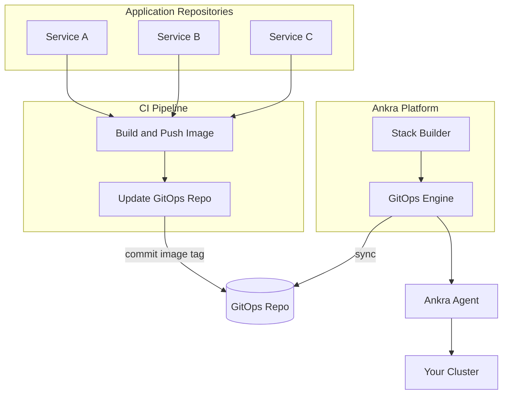

<Note>
This guide shows you how to build a CI/CD pipeline that automatically deploys your applications to Kubernetes when you push code. Your CI builds container images and updates the GitOps repository—Ankra handles the rest.
</Note>

---

## Architecture Overview

<Frame>

</Frame>

The flow works like this:

1. **You push code** to your application repository
2. **CI builds and pushes** a container image to your registry
3. **CI updates the GitOps repo** with the new image tag
4. **Ankra detects the change** and triggers a deployment
5. **Ankra Agent deploys** the updated manifest to your cluster

---

## What You'll Build

A complete CI/CD pipeline with:

| Component | Purpose |
|-----------|---------|
| **Application Repo** | Your app code with Dockerfile and CI workflow |
| **GitOps Repo** | Kubernetes manifests managed by Ankra |
| **Container Registry** | Stores your built images (GCR, ECR, Docker Hub, etc.) |
| **GitHub Actions** | Builds images and updates the GitOps repo |

---

## Prerequisites

- A cluster imported into Ankra with the agent connected
- A container registry (Google Artifact Registry, AWS ECR, Docker Hub, etc.)
- An application repository with a Dockerfile

---

## Step 1: Connect a GitHub Repository

First, connect a GitHub repository to your cluster. This enables GitOps and installs the necessary components on your cluster.

<Steps>
  <Step title="Navigate to Integration Settings">
    Go to your cluster → **Settings** → **Integration** tab.
  </Step>
  <Step title="Add a GitHub Credential">
    If you haven't connected GitHub yet, you'll see a prompt to connect a repository.
    
    Select an existing GitHub credential from the dropdown, or click to add a new one. This authorizes Ankra to access your repositories.
  </Step>
  <Step title="Select a Repository">
    Choose the repository that will store your GitOps configuration. This can be an existing repo or a new one.
    
    <Tip>
    We recommend creating a dedicated repository (e.g., `infrastructure-gitops`) to keep your cluster configurations separate from application code.
    </Tip>
  </Step>
  <Step title="Confirm Installation">
    When you connect for the first time, Ankra will install:
    - **ArgoCD** - GitOps continuous delivery
    - **Ankra Stack Builder** - Declarative infrastructure management  
    - **Ankra Resource Engine** - Intelligent resource orchestration
    - **GitOps Monitoring** - Continuous deployment from your repository
    
    Click **Install ArgoCD & Connect** to proceed.
  </Step>
</Steps>

Once connected, Ankra will create the repository structure and begin syncing your cluster configuration.

---

## Step 2: Create a Stack for Your Application

In Ankra, manifests are organized into **Stacks**. A Stack is a collection of related Kubernetes resources that are deployed together.

<Steps>
  <Step title="Open the Stacks Page">
    Navigate to your cluster → **Stacks**.
  </Step>
  <Step title="Create a New Stack">
    Click **Create** to open the Stack Builder.
  </Step>
  <Step title="Name Your Stack">
    Give your stack a descriptive name, like `backend-services` or `production-apps`.
  </Step>
  <Step title="Add a Manifest Using AI">
    Press `⌘+J` (or `Ctrl+J`) to open the AI Assistant and describe your deployment:
    
    ```
    Create a deployment manifest for my backend service:
    - Image: europe-west1-docker.pkg.dev/my-project/docker-images/backend:latest
    - Namespace: production
    - 2 replicas
    - Port 8080
    - Health check on /health
    - 256Mi memory, 100m CPU requests
    ```
    
    The AI will generate the manifest and add it to your stack.
  </Step>
  <Step title="Create the Stack">
    Review your configuration in the Builder tab, then click **Create Stack**.
    
    Ankra will commit the manifests to your GitOps repository and deploy them to your cluster.
  </Step>
</Steps>

<Tip>
You can view your stack's manifests in the GitOps repository under `clusters/{cluster-name}/manifests/`.
</Tip>

---

## Step 3: Set Up CI Deploy Key

Your CI pipeline needs write access to the GitOps repository to update image tags when new builds complete.

<Steps>
  <Step title="Generate an SSH Key">
    On your local machine, generate a deploy key:
    
    ```bash
    ssh-keygen -t ed25519 -C "ci-deploy-key" -f deploy_key -N ""
    ```
    
    This creates `deploy_key` (private) and `deploy_key.pub` (public).
  </Step>
  <Step title="Add Public Key to GitOps Repo">
    Go to your GitOps repository on GitHub → **Settings** → **Deploy keys** → **Add deploy key**.
    
    Paste the contents of `deploy_key.pub` and check **Allow write access**.
  </Step>
  <Step title="Add Private Key to App Repo">
    Go to your application repository → **Settings** → **Secrets and variables** → **Actions**.
    
    Create a new secret called `GITOPS_DEPLOY_KEY` with the contents of `deploy_key`.
  </Step>
</Steps>

---

## Step 4: Create the CI Workflow

Add a GitHub Actions workflow to your application repository that builds your container and updates the GitOps repo.

<Steps>
  <Step title="Create the Workflow File">
    In your application repository, create `.github/workflows/deploy.yml`.
  </Step>
  <Step title="Use the AI to Generate the Workflow">
    Open the AI Assistant (`⌘+J`) and describe your pipeline:
    
    ```
    Generate a GitHub Actions workflow that:
    - Triggers on push to main branch
    - Builds a Docker image from my Dockerfile
    - Pushes to Google Artifact Registry at europe-west1-docker.pkg.dev/my-project/docker-images/backend
    - Tags with the git SHA
    - Updates my GitOps repo at github.com/my-org/infrastructure-gitops
    - Updates the image tag in clusters/my-cluster/manifests/backend-deployment.yaml
    ```
    
    The AI will generate a complete workflow tailored to your setup.
  </Step>
  <Step title="Add Registry Secrets">
    Add these secrets to your application repository under **Settings** → **Secrets and variables** → **Actions**:
    
    | Secret | Description |
    |--------|-------------|
    | `REGISTRY_USERNAME` | Registry username (or `_json_key` for GCP) |
    | `REGISTRY_PASSWORD` | Registry password or service account key |
    | `GITOPS_DEPLOY_KEY` | The SSH private key from Step 3 |
  </Step>
</Steps>

<Accordion title="Example Workflow Reference">
Here's what a typical workflow looks like. Use the AI to customize it for your specific setup:

```yaml
name: Build and Deploy

on:
  push:
    branches: [main]
    paths:
      - 'src/**'
      - 'Dockerfile'
  workflow_dispatch:

env:
  IMAGE_NAME: europe-west1-docker.pkg.dev/my-project/docker-images/backend
  GITOPS_REPO: git@github.com:my-org/infrastructure-gitops.git
  MANIFEST_PATH: clusters/my-cluster/manifests/backend-deployment.yaml

jobs:
  build:
    runs-on: ubuntu-latest
    steps:
      - uses: actions/checkout@v4

      - uses: docker/setup-buildx-action@v3

      - uses: docker/login-action@v3
        with:
          registry: europe-west1-docker.pkg.dev
          username: _json_key
          password: ${{ secrets.GCP_SERVICE_ACCOUNT_KEY }}

      - uses: docker/build-push-action@v5
        with:
          context: .
          push: true
          tags: ${{ env.IMAGE_NAME }}:${{ github.sha }}
          cache-from: type=gha
          cache-to: type=gha,mode=max

  update-gitops:
    needs: build
    runs-on: ubuntu-latest
    steps:
      - uses: webfactory/ssh-agent@v0.9.0
        with:
          ssh-private-key: ${{ secrets.GITOPS_DEPLOY_KEY }}

      - name: Update GitOps repo
        run: |
          git clone ${{ env.GITOPS_REPO }}
          cd infrastructure-gitops

          git config user.name "GitHub Actions"
          git config user.email "github-actions[bot]@users.noreply.github.com"

          sed -i "s|${{ env.IMAGE_NAME }}:[a-zA-Z0-9_-]*|${{ env.IMAGE_NAME }}:${{ github.sha }}|" "${{ env.MANIFEST_PATH }}"

          git add "${{ env.MANIFEST_PATH }}"
          git commit -m "Deploy backend: ${{ github.sha }}"
          git push origin main
```
</Accordion>

---

## Step 5: Configure Registry Access in Your Cluster

If your container registry is private, your cluster needs credentials to pull images.

<Steps>
  <Step title="Open the AI Assistant">
    Press `⌘+J` to open the AI Assistant.
  </Step>
  <Step title="Ask for an Image Pull Secret">
    ```
    Create an image pull secret for my private registry:
    - Registry: europe-west1-docker.pkg.dev
    - Namespace: production
    - Name: gcr-pull-secret
    ```
  </Step>
  <Step title="Add the Secret Value">
    The AI will create a Secret manifest. You'll need to provide your registry credentials:
    - For GCP: Use a service account JSON key with `Artifact Registry Reader` role
    - For AWS ECR: Use an IAM access key
    - For Docker Hub: Use your username and access token
  </Step>
  <Step title="Link to Your Deployment">
    Ask the AI to update your deployment to use the pull secret:
    
    ```
    Update my backend deployment to use the gcr-pull-secret for pulling images
    ```
  </Step>
</Steps>

<Tip>
Use [SOPS encryption](/essentials/sops) to safely store registry credentials in your GitOps repository.
</Tip>

---

## Step 6: Test the Pipeline

<Steps>
  <Step title="Push a Code Change">
    Make a change to your application code and push to main:
    
    ```bash
    git add .
    git commit -m "Add new feature"
    git push origin main
    ```
  </Step>
  <Step title="Monitor CI Progress">
    Go to **Actions** in your application repository to watch the workflow run.
  </Step>
  <Step title="Verify GitOps Update">
    After CI completes, check your GitOps repository. You should see a new commit updating the image tag.
  </Step>
  <Step title="Watch the Deployment">
    In Ankra, go to your cluster → **Operations** to see the deployment in progress. The new image will roll out automatically.
  </Step>
</Steps>

---

## Step 7: Monitor GitOps Sync Status

Ankra provides visibility into your GitOps sync status.

<Steps>
  <Step title="View GitOps Status">
    Navigate to your cluster → **GitOps** to see:
    - Current sync status
    - Recent sync history
    - Any sync errors
  </Step>
  <Step title="Trigger Manual Sync">
    If needed, click **Sync** to manually trigger a sync from your repository.
  </Step>
  <Step title="View in Operations">
    Check the **Operations** page for detailed deployment history and job status.
  </Step>
</Steps>

---

## Adding More Services

To add CI/CD for additional services, use the AI Assistant to scaffold everything:

<Steps>
  <Step title="Add to Existing Stack or Create New">
    Either edit your existing stack or create a new one for the service.
  </Step>
  <Step title="Generate the Deployment Manifest">
    Open the AI Assistant (`⌘+J`) and describe your service:
    
    ```
    Add a deployment for my frontend service:
    - Image: europe-west1-docker.pkg.dev/my-project/docker-images/frontend
    - Namespace: production
    - 3 replicas
    - Port 3000
    - Expose via a Service on port 80
    ```
  </Step>
  <Step title="Generate the CI Workflow">
    In your frontend app repo, ask the AI to generate the workflow:
    
    ```
    Generate a GitHub Actions workflow to build and deploy my frontend:
    - Build from ./frontend/Dockerfile
    - Push to europe-west1-docker.pkg.dev/my-project/docker-images/frontend
    - Update clusters/my-cluster/manifests/frontend-deployment.yaml in my GitOps repo
    ```
  </Step>
  <Step title="Add the Secrets">
    Copy the same secrets (`GITOPS_DEPLOY_KEY`, registry credentials) to the new repository.
  </Step>
</Steps>

---

## Common AI Prompts

Use these prompts with the AI Assistant (`⌘+J`) to set up your CI/CD:

<AccordionGroup>
  <Accordion title="Create a Deployment">
    ```
    Create a deployment manifest for my backend service:
    - Image: my-registry.io/backend:latest
    - Namespace: production
    - 2 replicas with rolling update strategy
    - Port 8080
    - Health checks on /health and /ready
    - Resource requests: 256Mi memory, 100m CPU
    - Resource limits: 512Mi memory, 500m CPU
    - Environment variables from a ConfigMap called backend-config
    ```
  </Accordion>
  <Accordion title="Create a Complete Service Stack">
    ```
    Set up a complete service stack for my API:
    - Deployment with 3 replicas
    - Service exposing port 80
    - Ingress with TLS using cert-manager
    - HorizontalPodAutoscaler scaling 2-10 replicas at 70% CPU
    - PodDisruptionBudget allowing 1 unavailable
    ```
  </Accordion>
  <Accordion title="Add Image Pull Secret">
    ```
    Create a docker registry secret for pulling images from:
    - Registry: europe-west1-docker.pkg.dev
    - Namespace: production
    
    Then update my backend deployment to use this secret.
    ```
  </Accordion>
  <Accordion title="Generate CI Workflow">
    ```
    Generate a GitHub Actions workflow that:
    - Builds my Docker image on push to main
    - Pushes to AWS ECR at 123456789.dkr.ecr.us-east-1.amazonaws.com/my-app
    - Updates clusters/prod/manifests/app-deployment.yaml in my GitOps repo
    - Only builds when files in src/ or Dockerfile change
    ```
  </Accordion>
  <Accordion title="Add Canary Deployment">
    ```
    Modify my deployment to support canary releases:
    - Create a canary deployment with 1 replica
    - Use labels to route 10% of traffic to canary
    - Add a Service that selects both stable and canary pods
    ```
  </Accordion>
  <Accordion title="Troubleshoot Deployment">
    ```
    My backend deployment isn't updating after CI pushed a new image.
    Help me troubleshoot why the pods aren't rolling out.
    ```
  </Accordion>
</AccordionGroup>

<Tip>
The AI Assistant has full context of your cluster—it can see your existing resources, logs, and events. Describe what you want to achieve and it will generate the right configuration.
</Tip>

---

## Best Practices

<AccordionGroup>
  <Accordion title="Use Immutable Image Tags">
    Always use unique, immutable tags like git SHA or build number. The AI will help you set this up correctly.
    
    Ask the AI: *"Ensure my deployment uses immutable image tags and imagePullPolicy IfNotPresent"*
  </Accordion>
  <Accordion title="Add Health Checks">
    Let the AI configure proper health checks for your deployments.
    
    Ask the AI: *"Add appropriate liveness and readiness probes to my backend deployment for a Node.js app"*
  </Accordion>
  <Accordion title="Set Resource Limits">
    Prevent runaway resource usage with proper limits.
    
    Ask the AI: *"Review my deployment and suggest appropriate resource requests and limits based on a typical web API"*
  </Accordion>
  <Accordion title="Use SOPS for Secrets">
    Encrypt sensitive values in your GitOps repository.
    
    Ask the AI: *"Help me encrypt my database password using SOPS"*
  </Accordion>
</AccordionGroup>

---

## Troubleshooting

Having issues? Open the AI Assistant (`⌘+J`) and describe your problem:

<AccordionGroup>
  <Accordion title="CI Can't Push to GitOps Repo">
    Ask the AI:
    ```
    My CI workflow is failing to push to the GitOps repo with a permission denied error.
    Help me troubleshoot the deploy key setup.
    ```
  </Accordion>
  <Accordion title="Image Not Updating">
    Ask the AI:
    ```
    I pushed a new image tag to my GitOps repo but the pods aren't updating.
    What could be wrong?
    ```
  </Accordion>
  <Accordion title="Pods Can't Pull Image">
    Ask the AI:
    ```
    My pods are stuck in ImagePullBackOff. Help me fix the registry authentication.
    ```
  </Accordion>
  <Accordion title="Deployment Rollout Stuck">
    Ask the AI:
    ```
    My deployment rollout is stuck. Show me what's blocking it and how to fix it.
    ```
  </Accordion>
  <Accordion title="GitOps Sync Not Triggering">
    Check the **GitOps** page in your cluster to see sync status. If sync isn't triggering:
    - Verify the GitHub repository is still connected in **Settings** → **Integration**
    - Check that your commit was pushed to the correct branch
    - Look for webhook configuration issues in the GitOps status
  </Accordion>
</AccordionGroup>

<Note>
The AI has access to your pod logs, events, and deployment status. It can pinpoint exactly what's going wrong and suggest fixes.
</Note>

---

## Next Steps

<CardGroup cols={2}>
  <Card title="GitOps Reference" icon="git-alt" href="/essentials/cluster-gitops-multiple">
    Learn more about GitOps file formats and include paths.
  </Card>
  <Card title="SOPS Encryption" icon="lock" href="/essentials/sops">
    Encrypt secrets in your GitOps repository.
  </Card>
  <Card title="Webhooks" icon="webhook" href="/essentials/webhooks">
    Trigger external systems when deployments complete.
  </Card>
  <Card title="Operations" icon="list-check" href="/essentials/operations">
    Monitor deployment progress and history.
  </Card>
</CardGroup>
