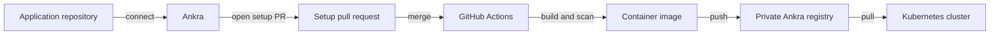

Ankra Applications generates a GitHub Actions pipeline that builds your source repository, scans the image, and publishes it to your organisation's private registry. The generated Kubernetes manifests already reference that image and the matching pull secret.

<Note>
The Ankra registry is private. Ankra provisions its project, GitHub Actions credentials, and Kubernetes pull credentials automatically.
</Note>

## How it works


```mermaid
flowchart LR
    Repo[Application repository] -->|connect| Ankra
    Ankra -->|open setup PR| PR[Setup pull request]
    PR -->|merge| Actions[GitHub Actions]
    Actions -->|build and scan| Image[Container image]
    Image -->|push| Registry[Private Ankra registry]
    Registry -->|pull| Cluster[Kubernetes cluster]
```

<Steps>
  <Step title="Connect the repository">
    Create an Application from a GitHub repository. Ankra analyses the source and prepares the missing Dockerfile, Kubernetes manifests, and workflow.
  </Step>
  <Step title="Review the setup pull request">
    The pull request adds `.github/workflows/build-and-publish.yml` and manifests under `.ankra/manifests/`. Monorepos get one scoped workflow per application.
  </Step>
  <Step title="Merge and build">
    Merging the pull request runs the workflow. It tests the source, builds the image, pushes it to your organisation's project on `registry.ankra.cloud`, and scans it with Trivy.
  </Step>
  <Step title="Deploy">
    Deploy the Application to a cluster. Ankra checks that an image was published before starting the deployment.
  </Step>
</Steps>

## Registry authentication

Ankra installs these encrypted GitHub Actions secrets on the application repository:

| Secret | Purpose |
|--------|---------|
| `ANKRA_REGISTRY_USERNAME` | Push robot username for the organisation registry project |
| `ANKRA_REGISTRY_PASSWORD` | Push robot password |

The generated workflow uses the secrets with `docker/login-action`. It does not use `GITHUB_TOKEN` package permissions and does not publish a public package.

For Kubernetes pulls, Ankra creates an `ankra-registry-pull` Docker registry secret in each managed namespace. Generated Deployments include:

```yaml
spec:
  template:
    spec:
      imagePullSecrets:
        - name: ankra-registry-pull
```

The same pull credential is injected into short-lived Application preview environments.

## Existing applications

Reconcile an Application after the registry cutover. Ankra updates its image URL, replaces a legacy build workflow or manifest with the private registry version, and restores missing repository secrets.

You can inspect readiness in the Application's **CI/CD** tab or from the CLI:

```bash
ankra application publish-readiness <application-id>
```

Readiness checks the organisation registry project, both repository secrets, the workflow login target, and whether an image has been published.

## Troubleshooting

<AccordionGroup>
  <Accordion title="The workflow cannot log in">
    Open the Application's **CI/CD** tab. If Ankra cannot restore the repository secrets, approve the updated Ankra GitHub App **Secrets** permission and retry the fix.
  </Accordion>
  <Accordion title="The registry project is not ready">
    Registry projects are provisioned automatically. The background reconciler retries missed provisioning. If readiness remains blocked after a few minutes, contact support.
  </Accordion>
  <Accordion title="The image push is denied">
    Confirm that the workflow logs in to the host shown in the Application image URL and uses `ANKRA_REGISTRY_USERNAME` and `ANKRA_REGISTRY_PASSWORD`. Reconcile the Application to replace a legacy workflow.
  </Accordion>
  <Accordion title="Pods report ImagePullBackOff">
    Reconcile the Application and check the target namespace for `ankra-registry-pull`. Ankra rotates and reapplies pull credentials automatically.
  </Accordion>
  <Accordion title="Deploy is blocked">
    Ankra blocks deployment until it can verify a published image in the organisation registry. Check the latest GitHub Actions run, then retry after the image push succeeds.
  </Accordion>
</AccordionGroup>

## Next steps

<CardGroup cols={2}>
  <Card title="Applications" icon="box" href="/concepts/applications">
    Connect a repository and follow the Application lifecycle.
  </Card>
  <Card title="GitHub integration" icon="github" href="/integrations/github">
    Review the GitHub App permissions used by Ankra.
  </Card>
  <Card title="Pipeline Agents" icon="robot" href="/guides/pipeline-agents">
    Add read-only deployment and health reporting to your CI workflows.
  </Card>
  <Card title="SOPS Encryption" icon="lock" href="/guides/sops">
    Encrypt other secrets stored in GitOps.
  </Card>
</CardGroup>
