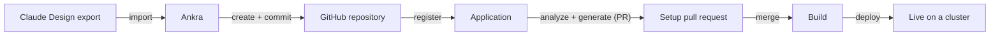

import { CliVersion } from "/snippets/cli-version.jsx";

A design you made in [Claude Design](https://claude.ai/design) can be a running application on one of your clusters in a few minutes. Ankra takes the export, turns the artboards into a static site, creates a GitHub repository for it, commits the site with a Dockerfile, and registers it as an [application](/concepts/applications) - from there it is the same setup pull request, build and deploy lane every application goes through.

<Note>
Applications are in closed beta and connect to **GitHub** through a [GitHub credential](/integrations/github). The import creates the repository under that credential's account (or an owner you name), so the credential needs the Ankra GitHub App installed there.
</Note>

## What the import does



Every artboard (`<Name>.dc.html`) becomes a page under `site/` in the repository: `Main.dc.html` is `index.html`, the rest take their name (`Pricing.dc.html` becomes `pricing.html`), and a canvas with several artboards gets a `canvas.html` front door listing them by their canvas titles and pages. Images travel along under `site/assets/`. The Dockerfile serves the site with busybox `httpd` on port 8080 as a non-root user, which is what the generated Kubernetes manifests expect. A `.ankra/design-import.json` file records what was imported, so running the same import again registers the same repository without a second commit.

## 1. Export the design

In Claude Design, export the canvas. Any of these shapes work:

- a folder holding the artboards (`Main.dc.html`, `Pricing.dc.html`, …), `canvas.json` and any images;
- a zip of that folder;
- a single artboard file;
- a saved canvas page (`.html`) - the page Claude Design publishes, which carries the artboards inside it.

Files over 2 MiB and exports over 16 MiB are refused; those are the editor's own limits, so an export that came out of it fits.

## 2. Import it

<Tabs>
  <Tab title="CLI">
    <CliVersion />

    ```bash
    ankra application import claude-design ./neighborly-export --name neighborly
    ```

    With one GitHub credential in the organisation the command picks it and creates the repository under that credential's account. Name them yourself when there is a choice:

    ```bash
    ankra application import claude-design neighborly.zip \
      --credential github-acme --owner acme --repository neighborly-site \
      --source-url https://claude.ai/design/p/<project-id> --wait
    ```

    `--wait` follows the analysis and prints the setup pull request when it opens. `-o json` returns the application id, the repository, the pages and any warnings as one document.
  </Tab>
  <Tab title="Portal">
    Open **Applications → Add application** and choose **Claude Design** as the source. Drop the export files (or the zip, or the saved page) onto the form, name the application, pick the GitHub credential and the owner, and import. The application page opens with the repository link and the setup pull request once analysis has run.
  </Tab>
  <Tab title="API">
    ```bash
    curl -X POST "$ANKRA_API/api/v1/org/applications/imports/claude-design" \
      -H "Authorization: Bearer $ANKRA_API_TOKEN" \
      -H "Content-Type: application/json" \
      -d '{
        "name": "neighborly",
        "app_repo_credential_name": "github-acme",
        "app_repo_owner": "acme",
        "files": [
          {"path": "Main.dc.html", "content_base64": "..."},
          {"path": "canvas.json",  "content_base64": "..."}
        ]
      }'
    ```

    The answer has the create route's `id` and `errors`, plus `repository`, `pages` and `warnings`. A refusal you can act on - a repository name that is taken, a file the importer does not recognise - comes back in `errors` with a 200; see the [API reference](/api-reference/applications/import-claude-design-application-api-endpoint).
  </Tab>
</Tabs>

## 3. Merge, build, deploy

From here the application is an ordinary one. Ankra opens the setup pull request with the manifests, chart and build workflow (it keeps the committed Dockerfile), the merge builds and publishes the image, and you deploy it to a cluster:

```bash
ankra application get <application-id>
ankra application deploy <application-id> --cluster <cluster>
```

The [applications concept](/concepts/applications) walks through the setup pull request, secrets and deployment in full.

## Artboards that use template logic

An artboard is served as it was authored. Artboards that only use markup and styles look exactly as they did on the canvas. Artboards that depend on the Claude Design runtime - `{{ }}` holes, `sc-for` or `sc-if` blocks, `dc-import` components, or a `data-dc-script` logic block - are imported too, but the import reports each of them as a warning: without the runtime they may not render as they did in the editor. Replace the logic with plain markup in Claude Design and import again, or edit the page under `site/` in the repository; every push builds and deploys.

## Importing again

The repository keeps `.ankra/design-import.json`, a record of the files the import was built from. Running the import again with the same export finds that record and registers without committing; running it with a changed export is refused for now - import into a new repository name, or edit the pages in the repository directly.

## Related

- [Applications](/concepts/applications)
- [Ankra Pipelines](/guides/ankra-pipelines)
- [Branch demos](/guides/branch-demos)
