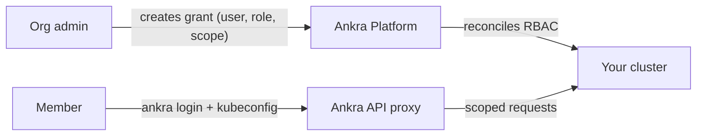

import { CliVersion } from "/snippets/cli-version.jsx";

Cluster Access lets organisation admins grant teammates scoped Kubernetes access to a cluster. Instead of handing out long-lived kubeconfigs or shared service-account tokens, you create a **grant** that maps an Ankra user to a role and scope. Ankra reconciles that grant into native Kubernetes RBAC on the cluster, and the user reaches the cluster through Ankra's authenticated [kubeconfig and API proxy](/guides/kubeconfig).

<Note>
Access is **SSO-backed and ephemeral**. Members authenticate as themselves (via `ankra login` or the portal), and the credentials their kubeconfig uses are short-lived tokens minted on demand - there are no static cluster secrets to leak or rotate.
</Note>

---

## How it works



1. An admin grants a member a role at a chosen scope.
2. Ankra reconciles the grant into Kubernetes RBAC (a `RoleBinding` or `ClusterRoleBinding`) on the cluster.
3. The member adds an Ankra context to their kubeconfig and runs `kubectl` - every request flows through the Ankra proxy and is bound by the RBAC the grant created.

---

## Roles and scopes

Each grant combines a **role** with a **scope**:

| Role | Bound to | Kubernetes capability |
|------|----------|----------------------|
| `view` | `ankra:view` | Read-only access |
| `edit` | `ankra:edit` | Read/write to most namespaced resources |
| `admin` | `ankra:admin` | Full control within the scope, including Roles and RoleBindings for permissions the grant itself holds |
| `cluster-admin` | `ankra:cluster-admin` | Full control of the cluster |

| Scope | Applies to |
|-------|-----------|
| `cluster` | The whole cluster (cluster-wide binding) |
| `namespace` | A single namespace (the `namespace` field is required and must be a valid DNS-1123 label) |

<Tip>
Grant the narrowest role and scope that gets the job done - for example `view` on a single `namespace` for someone triaging one team's workloads, rather than `cluster-admin`.
</Tip>

### No impersonation, escalation or bind

A grant binds to an Ankra-managed ClusterRole, never to the Kubernetes built-in one. Each `ankra:*` ClusterRole is derived from the built-in role of the same name with the `impersonate`, `escalate` and `bind` verbs removed. So no Ankra identity can act as another user, group or service account, and none can create a Role or binding that holds more than it already has. Even with `cluster-admin`:

```bash
kubectl auth can-i impersonate serviceaccounts
# no
```

The gateway also strips any `Impersonate-*` headers a client sends, so `kubectl --as` and `--as-group` have no effect through Ankra.

### Secrets need their own permission

Reading or changing Kubernetes Secrets through Ankra also needs the `kubernetes.secrets_reveal` permission, whatever role the grant gives. Among the built-in organisation roles `owner`, `admin` and `operator` hold it; `member` and `viewer` do not. Without it, `kubectl get secret` and any other request for Secrets (a list, a watch, a create or an edit) returns `Forbidden` with a message naming the permission, and nothing is sent to the cluster. Every Secret request Ankra lets through is written to the [audit log](/guides/audit-log) with who made it, the cluster, the namespace and the name.

This is a check on the request, not on what a pod can do. A member whose grant lets them open a shell in a pod, or create a pod, can still read a Secret that pod mounts. To keep credentials away from someone, give them a `view` grant: the Kubernetes `view` role cannot read Secrets or open a shell in a pod, whatever their organisation role.

---

## Managing access

Open a cluster and go to its **Access** view. The page adapts to your role:

- **Admins** can list organisation members, view existing grants and their reconcile status, create new grants, and revoke them.
- **Members** see whether they have access and can generate a kubeconfig if they do.

<Note>
A grant is required to mint tokens and reach the cluster **for every user, including organisation admins**. Being able to manage access does not itself include kubectl access - admins who want to use `kubectl` must create a grant for themselves too.

The one exception is whoever created or imported the cluster. By default they are given a cluster-scoped `cluster-admin` grant at create time, so they can generate a kubeconfig straight away. An [organisation access policy](#organisation-access-policy) can change that role, or turn the creator grant off. It is an ordinary grant - it appears in the **Access** view and in `ankra cluster access list`, and it can be revoked like any other.
</Note>

### Grant access

<Steps>
  <Step title="Pick a member">
    Choose an active organisation member by email. The target must already be a member of the organisation.
  </Step>
  <Step title="Choose role and scope">
    Select a role (`view`/`edit`/`admin`/`cluster-admin`) and a scope (whole `cluster` or a single `namespace`).
  </Step>
  <Step title="Create the grant">
    Ankra records the grant and begins reconciling it onto the cluster.
  </Step>
  <Step title="Wait for the grant to apply">
    The grant starts as `pending` while the RBAC is applied on the cluster. A token can be minted as soon as the grant exists, but `kubectl` returns `Forbidden` until the status reaches `applied` - check it in the **Access** view or with `ankra cluster access list`.
  </Step>
  <Step title="Share the kubeconfig step">
    The member adds an Ankra context to their kubeconfig - see [Accessing clusters with kubectl](/guides/kubeconfig). For a namespace-scoped grant, they should pass `--namespace` with the granted namespace.
  </Step>
</Steps>

### Reconcile status

Because RBAC is applied on the cluster by the agent, each grant carries a reconcile status:

| Status | Meaning |
|--------|---------|
| `pending` | The grant has been created and is waiting to be applied |
| `applied` | RBAC is live on the cluster |
| `failed` | Reconcile failed - see the grant's error detail |
| `cluster_offline` | The cluster is offline; the grant will apply once it reconnects |

### Revoke access

Delete an individual grant to remove that binding, or use **revoke all** to clear every grant and invalidate any tokens minted for the cluster in one action.

### From the CLI

Admins can manage grants from the [Ankra CLI](/reference/cli/cluster#ankra-cluster-access) (v0.4.0 or later) instead of the portal:

<CliVersion since="0.4.0" />

```bash
# List grants and their reconcile status
ankra cluster access list --cluster my-cluster

# Grant a member access (cluster-wide view by default)
ankra cluster access grant user@example.com --role view

# Limit a grant to one namespace
ankra cluster access grant user@example.com --role edit --namespace staging

# Revoke a single grant by ID, or every grant a member has on the cluster
ankra cluster access revoke user@example.com
```

---

## Time-boxed grants

A grant can carry an expiry and a reason. Without an expiry it is a standing grant and lasts until someone revokes it.

- **Expiry.** Send `expires_in` as a duration such as `30m`, `4h` or `7d`, or `expires_at` as an RFC 3339 time.
- **Reason.** Send `reason`, 3 to 500 characters. It is stored with the grant and shown when grants are listed.
- **Re-timing.** Posting a grant that matches a live one (same member, role, scope and namespace) with a new expiry re-times the existing grant instead of adding a second one. Without an expiry, a matching request is refused with `409` as a duplicate.
- **Expiry is enforced.** The platform removes an expired grant from the cluster, and a kube token minted under a grant cannot outlive it, whenever the token was minted.

<CliVersion since="0.28.0" command="cluster access grant --expires --reason" />

<CodeGroup>

```bash CLI
# Four hours of admin, with a reason
ankra cluster access grant user@example.com --cluster my-cluster --role admin --expires 4h --reason "maintenance window"

# List shows each grant's expiry (or "standing") and reason
ankra cluster access list --cluster my-cluster
```

```bash cURL
curl -X POST https://platform.ankra.app/api/v1/clusters/<cluster-id>/access/grants \
  -H "Authorization: Bearer <your-token>" \
  -H "Content-Type: application/json" \
  -d '{"user_email": "user@example.com", "role": "admin", "scope": "cluster", "expires_in": "4h", "reason": "maintenance window"}'
```

</CodeGroup>

`--expires` takes a duration or an RFC 3339 time and sends whichever field fits.

---

## Organisation access policy

An organisation access policy sets the limits every grant in the organisation is held to. It is opt-in: an organisation without a policy keeps the defaults, which are a `cluster-admin` grant for the cluster's creator, no ceiling and no bounds on expiry or reason.

| Field | Values | Effect |
|-------|--------|--------|
| `creator_grant_role` | `none`, `view`, `edit`, `admin`, `cluster-admin` | What whoever creates or imports a cluster is given on it. `none` gives no grant. |
| `max_grant_role` | `view`, `edit`, `admin`, `cluster-admin` | The ceiling. No grant above it can be created, by anyone, admins included. |
| `elevated_max_ttl_seconds` | `60` to `31536000`, optional | Any grant above `view` must expire within this many seconds. |
| `require_reason_from_role` | `view`, `edit`, `admin`, `cluster-admin`, optional | Grants at or above this role need a reason. |

### Who can see and change it

- **Changing the policy** needs the `kube_access.policy` permission, held by owners and admins. It is human-only: an API token carries it only if the token's scopes name it explicitly, so an unscoped or `*` token is refused with `403 permission_denied (kube_access.policy)`. In practice a signed-in owner or admin changes the policy in the new Ankra interface: **Organisation settings → Roles**, section **Kubernetes access policy** (`/next/organisation/roles` on your portal's address).
- **Reading the policy** needs any of `kube_access.manage`, `kube_access.policy` or `kube_access.elevate`.

<CliVersion since="0.28.0" command="org access-policy get" />

<CodeGroup>

```bash CLI
# Read the policy (there is no set command: changes are made signed in)
ankra org access-policy get
```

```bash cURL
curl https://platform.ankra.app/api/v1/org/cluster-access-policy \
  -H "Authorization: Bearer <your-token>"
```

</CodeGroup>

The policy is read and written at `GET` and `PUT /api/v1/org/cluster-access-policy`, and at `/org/cluster-access-policy` for a browser session. On a `PUT`, an omitted `elevated_max_ttl_seconds` or `require_reason_from_role` keeps its stored value, and `null` clears it.

### What happens to existing grants

Changing the policy does not change grants that already exist. A standing `cluster-admin` grant stays when the ceiling is lowered to `edit`, until it is revoked or expires.

The exception is Kubernetes access that comes from a custom [organisation role](/guides/roles-and-access#kubernetes-access-in-custom-roles). That access is always clamped to the ceiling, and it drops to the new ceiling within about a minute after the ceiling is lowered.

---

## Break-glass elevation

The `kube_access.elevate` permission lets its holder give **itself** time-boxed access to a cluster, and nothing else. It is meant for a person or an automation that should be able to step up during an incident without being able to hand out access.

An elevation:

- **Must expire** within the policy's `elevated_max_ttl_seconds`, or within 4 hours when the policy sets none.
- **Must carry a reason.**
- **Stays under the ceiling** set by `max_grant_role`.
- **Can be re-timed** by posting it again, which extends only the caller's own elevation.
- **Can be ended early** by the caller with `DELETE /api/v1/clusters/{cluster_id}/access/grants/{grant_id}`.

`kube_access.elevate` cannot grant anyone else, create a standing grant, extend or end someone else's grant, list grants, or change the policy. An admin who elevates is held to the same bounds.

### Elevate

`POST /api/v1/clusters/{cluster_id}/access/elevate` takes `role`, `scope` (default `cluster`), `namespace` for a namespace scope, `expires_in` or `expires_at`, and `reason`. The grantee is always the caller, so it works for a service account, which has no email. A body that names `user_email` is refused with `422`.

<CliVersion since="0.28.0" command="cluster access elevate" />

<CodeGroup>

```bash CLI
# Elevate yourself (or the service account the token belongs to)
ankra cluster access elevate --cluster my-cluster --role edit --expires 4h --reason "incident: restart the stuck rollout"

# End it early with the grant id elevate printed
ankra cluster access revoke <grant-id> --cluster my-cluster
```

```bash cURL
curl -X POST https://platform.ankra.app/api/v1/clusters/<cluster-id>/access/elevate \
  -H "Authorization: Bearer <your-token>" \
  -H "Content-Type: application/json" \
  -d '{"role": "edit", "expires_in": "4h", "reason": "incident: restart the stuck rollout"}'
```

</CodeGroup>

`ankra cluster access elevate` requires `--expires` and `--reason`, and prints the id of the grant it created.

### Recommended setup for automation

For automation that needs break-glass access, such as an incident bot or an operator pod:

<Steps>
  <Step title="Create a break-glass role">
    Under **Organisation → Roles**, create a custom role holding only `kube_access.elevate` and `kube_access.use`, with its Kubernetes access set to `view`.
  </Step>
  <Step title="Create a service account for the automation">
    Under **Organisation → Service tokens**, create a [service token](/guides/service-tokens) with that role. The automation has standing read-only access and nothing more.
  </Step>
  <Step title="Elevate when a person approves">
    When a person approves out of band (in chat, in your ticketing tool), the automation calls `elevate` with a short expiry and a reason that points at the approval. The elevation ends on its own when it expires.
  </Step>
</Steps>

Every elevation reaches your notification channels and the audit log, as described below.

---

## Refusals

A grant or elevation the policy does not allow answers `403` with a JSON `detail` code:

| `detail` code | Extra field | Meaning |
|---------------|-------------|---------|
| `cluster_access_policy_violation` | `max_grant_role` | The role is above the ceiling |
| `cluster_access_grant_expiry_required` | `max_lifetime_seconds` | The grant needs an expiry |
| `cluster_access_grant_lifetime_exceeded` | `max_lifetime_seconds` | The expiry is further away than the policy allows |
| `cluster_access_grant_reason_required` | `require_reason_from_role` | The grant needs a reason |

---

## Notifications and audit

Two notification kinds report access changes. Both are `warning` severity and are delivered through your organisation's [notification routes](/guides/notification-routing#cluster-access-kinds) (Slack, Microsoft Teams, Discord, PagerDuty, webhook):

| Kind | Sent for |
|------|----------|
| `cluster_access_policy_changed` | Every accepted policy change, with who made it and the policy before and after |
| `cluster_access_elevated_grant` | Every self-elevation at any role, and every `admin` or `cluster-admin` grant, including extensions |

They reach catch-all routing rules and the home channel without any configuration, and a rule can also name either kind.

Every grant and policy change is also in the [audit log](/guides/audit-log): `cluster_access_grant_created`, `cluster_access_grant_extended`, `cluster_access_grant_deleted` and `cluster_access_policy_updated`. Grant entries record the `authority`, the permission the grant was made under (for example `kube_access.manage` or `kube_access.elevate`).

---

## Availability

- Cluster Access requires the access gateway to be enabled for your deployment. When it is not enabled, the access endpoints return `404` and the **Access** view reports the feature as unavailable.
- [Sandbox clusters](/guides/cluster-sandbox) do not support Cluster Access.

---

## API

All endpoints are organisation-scoped and operate on a specific cluster. Managing grants requires the `kube_access.manage` permission (owners and admins); write operations require a CSRF header for browser-originated requests.

The table below lists the **session-authenticated portal endpoints**. The CLI and API tokens use token-authenticated equivalents under `/api/v1/clusters/{cluster_id}/...` (`/access/grants` for managing grants, `/access/elevate` for break-glass, `/k8s-token` and `/kubeconfig` for consuming access) - see the [kubectl access API table](/guides/kubeconfig#api).

| Method | Path | Purpose |
|--------|------|---------|
| `GET` | `/org/clusters/{cluster_id}/access/capabilities` | Whether access is enabled, and if the caller can manage / already has access |
| `GET` | `/org/clusters/{cluster_id}/access/members` | Organisation members eligible for a grant |
| `GET` | `/org/clusters/{cluster_id}/access/grants` | List existing grants and their reconcile status |
| `POST` | `/org/clusters/{cluster_id}/access/grants` | Create a grant |
| `DELETE` | `/org/clusters/{cluster_id}/access/grants/{grant_id}` | Delete a grant |
| `POST` | `/org/clusters/{cluster_id}/access/kubeconfig` | Generate a kubeconfig for the caller |
| `POST` | `/org/clusters/{cluster_id}/access/revoke-all` | Revoke all grants and tokens for the cluster |
| `GET` | `/org/cluster-access-policy` | Read the organisation access policy |
| `PUT` | `/org/cluster-access-policy` | Change the organisation access policy |

See [Accessing clusters with kubectl](/guides/kubeconfig) for how members consume their access, and the [API Reference](/api-reference/introduction) for full schemas.
