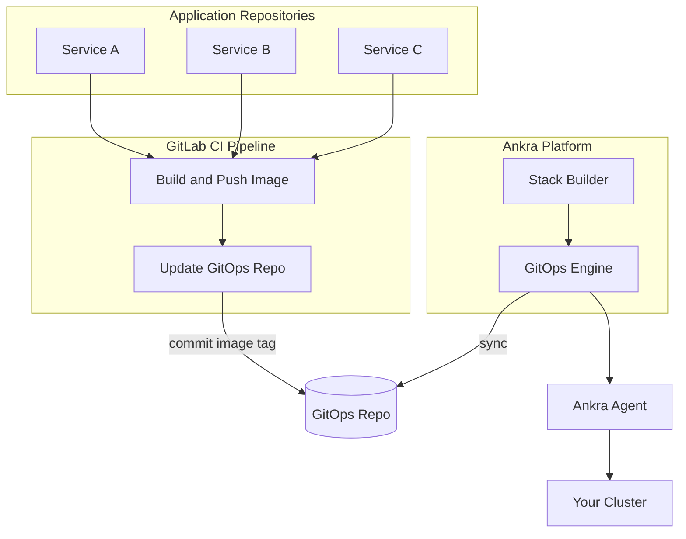

<Note>
This guide shows you how to build a CI/CD pipeline with GitLab CI that automatically deploys your applications to Kubernetes when you push code. Your pipeline builds container images and updates the GitOps repository. Ankra handles the rest.
</Note>

---

## Architecture Overview



The flow works like this:

1. **You push code** to your GitLab application repository
2. **GitLab CI builds and pushes** a container image to your registry
3. **GitLab CI updates the GitOps repo** with the new image tag
4. **Ankra detects the change** and triggers a deployment
5. **Ankra Agent deploys** the updated manifest to your cluster

---

## What You'll Build

A complete CI/CD pipeline with:

| Component | Purpose |
|-----------|---------|
| **Application Repo** | Your app code with Dockerfile and `.gitlab-ci.yml` |
| **GitOps Repo** | Kubernetes manifests managed by Ankra |
| **Container Registry** | Stores your built images (GitLab Container Registry, GCR, ECR, etc.) |
| **GitLab CI** | Builds images and updates the GitOps repo |

---

## Prerequisites

- A cluster imported into Ankra with the agent connected
- A container registry (GitLab Container Registry, Google Artifact Registry, AWS ECR, Docker Hub, etc.)
- An application repository on GitLab with a Dockerfile

---

## Step 1: Connect a GitLab Repository

First, connect a GitLab repository to your cluster. This enables GitOps and installs the necessary components on your cluster.

<Steps>
  <Step title="Navigate to Integration Settings">
    Go to your cluster → **Settings** → **Integration** tab.
  </Step>
  <Step title="Add a GitLab Credential">
    If you haven't connected GitLab yet, add a new credential:

    1. Go to **Credentials** and create a new Git credential
    2. Select **GitLab** as the provider
    3. Provide your GitLab URL and a [Personal Access Token](https://docs.gitlab.com/ee/user/profile/personal_access_tokens.html) with `api` and `read_repository` scopes
  </Step>
  <Step title="Select a Repository">
    Choose the repository that will store your GitOps configuration.

    <Tip>
    We recommend creating a dedicated repository (e.g., `infrastructure-gitops`) to keep your cluster configurations separate from application code.
    </Tip>
  </Step>
  <Step title="Confirm Installation">
    When you connect for the first time, Ankra will install:
    - **ArgoCD** - GitOps continuous delivery
    - **Ankra Stack Builder** - Declarative infrastructure management
    - **Ankra Resource Engine** - Intelligent resource orchestration
    - **GitOps Monitoring** - Continuous deployment from your repository

    Click **Install ArgoCD & Connect** to proceed.
  </Step>
</Steps>

Once connected, Ankra will create the repository structure and begin syncing your cluster configuration.

---

## Step 2: Create a Stack for Your Application

In Ankra, manifests are organized into **Stacks**. A Stack is a collection of related Kubernetes resources that are deployed together.

<Steps>
  <Step title="Open the Stacks Page">
    Navigate to your cluster → **Stacks**.
  </Step>
  <Step title="Create a New Stack">
    Click **Create** to open the Stack Builder.
  </Step>
  <Step title="Name Your Stack">
    Give your stack a descriptive name, like `backend-services` or `production-apps`.
  </Step>
  <Step title="Add a Manifest Using AI">
    Press `⌘+J` (or `Ctrl+J`) to open the AI Assistant and describe your deployment:

    ```
    Create a deployment manifest for my backend service:
    - Image: registry.gitlab.com/my-group/my-app/backend:latest
    - Namespace: production
    - 2 replicas
    - Port 8080
    - Health check on /health
    - 256Mi memory, 100m CPU requests
    ```

    The AI will provide a manifest you can add to your stack.
  </Step>
  <Step title="Create the Stack">
    Review your configuration in the Builder tab, then click **Create Stack**.

    Ankra will commit the manifests to your GitOps repository and deploy them to your cluster.
  </Step>
</Steps>

<Tip>
You can view your stack's manifests in the GitOps repository under `clusters/{cluster-name}/manifests/`.
</Tip>

---

## Step 3: Set Up CI Deploy Key

Your GitLab CI pipeline needs write access to the GitOps repository to update image tags when new builds complete.

<Steps>
  <Step title="Generate an SSH Key">
    On your local machine, generate a deploy key:

    ```bash
    ssh-keygen -t ed25519 -C "ci-deploy-key" -f deploy_key -N ""
    ```

    This creates `deploy_key` (private) and `deploy_key.pub` (public).
  </Step>
  <Step title="Add Public Key to GitOps Repo">
    Go to your GitOps repository on GitLab → **Settings** → **Repository** → **Deploy keys**.

    Add the contents of `deploy_key.pub` and check **Grant write permissions to this key**.
  </Step>
  <Step title="Add Private Key to App Repo">
    Go to your application repository → **Settings** → **CI/CD** → **Variables**.

    Create a new variable:
    - **Key:** `GITOPS_DEPLOY_KEY`
    - **Value:** Contents of `deploy_key`
    - **Type:** File
    - **Flags:** Check **Mask variable** and **Protect variable**
  </Step>
</Steps>

---

## Step 4: Create the GitLab CI Pipeline

Add a `.gitlab-ci.yml` file to your application repository that builds your container and updates the GitOps repo.

<Steps>
  <Step title="Create the Pipeline File">
    In your application repository, create `.gitlab-ci.yml` at the root.
  </Step>
  <Step title="Use the AI to Generate the Pipeline">
    Open the AI Assistant (`⌘+J`) and describe your pipeline:

    ```
    Generate a GitLab CI pipeline that:
    - Triggers on push to main branch
    - Builds a Docker image from my Dockerfile
    - Pushes to GitLab Container Registry
    - Tags with the git SHA
    - Updates my GitOps repo at gitlab.com/my-group/infrastructure-gitops
    - Updates the image tag in clusters/my-cluster/manifests/backend-deployment.yaml
    ```

    The AI will generate a complete pipeline tailored to your setup.
  </Step>
  <Step title="Add Registry Variables">
    If using an external registry (not GitLab Container Registry), add these variables under **Settings** → **CI/CD** → **Variables**:

    | Variable | Description |
    |----------|-------------|
    | `REGISTRY_USERNAME` | Registry username (or `_json_key` for GCP) |
    | `REGISTRY_PASSWORD` | Registry password or service account key |
    | `GITOPS_DEPLOY_KEY` | The SSH private key from Step 3 |

    <Tip>
    GitLab Container Registry is available by default in GitLab CI via `$CI_REGISTRY`, `$CI_REGISTRY_USER`, and `$CI_REGISTRY_PASSWORD` — no extra variables needed.
    </Tip>
  </Step>
</Steps>

<Accordion title="Example Pipeline: GitLab Container Registry">
Here's a pipeline using GitLab's built-in container registry. Use the AI to customize it for your setup:

```yaml
stages:
  - build
  - deploy

variables:
  IMAGE_NAME: $CI_REGISTRY_IMAGE/backend
  GITOPS_REPO: git@gitlab.com:my-group/infrastructure-gitops.git
  MANIFEST_PATH: clusters/my-cluster/manifests/backend-deployment.yaml

build:
  stage: build
  image: docker:27
  services:
    - docker:27-dind
  rules:
    - if: $CI_COMMIT_BRANCH == "main"
      changes:
        - src/**/*
        - Dockerfile
  script:
    - docker login -u $CI_REGISTRY_USER -p $CI_REGISTRY_PASSWORD $CI_REGISTRY
    - docker build -t $IMAGE_NAME:$CI_COMMIT_SHA -t $IMAGE_NAME:latest .
    - docker push $IMAGE_NAME:$CI_COMMIT_SHA
    - docker push $IMAGE_NAME:latest

update-gitops:
  stage: deploy
  image: alpine:3.20
  needs: [build]
  rules:
    - if: $CI_COMMIT_BRANCH == "main"
      changes:
        - src/**/*
        - Dockerfile
  before_script:
    - apk add --no-cache git openssh-client sed
    - eval $(ssh-agent -s)
    - chmod 600 $GITOPS_DEPLOY_KEY
    - ssh-add $GITOPS_DEPLOY_KEY
    - mkdir -p ~/.ssh
    - ssh-keyscan gitlab.com >> ~/.ssh/known_hosts
  script:
    - git clone $GITOPS_REPO gitops-repo
    - cd gitops-repo
    - "sed -i \"s|image: .*backend:.*|image: ${IMAGE_NAME}:${CI_COMMIT_SHA}|\" $MANIFEST_PATH"
    - git config user.name "GitLab CI"
    - git config user.email "gitlab-ci@users.noreply.gitlab.com"
    - git add $MANIFEST_PATH
    - git commit -m "Deploy backend: $CI_COMMIT_SHA"
    - git push origin main
```
</Accordion>

<Accordion title="Example Pipeline: Google Artifact Registry">
Here's a pipeline pushing to Google Artifact Registry:

```yaml
stages:
  - build
  - deploy

variables:
  IMAGE_NAME: europe-west1-docker.pkg.dev/my-project/docker-images/backend
  GITOPS_REPO: git@gitlab.com:my-group/infrastructure-gitops.git
  MANIFEST_PATH: clusters/my-cluster/manifests/backend-deployment.yaml

build:
  stage: build
  image: docker:27
  services:
    - docker:27-dind
  rules:
    - if: $CI_COMMIT_BRANCH == "main"
      changes:
        - src/**/*
        - Dockerfile
  script:
    - echo "$GCP_SERVICE_ACCOUNT_KEY" | docker login -u _json_key --password-stdin https://europe-west1-docker.pkg.dev
    - docker build -t $IMAGE_NAME:$CI_COMMIT_SHA .
    - docker push $IMAGE_NAME:$CI_COMMIT_SHA

update-gitops:
  stage: deploy
  image: alpine:3.20
  needs: [build]
  rules:
    - if: $CI_COMMIT_BRANCH == "main"
      changes:
        - src/**/*
        - Dockerfile
  before_script:
    - apk add --no-cache git openssh-client sed
    - eval $(ssh-agent -s)
    - chmod 600 $GITOPS_DEPLOY_KEY
    - ssh-add $GITOPS_DEPLOY_KEY
    - mkdir -p ~/.ssh
    - ssh-keyscan gitlab.com >> ~/.ssh/known_hosts
  script:
    - git clone $GITOPS_REPO gitops-repo
    - cd gitops-repo
    - "sed -i \"s|image: .*backend:.*|image: ${IMAGE_NAME}:${CI_COMMIT_SHA}|\" $MANIFEST_PATH"
    - git config user.name "GitLab CI"
    - git config user.email "gitlab-ci@users.noreply.gitlab.com"
    - git add $MANIFEST_PATH
    - git commit -m "Deploy backend: $CI_COMMIT_SHA"
    - git push origin main
```
</Accordion>

---

## Step 5: Configure Registry Access in Your Cluster

If your container registry is private, your cluster needs credentials to pull images.

<Steps>
  <Step title="Open the AI Assistant">
    Press `⌘+J` to open the AI Assistant.
  </Step>
  <Step title="Ask for an Image Pull Secret">
    ```
    Create an image pull secret for my private registry:
    - Registry: registry.gitlab.com
    - Namespace: production
    - Name: gitlab-pull-secret
    ```
  </Step>
  <Step title="Add the Secret Value">
    The AI will provide a Secret manifest template. You'll need to provide your registry credentials:
    - For GitLab: Use a [Deploy Token](https://docs.gitlab.com/ee/user/project/deploy_tokens/) with `read_registry` scope
    - For GCP: Use a service account JSON key with `Artifact Registry Reader` role
    - For AWS ECR: Use an IAM access key
  </Step>
  <Step title="Link to Your Deployment">
    Ask the AI to update your deployment to use the pull secret:

    ```
    Update my backend deployment to use the gitlab-pull-secret for pulling images
    ```
  </Step>
</Steps>

<Tip>
Use [SOPS encryption](/essentials/sops) to safely store registry credentials in your GitOps repository.
</Tip>

---

## Step 6: Test the Pipeline

<Steps>
  <Step title="Push a Code Change">
    Make a change to your application code and push to main:

    ```bash
    git add .
    git commit -m "Add new feature"
    git push origin main
    ```
  </Step>
  <Step title="Monitor CI Progress">
    Go to **CI/CD** → **Pipelines** in your GitLab project to watch the pipeline run.
  </Step>
  <Step title="Verify GitOps Update">
    After CI completes, check your GitOps repository. You should see a new commit updating the image tag.
  </Step>
  <Step title="Watch the Deployment">
    In Ankra, go to your cluster → **Operations** to see the deployment in progress. The new image will roll out automatically.
  </Step>
</Steps>

---

## Step 7: Monitor GitOps Sync Status

Ankra provides visibility into your GitOps sync status.

<Steps>
  <Step title="View GitOps Status">
    Navigate to your cluster → **GitOps** to see:
    - Current sync status
    - Recent sync history
    - Any sync errors
  </Step>
  <Step title="Trigger Manual Sync">
    If needed, click **Sync** to manually trigger a sync from your repository.
  </Step>
  <Step title="View in Operations">
    Check the **Operations** page for detailed deployment history and job status.
  </Step>
</Steps>

---

## Adding More Services

To add CI/CD for additional services, use the AI Assistant to scaffold everything:

<Steps>
  <Step title="Add to Existing Stack or Create New">
    Either edit your existing stack or create a new one for the service.
  </Step>
  <Step title="Generate the Deployment Manifest">
    Open the AI Assistant (`⌘+J`) and describe your service:

    ```
    Add a deployment for my frontend service:
    - Image: registry.gitlab.com/my-group/my-app/frontend
    - Namespace: production
    - 3 replicas
    - Port 3000
    - Expose via a Service on port 80
    ```
  </Step>
  <Step title="Generate the CI Pipeline">
    In your frontend app repo, create a `.gitlab-ci.yml` or ask the AI:

    ```
    Generate a GitLab CI pipeline to build and deploy my frontend:
    - Build from ./frontend/Dockerfile
    - Push to GitLab Container Registry
    - Update clusters/my-cluster/manifests/frontend-deployment.yaml in my GitOps repo
    ```
  </Step>
  <Step title="Add the Variables">
    Copy the same CI/CD variables (`GITOPS_DEPLOY_KEY`, registry credentials) to the new project.
  </Step>
</Steps>

---

## Common AI Prompts

Use these prompts with the AI Assistant (`⌘+J`) to set up your CI/CD:

<AccordionGroup>
  <Accordion title="Create a Deployment">
    ```
    Create a deployment manifest for my backend service:
    - Image: registry.gitlab.com/my-group/backend:latest
    - Namespace: production
    - 2 replicas with rolling update strategy
    - Port 8080
    - Health checks on /health and /ready
    - Resource requests: 256Mi memory, 100m CPU
    - Resource limits: 512Mi memory, 500m CPU
    - Environment variables from a ConfigMap called backend-config
    ```
  </Accordion>
  <Accordion title="Create a Complete Service Stack">
    ```
    Set up a complete service stack for my API:
    - Deployment with 3 replicas
    - Service exposing port 80
    - Ingress with TLS using cert-manager
    - HorizontalPodAutoscaler scaling 2-10 replicas at 70% CPU
    - PodDisruptionBudget allowing 1 unavailable
    ```
  </Accordion>
  <Accordion title="Add Image Pull Secret">
    ```
    Create a docker registry secret for pulling images from:
    - Registry: registry.gitlab.com
    - Namespace: production

    Then update my backend deployment to use this secret.
    ```
  </Accordion>
  <Accordion title="Generate GitLab CI Pipeline">
    ```
    Generate a GitLab CI pipeline that:
    - Builds my Docker image on push to main
    - Pushes to GitLab Container Registry
    - Updates clusters/prod/manifests/app-deployment.yaml in my GitOps repo
    - Only builds when files in src/ or Dockerfile change
    ```
  </Accordion>
  <Accordion title="Troubleshoot Deployment">
    ```
    My backend deployment isn't updating after CI pushed a new image.
    Help me troubleshoot why the pods aren't rolling out.
    ```
  </Accordion>
</AccordionGroup>

<Tip>
The AI Assistant has full context of your cluster. It can see your existing resources, logs, and events. Describe what you want to achieve and it will generate the right configuration.
</Tip>

---

## Best Practices

<AccordionGroup>
  <Accordion title="Use Immutable Image Tags">
    Always use unique, immutable tags like `$CI_COMMIT_SHA` or `$CI_PIPELINE_ID`. Avoid relying solely on `latest`.

    Ask the AI: *"Ensure my deployment uses immutable image tags and imagePullPolicy IfNotPresent"*
  </Accordion>
  <Accordion title="Use GitLab Deploy Tokens for Pull Access">
    Instead of using Personal Access Tokens, create [Deploy Tokens](https://docs.gitlab.com/ee/user/project/deploy_tokens/) with `read_registry` scope for image pull secrets. They're scoped to a project and easy to rotate.
  </Accordion>
  <Accordion title="Add Health Checks">
    Let the AI configure proper health checks for your deployments.

    Ask the AI: *"Add appropriate liveness and readiness probes to my backend deployment for a Node.js app"*
  </Accordion>
  <Accordion title="Set Resource Limits">
    Prevent runaway resource usage with proper limits.

    Ask the AI: *"Review my deployment and suggest appropriate resource requests and limits based on a typical web API"*
  </Accordion>
  <Accordion title="Use SOPS for Secrets">
    Encrypt sensitive values in your GitOps repository.

    Ask the AI: *"Help me encrypt my database password using SOPS"*
  </Accordion>
  <Accordion title="Protect CI/CD Variables">
    Mark sensitive variables as **Protected** and **Masked** in GitLab CI/CD settings. Use **File** type for SSH keys to avoid shell escaping issues.
  </Accordion>
</AccordionGroup>

---

## Troubleshooting

Having issues? Open the AI Assistant (`⌘+J`) and describe your problem:

<AccordionGroup>
  <Accordion title="CI Can't Push to GitOps Repo">
    Ask the AI:
    ```
    My GitLab CI pipeline is failing to push to the GitOps repo with a permission denied error.
    Help me troubleshoot the deploy key setup.
    ```

    Common causes:
    - Deploy key doesn't have write permissions on the GitOps repo
    - `GITOPS_DEPLOY_KEY` variable is not set as **File** type
    - `ssh-keyscan` is missing for the GitLab host
  </Accordion>
  <Accordion title="Image Not Updating">
    Ask the AI:
    ```
    I pushed a new image tag to my GitOps repo but the pods aren't updating.
    What could be wrong?
    ```
  </Accordion>
  <Accordion title="Pods Can't Pull Image">
    Ask the AI:
    ```
    My pods are stuck in ImagePullBackOff. Help me fix the registry authentication.
    ```

    For GitLab Container Registry, ensure your image pull secret uses a Deploy Token with `read_registry` scope.
  </Accordion>
  <Accordion title="Pipeline Fails on Docker Build">
    Ensure your GitLab Runner supports Docker-in-Docker:
    - Use `docker:27` as the job image
    - Add `docker:27-dind` as a service
    - If using Kubernetes executors, ensure privileged mode is enabled or use Kaniko instead
  </Accordion>
  <Accordion title="GitOps Sync Not Triggering">
    Check the **GitOps** page in your cluster to see sync status. If sync isn't triggering:
    - Verify the GitLab repository is still connected in **Settings** → **Integration**
    - Check that your commit was pushed to the correct branch
    - Look for webhook configuration issues in the GitOps status
  </Accordion>
</AccordionGroup>

<Note>
The AI has access to your pod logs, events, and deployment status. It can pinpoint exactly what's going wrong and suggest fixes.
</Note>

---

## Next Steps

<CardGroup cols={2}>
  <Card title="GitHub CI/CD Pipeline" icon="github" href="/guides/cicd-pipeline">
    See the equivalent guide for GitHub Actions.
  </Card>
  <Card title="GitOps Reference" icon="git-alt" href="/essentials/cluster-gitops-multiple">
    Learn more about GitOps file formats and include paths.
  </Card>
  <Card title="SOPS Encryption" icon="lock" href="/essentials/sops">
    Encrypt secrets in your GitOps repository.
  </Card>
  <Card title="Operations" icon="list-check" href="/essentials/operations">
    Monitor deployment progress and history.
  </Card>
</CardGroup>
