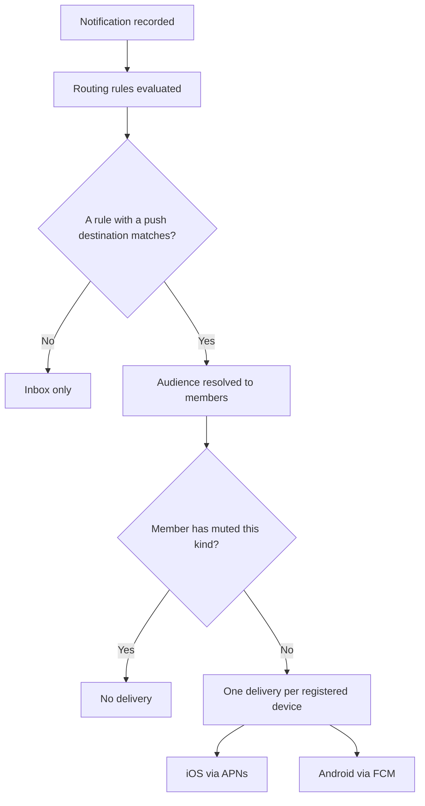

The Ankra mobile app can receive notifications on iOS and Android. Nothing arrives by default: a notification reaches a phone only when a **routing rule** sends it to a push audience, exactly as it would send one to a webhook.

## Registering a phone

Devices add themselves. Sign in to the app, accept the notification prompt, and the device appears under **Profile → Notifications → Push notifications**. There is no "add device" action, and no credential to copy: the app holds none of its own. It hands the token to the signed-in page, and the page registers it against your session — which is why a device always belongs to exactly the member who signed in on it, and why signing in on a shared phone re-homes that device to you.

Each row shows the platform, OS and app version, and the last characters of the token, which is what tells two of your own phones apart. From the row you can:

- **Mute one device** without signing out of it, or removing it.
- **Remove it**, which stops delivery to that install entirely.
- **Send test**, which delivers straight to that device without consulting any routing rule. This is the one path that bypasses routing, so it proves the device and the credentials work even before a rule exists.

You manage only your own devices. There is no organisation-wide view of who has push enabled, and an administrator cannot revoke someone else's phone.

## Sending to phones

Under **Alerting** → **Destinations** → **Routing rules**, a rule's destination type can be **Push notification** instead of a webhook. The audience decides whose phones:

| Audience | Reaches |
|---|---|
| All cluster members | Everyone who is a member of the cluster the notification is about |
| Organisation admins | Every administrator of the organisation |

A rule filters on kind and severity exactly as any other routing rule does, so "every critical" and "only `bastion_offline`" are both a single rule. The same de-duplication and mute rules apply: a member who has snoozed a kind stays snoozed on their phone, and a notification addressed to one member reaches only that member's devices.

<Note>
Start narrower than you think you want. A rule for every critical notification is a realistic dozen or more pushes a day on a busy fleet. One or two kinds for a week tells you what the volume actually feels like.
</Note>

## What decides whether a notification interrupts

Severity, and it behaves differently on each platform because the platforms differ.

| Severity | iOS | Android |
|---|---|---|
| Critical | Sound, time-sensitive — breaks through Focus | Sound, high priority — delivered immediately, even in Doze |
| Warning | Sound, active | Sound, default importance |
| Info | Silent, passive — will not light the screen | Delivered quietly |

On Android the importance comes from the **notification channel**, not from the message. The app creates three — *Critical alerts*, *Warnings* and *Updates* — and Android hands them to you afterwards: change *Warnings* to silent in system settings and it stays silent, through app updates. Ankra cannot override that, which is the point.

Tapping a notification opens the page it is about, on both platforms.

## When a device registers but nothing arrives

The device row is proof that registration worked. It is not proof that delivery will. In order of likelihood:

- **No routing rule sends anything to push.** This is by far the most common answer, and *Send test* will still work, which is exactly why it is confusing. Check **Routing rules** for a rule with a push destination.
- **You have muted the kind.** Mutes are applied before delivery is queued, so a snoozed kind is silent everywhere at once.
- **The row says `sandbox`.** That device is running a development build, whose token belongs to Apple's sandbox APNs host. The two token spaces are separate, and a production notification sent to a sandbox token is silently undelivered. A TestFlight or App Store build registers as production.
- **The row carries a reason.** When Apple or Google reports that a token is dead — the app was removed, or the token rotated — Ankra disables that device and records why, so a stale install is visible rather than a silent gap. Signing in again registers a fresh token.

## What the platform needs configured

Push delivery is a deployment-level capability, and the two platforms are independent: configuring one does not require the other, and a device whose platform has no credential fails only its own deliveries.

| Platform | Secret | Contents |
|---|---|---|
| iOS | `ankra-cluster-apns-secret` | An APNs provider key (`.p8`), its key id, and the team id |
| Android | `ankra-cluster-fcm-secret` | A Firebase service account for the project the app is registered in |

Absent either secret, that platform's deliveries fail with an explanatory status and every other destination — webhook, Slack, Teams — keeps working.
