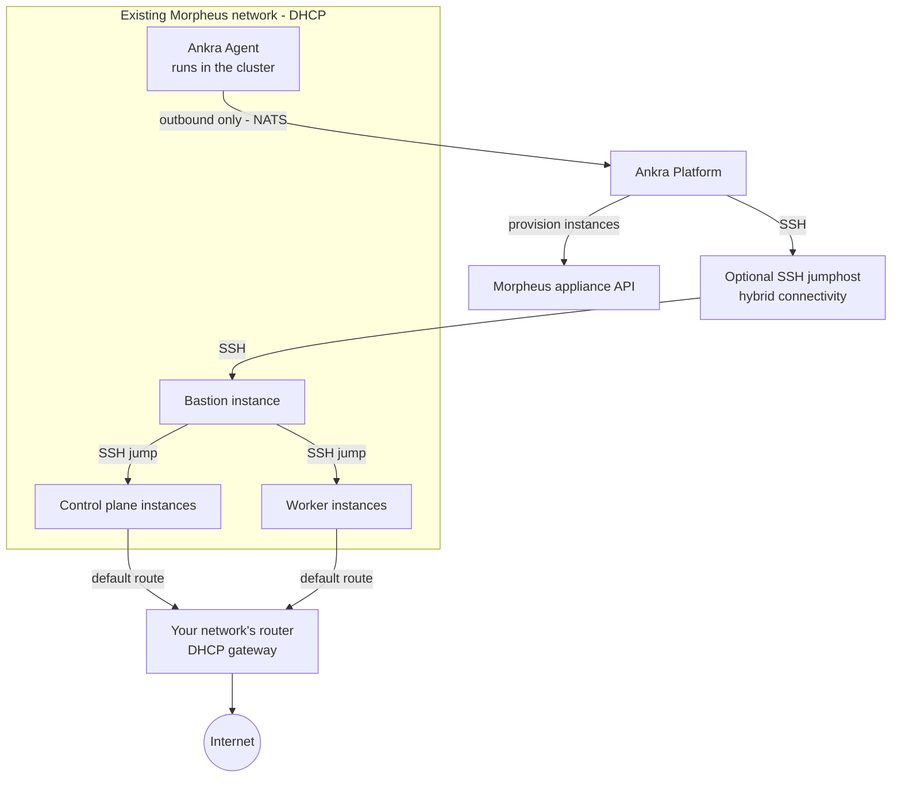

Ankra supports provisioning fully managed Kubernetes clusters through [Morpheus](https://morpheusdata.com/). Ankra provisions instances via your Morpheus appliance using the groups, clouds, networks, virtual images, and service plans you already manage there - then installs Kubernetes and manages the full cluster lifecycle: node groups, scaling, upgrades, and deprovisioning.

<Warning>
**Closed beta.** Morpheus cluster provisioning is in closed beta. The workflow is stable but the surface may still change, and it is enabled per organisation on request. [Contact support](/platform/support) to have it turned on for your organisation.
</Warning>

---

## Prerequisites

Before creating a Morpheus cluster, you need two credentials:

<CardGroup cols={2}>
  <Card title="Morpheus API Credential" icon="key">
    The Morpheus appliance URL and a long-lived API access token. See [Morpheus Credentials](/platform/credentials/morpheus).
  </Card>
  <Card title="SSH Key Credential" icon="lock">
    An SSH public key for instance access. You can provide your own or let Ankra generate one. See [SSH Key Credentials](/platform/credentials/ssh-key).
  </Card>
</CardGroup>

Your Morpheus environment must also provide:

- **A group and cloud** the API token can provision into.
- **A network with DHCP.** Cluster instances get their addresses from DHCP on the network you select.
- **An instance layout** based on a Linux cloud image, used for all cluster instances. You can optionally pin a specific **virtual image**.
- **Service plans** to size the bastion, control plane, and worker instances.
- **API reachability.** The Morpheus API must be reachable from Ankra either directly or through an [SSH jumphost](#hybrid-connectivity-ssh-jumphost).

---

## Hybrid Connectivity (SSH Jumphost)

If the Morpheus appliance and the instance network are not directly reachable from Ankra, attach an **SSH jumphost** (host, port, username, and private key) to your Morpheus credential. Ankra then tunnels both the Morpheus API calls and the SSH connections to your cluster nodes through the jumphost.

If your Morpheus appliance uses a self-signed certificate, enable the **TLS insecure** toggle (`tls_insecure`) on the credential.

Both options are configured on the credential - see [Morpheus Credentials](/platform/credentials/morpheus).

---

## Creating a Morpheus Cluster

### Via the Platform UI

<Steps>
  <Step title="Navigate to Clusters">
    Go to **Clusters** in the Ankra dashboard and click **Create Cluster**.
  </Step>
  <Step title="Select Morpheus">
    Choose **Morpheus** as the provider.
  </Step>
  <Step title="Select Credentials">
    Pick your Morpheus API credential and SSH key credential from the dropdowns. You can also create new credentials directly from the wizard.
  </Step>
  <Step title="Choose Placement">
    Select the Morpheus **group**, **cloud**, and **network** for the cluster instances, and the **instance layout** (based on a Linux cloud image) they are provisioned from. The network must provide DHCP.
  </Step>
  <Step title="Configure Nodes">
    Set your cluster topology using Morpheus service plans as instance types:
    - **Bastion** - Service plan for the SSH bastion instance
    - **Control Plane** - Count (1 or 3) and service plan
    - **Workers** - Count and service plan

    The wizard shows the vCPUs and memory of each service plan. Cost estimates are not available for Morpheus clusters.
  </Step>
  <Step title="Choose Distribution">
    Pick the Kubernetes distribution:
 **k3s** Lightweight Kubernetes with a user-selectable CNI (default).
 **kubeadm** Vanilla upstream Kubernetes bootstrapped with `kubeadm` and containerd. kubeadm clusters always use Cilium CNI and optionally support an external etcd topology with dedicated etcd instances.

    See [Kubernetes Distribution](#kubernetes-distribution) for details.
  </Step>
  <Step title="Create & Track Progress">
    Click **Create** to start provisioning. A live progress view tracks credential setup, SSH key deployment, bastion provisioning, instance creation, Kubernetes installation (k3s or kubeadm), and Ankra Agent setup. The cluster appears with an **offline** state until provisioning completes, then transitions to **online**.
  </Step>
</Steps>

### Via the API

<Note>
Morpheus clusters are managed from the **portal or API** during the closed beta - the `ankra` CLI does not yet include Morpheus commands. Create the [Morpheus credential](/platform/credentials/morpheus) and [SSH key credential](/platform/credentials/ssh-key) from the portal first.
</Note>

```bash
curl -X POST https://platform.ankra.app/api/v1/clusters/morpheus \
  -H "Authorization: Bearer $ANKRA_API_TOKEN" \
  -H "Content-Type: application/json" \
  -d '{
    "name": "my-cluster",
    "credential_id": "<morpheus-credential-id>",
    "ssh_key_credential_id": "<ssh-key-credential-id>",
    "group_id": 1,
    "cloud_id": 1,
    "network_id": 2,
    "layout_id": 42,
    "bastion_plan_id": 101,
    "control_plane_count": 1,
    "control_plane_plan_id": 102,
    "node_groups": [
      {"name": "default", "plan_id": 102, "count": 2}
    ],
    "distribution": "k3s"
  }'
```

---

## Cluster Configuration Options

All Morpheus IDs are the numeric IDs from your appliance - discover them in the portal's create wizard or with the catalog API routes (groups, clouds, networks, layouts, plans).

| Parameter | Default | Description |
|-----------|---------|-------------|
| `name` | *required* | Unique cluster name |
| `credential_id` | *required* | Morpheus API credential ID |
| `ssh_key_credential_id` | *required* | SSH key credential ID |
| `group_id` | *required* | Numeric ID of the Morpheus group to provision into |
| `cloud_id` | *required* | Numeric ID of the Morpheus cloud to provision into |
| `network_id` | *required* | Numeric ID of the Morpheus network the instances attach to (must provide DHCP) |
| `layout_id` | *required* | Numeric ID of the instance layout the instances are provisioned from |
| `virtual_image_id` | | Numeric ID of a virtual image to pin (optional; the layout's image is used otherwise) |
| `bastion_plan_id` | *required* | Numeric service plan ID for the bastion instance |
| `control_plane_count` | `1` | Number of control plane nodes (1, 3, or 5) |
| `control_plane_plan_id` | *required* | Numeric service plan ID for control planes |
| `worker_count` | `1` | Number of worker nodes (legacy, use `node_groups` instead) |
| `worker_plan_id` | *required* | Numeric service plan ID for workers |
| `node_groups` | | Array of node group definitions sized by numeric `plan_id` (see [Node Groups](#node-groups)) |
| `distribution` | `k3s` | Kubernetes distribution (`k3s` or `kubeadm`) |
| `kubernetes_version` | *latest stable* | Kubernetes version (optional) |
| `cni` | `flannel` (k3s) | CNI plugin. kubeadm clusters always use `cilium` |
| `etcd_topology` | `stacked` | kubeadm only. `stacked` (etcd on control planes) or `external` (dedicated etcd instances) |
| `etcd_node_count` | `3` | kubeadm `external` topology only. Number of dedicated etcd instances (3 or 5) |
| `etcd_plan_id` | | kubeadm `external` topology only. Numeric service plan ID for dedicated etcd nodes |

<Note>
Cost estimates are not available for Morpheus clusters - neither in the creation wizard nor in [Cloud Cost](/platform/cloud-cost).
</Note>

### Networking

Ankra does not create networks in Morpheus. You select an existing network at creation, and all cluster instances receive their IP addresses via DHCP on that network. Make sure DHCP is available before creating the cluster.

---

## Kubernetes Distribution

Morpheus clusters can be provisioned with either **k3s** (default) or **kubeadm**.

| | k3s | kubeadm |
|---|-----|---------|
| Kubernetes | Lightweight, single-binary distribution | Vanilla upstream Kubernetes |
| CNI | User-selectable (Flannel default) | Cilium (fixed, cannot be changed after creation) |
| etcd | Embedded | `stacked` (on control planes) or `external` (dedicated instances) |
| Version format | `v1.35.1+k3s1` | `v1.31.0` (plain upstream tag) |

<Note>
kubeadm clusters always use Cilium CNI (eBPF-based networking, L7 policies, Hubble observability). The CNI cannot be changed after creation.
</Note>

### External etcd topology (kubeadm)

By default kubeadm runs etcd **stacked** on the control plane nodes. For larger clusters you can run etcd on dedicated instances by setting `etcd_topology` to `external` together with `etcd_node_count` and `etcd_plan_id`.

---

## Node Groups

Node groups let you organize worker nodes into logical groups with independent service plans, counts, labels, and taints. Manage node groups from **Settings** > **Nodes** in the dashboard, or via the API.

### Node Group API Reference

| Endpoint | Method | Description |
|----------|--------|-------------|
| `/api/v1/clusters/morpheus/{id}/node-groups` | GET | List all node groups |
| `/api/v1/clusters/morpheus/{id}/node-groups` | POST | Add a node group |
| `/api/v1/clusters/morpheus/{id}/node-groups/{name}/scale` | PUT | Scale a node group (0-100) |
| `/api/v1/clusters/morpheus/{id}/node-groups/{name}/instance-type` | PUT | Change service plan |
| `/api/v1/clusters/morpheus/{id}/node-groups/{name}/labels` | PUT | Update labels |
| `/api/v1/clusters/morpheus/{id}/node-groups/{name}/taints` | PUT | Update taints |
| `/api/v1/clusters/morpheus/{id}/node-groups/{name}` | DELETE | Delete a node group |

For detailed usage examples, see [Hetzner Node Groups](/guides/hetzner-clusters#node-groups) - the API is identical across all providers.

---

## Resizing the Bastion

Resize the bastion without recreating the cluster - Ankra powers it off, resizes it, and powers it back on. This is available from cluster **Settings** > **Nodes** in the dashboard or via the API; the `ankra-cli` does not yet have a Morpheus command tree.

```bash
curl -X PUT https://platform.ankra.app/api/v1/clusters/morpheus/<cluster_id>/bastion/instance-type \
  -H "Authorization: Bearer $ANKRA_API_TOKEN" \
  -H "Content-Type: application/json" \
  -d '{"instance_type": "<service-plan-name>"}'
```

See [Resizing the Bastion or Gateway](/guides/hetzner-clusters#resizing-the-bastion-or-gateway) for the accept/wait contract - identical across providers.

<Note>
Restarting individual nodes is not yet available for Morpheus clusters.
</Note>

---

## Legacy Worker Scaling

The legacy `scale-workers` and `worker-count` endpoints operate on all workers as a single pool.

```bash
curl https://platform.ankra.app/api/v1/clusters/morpheus/<cluster_id>/worker-count \
  -H "Authorization: Bearer $ANKRA_API_TOKEN"

curl -X POST https://platform.ankra.app/api/v1/clusters/morpheus/<cluster_id>/scale-workers \
  -H "Authorization: Bearer $ANKRA_API_TOKEN" \
  -H "Content-Type: application/json" \
  -d '{"worker_count": 4}'
```

<Note>
Prefer using [Node Groups](#node-groups) for more granular control.
</Note>

---

## Upgrading Kubernetes Version

You can upgrade the Kubernetes version on all nodes in a Morpheus cluster. Upgrades are applied to control plane nodes first, then workers. Both k3s and kubeadm clusters are supported.

<Warning>
- Both k3s and kubeadm clusters are supported for version upgrades, including kubeadm clusters with an **external** etcd topology: the dedicated etcd members are upgraded first, one at a time, each saving a pre-upgrade snapshot before its static pod rolls to the etcd image matching the target Kubernetes version.
- Use the matching version format for the target: `v1.35.1+k3s1` for k3s, or a plain `v1.31.0` upstream tag for kubeadm.
- Downgrades are not supported - downgrades require an etcd snapshot restore.
- You can only upgrade one minor version at a time (e.g., v1.33.x to v1.34.x, not v1.33.x to v1.35.x).
- The cluster must be online with no active operations.
</Warning>

### Check Current Version

```bash
curl https://platform.ankra.app/api/v1/clusters/morpheus/<cluster_id>/k8s-version \
  -H "Authorization: Bearer $ANKRA_API_TOKEN"
```

### Upgrade Version

```bash
curl -X POST https://platform.ankra.app/api/v1/clusters/morpheus/<cluster_id>/upgrade-k8s-version \
  -H "Authorization: Bearer $ANKRA_API_TOKEN" \
  -H "Content-Type: application/json" \
  -d '{"target_version": "v1.35.1+k3s1"}'
```

For a kubeadm cluster, use a plain upstream tag instead (for example `"target_version": "v1.31.0"`).

---

## Deprovisioning

Deprovisioning deletes all instances Ankra created through Morpheus (bastion, control planes, workers, and dedicated etcd instances if any) and removes the cluster from Ankra. Your Morpheus groups, clouds, networks, and virtual images are left untouched.

<Warning>
This action is irreversible. All data on the cluster will be permanently deleted.
</Warning>

```bash
curl -X DELETE https://platform.ankra.app/api/v1/clusters/morpheus/<cluster_id> \
  -H "Authorization: Bearer $ANKRA_API_TOKEN"
```

---

## Architecture

A Morpheus cluster provisions the following infrastructure:

| Component | Description |
|-----------|-------------|
| **Bastion Instance** | Jump server for secure SSH access to cluster nodes |
| **Control Plane(s)** | Kubernetes control plane instances |
| **Worker(s)** | Kubernetes worker instances organized in [node groups](#node-groups) |
| **etcd Node(s)** | Dedicated etcd instances, only for kubeadm clusters with an `external` [etcd topology](#external-etcd-topology-kubeadm) |
| **SSH Keys** | Deployed to all instances for access |



All instances are provisioned through your Morpheus appliance into the group, cloud, and network you selected, booting from the chosen virtual image with DHCP addressing. Ankra creates no network infrastructure: the instances attach to an existing Morpheus network, and routing and internet egress follow that network's own DHCP-provided gateway.

The bastion instance provides the only SSH access point Ankra uses to reach the cluster nodes - it carries no workload or egress traffic. When an [SSH jumphost](#hybrid-connectivity-ssh-jumphost) is configured, Ankra reaches both the Morpheus API and the bastion through the jumphost (without one, Ankra connects to the bastion directly).

<Note>
Morpheus clusters do not include a cloud controller manager or load balancer integration - `external_cloud_provider` is not supported. Kubernetes `LoadBalancer` services are not provisioned automatically; expose workloads with `NodePort` services, an ingress controller, or a load balancer solution you deploy yourself.
</Note>

---

## Troubleshooting

### Common Issues

| Issue | Solution |
|-------|----------|
| Morpheus API unreachable from Ankra | Attach an [SSH jumphost](#hybrid-connectivity-ssh-jumphost) to the credential - Ankra tunnels API calls and node SSH through it |
| TLS certificate errors (self-signed) | Enable the **TLS insecure** toggle (`tls_insecure`) on the Morpheus credential |
| Instances never get an IP address | The selected network must provide DHCP - Ankra does not manage IP allocation. Verify a DHCP server answers on that network |
| Cluster stuck in provisioning | Check that the access token can provision into the selected group and cloud, and that the cloud has free capacity |
| Instance creation fails | Verify the virtual image is a Linux cloud image available to the selected cloud, and the service plan is valid for it |
| LoadBalancer service stuck in `Pending` | Morpheus clusters have no cloud controller manager - use `NodePort`, ingress, or your own load balancer |
| No cost estimates shown | Expected - cost estimation is not supported for Morpheus clusters |
