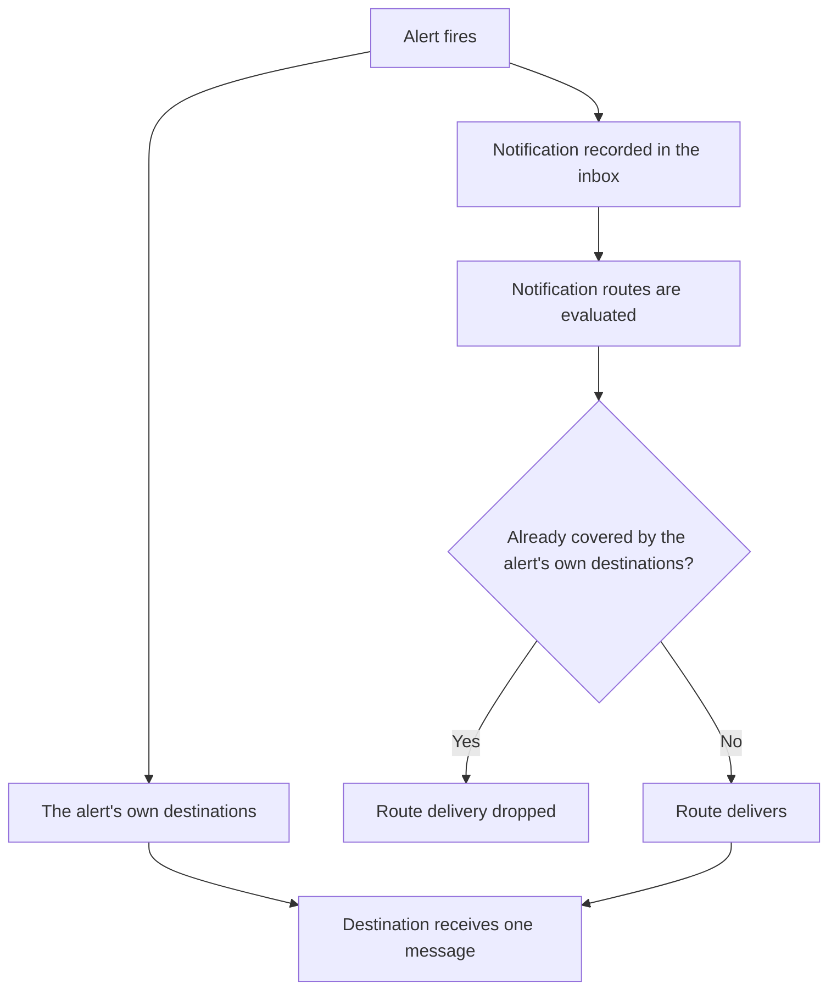

A notification can reach a destination by two independent paths:

- **An alert's own destinations.** On an alert rule, **Notifications** → **Destinations** attaches destinations directly. When the alert fires, Ankra delivers to every destination on that list.
- **A notification route.** Under **Alerting** → **Destinations** → **Routing rules**, an organisation-wide rule matches notifications by kind, severity, cluster, and source, and sends them to one destination. Routes cover every notification kind, not only alerts.

Both paths can point at the same destination at the same time. That is a supported configuration, and it delivers once.



## One delivery per destination

**A notification is delivered at most once per destination.** This is a guarantee, not a timing accident.

Before it queues anything, Ankra subtracts the destinations the alert's own list already covers from the destinations the routing rules resolved. A destination that both paths point at is queued once, by the alert.

Two consequences follow, and both matter when you are deciding how to configure routing:

- **You do not need to detach destinations from your alerts** to avoid duplicates, and you do not need to delete the routing rule either. Keeping both is safe.
- **The subtraction only runs one way.** Routing rules are netted against the alert's destinations. The alert's own destinations are never netted against anything, so no routing rule - include or exclude, at any priority - can add to them or take them away.

The netting happens before anything is queued, so a de-duplicated rule never produces a delivery at all. The one case where a destination can see the same firing twice is if the alert's trigger record has already been removed by the time routing runs: Ankra then cannot tell what the alert covered, and delivers rather than risk staying silent. It errs towards a duplicate, never towards a missed alert.

## How a rule matches

A routing rule sets any combination of four filters. Every filter it sets must match; a filter it leaves empty matches everything.

| Filter | Empty means | Matches when |
|---|---|---|
| Kind | All kinds | The notification's kind is in the rule's kind list (or, for a negated list, is not in it) |
| Severity | All severities | The notification's severity is exactly the rule's severity |
| Cluster | All clusters | The notification is about that cluster |
| Source | All sources | The notification's source id is exactly the rule's source id - for alert firings, the alert id |

A rule with no filters at all matches every notification. Disabled rules are skipped entirely.

## Kinds: one, several, or everything except

**Kind** takes a list, and the list can be inverted:

- **All kinds** - no kind filter.
- **A list of kinds** - "Operation failed and Reconciliation failing, nothing else" is one rule, not two.
- **All except a list of kinds** - switch the rule to **All kinds except** and name the kinds to leave out. "Route everything except Alert firing to this channel, because alerts already have their own destinations" is one rule, not ten.

Negating a list is not the same as an Exclude rule. A negated list changes which notifications the rule *matches*; Exclude changes what the rule *does* when it matches. See the next section.

<Note>
The API accepts both spellings. `kinds` is the list, and `kinds_negated: true` inverts it. The older single-value `kind` field still works, and a rule whose list is exactly one kind continues to report that kind in `kind`, so existing API clients and scripts keep working unchanged.
</Note>

## Evaluation order

Rules are evaluated in ascending **priority** - 10 runs before 100. Rules sharing a priority are broken by **specificity**: the rule that names more values runs first.

Specificity counts the filters that name a value:

| Filter | Adds specificity |
|---|---|
| A kind, or a list of kinds | Yes |
| **All kinds except …** | No - it names what the rule skips, not what it covers |
| Severity | Yes |
| Cluster | Yes |
| Source | Yes |

The walk keeps a running set of destinations, starting empty. Each matching rule adds to it or removes from it, and the set that survives is what gets delivered.

## Include and Exclude

| Mode | Effect when the rule matches |
|---|---|
| Include | Adds its destination to the running set |
| Exclude | Removes its destination from the running set - **if an earlier rule put it there** |

**Exclude is not mute.** An Exclude rule can only take back what a higher-precedence rule in the same walk already added. An Exclude rule that runs before anything has added its destination removes nothing.

**Exclude never touches an alert's own destinations.** The walk described here resolves routing rules only. An alert's own destinations are delivered by the alert itself and are not in the running set, so no Exclude rule can remove them - whatever its priority, and whether or not it stops the walk.

Worked example, for a rule at priority 10 that matches everything, is set to Exclude, and has **Stop on match** on:

| What happens | Result |
|---|---|
| The walk starts, running set is empty | - |
| The Exclude rule matches and tries to remove its destination | Nothing to remove; the set stays empty |
| Stop on match halts the walk | Lower-priority Include rules are never evaluated |
| Routing rules deliver | Nothing |
| The alert's own destinations deliver | Unaffected - still delivered |
| The home channel fires | No - a rule matched, so this is a deliberate mute, not an unhandled event |

So that rule is a global mute for route-driven delivery, and only for route-driven delivery. If you want to silence an alert entirely, remove its destinations on the alert itself or disable the alert.

## Stop on match

**Stop on match** halts the walk at the first matching rule that carries it. Rules with a lower priority are never evaluated, whatever their mode. Combined with priority it gives you a first-match-wins rule: put the specific rule at a low priority with Stop on match, and let the catch-all sit at priority 100.

Stop on match does not by itself deliver or suppress anything - it only ends the walk. The running set at that moment is what gets delivered.

## The home channel fallback

If your organisation has a [home channel](/guides/webhooks#home-channel) and a critical or warning notification matches **no** routing rule at all, Ankra posts it to the home channel so nothing important is lost silently.

The fallback is deliberately narrow:

- It fires only when no rule matched. A rule that matched and netted the destinations to nothing is a mute, and the home channel stays quiet.
- It never fires for informational notifications.
- It never fires for an alert firing that already delivers to the alert's own destinations.

## Preview what would be delivered

Rather than reasoning through the walk, ask Ankra. **Preview** on the Routing rules page evaluates a hypothetical notification against your organisation's rules and lists the destinations it would reach, the destinations it would not, and the reason for each - including which rules matched, which were skipped by a Stop on match, and which route deliveries were dropped because an alert's own destination already covers them.

The preview is a dry run. It delivers nothing and changes nothing.

<CodeGroup>

```bash CLI
ankra alerts routes preview --kind alert_trigger_fired --severity critical
ankra alerts routes preview --kind alert_trigger_fired --severity critical --alert-id <alert-id>
ankra alerts routes preview --kind gitops_sync_failed --severity warning --cluster-id <cluster-id> -o json
```

```bash cURL
curl -X POST https://platform.ankra.app/api/v1/org/notifications/routes/preview \
  -H "Authorization: Bearer <your-token>" \
  -H "Content-Type: application/json" \
  -d '{"kind": "alert_trigger_fired", "severity": "critical", "alert_id": "<alert-id>"}'
```

</CodeGroup>

Pass `--alert-id` (or `alert_id`) whenever you are previewing an alert firing: without it the preview cannot know which destinations the alert itself covers, and will show the route deliveries that de-duplication would drop.

## Managing rules from the CLI

<CodeGroup>

```bash CLI
ankra alerts routes list
ankra alerts routes create --destination-id <destination-id> --kinds execution_failed,resource_reconcile_failed
ankra alerts routes create --destination-id <destination-id> --exclude-kinds alert_trigger_fired
ankra alerts routes update <route-id> --priority 10 --stop-on-match
ankra alerts routes preview --kind execution_failed --severity critical
ankra alerts routes delete <route-id>
```

</CodeGroup>

`--kinds` takes a comma-separated list and `--exclude-kinds` takes the same list negated; the two are mutually exclusive. The single-value `--kind` flag still works and is equivalent to `--kinds` with one entry.

## Related

<CardGroup cols={2}>
  <Card title="Alerts" icon="bell" href="/guides/alerts">
    Alert rules, conditions, and the destinations an alert notifies directly.
  </Card>
  <Card title="Webhooks" icon="webhook" href="/guides/webhooks">
    Destinations, payload templates, and the organisation home channel.
  </Card>
</CardGroup>
