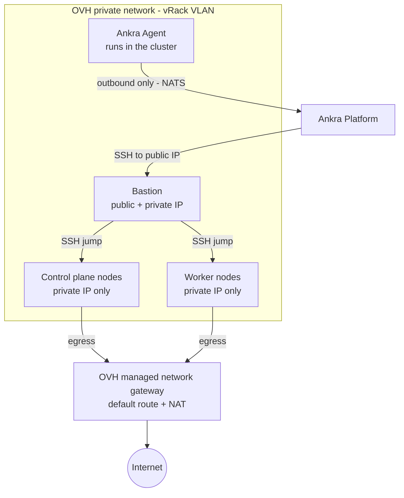

Ankra supports provisioning fully managed Kubernetes clusters on [OVH Cloud](https://www.ovhcloud.com/). You can create clusters with configurable control planes, workers, and networking - then scale workers up or down as needed.

---

## Prerequisites

Before creating an OVH cluster, you need two credentials:

<CardGroup cols={2}>
  <Card title="OVH API Credential" icon="key">
    OVH Cloud API credentials (application key, application secret, consumer key, and project ID). See [OVH API Credentials](/platform/credentials/ovh).
  </Card>
  <Card title="SSH Key Credential" icon="lock">
    An SSH public key for server access. You can provide your own or let Ankra generate one. See [SSH Key Credentials](/platform/credentials/ssh-key).
  </Card>
</CardGroup>

---

## Creating an OVH Cluster

### Via the Platform UI

A guided wizard walks you through creating an OVH cluster - select credentials, pick a region, choose instance flavors (general purpose, CPU-optimized, or RAM-optimized), set control plane and worker counts, and launch.

<Steps>
  <Step title="Navigate to Clusters">
    Go to **Clusters** in the Ankra dashboard and click **Create Cluster**.
  </Step>
  <Step title="Select OVH Cloud">
    Choose **OVH Cloud** as the provider.
  </Step>
  <Step title="Select Credentials">
    Pick your OVH API credential and SSH key credential from the dropdowns. You can also create new credentials directly from the wizard.
  </Step>
  <Step title="Choose Region">
    Select an OVH Cloud region (e.g., Gravelines, Strasbourg, Beauharnois, Warsaw, London, Frankfurt). Each region shows the location and country.
  </Step>
  <Step title="Configure Nodes">
    Set your cluster topology:
    - **Bastion** - instance flavor for the SSH bastion (e.g., `b2-7`)
    - **Control Plane** - count and flavor (e.g., 1x `b2-15`)
    - **Workers** - count and flavor (e.g., 2x `b2-15`)

    The wizard shows vCPUs, RAM, disk, and hourly cost for each flavor to help you choose.
  </Step>
  <Step title="Create & Track Progress">
    Click **Create** to start provisioning. A live progress view tracks every step - network creation, bastion setup, control plane provisioning, worker provisioning, k3s installation, and Ankra Agent setup. The cluster appears with an **offline** state until provisioning completes, then transitions to **online**.
  </Step>
</Steps>

### Managing from the Dashboard

Once your OVH cluster is online, you can manage it directly from the Ankra dashboard:

- **Scale workers** - go to **Cluster Settings** → **General** to scale worker nodes up or down
- **Upgrade Kubernetes** - upgrade the k3s version from cluster settings
- **Deprovision** - delete the cluster and all OVH resources from the **Danger Zone** in cluster settings

### Via the CLI

```bash
# Create credentials first
ankra credentials ovh create --name my-ovh-cred --project-id <project-id>
# You will be prompted for application key, application secret, and consumer key

ankra credentials ovh ssh-key create --name my-ssh-key --generate

# Create the cluster
ankra cluster ovh create \
  --name my-cluster \
  --credential-id <ovh-credential-id> \
  --ssh-key-credential-id <ssh-key-credential-id> \
  --region GRA7 \
  --control-plane-count 1 \
  --control-plane-flavor-id b2-15 \
  --worker-count 2 \
  --worker-flavor-id b2-15
```

### Via the API

```bash
curl -X POST https://platform.ankra.app/api/v1/clusters/ovh \
  -H "Authorization: Bearer $ANKRA_API_TOKEN" \
  -H "Content-Type: application/json" \
  -d '{
    "name": "my-cluster",
    "credential_id": "<ovh-credential-id>",
    "ssh_key_credential_id": "<ssh-key-credential-id>",
    "region": "GRA7",
    "control_plane_count": 1,
    "control_plane_flavor_id": "b2-15",
    "worker_count": 2,
    "worker_flavor_id": "b2-15",
    "distribution": "k3s"
  }'
```

Every configuration parameter, the region list, and instance flavors are in the [OVH Reference](/reference/ovh).

---

## Node Groups

Node groups let you organize worker nodes into logical groups with independent instance flavors, counts, labels, and taints. Each group can be scaled, re-flavored, and configured independently.

### Via the Platform UI

Navigate to cluster **Settings** > **Nodes** to manage node groups. From this tab you can:

- View all node groups with their instance flavor, count, labels, and taints
- Add new node groups with a name, instance flavor, count, and optional labels/taints
- Scale individual groups up or down (0–100 nodes)
- Upgrade the instance flavor (upgrade only - see [Instance Flavor Changes](#instance-flavor-changes))
- Edit labels and taints per group
- Delete a node group and all its nodes

### List Node Groups

<CodeGroup>

```bash CLI
ankra cluster ovh node-group list <cluster_id>
```

```bash cURL
curl https://platform.ankra.app/api/v1/clusters/ovh/<cluster_id>/node-groups \
  -H "Authorization: Bearer $ANKRA_API_TOKEN"
```

</CodeGroup>

Response:
```json
{
  "node_groups": [
    {
      "name": "default",
      "instance_type": "b2-15",
      "count": 2,
      "min": 0,
      "max": 100,
      "labels": {},
      "taints": []
    }
  ]
}
```

### Add a Node Group

From the CLI, a node group can be created with its Kubernetes labels and taints in one step:

<CodeGroup>

```bash CLI
ankra cluster ovh node-group add <cluster_id> \
  --name gpu-workers \
  --instance-type b2-30 \
  --count 2 \
  --labels workload=gpu \
  --taints dedicated=gpu:NoSchedule
```

```bash cURL
curl -X POST https://platform.ankra.app/api/v1/clusters/ovh/<cluster_id>/node-groups \
  -H "Authorization: Bearer $ANKRA_API_TOKEN" \
  -H "Content-Type: application/json" \
  -d '{
    "name": "gpu-workers",
    "instance_type": "b2-30",
    "count": 2,
    "labels": {"workload": "gpu"},
    "taints": [{"key": "dedicated", "value": "gpu", "effect": "NoSchedule"}]
  }'
```

</CodeGroup>

### Scale a Node Group

<CodeGroup>

```bash CLI
ankra cluster ovh node-group scale <cluster_id> default 4
```

```bash cURL
curl -X PUT https://platform.ankra.app/api/v1/clusters/ovh/<cluster_id>/node-groups/default/scale \
  -H "Authorization: Bearer $ANKRA_API_TOKEN" \
  -H "Content-Type: application/json" \
  -d '{"count": 4}'
```

</CodeGroup>

Node groups can be scaled to 0 nodes. This keeps the group definition but removes all instances.

### Instance Flavor Changes

<Warning>
Instance flavor upgrades are one-way - you cannot downgrade a node group to a smaller flavor. To use a smaller flavor, create a new node group with the desired flavor and delete the old one.
</Warning>

<CodeGroup>

```bash CLI
ankra cluster ovh node-group upgrade <cluster_id> default b2-30
```

```bash cURL
curl -X PUT https://platform.ankra.app/api/v1/clusters/ovh/<cluster_id>/node-groups/default/instance-type \
  -H "Authorization: Bearer $ANKRA_API_TOKEN" \
  -H "Content-Type: application/json" \
  -d '{"instance_type": "b2-30"}'
```

</CodeGroup>

Each node is powered off, resized, and powered back on. This causes brief downtime for workloads on those nodes.

### Update Labels and Taints

<CodeGroup>

```bash CLI
ankra cluster ovh node-group labels <cluster_id> default --labels env=production,tier=backend
ankra cluster ovh node-group taints <cluster_id> default --taints dedicated=ml:NoSchedule
```

```bash cURL
curl -X PUT https://platform.ankra.app/api/v1/clusters/ovh/<cluster_id>/node-groups/default/labels \
  -H "Authorization: Bearer $ANKRA_API_TOKEN" \
  -H "Content-Type: application/json" \
  -d '{"labels": {"env": "production", "tier": "backend"}}'

curl -X PUT https://platform.ankra.app/api/v1/clusters/ovh/<cluster_id>/node-groups/default/taints \
  -H "Authorization: Bearer $ANKRA_API_TOKEN" \
  -H "Content-Type: application/json" \
  -d '{"taints": [{"key": "dedicated", "value": "ml", "effect": "NoSchedule"}]}'
```

</CodeGroup>

Labels and taints are applied to every node in the group; passing `--clear` (or an empty value via the API) removes them, and a taint effect defaults to `NoSchedule`.

### Delete a Node Group

<CodeGroup>

```bash CLI
ankra cluster ovh node-group delete <cluster_id> gpu-workers
```

```bash cURL
curl -X DELETE https://platform.ankra.app/api/v1/clusters/ovh/<cluster_id>/node-groups/gpu-workers \
  -H "Authorization: Bearer $ANKRA_API_TOKEN"
```

</CodeGroup>

<Warning>
Deleting a node group removes all its instances. Workloads running on those nodes will be evicted.
</Warning>

### Node Group API Reference

All node-group operations are also available via the REST API - see the [OVH Node Group API](/reference/ovh#node-group-api-reference).

---

## Legacy Worker Scaling

The legacy `scale-workers` and `worker-count` endpoints still work for backward compatibility.

<CodeGroup>

```bash CLI
ankra cluster ovh workers <cluster_id>
ankra cluster ovh scale <cluster_id> 4
```

```bash cURL
curl https://platform.ankra.app/api/v1/clusters/ovh/<cluster_id>/worker-count \
  -H "Authorization: Bearer $ANKRA_API_TOKEN"

curl -X POST https://platform.ankra.app/api/v1/clusters/ovh/<cluster_id>/scale-workers \
  -H "Authorization: Bearer $ANKRA_API_TOKEN" \
  -H "Content-Type: application/json" \
  -d '{"worker_count": 4}'
```

</CodeGroup>

<Note>
For new clusters, prefer using [Node Groups](#node-groups) for more granular control.
</Note>

---

## Upgrading Kubernetes Version

You can upgrade the Kubernetes (k3s) version on all nodes in an OVH cluster. Upgrades are applied to control plane nodes first, then workers.

<Warning>
- Only k3s clusters are supported for version upgrades.
- Downgrades are not supported - k3s downgrades require an etcd snapshot restore.
- You can only upgrade one minor version at a time (e.g., v1.33.x to v1.34.x, not v1.33.x to v1.35.x).
- The cluster must be online with no active operations.
</Warning>

### Via the Dashboard

Go to your cluster → **Settings** → **General** to see the current k3s version and trigger an upgrade.

### Check Current Version

<CodeGroup>

```bash CLI
ankra cluster ovh k8s-version <cluster_id>
```

```bash cURL
curl https://platform.ankra.app/api/v1/clusters/ovh/<cluster_id>/k8s-version \
  -H "Authorization: Bearer $ANKRA_API_TOKEN"
```

</CodeGroup>

Response:
```json
{
  "current_version": "v1.34.4+k3s1",
  "distribution": "k3s"
}
```

### Upgrade Version

<CodeGroup>

```bash CLI
ankra cluster ovh upgrade <cluster_id> v1.35.1+k3s1
```

```bash cURL
curl -X POST https://platform.ankra.app/api/v1/clusters/ovh/<cluster_id>/upgrade-k8s-version \
  -H "Authorization: Bearer $ANKRA_API_TOKEN" \
  -H "Content-Type: application/json" \
  -d '{"target_version": "v1.35.1+k3s1"}'
```

</CodeGroup>

Response:
```json
{
  "previous_version": "v1.34.4+k3s1",
  "new_version": "v1.35.1+k3s1",
  "nodes_affected": 3
}
```

---

## Stopping and Starting a Cluster

You can stop an OVH cluster to release its compute (node instances, the bastion, and the managed network gateway) while keeping its configuration, networking definition, and SSH keys. Starting the cluster re-provisions the compute and reconciles it back to a running state. This is useful for pausing non-production clusters to save cost.

When starting, use `--scope control_plane` to bring up only the control plane first (for example to inspect or repair it), or `--scope all` (the default) to provision the whole cluster.

<CodeGroup>

```bash CLI
ankra cluster ovh stop <cluster_id>
ankra cluster ovh start <cluster_id>                       # scope defaults to "all"
ankra cluster ovh start <cluster_id> --scope control_plane # control plane only
```

```bash cURL
curl -X POST https://platform.ankra.app/api/v1/clusters/ovh/<cluster_id>/stop \
  -H "Authorization: Bearer $ANKRA_API_TOKEN"

curl -X POST "https://platform.ankra.app/api/v1/clusters/ovh/<cluster_id>/start?scope=all" \
  -H "Authorization: Bearer $ANKRA_API_TOKEN"
```

</CodeGroup>

<Note>
Stop and start are background operations. A start returns `409` if a stop or terminate operation is still running. The private network is preserved while stopped and reused on the next start.
</Note>

---

## SSH Access and Keys

`ankra cluster ovh access-info` prints the bastion and control plane IPs along with ready-to-paste `ssh -J` jump and Kubernetes API port-forward commands, so you can reach nodes behind the bastion without looking up IPs by hand.

<CodeGroup>

```bash CLI
ankra cluster ovh access-info <cluster_id>
```

```bash cURL
curl https://platform.ankra.app/api/v1/clusters/ovh/<cluster_id>/access-info \
  -H "Authorization: Bearer $ANKRA_API_TOKEN"
```

</CodeGroup>

You can also view and replace the SSH key credentials attached to a cluster. Replacing the keys applies on the next reconciliation.

<CodeGroup>

```bash CLI
ankra cluster ovh ssh-keys get <cluster_id>
ankra cluster ovh ssh-keys set <cluster_id> --ssh-key-credential-ids <id>,<id>
```

```bash cURL
curl https://platform.ankra.app/api/v1/clusters/ovh/<cluster_id>/ssh-keys \
  -H "Authorization: Bearer $ANKRA_API_TOKEN"

curl -X PUT https://platform.ankra.app/api/v1/clusters/ovh/<cluster_id>/ssh-keys \
  -H "Authorization: Bearer $ANKRA_API_TOKEN" \
  -H "Content-Type: application/json" \
  -d '{"ssh_key_credential_ids": ["<ssh-key-credential-id>"]}'
```

</CodeGroup>

---

## Managing the Control Plane

Inspect the control plane configuration, then change the node count or instance flavor. OVH control planes support a count of `1` or `3`.

<CodeGroup>

```bash CLI
ankra cluster ovh control-plane get <cluster_id>
ankra cluster ovh control-plane set-count <cluster_id> 3
ankra cluster ovh control-plane set-instance-type <cluster_id> b2-15
```

```bash cURL
curl https://platform.ankra.app/api/v1/clusters/ovh/<cluster_id>/control-plane \
  -H "Authorization: Bearer $ANKRA_API_TOKEN"

curl -X PUT https://platform.ankra.app/api/v1/clusters/ovh/<cluster_id>/control-plane \
  -H "Authorization: Bearer $ANKRA_API_TOKEN" \
  -H "Content-Type: application/json" \
  -d '{"count": 3}'

curl -X PUT https://platform.ankra.app/api/v1/clusters/ovh/<cluster_id>/control-plane/instance-type \
  -H "Authorization: Bearer $ANKRA_API_TOKEN" \
  -H "Content-Type: application/json" \
  -d '{"instance_type": "b2-15"}'
```

</CodeGroup>

<Warning>
Control plane changes require the cluster to be **stopped** first. Changing the count or instance type on a running cluster returns `409` with "The cluster must be stopped" - stop it, apply the change, then start it again.
</Warning>

---

## Inspecting Nodes

List every node in the cluster or fetch the details of a single node by ID. The list includes each node's live status as last reported by the OVH API (`provider_status` / `provider_power_state`) - useful for spotting a crashed or unexpectedly powered-off instance before you restart it.

<CodeGroup>

```bash CLI
ankra cluster ovh nodes list <cluster_id>
ankra cluster ovh nodes get <cluster_id> <node_id>
```

```bash cURL
curl https://platform.ankra.app/api/v1/clusters/ovh/<cluster_id>/nodes \
  -H "Authorization: Bearer $ANKRA_API_TOKEN"

curl https://platform.ankra.app/api/v1/clusters/ovh/<cluster_id>/nodes/<node_id> \
  -H "Authorization: Bearer $ANKRA_API_TOKEN"
```

</CodeGroup>

### Restart a Node

Restart any node - a control plane node, a worker, or the bastion/gateway - as a tracked operation. Ankra schedules a native reboot (falling back to a power cycle) via the OVH API.

<CodeGroup>

```bash CLI
ankra cluster ovh nodes restart <cluster_id> <node_id>
```

```bash cURL
curl -X POST https://platform.ankra.app/api/v1/clusters/ovh/<cluster_id>/nodes/<node_id>/restart \
  -H "Authorization: Bearer $ANKRA_API_TOKEN"
```

</CodeGroup>

<Note>
From the dashboard, use the row menu in cluster **Settings** > **Nodes** instead. The node must be in the `up` state with no restart already in flight; workloads on it are briefly unavailable while it reboots. You can also ask the Ankra AI assistant, e.g. "restart the bastion on my-cluster".
</Note>

---

## Resizing the Bastion or Gateway

Change the bastion/gateway's instance flavor without recreating the cluster. Ankra powers it off, resizes it, and powers it back on - causing a brief SSH and outbound-NAT interruption.

<CodeGroup>

```bash CLI
ankra cluster ovh bastion resize <cluster_id> b2-15
```

```bash cURL
curl -X PUT https://platform.ankra.app/api/v1/clusters/ovh/<cluster_id>/bastion/instance-type \
  -H "Authorization: Bearer $ANKRA_API_TOKEN" \
  -H "Content-Type: application/json" \
  -d '{"instance_type": "b2-15"}'
```

</CodeGroup>

<Note>
Like node-group writes, this endpoint answers `202 Accepted` and applies the resize in the background unless you pass `--wait` (CLI) or `?wait=true` (API).
</Note>

---

## Deprovisioning

Deprovisioning deletes all OVH resources (instances, networks, SSH keys) and removes the cluster from Ankra.

<Warning>
This action is irreversible. All data on the cluster will be permanently deleted.
</Warning>

### Via the Dashboard

Go to your cluster → **Settings** → **General** → **Danger Zone** and click **Deprovision Cluster**. You will be asked to confirm before the operation begins.

### Via CLI or API

<CodeGroup>

```bash CLI
ankra cluster ovh deprovision <cluster_id>
```

```bash cURL
curl -X DELETE https://platform.ankra.app/api/v1/clusters/ovh/<cluster_id> \
  -H "Authorization: Bearer $ANKRA_API_TOKEN"
```

</CodeGroup>

---

## Architecture

An OVH cluster provisions the following infrastructure:

| Component | Description |
|-----------|-------------|
| **Private Network** | Isolated vRack VLAN with a DHCP subnet for inter-node communication |
| **Managed Network Gateway** | OVH-managed gateway attached to the subnet - the default route and NAT for all node egress |
| **Bastion** | Small instance holding the cluster's only public IP - the SSH jump host Ankra uses to provision and manage nodes |
| **Control Plane(s)** | Kubernetes control plane instances (private IPs only) |
| **Worker(s)** | Kubernetes worker instances for running workloads (private IPs only) |
| **SSH Keys** | Deployed to all instances for access |



All nodes are deployed within a private OVH network and have no public IPs. Two different components share the word "gateway", so it helps to keep them apart:

- The **managed network gateway** (created alongside the private network, named `<cluster>-network-gw`) is the actual router: every node's default route points at it, and all outbound traffic to the internet leaves through it.
- The **bastion** (named `<cluster>-bastion`) is an SSH jump host, not a router. No workload or egress traffic flows through it. Ankra connects to its public IP to provision nodes, install Kubernetes, apply upgrades, and run reconciliation, and you can use it for `ssh -J` access to the nodes.

<Note>
Clusters created before the bastion rename carry the instance name `<cluster>-gateway` in OVH instead of `<cluster>-bastion`. It is the same component with the same role; existing clusters keep their original instance name.
</Note>

Because the data plane does not depend on the bastion, workloads keep running if it is briefly unavailable - but Ankra cannot provision, scale, upgrade, or reconcile the cluster until it is back, and the cluster can appear degraded in the dashboard while reads fail.

---

## Troubleshooting

### Common Issues

| Issue | Solution |
|-------|----------|
| Cluster stuck in provisioning | Check OVH API credentials and project quota |
| Cannot scale workers | Ensure cluster is online and no operations are running |
| Invalid API credentials | Re-validate at [OVH API Console](https://api.ovh.com/console/) |
| Flavor unavailable | Try a different region or flavor |

### OVH Cloud Quotas

OVH Cloud has default resource limits per project. If provisioning fails, check your quotas in the [OVH Control Panel](https://www.ovh.com/manager/):
- Instances
- Networks / VLANs
- SSH Keys

Contact OVH support to increase limits if needed.
