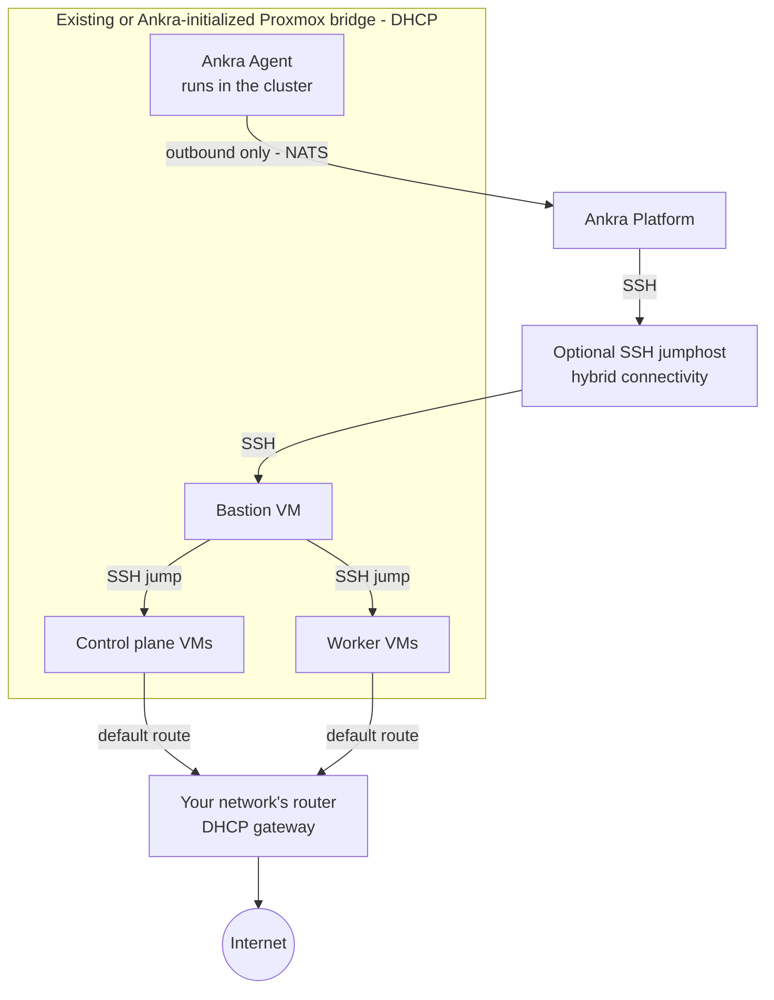

Ankra supports provisioning fully managed Kubernetes clusters on [Proxmox VE](https://www.proxmox.com/en/proxmox-virtual-environment). You bring your own Proxmox nodes and can use existing storage and network bridges. Ankra fills in safe defaults when they are absent, creates the VMs, installs Kubernetes, and manages the full cluster lifecycle: node groups, scaling, upgrades, and deprovisioning.

<Warning>
**Closed beta.** Proxmox VE cluster provisioning is in closed beta. The workflow is stable but the surface may still change, and it is enabled per organisation on request. [Contact support](/platform/support) to have it turned on for your organisation.
</Warning>

---

## Prerequisites

Before creating a Proxmox VE cluster, you need two credentials:

<CardGroup cols={2}>
  <Card title="Proxmox VE API Credential" icon="key">
    The Proxmox API URL and an API token with VM management privileges. If Ankra needs to initialize storage or networking, the token also needs `Datastore.Allocate`, `Sys.Modify`, and `SDN.Use`. See [Proxmox VE Credentials](/platform/credentials/proxmox).
  </Card>
  <Card title="SSH Key Credential" icon="lock">
    An SSH public key for VM access. You can provide your own or let Ankra generate one. See [SSH Key Credentials](/platform/credentials/ssh-key).
  </Card>
</CardGroup>

Your Proxmox environment must also provide:

- **A cloud-init VM template** (e.g., Ubuntu 24.04) with the QEMU guest agent installed, registered on the node you deploy to. Ankra clones this template for every cluster VM and reads each VM's IP address through the guest agent. You can pin a specific template with the `template` option; otherwise the first template on the node is used.
- **A network with DHCP.** You can provide an existing active Linux bridge. If none exists, the host must have exactly one active, statically addressed Ethernet or bond management interface that Ankra can safely convert to `vmbr0`.
- **Local free disk space or existing VM storage.** If no active storage supports VM images, Ankra enables `images` and `rootdir` on the `local` directory storage, or creates it at `/var/lib/vz`.
- **API reachability.** The Proxmox API must use HTTPS and be reachable from Ankra either directly or through an [SSH jumphost](#hybrid-connectivity-ssh-jumphost).

---

## Hybrid Connectivity (SSH Jumphost)

Many Proxmox environments are not directly reachable from the internet. If the Proxmox API and the VM network cannot be reached from Ankra, attach an **SSH jumphost** (host, port, username, and private key) to your Proxmox VE credential. Ankra then tunnels both the Proxmox API calls and the SSH connections to your cluster nodes through the jumphost.

If your Proxmox API uses a self-signed certificate, enable the **TLS insecure** toggle (`tls_insecure`) on the credential.

Both options are configured on the credential - see [Proxmox VE Credentials](/platform/credentials/proxmox).

---

## Creating a Proxmox VE Cluster

### Via the Platform UI

<Steps>
  <Step title="Navigate to Clusters">
    Go to **Clusters** in the Ankra dashboard and click **Create Cluster**.
  </Step>
  <Step title="Select Proxmox VE">
    Choose **Proxmox VE** as the provider.
  </Step>
  <Step title="Select Credentials">
    Pick your Proxmox VE API credential and SSH key credential from the dropdowns. You can also create new credentials directly from the wizard.
  </Step>
  <Step title="Choose Placement">
    Pick **Single host** or **Host spread** placement. With single host, select the **Proxmox node** that hosts all cluster VMs. With host spread, select two or more compatible hosts and Ankra distributes the Kubernetes VMs across them - see [Host-Spread Placement](#host-spread-placement). In both modes, select the **storage** for VM disks and the **network bridge** the VMs attach to. The bridge must provide DHCP.
  </Step>
  <Step title="Configure Nodes">
    Set your cluster topology:
    - **Bastion** - Instance size for the SSH bastion VM (e.g., `px-small`)
    - **Control Plane** - Count (1, 3, or 5) and size (e.g., `px-medium`)
    - **Workers** - Count and size (e.g., 2× `px-medium`)

    The wizard shows vCPUs, memory, and disk for each size. Proxmox has no list pricing, so no cost estimate is shown.
  </Step>
  <Step title="Choose Distribution">
    Pick the Kubernetes distribution:
 **k3s** Lightweight Kubernetes with a user-selectable CNI (Flannel default, Calico, or Cilium).
 **kubeadm** Vanilla upstream Kubernetes bootstrapped with `kubeadm` and containerd. kubeadm clusters always use Cilium CNI and optionally support an external etcd topology with dedicated etcd VMs.

    See [Kubernetes Distribution](#kubernetes-distribution) for details.
  </Step>
  <Step title="Create & Track Progress">
    Click **Create** to start provisioning. A live progress view tracks credential setup, SSH key deployment, bastion provisioning, VM creation, Kubernetes installation (k3s or kubeadm), and Ankra Agent setup. The cluster appears with an **offline** state until provisioning completes, then transitions to **online**.
  </Step>
</Steps>

### Via the API

<Note>
Proxmox VE clusters are managed from the **portal or API** during the closed beta - the `ankra` CLI does not yet include Proxmox commands. Create the [Proxmox VE credential](/platform/credentials/proxmox) and [SSH key credential](/platform/credentials/ssh-key) from the portal first.
</Note>

```bash
curl -X POST https://platform.ankra.app/api/v1/clusters/proxmox \
  -H "Authorization: Bearer $ANKRA_API_TOKEN" \
  -H "Content-Type: application/json" \
  -d '{
    "name": "my-cluster",
    "credential_id": "<proxmox-credential-id>",
    "ssh_key_credential_id": "<ssh-key-credential-id>",
    "node": "pve01",
    "storage": "local-lvm",
    "bridge": "vmbr0",
    "control_plane_count": 1,
    "control_plane_instance_type": "px-medium",
    "node_groups": [
      {"name": "default", "instance_type": "px-medium", "count": 2}
    ],
    "distribution": "k3s"
  }'
```

---

## Cluster Configuration Options

| Parameter | Default | Description |
|-----------|---------|-------------|
| `name` | *required* | Unique cluster name |
| `credential_id` | *required* | Proxmox VE API credential ID |
| `ssh_key_credential_id` | *required* | SSH key credential ID |
| `node` | *required* | Proxmox node that hosts the cluster VMs (and the bastion in host-spread mode) |
| `placement_nodes` | | Two or more Proxmox nodes to spread the Kubernetes VMs across (see [Host-Spread Placement](#host-spread-placement)). Omit for single-host placement |
| `bridge` | *required* | Network bridge the VMs attach to (must provide DHCP). `vmbr0` is created during credential setup when no bridge exists |
| `storage` | *auto-picked* | Active Proxmox storage for VM disks. Prefers `local-lvm`, then `local` |
| `template` | *auto-picked* | Cloud-init template to clone, by VMID or name. Defaults to the first template on the node |
| `bastion_instance_type` | `px-small` | Instance size for the bastion VM |
| `control_plane_count` | `1` | Number of control plane nodes (1, 3, or 5) |
| `control_plane_instance_type` | `px-medium` | Instance size for control planes |
| `worker_count` | `1` | Number of worker nodes (legacy, use `node_groups` instead) |
| `worker_instance_type` | `px-medium` | Instance size for workers (legacy, use `node_groups` instead) |
| `node_groups` | | Array of node group definitions (see [Node Groups](#node-groups)) |
| `distribution` | `k3s` | Kubernetes distribution (`k3s` or `kubeadm`) |
| `kubernetes_version` | *latest stable* | Kubernetes version (optional) |
| `cni` | `flannel` (k3s) | CNI plugin (`flannel`, `calico`, or `cilium`). kubeadm clusters always use `cilium` |
| `etcd_topology` | `stacked` | kubeadm only. `stacked` (etcd on control planes) or `external` (dedicated etcd VMs) |
| `etcd_node_count` | `3` | kubeadm `external` topology only. Number of dedicated etcd VMs (3 or 5) |
| `etcd_instance_type` | `px-medium` | kubeadm `external` topology only. Instance size for dedicated etcd nodes |

### Instance Sizes

Proxmox VE clusters use fixed instance size presets:

| Size | vCPUs | RAM | Disk | Typical use |
|------|-------|-----|------|-------------|
| `px-small` | 2 | 4 GB | 40 GB | Bastion |
| `px-medium` | 4 | 8 GB | 80 GB | Control plane, general workers |
| `px-large` | 8 | 16 GB | 160 GB | Larger workloads |
| `px-xlarge` | 16 | 32 GB | 320 GB | Heavy workloads |

<Note>
Proxmox VE has no list pricing, so Ankra does not show cost estimates for Proxmox clusters - neither in the creation wizard nor in [Cloud Cost](/platform/cloud-cost).
</Note>

### Networking

When you save a Proxmox VE credential, Ankra keeps any existing active Linux bridge unchanged. If no bridge exists, Ankra can convert a single active, statically addressed Ethernet or bond management interface to `vmbr0`: the host address and gateway move to the bridge, the physical interface becomes its uplink, and Proxmox applies the network configuration. Inactive bridges must be fixed or removed first.

Ankra refuses the automatic conversion without changing the live network when the management interface is ambiguous, uses DHCP, has custom interface options, or another network change is pending. Do not edit Proxmox networking concurrently while saving the credential. Configure a bridge manually in those cases, then save the credential again.

All cluster VMs receive their IP addresses via DHCP on the selected bridge. The upstream network must therefore provide DHCP whether you use an existing bridge or the automatically created `vmbr0`.

---

## Host-Spread Placement

When your Proxmox VE cluster has multiple nodes, you can spread the Kubernetes VMs across them so a single host failure does not take down the whole Kubernetes cluster. Host spread is opt-in: pass `placement_nodes` with two or more nodes via the API, or pick **Host spread** in the creation wizard.

```bash
curl -X POST https://platform.ankra.app/api/v1/clusters/proxmox \
  -H "Authorization: Bearer $ANKRA_API_TOKEN" \
  -H "Content-Type: application/json" \
  -d '{
    "name": "my-cluster",
    "credential_id": "<proxmox-credential-id>",
    "ssh_key_credential_id": "<ssh-key-credential-id>",
    "node": "pve01",
    "placement_nodes": ["pve01", "pve02", "pve03"],
    "storage": "local-lvm",
    "bridge": "vmbr0",
    "control_plane_count": 3,
    "control_plane_instance_type": "px-medium",
    "node_groups": [
      {"name": "default", "instance_type": "px-medium", "count": 3}
    ],
    "distribution": "k3s"
  }'
```

### Prerequisites

Every selected host must be online and provide the **same-named resources**, because VMs are cloned locally on each host:

- Active storage with the selected name that allows VM images (e.g., `local-lvm` on every host).
- An active bridge with the selected name (e.g., `vmbr0` on every host), all attached to the same DHCP network.
- A cloud-init template with the **same name** on every host. Ankra resolves each host's own template VMID and clones locally - shared-storage cross-node cloning is not used.

Creation is rejected if any selected host is missing one of these. `node` stays required and must be one of the `placement_nodes`; the bastion always runs there.

### How VMs are distributed

Ankra assigns control planes, dedicated etcd members, and each worker group deterministically: the host with the fewest members of the same role or group wins, ties break by fewest total Kubernetes VMs, then by your selected-node order. Every Kubernetes node is labeled with `topology.kubernetes.io/zone=<proxmox-node>` so you can use standard [topology spread constraints](https://kubernetes.io/docs/concepts/scheduling-eviction/topology-spread-constraints/) and pod anti-affinity against the physical failure domain.

Later scaling keeps the policy: adding node groups, scaling them up, and adding control planes all place new VMs on the least-represented eligible host. Restart, resize, upgrade, and delete operations stay pinned to each VM's recorded host.

### Requirements and limitations

- **At least 3 control planes.** Host-spread clusters must be created with 3 or 5 control plane nodes so the Kubernetes control plane keeps quorum when one host fails.
- **Two hosts give reduced resilience.** With only two hosts, losing the host that carries the control-plane majority still takes the Kubernetes API down. Three or more hosts are recommended.
- **The bastion is not spread.** It runs on the primary `node`; if that host fails, Ankra's SSH path to the cluster is unavailable until the host returns, while workloads keep running.
- **No Proxmox HA-manager integration.** Ankra does not enroll VMs in Proxmox HA groups and never live-migrates or recreates VMs on another host after a failure. Resilience comes from Kubernetes replication across hosts, so run workloads with multiple replicas spread over zones.

### Workload guidance

For a workload to survive a host outage, run at least two replicas and spread them across zones:

```yaml
topologySpreadConstraints:
  - maxSkew: 1
    topologyKey: topology.kubernetes.io/zone
    whenUnsatisfiable: ScheduleAnyway
    labelSelector:
      matchLabels:
        app: my-app
```

---

## Kubernetes Distribution

Proxmox VE clusters can be provisioned with either **k3s** (default) or **kubeadm**.

| | k3s | kubeadm |
|---|-----|---------|
| Kubernetes | Lightweight, single-binary distribution | Vanilla upstream Kubernetes |
| CNI | User-selectable (Flannel default, Calico, or Cilium) | Cilium (fixed, cannot be changed after creation) |
| etcd | Embedded | `stacked` (on control planes) or `external` (dedicated VMs) |
| Version format | `v1.35.1+k3s1` | `v1.31.0` (plain upstream tag) |

<Note>
kubeadm clusters always use Cilium CNI (eBPF-based networking, L7 policies, Hubble observability). The CNI cannot be changed after creation.
</Note>

### External etcd topology (kubeadm)

By default kubeadm runs etcd **stacked** on the control plane nodes. For larger clusters you can run etcd on dedicated VMs by setting `etcd_topology` to `external`:

```bash
curl -X POST https://platform.ankra.app/api/v1/clusters/proxmox \
  -H "Authorization: Bearer $ANKRA_API_TOKEN" \
  -H "Content-Type: application/json" \
  -d '{
    "name": "my-cluster",
    "credential_id": "<proxmox-credential-id>",
    "ssh_key_credential_id": "<ssh-key-credential-id>",
    "node": "pve01",
    "storage": "local-lvm",
    "bridge": "vmbr0",
    "control_plane_count": 3,
    "control_plane_instance_type": "px-medium",
    "node_groups": [
      {"name": "default", "instance_type": "px-medium", "count": 2}
    ],
    "distribution": "kubeadm",
    "etcd_topology": "external",
    "etcd_node_count": 3,
    "etcd_instance_type": "px-medium"
  }'
```

---

## Node Groups

Node groups let you organize worker nodes into logical groups with independent instance sizes, counts, labels, and taints. Manage node groups from **Settings** > **Nodes** in the dashboard, or via the API.

### Node Group API Reference

| Endpoint | Method | Description |
|----------|--------|-------------|
| `/api/v1/clusters/proxmox/{id}/node-groups` | GET | List all node groups |
| `/api/v1/clusters/proxmox/{id}/node-groups` | POST | Add a node group |
| `/api/v1/clusters/proxmox/{id}/node-groups/{name}/scale` | PUT | Scale a node group (0-100) |
| `/api/v1/clusters/proxmox/{id}/node-groups/{name}/instance-type` | PUT | Change instance size |
| `/api/v1/clusters/proxmox/{id}/node-groups/{name}/labels` | PUT | Update labels |
| `/api/v1/clusters/proxmox/{id}/node-groups/{name}/taints` | PUT | Update taints |
| `/api/v1/clusters/proxmox/{id}/node-groups/{name}` | DELETE | Delete a node group |

For detailed usage examples, see [Hetzner Node Groups](/guides/hetzner-clusters#node-groups) - the API is identical across all providers.

---

## Restarting a Node

Restart any node - a control plane node, a worker, or the bastion - as a tracked operation, from cluster **Settings** > **Nodes** in the dashboard, via the API, or by asking the Ankra AI assistant (e.g. "restart the bastion on my-cluster"). The `ankra-cli` does not yet have a Proxmox command tree.

```bash
curl -X POST https://platform.ankra.app/api/v1/clusters/proxmox/<cluster_id>/nodes/<node_id>/restart \
  -H "Authorization: Bearer $ANKRA_API_TOKEN"
```

See [Restarting a Node](/guides/hetzner-clusters#restarting-a-node) for the full walkthrough, response shape, and state requirements - identical across providers.

---

## Resizing the Bastion

Resize the bastion without recreating the cluster - Ankra powers it off, resizes it, and powers it back on.

```bash
curl -X PUT https://platform.ankra.app/api/v1/clusters/proxmox/<cluster_id>/bastion/instance-type \
  -H "Authorization: Bearer $ANKRA_API_TOKEN" \
  -H "Content-Type: application/json" \
  -d '{"instance_type": "<instance-size>"}'
```

See [Resizing the Bastion or Gateway](/guides/hetzner-clusters#resizing-the-bastion-or-gateway) for the accept/wait contract - identical across providers.

---

## Legacy Worker Scaling

The legacy `scale-workers` and `worker-count` endpoints operate on all workers as a single pool.

```bash
curl https://platform.ankra.app/api/v1/clusters/proxmox/<cluster_id>/worker-count \
  -H "Authorization: Bearer $ANKRA_API_TOKEN"

curl -X POST https://platform.ankra.app/api/v1/clusters/proxmox/<cluster_id>/scale-workers \
  -H "Authorization: Bearer $ANKRA_API_TOKEN" \
  -H "Content-Type: application/json" \
  -d '{"worker_count": 4}'
```

<Note>
Prefer using [Node Groups](#node-groups) for more granular control.
</Note>

---

## Upgrading Kubernetes Version

You can upgrade the Kubernetes version on all nodes in a Proxmox VE cluster. Upgrades are applied to control plane nodes first, then workers. Both k3s and kubeadm clusters are supported.

<Warning>
- Both k3s and kubeadm clusters are supported for version upgrades, including kubeadm clusters with an **external** etcd topology: the dedicated etcd members are upgraded first, one at a time, each saving a pre-upgrade snapshot before its static pod rolls to the etcd image matching the target Kubernetes version.
- Use the matching version format for the target: `v1.35.1+k3s1` for k3s, or a plain `v1.31.0` upstream tag for kubeadm.
- Downgrades are not supported - downgrades require an etcd snapshot restore.
- You can only upgrade one minor version at a time (e.g., v1.33.x to v1.34.x, not v1.33.x to v1.35.x).
- The cluster must be online with no active operations.
</Warning>

### Check Current Version

```bash
curl https://platform.ankra.app/api/v1/clusters/proxmox/<cluster_id>/k8s-version \
  -H "Authorization: Bearer $ANKRA_API_TOKEN"
```

### Upgrade Version

```bash
curl -X POST https://platform.ankra.app/api/v1/clusters/proxmox/<cluster_id>/upgrade-k8s-version \
  -H "Authorization: Bearer $ANKRA_API_TOKEN" \
  -H "Content-Type: application/json" \
  -d '{"target_version": "v1.35.1+k3s1"}'
```

For a kubeadm cluster, use a plain upstream tag instead (for example `"target_version": "v1.31.0"`).

---

## Deprovisioning

Deprovisioning deletes all VMs Ankra created on your Proxmox nodes (bastion, control planes, workers, and dedicated etcd VMs if any) and removes the cluster from Ankra. Your Proxmox nodes, storage, and bridges are left untouched.

<Warning>
This action is irreversible. All data on the cluster will be permanently deleted.
</Warning>

```bash
curl -X DELETE https://platform.ankra.app/api/v1/clusters/proxmox/<cluster_id> \
  -H "Authorization: Bearer $ANKRA_API_TOKEN"
```

---

## Architecture

A Proxmox VE cluster provisions the following infrastructure:

| Component | Description |
|-----------|-------------|
| **Bastion VM** | Jump server for secure SSH access to cluster nodes |
| **Control Plane(s)** | Kubernetes control plane VMs (1, 3, or 5) |
| **Worker(s)** | Kubernetes worker VMs organized in [node groups](#node-groups) |
| **etcd Node(s)** | Dedicated etcd VMs, only for kubeadm clusters with an `external` [etcd topology](#external-etcd-topology-kubeadm) |
| **SSH Keys** | Deployed to all VMs for access |



All VMs are QEMU virtual machines on the Proxmox node you selected, attached to the selected bridge with DHCP addressing. Ankra can initialize `vmbr0` during credential setup when no bridge exists, but it does not manage DHCP, routing, or internet egress. Those continue to use your network's DHCP-provided gateway, while Ankra only pins the default route and DNS on each VM.

The bastion VM provides the only SSH access point Ankra uses to reach the cluster nodes - it carries no workload or egress traffic. When an [SSH jumphost](#hybrid-connectivity-ssh-jumphost) is configured, Ankra reaches both the Proxmox API and the bastion through the jumphost (without one, Ankra connects to the bastion directly).

<Note>
Proxmox VE clusters do not include a cloud controller manager or load balancer integration - `external_cloud_provider` is not supported. Kubernetes `LoadBalancer` services are not provisioned automatically; expose workloads with `NodePort` services, an ingress controller, or a load balancer solution you deploy yourself.
</Note>

---

## Troubleshooting

### Common Issues

| Issue | Solution |
|-------|----------|
| Proxmox API unreachable from Ankra | Attach an [SSH jumphost](#hybrid-connectivity-ssh-jumphost) to the credential - Ankra tunnels API calls and node SSH through it |
| TLS certificate errors (self-signed) | Enable the **TLS insecure** toggle (`tls_insecure`) on the Proxmox VE credential |
| Nodes never get an IP address | The selected bridge must provide DHCP - Ankra does not manage IP allocation. Verify a DHCP server answers on that bridge |
| Provisioning fails waiting for a VM's IP address | The cloned template must have the **QEMU guest agent** installed and enabled - Ankra reads VM addresses through the agent. Rebuild the template with `qemu-guest-agent` and retry |
| No VM templates found on the node | Create a cloud-init template on the selected Proxmox node first - Ankra clones it for every cluster VM |
| Cluster stuck in provisioning | Check the API token privileges (see [Proxmox VE Credentials](/platform/credentials/proxmox)) and free capacity on the selected node and storage |
| VM creation fails with a permission error | The API token is missing privileges (e.g., `VM.Allocate`, `Datastore.AllocateSpace`) on the selected node, storage, or bridge |
| LoadBalancer service stuck in `Pending` | Proxmox clusters have no cloud controller manager - use `NodePort`, ingress, or your own load balancer |
| No cost estimates shown | Expected - Proxmox has no list pricing, so cost estimation is not supported |
