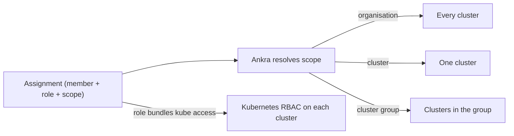

import { CliVersion } from "/snippets/cli-version.jsx";

Ankra controls access with **roles** that you assign at a **scope**. A role is a set of permissions; a scope decides where those permissions apply - the whole organisation, a single cluster, or a **cluster group**. A role can also bundle Kubernetes access that Ankra provisions on every cluster in scope, so platform permissions and `kubectl` access are granted together.

<Note>
Roles and scoped assignments replace the earlier admin/member split. Existing members keep working: `admin` and `member` map onto the new model, and wider roles become available as you adopt them.
</Note>

---

## How access is decided



An **assignment** ties a member to a role at a scope. When the role includes Kubernetes access, Ankra reconciles the matching [Cluster Access](/guides/cluster-access) grants onto every cluster the scope resolves to, and keeps them in sync as group membership changes.

---

## Built-in roles

| Role | What it grants |
|------|----------------|
| `owner` | Full control, including organisation deletion and ownership transfer |
| `admin` | Full control except deleting the organisation (includes billing and the audit log) |
| `operator` | Day-2 operations: deploy, operate clusters, act on alerts, `kubectl` write and exec |
| `member` | Build and deploy stacks, variables, and applications |
| `viewer` | Read-only access plus ask-mode AI |

`read-only` from the earlier model maps to `viewer`.

You can also define **custom roles** that bundle a specific permission set and, optionally, a Kubernetes access level provisioned across the assignment's scope.

---

## Permission matrix

Every permission Ankra checks, and which built-in role holds it. A custom role can hold any combination of these. The table is generated from the platform's permission registry, so it lists exactly what the platform enforces.

Two patterns to notice when you review access:

- **Every built-in role can read.** All read permissions, including ask-mode AI (`ai.use`), are shared by every role. The exception is `audit.read`: only `admin` and `owner` hold it, and a custom role can grant it on its own.
- **Some powers sit only with `admin` and `owner`.** Among them are revealing stored credentials (`credentials.reveal`), approving promotions (`promotions.approve`), managing members and tokens, and choosing the AI provider (`ai.manage`).

**Human-only** permissions reach an API or MCP token only when the token names them explicitly. A token that asks for "everything its owner can do" does not get them, so an automated caller cannot approve its own promotion or its own AI action.

{/* role-matrix:start generated by scripts/gen_role_matrix.py from ankraio/cluster enginekit/authz/registry.go at commit 111b3d6fb18257e7388a1164861a8e57e3851e1a. Do not edit by hand. */}

### Organisation, people and audit

| Permission | What it allows | `owner` | `admin` | `operator` | `member` | `viewer` |
|---|---|:-:|:-:|:-:|:-:|:-:|
| `organisation.read` | Read organisation settings and metadata | ✓ | ✓ | ✓ | ✓ | ✓ |
| `organisation.manage` | Update organisation settings (name, slug, MFA requirement, AI insight settings) | ✓ | ✓ |  |  |  |
| `organisation.delete` | Delete the organisation | ✓ |  |  |  |  |
| `members.read` | List members, invites, and their roles | ✓ | ✓ | ✓ | ✓ | ✓ |
| `members.invite` | Invite new members and revoke pending invites | ✓ | ✓ |  |  |  |
| `members.manage` | Change member roles and remove members | ✓ | ✓ |  |  |  |
| `members.mfa_reset` | Reset another member's MFA factors | ✓ | ✓ |  |  |  |
| `billing.read` | Read subscription, invoices, and usage analytics | ✓ | ✓ | ✓ | ✓ | ✓ |
| `billing.manage` | Change subscription, open the billing portal, sync billing | ✓ | ✓ |  |  |  |
| `tokens.manage` | Revoke organisation members' API and kube tokens | ✓ | ✓ |  |  |  |
| `audit.read` | Read the organisation audit log | ✓ | ✓ |  |  |  |

### Clusters and Kubernetes

| Permission | What it allows | `owner` | `admin` | `operator` | `member` | `viewer` |
|---|---|:-:|:-:|:-:|:-:|:-:|
| `clusters.read` | Read clusters, their resources, and their state | ✓ | ✓ | ✓ | ✓ | ✓ |
| `clusters.create` | Import or provision new clusters | ✓ | ✓ |  |  |  |
| `clusters.write` | Edit cluster configuration and metadata | ✓ | ✓ | ✓ | ✓ |  |
| `clusters.operate` | Scale, upgrade, start/stop, reconcile, and sync clusters | ✓ | ✓ | ✓ |  |  |
| `clusters.delete` | Deprovision or delete clusters | ✓ | ✓ |  |  |  |
| `agents.manage` | Mint agent bootstrap tokens and upgrade cluster agents | ✓ | ✓ |  |  |  |
| `kubernetes.read` | Read Kubernetes resources, pods, and logs through the platform | ✓ | ✓ | ✓ | ✓ | ✓ |
| `kubernetes.write` | Apply, patch, and delete Kubernetes resources through the platform | ✓ | ✓ | ✓ |  |  |
| `kubernetes.exec` | Open pod terminals, exec, and port-forward sessions | ✓ | ✓ | ✓ |  |  |
| `kube_access.use` | Mint kubeconfigs and kube tokens for granted clusters | ✓ | ✓ | ✓ | ✓ |  |
| `kube_access.manage` | Grant and revoke cluster Kubernetes access for members | ✓ | ✓ |  |  |  |

### Stacks, configuration and secrets

| Permission | What it allows | `owner` | `admin` | `operator` | `member` | `viewer` |
|---|---|:-:|:-:|:-:|:-:|:-:|
| `stacks.read` | Read stacks, addons, manifests, and drafts | ✓ | ✓ | ✓ | ✓ | ✓ |
| `stacks.write` | Create and edit stacks, addons, manifests, and drafts | ✓ | ✓ | ✓ | ✓ |  |
| `stacks.deploy` | Deploy, sync, and roll back stacks and addons | ✓ | ✓ | ✓ | ✓ |  |
| `stacks.delete` | Delete stacks, addons, and manifests | ✓ | ✓ | ✓ | ✓ |  |
| `variables.read` | Read organisation and cluster variables | ✓ | ✓ | ✓ | ✓ | ✓ |
| `variables.write` | Create, update, and delete variables | ✓ | ✓ | ✓ | ✓ |  |
| `profiles.read` | Read stack profiles and their versions | ✓ | ✓ | ✓ | ✓ | ✓ |
| `profiles.write` | Create, edit, and publish stack profiles | ✓ | ✓ |  | ✓ |  |
| `profiles.share` | Share stack profiles with other organisations | ✓ | ✓ |  |  |  |
| `helm.read` | Browse helm registries and charts | ✓ | ✓ | ✓ | ✓ | ✓ |
| `helm.manage` | Manage helm registries and their credentials | ✓ | ✓ |  |  |  |
| `git.manage` | Connect and manage git providers and GitOps repositories | ✓ | ✓ |  |  |  |
| `sops.use` | Encrypt and decrypt values with the organisation SOPS key | ✓ | ✓ | ✓ | ✓ |  |
| `sops.manage` | Initialise and rotate the organisation SOPS key | ✓ | ✓ |  |  |  |
| `credentials.read` | List credentials and read their metadata | ✓ | ✓ | ✓ | ✓ | ✓ |
| `credentials.write` | Create and update credentials | ✓ | ✓ |  |  |  |
| `credentials.delete` | Delete credentials | ✓ | ✓ |  |  |  |
| `credentials.reveal` | Reveal stored credential secret material | ✓ | ✓ |  |  |  |

### Applications and delivery

| Permission | What it allows | `owner` | `admin` | `operator` | `member` | `viewer` |
|---|---|:-:|:-:|:-:|:-:|:-:|
| `applications.read` | Read applications and their workflow state | ✓ | ✓ | ✓ | ✓ | ✓ |
| `applications.write` | Create and edit applications | ✓ | ✓ | ✓ | ✓ |  |
| `applications.deploy` | Deploy applications | ✓ | ✓ | ✓ | ✓ |  |
| `applications.delete` | Delete applications | ✓ | ✓ |  | ✓ |  |
| `pipelines.read` | Read pipeline definitions, schedules, and step templates | ✓ | ✓ | ✓ | ✓ | ✓ |
| `pipelines.operate` | Run, re-run, cancel, and dispatch pipelines | ✓ | ✓ | ✓ | ✓ |  |
| `pipelines.manage` | Manage pipeline definitions, schedules, step templates, and organisation CI policy | ✓ | ✓ | ✓ |  |  |
| `promotions.read` | Read promotions, their approvals, and their history | ✓ | ✓ | ✓ | ✓ | ✓ |
| `promotions.request` | Request a promotion between environments | ✓ | ✓ | ✓ | ✓ |  |
| `promotions.approve` | Approve or reject a requested promotion (human-only) | ✓ | ✓ |  |  |  |
| `environments.read` | Read environments, their instances, and their promotion edges | ✓ | ✓ | ✓ | ✓ | ✓ |
| `environments.operate` | Create, hydrate, extend, and destroy ephemeral environment instances | ✓ | ✓ | ✓ | ✓ |  |
| `environments.manage` | Manage environment definitions, protection rules, and promotion edges | ✓ | ✓ | ✓ |  |  |
| `executions.read` | Read executions, operations, and their events | ✓ | ✓ | ✓ | ✓ | ✓ |
| `executions.operate` | Cancel and retry executions and operations | ✓ | ✓ | ✓ |  |  |
| `runs.read` | Read cross-cluster runs and stream their progress | ✓ | ✓ | ✓ | ✓ | ✓ |
| `runs.operate` | Start and cancel cross-cluster runs | ✓ | ✓ | ✓ |  |  |
| `automations.read` | Read automations, their triggers, and their run history | ✓ | ✓ | ✓ | ✓ | ✓ |
| `automations.manage` | Create, edit, enable, and delete automations | ✓ | ✓ |  |  |  |

### Alerts, security and backups

| Permission | What it allows | `owner` | `admin` | `operator` | `member` | `viewer` |
|---|---|:-:|:-:|:-:|:-:|:-:|
| `alerts.read` | Read alerts, triggers, and integrations | ✓ | ✓ | ✓ | ✓ | ✓ |
| `alerts.write` | Acknowledge, resolve, snooze, and annotate alert triggers | ✓ | ✓ | ✓ |  |  |
| `alerts.manage` | Manage alert definitions, integrations, and notification routes | ✓ | ✓ |  |  |  |
| `security.read` | Read fleet security findings, posture, and disposition policies | ✓ | ✓ | ✓ | ✓ | ✓ |
| `security.triage` | Acknowledge fleet security findings | ✓ | ✓ | ✓ |  |  |
| `security.manage` | Create, edit, and revoke accepted-risk security policies | ✓ | ✓ |  |  |  |
| `backups.read` | Read backup vaults, stack backup policies, and restore points | ✓ | ✓ | ✓ | ✓ | ✓ |
| `backups.operate` | Create restore points and run restores and data clones | ✓ | ✓ | ✓ | ✓ |  |
| `backups.manage` | Manage backup vaults and stack backup policies | ✓ | ✓ |  |  |  |

### AI

| Permission | What it allows | `owner` | `admin` | `operator` | `member` | `viewer` |
|---|---|:-:|:-:|:-:|:-:|:-:|
| `ai.use` | Use ask-mode AI chat and read AI insights | ✓ | ✓ | ✓ | ✓ | ✓ |
| `ai.execute` | Run agent-mode AI and confirm AI-proposed actions | ✓ | ✓ | ✓ | ✓ |  |
| `ai.manage` | Manage AI providers, MCP servers, skills, trusted actions, and spend caps | ✓ | ✓ |  |  |  |
| `ai_actions.approve` | Approve or reject a parked AI action from an API or MCP token (a token carries it only by naming it) (human-only) | ✓ | ✓ |  |  |  |

{/* role-matrix:end */}

---

## Scopes

| Scope | Applies to |
|-------|-----------|
| **Organisation** | Every cluster and resource in the organisation |
| **Cluster** | A single named cluster |
| **Cluster group** | Every cluster that a group resolves to |

<Tip>
Assign the narrowest scope that fits. A support engineer who only triages one team's clusters gets a `viewer` (or `operator`) role on that team's **cluster group**, not the whole organisation.
</Tip>

---

## Cluster groups

A **cluster group** is a named set of clusters used as an assignment scope. Groups can be:

- **Static** - you pin specific clusters as members.
- **Dynamic** - a label selector evaluated against cluster labels, so clusters join and leave the group automatically as their labels change.

Manage groups on the **Roles** page of your organisation (**Organisation → Roles**, section **Cluster Groups**). A preview shows exactly which clusters a group currently resolves to before you use it in an assignment.

---

## Assigning a role

<Steps>
  <Step title="Open Roles & Access">
    Go to **Organisation → Roles**. The same page holds **Cluster Groups** if you need a group scope. It is shown to members who can manage members (`admin` and `owner` by default).
  </Step>
  <Step title="Pick a member and role">
    Choose an organisation member, then a built-in or custom role.
  </Step>
  <Step title="Choose the scope">
    Assign at the organisation, a single cluster, or a cluster group.
  </Step>
  <Step title="Save">
    Ankra applies the assignment immediately. If the role bundles Kubernetes access, it reconciles the grants onto every cluster in scope.
  </Step>
</Steps>

To list the built-in and custom roles from the [CLI](/reference/cli/org):

<CliVersion since="0.6.0" />

```bash
ankra org roles
```

The CLI has no commands for assignments or cluster groups; manage them on the **Roles** page.

---

## Audit log

Every access change - invitations, role assignments, cluster-group edits, revocations - is recorded in the organisation **Audit log** under **Organisation → Audit log**, so you can see who changed what and when.

---

## Related

<CardGroup cols={2}>
  <Card title="Cluster Access" icon="key" href="/guides/cluster-access">
    Scoped, SSO-backed kubectl access.
  </Card>
  <Card title="Organisations" icon="users" href="/concepts/organisations">
    Invite and manage members.
  </Card>
  <Card title="Organisation Settings" icon="gear" href="/platform/organisation-settings">
    Configure organisation-wide behaviour.
  </Card>
  <Card title="API Tokens" icon="key" href="/reference/tokens">
    Create tokens for scripts, CI, and MCP clients.
  </Card>
</CardGroup>
