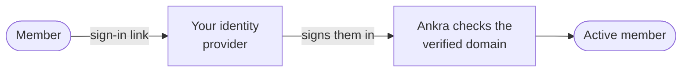
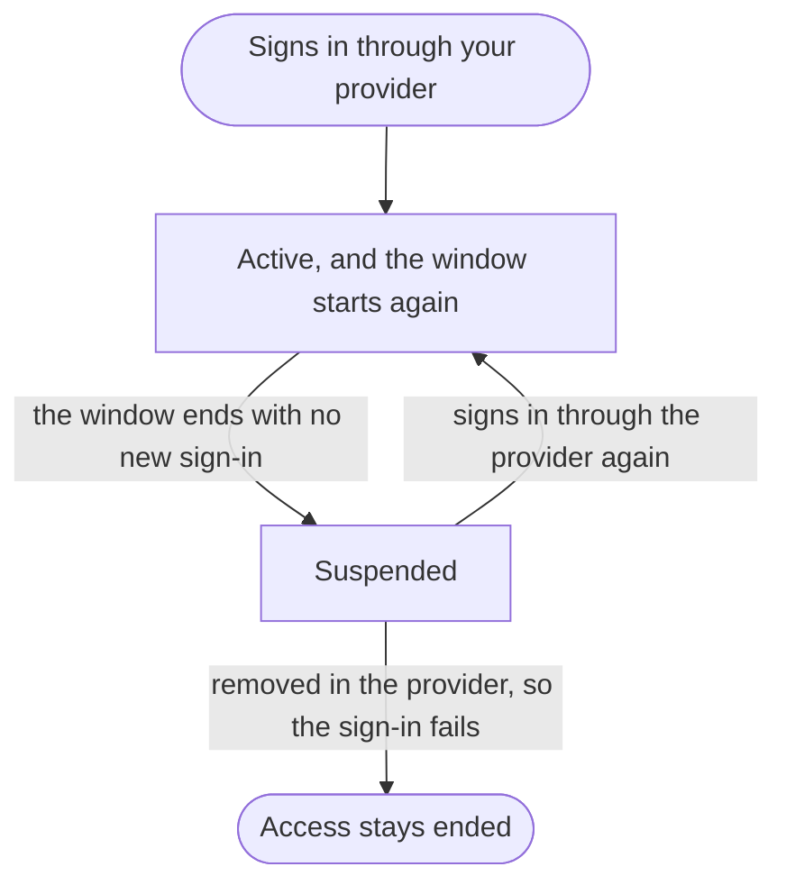

import { YouTube } from "/snippets/youtube.jsx";

Single sign-on lets your organisation's own identity provider decide who is a member of it in Ankra. People the provider admits become members when they sign in. People it stops admitting lose access on their own, without anyone removing them in Ankra.

You set it up yourself under **Organisation** → **Settings** → **Single sign-on**. Ankra does not need to enable anything for you first.

The whole setup in two minutes, from connecting the provider to what happens when someone leaves:

<YouTube id="gZEfsZNjcyI" title="Ankra single sign-on: your identity provider decides who is in" />

<CardGroup cols={3}>
  <Card title="Who may sign in" icon="user-check" href="#who-becomes-a-member">
    Whoever is assigned to the Ankra application in your provider.
  </Card>
  <Card title="Which role they hold" icon="users-gear" href="#set-roles-from-groups">
    The provider's groups, mapped to Ankra roles. Optional.
  </Card>
  <Card title="When access ends" icon="hourglass-half" href="#how-access-ends">
    At the end of the re-verification window: 24 hours by default.
  </Card>
</CardGroup>

<Frame caption="A sign-in through your provider">



</Frame>

---

## Before you start

| You need | Why |
|----------|-----|
| **The `organisation.manage` permission** | Held by owners and admins. See [Roles & Access](/guides/roles-and-access). |
| **An OpenID Connect identity provider** | Microsoft Entra ID (Microsoft 365), Okta and Keycloak all speak it. SAML is not supported. |
| **Access to the DNS of your email domain** | You publish one TXT record to prove the domain is yours. |
| **A plan that allows more than one member** | Single sign-on adds members, so an organisation on a single-user plan cannot connect a provider. |

---

## Set it up

<Frame caption="The Single sign-on settings page with a provider connected and enabled (example data)">
  
</Frame>

<Steps>
  <Step title="Register Ankra with your identity provider">
    Open **Organisation** → **Settings** → **Single sign-on** and copy the value under **Redirect URI to register with your provider**. Then create an application for Ankra in your provider.

    <Tabs>
      <Tab title="Microsoft Entra ID">
        1. In the Microsoft Entra admin centre, open **App registrations** → **New registration**.
        2. Under **Supported account types**, choose **Accounts in this organizational directory only**.
        3. Under **Redirect URI**, choose the **Web** platform and paste the redirect URI from Ankra.
        4. On the registration's **Overview**, copy the **Application (client) ID** and the **Directory (tenant) ID**.
        5. Open **Certificates & secrets** → **New client secret** and copy the secret's **Value**.
        6. Open **Enterprise applications**, select the application, and under **Properties** set **Assignment required?** to **Yes**. Then assign the people or groups who should have access under **Users and groups**.

        Your issuer is `https://login.microsoftonline.com/<tenant-id>/v2.0`.

        <Warning>
        Without **Assignment required**, everyone in your tenant with an address on a verified domain can sign in, and joins your Ankra organisation while just-in-time membership is on. Removing someone from the assignment is also how their access ends, so it is the control this whole feature rests on.
        </Warning>

        Ankra reads the `email` claim, which Entra ID fills from the user's email address. A user with no email address set in Entra ID cannot sign in.
      </Tab>
      <Tab title="Okta">
        1. In the Okta Admin Console, open **Applications** → **Create App Integration**.
        2. Choose **OIDC - OpenID Connect** and **Web Application**.
        3. Under **Sign-in redirect URIs**, paste the redirect URI from Ankra. Keep the **Authorization Code** grant.
        4. Under **Assignments**, limit access to the people or groups who should have access.
        5. Copy the **Client ID** and **Client secret**.

        Your issuer is your Okta organisation URL, `https://<your-okta-domain>`. If you sign people in through a custom authorization server, use its issuer instead, for example `https://<your-okta-domain>/oauth2/default`.
      </Tab>
      <Tab title="Another provider">
        Any OpenID Connect provider works if it meets these requirements:

        - It publishes a discovery document at `<issuer>/.well-known/openid-configuration`, reachable from the internet over HTTPS.
        - The application is a confidential client: authorization code flow with a client secret.
        - It releases the `email` claim when Ankra requests the `openid`, `profile` and `email` scopes.
        - The redirect URI from Ankra is registered on the application.

        Restrict who may use the application in the provider itself. Ankra admits whoever the provider signs in with an address on one of your verified domains.
      </Tab>
    </Tabs>
  </Step>
  <Step title="Connect the provider in Ankra">
    Back on **Single sign-on**, under **Identity provider**, fill in the three fields and click **Connect provider**.

    | Field | What to enter |
    |-------|---------------|
    | **Issuer** | The issuer URL itself, not the discovery document URL. For Entra ID it must be your own tenant's issuer: the shared `common`, `organizations` and `consumers` authorities admit accounts from any tenant and are refused. |
    | **Client ID** | The application's client ID. |
    | **Client secret** | Passed to the identity broker that performs the sign-in. It is not stored in Ankra or shown again. |

    The provider now shows as **Connected, not enabled**. Nobody can sign in through it yet.

    <Tip>
    To rotate the secret later, enter the new one and click **Save provider**. Changing the issuer or the client ID needs the secret again.
    </Tip>
  </Step>
  <Step title="Verify your email domain">
    Under **Email domains**, enter the domain your members' addresses use and click **Add domain**. Ankra shows a record to publish at your DNS provider:

    | Type | Record name | Record value |
    |------|-------------|--------------|
    | `TXT` | `_ankra-challenge.<your-domain>` | `ankra-domain-verification=<token>` |

    Publish it, then click **Verify**. DNS changes can take a few minutes to appear, and you can click **Verify** again until the domain shows **Verified**. A **Sign-in link** then appears under **Email domains**.

    Ankra accepts a sign-in through your provider only when the address is on a domain you have verified. That is what stops a provider from signing people in under addresses its owner does not control.

    - A verified domain covers exactly that domain. `example.com` does not cover `eu.example.com`; add and verify each one.
    - Public email providers such as `gmail.com` and `outlook.com` cannot be claimed.
    - A domain can be verified by one organisation only.
  </Step>
  <Step title="Enable single sign-on">
    Under **Access policy**, turn on **Enable single sign-on**. It can only be turned on once at least one domain is verified.
  </Step>
  <Step title="Sign in through the provider once">
    Open the sign-in link in a private browser window and sign in as someone assigned to the application. You should land in your organisation, and the **Identity provider** card should show the time under **Last sign-in through the provider**.

    Do this before you tell anyone else. It proves the provider works, and Ankra will not let you require single sign-on until one sign-in has succeeded.
  </Step>
</Steps>

<Check>
Single sign-on is now on and optional: members can use it, and everyone can still sign in the way they did before. To make the provider the only way in, see [Require single sign-on](#require-single-sign-on).
</Check>

---

## How members sign in

There are two ways to reach your provider:

<CodeGroup>

```text Sign-in link
https://platform.ankra.app/auth/sso/login?domain=<your-domain>
```

```text Single sign-on page
https://platform.ankra.app/auth/sso
```

</CodeGroup>

<CardGroup cols={2}>
  <Card title="The sign-in link" icon="link">
    Shown under **Email domains**. It goes straight to your provider. Share it, or set it as the application's home page URL in your provider so that the Ankra tile in your members' application portal opens it.
  </Card>
  <Card title="The single sign-on page" icon="at">
    A member enters their work email address and Ankra sends them to the provider that serves its domain.
  </Card>
</CardGroup>

Every sign-in through the provider has to be a fresh one: Ankra accepts it only when the provider authenticated the person within the last ten minutes.

Ankra's second factor is separate from your provider's. A member who has one enrolled is still asked for it after the provider signs them in, and an organisation that [requires MFA](/platform/account-security) still requires each member to enrol.

---

## Who becomes a member

**Just-in-time membership** is on by default: anyone the provider admits, with an address on a verified domain, becomes a member the first time they sign in. Turn it off under **Access policy** and only people you have invited can join through the provider.

| Who signs in through the provider | Just-in-time on (default) | Just-in-time off |
|-----------------------------------|---------------------------|------------------|
| Someone new, with no invitation | Becomes a member with the **Default role**, which is **Member** unless you change it | Refused, and told to ask an administrator for an invite |
| Someone you invited | The invitation is accepted, with the role it carries | The invitation is accepted, with the role it carries |
| An existing member | Stays a member, and is governed by single sign-on from now on | Stays a member, and is governed by single sign-on from now on |

Someone who already has an Ankra account under the same address keeps it. The provider is connected to their existing account, so their API tokens, second factors and memberships of other organisations are unchanged. This needs the existing account's address to have been verified; an account that never verified its address is refused, and the message says so.

<Note>
While just-in-time membership is on, removing a governed member on the members page lasts only until their next sign-in: the provider still admits them, so they join again. To remove someone, remove them from the application in your provider.
</Note>

---

## Set roles from groups

By default the provider decides who is a member and you decide roles in Ankra. Add mappings under **Group to role** and the provider decides roles too.

<Steps>
  <Step title="Send the member's groups to Ankra">
    Your provider has to put the member's groups in a `groups` claim on the ID token. Ankra requests the `openid`, `profile` and `email` scopes only, so the claim has to be released without an extra scope.

    <Tabs>
      <Tab title="Microsoft Entra ID">
        On the app registration, open **Token configuration** → **Add groups claim** and include it in the ID token. Choose **Groups assigned to the application** so the claim stays small.

        The claim carries group object IDs unless you configure the application to emit names.
      </Tab>
      <Tab title="Okta">
        On the application's **Sign On** tab, set a groups claim filter in the **OpenID Connect ID Token** section.
      </Tab>
    </Tabs>
  </Step>
  <Step title="Map groups to roles">
    Click **Add mapping**, enter a group exactly as the provider sends it - a name or an object ID - and pick **Member**, **Admin** or **Read-only**. Then click **Save mappings**.
  </Step>
  <Step title="Check it">
    Sign in as a member of a mapped group and look for the `sso_member_role_synced` entry in the [audit log](/guides/audit-log).
  </Step>
</Steps>

While at least one mapping exists, every sign-in through the provider sets the member's role from the groups it sent:

| Situation | Role the member gets |
|-----------|----------------------|
| In one mapped group | That group's role |
| In several mapped groups | The highest: **Admin**, then **Member**, then **Read-only** |
| In no mapped group | The **Default role** |
| You changed the role by hand in Ankra | Your change lasts until that member's next sign-in |
| An **owner** or a **break-glass member** | Never moved by groups. Ownership is granted by hand, and break-glass members are your way back in if the provider is wrong. |

Mappings set the organisation-wide built-in role. [Custom roles](/guides/roles-and-access) and roles assigned on a single cluster or cluster group are left as they are. Remove every mapping and roles are yours to set in Ankra again.

---

## How access ends

Your provider does not tell Ankra when you remove someone, so access through single sign-on is a lease that each sign-in renews.

<Frame caption="The life of a membership that single sign-on governs">



</Frame>

A member is **governed** by single sign-on once they have signed in through the provider. Each of those sign-ins records that the provider vouched for them. When the latest one is older than the **Re-verification window**, Ankra suspends the membership.

A suspended member loses everything at once: portal sessions, personal API tokens, and Kubernetes access granted through Ankra. They show as **Suspended** on the members page. Ankra checks every five minutes, and a suspension takes effect everywhere within about six minutes of the window ending.

Signing in through the provider again restores the membership, with the role it had. Someone you removed from the application in your provider cannot complete that sign-in, so their access ends at the window.

The window therefore sets two things:

| What it sets | How |
|--------------|-----|
| **How long a removed person keeps access** | At most one window after their last sign-in through the provider |
| **How often everyone else signs in through the provider** | At least once per window, or they are suspended until they do |

The default is 24 hours, and you can set anything from 1 to 720 hours under **Access policy**. A shorter window revokes faster and asks members to sign in more often.

Two kinds of member are never suspended: break-glass members, and everyone while single sign-on is switched off for the organisation.

<Tip>
A suspended member's personal API tokens stop working with them. Run pipelines and integrations on [service tokens](/guides/service-tokens), which belong to the organisation and are not governed by single sign-on.
</Tip>

---

## Require single sign-on

Under **Access policy**, set **Require single sign-on** to **Required**. Ankra allows this once single sign-on is enabled and someone has signed in through the provider.

| Who | What changes when it is required |
|-----|----------------------------------|
| A member with an address on a verified domain | Signing in any other way sends them to your provider |
| A new sign-up with an address on a verified domain | Sent to your provider |
| Every active member on a verified domain, except break-glass members | Governed immediately, with one full window to sign in through the provider |
| A member whose address is on another domain | Nothing. They keep signing in the way they do today |
| An account that shares your domain but belongs only to other organisations | Nothing |

### Break-glass members

Break-glass members keep their other sign-in methods when single sign-on is required, and are never suspended. They are how you get back in when the provider is misconfigured or down.

- The list can never be empty, and at least one break-glass member must be able to manage the organisation.
- Whoever sets single sign-on to **Required** is added to the list.
- Choose them under **Break-glass members** and click **Save break-glass members**.

<Warning>
Keep at least one break-glass member whose own sign-in you have tested. If the provider fails and no break-glass member can sign in, nobody in your organisation can reach the settings to turn single sign-on off, and you will need [Ankra support](/platform/support) to recover access.
</Warning>

---

## Change or remove it

| Action | What happens to members |
|--------|-------------------------|
| Turn off **Enable single sign-on** | Nobody can sign in through the provider, nobody is suspended, and **Required** returns to **Optional**. Members with a password or social sign-in use that; members who only ever signed in through the provider cannot sign in until it is enabled again. |
| Remove a verified domain | Active members on that domain return to ordinary membership. Suspended members stay suspended. The last verified domain cannot be removed while single sign-on is enabled. |
| **Remove single sign-on** | Active members become ordinary members. Suspended members stay suspended. |

<Warning>
Removing single sign-on cannot be undone for accounts that existed only through your provider. They lose their sign-in, and their personal API tokens and Kubernetes access are revoked. Members who also have a password or social sign-in keep it.
</Warning>

A member who is still suspended after single sign-on is turned off or removed can be removed and invited again from the members page.

---

## Audit trail

Every change and every membership decision is written to the organisation's [audit log](/guides/audit-log):

| Action | Recorded when |
|--------|---------------|
| `sso_connection_created`, `sso_connection_updated`, `sso_connection_deleted` | The provider is connected, re-keyed or removed |
| `sso_policy_updated` | Enabling, requiring, the default role, the window or the break-glass list changes |
| `sso_domain_added`, `sso_domain_verified`, `sso_domain_removed` | An email domain is claimed, verified or removed |
| `sso_group_mappings_updated` | The group mappings are saved |
| `sso_member_provisioned` | The provider admits a new member |
| `accept_invite` | An invited person joins by signing in through the provider |
| `sso_member_role_synced` | A sign-in changes a member's role from their groups |
| `sso_member_suspended` | The window ends without a sign-in through the provider |
| `sso_member_restored` | A suspended member signs in through the provider again |

For an access review, filter the [audit export](/security/audit-export) to these actions: together they are the joiner, mover and leaver record for members the provider governs.

---

## Limits

| Limit | Value |
|-------|-------|
| **Protocol** | OpenID Connect. SAML is not supported. |
| **Providers** | One per organisation |
| **Email domains** | Up to 20 |
| **Group mappings** | Up to 50, to **Member**, **Admin** and **Read-only**. **Owner** cannot be mapped. |
| **Break-glass members** | 1 to 20 |
| **Re-verification window** | 1 to 720 hours, 24 by default |
| **Deprovisioning** | Removal in the provider is not pushed to Ankra (there is no SCIM provisioning). Access ends at the re-verification window. |
| **Management** | In the portal. There is no CLI command or API token endpoint for these settings. |

---

## Troubleshooting

Entries are titled with the message Ankra shows, to an administrator on the settings page or to a member at sign-in.

### Connecting a provider

<AccordionGroup>
  <Accordion title="Single sign-on could not be prepared on this installation right now" icon="triangle-exclamation">
    Ankra could not get its sign-in service ready for single sign-on. Try again in a few minutes, and [contact support](/platform/support) if it keeps failing.
  </Accordion>
  <Accordion title="The identity provider configuration was not accepted" icon="triangle-exclamation">
    The issuer or the client was refused. Check that the issuer is the issuer URL itself and that its discovery document is reachable from the internet.
  </Accordion>
  <Accordion title="Single sign-on adds members to the organisation, and the Homebuilder plan is limited to a single user" icon="triangle-exclamation">
    The organisation's plan allows one member. Upgrade the plan under [Billing](/platform/billing), then connect the provider.
  </Accordion>
</AccordionGroup>

### Verifying a domain

<AccordionGroup>
  <Accordion title="No TXT record with the expected value was found" icon="globe">
    The record is not visible in DNS yet, or its name or value differs from what the page shows. Check it and click **Verify** again.
  </Accordion>
  <Accordion title="The domain is already verified by another organisation" icon="globe">
    Another Ankra organisation has verified this domain, and a domain belongs to one organisation only. One of your own organisations may hold it.
  </Accordion>
</AccordionGroup>

### Signing in

<AccordionGroup>
  <Accordion title="Not a domain your organisation has verified with Ankra" icon="right-to-bracket">
    The provider signed the person in with an address outside your verified domains. Verify that domain, or correct the email address the provider sends.
  </Accordion>
  <Accordion title="Your identity provider did not share an email address with Ankra" icon="right-to-bracket">
    The application does not release the `email` claim, or the user has no email address in the provider.
  </Accordion>
  <Accordion title="You have not been invited to it yet" icon="right-to-bracket">
    Just-in-time membership is off and the person has no invitation. Invite them, or turn just-in-time membership on.
  </Accordion>
  <Accordion title="An Ankra account already exists for this email address, but the address was never verified" icon="right-to-bracket">
    Sign in to that account the way it was created and verify the address, then sign in through the provider again.
  </Accordion>
  <Accordion title="This organisation is on the Homebuilder plan, which is limited to a single user" icon="right-to-bracket">
    The provider admitted the person, but the organisation's plan allows one member. The organisation needs to upgrade before anyone else can join.
  </Accordion>
  <Accordion title="Single sign-on is not enabled for this organisation" icon="right-to-bracket">
    The provider is connected but **Enable single sign-on** is off.
  </Accordion>
  <Accordion title="Single sign-on is not set up for the domain" icon="right-to-bracket">
    Shown on the single sign-on page when no enabled provider serves the address's domain. Check the address, or that the domain is verified and single sign-on is enabled.
  </Accordion>
  <Accordion title="Ankra could not confirm a fresh sign-in with your identity provider" icon="right-to-bracket">
    The provider did not authenticate the person just now. Close the window and start again from the sign-in link.
  </Accordion>
  <Accordion title="Your organisation requires single sign-on, but the sign-in did not complete through your identity provider" icon="right-to-bracket">
    Start again from the sign-in link. If it repeats, [contact support](/platform/support).
  </Accordion>
  <Accordion title="A member shows as Suspended" icon="user-clock">
    The provider has not vouched for them within the window. They are restored by signing in through the provider.
  </Accordion>
</AccordionGroup>

### Requiring single sign-on

<AccordionGroup>
  <Accordion title="Sign in through single sign-on successfully once before requiring it" icon="shield-halved">
    Nobody has signed in through the provider yet. Use the sign-in link once, then set **Required**.
  </Accordion>
</AccordionGroup>

---

## Related

<CardGroup cols={2}>
  <Card title="Identity & Access Controls" icon="id-card" href="/security/identity-and-access">
    The compliance view of sign-in, MFA, roles and tokens.
  </Card>
  <Card title="Roles & Access" icon="user-shield" href="/guides/roles-and-access">
    What each role grants, and scoped and custom roles.
  </Card>
  <Card title="Service Tokens" icon="key" href="/guides/service-tokens">
    Credentials for automation that do not depend on a person.
  </Card>
  <Card title="Audit Log" icon="clipboard-list" href="/guides/audit-log">
    Review who was admitted, suspended and restored.
  </Card>
</CardGroup>
