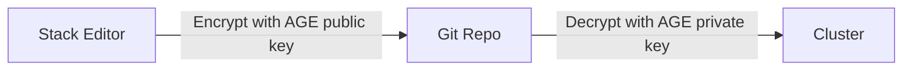

import { CliVersion } from "/snippets/cli-version.jsx";

<Note>
SOPS (Secrets OPerationS) encryption allows you to securely store sensitive values like passwords, API keys, and credentials in your GitOps repository. Encrypted values are automatically decrypted during deployment.
</Note>

## What is SOPS?

[SOPS](https://github.com/getsops/sops) is an editor for encrypted files that supports YAML, JSON, ENV, INI and BINARY formats. Ankra uses SOPS with [AGE](https://github.com/FiloSottile/age) encryption to protect sensitive values in your Stack configurations.

### How It Works



1. **In the Stack Builder**: You enter secrets in plaintext
2. **On Save**: Ankra encrypts marked fields with your organisation's AGE public key
3. **In Git**: Encrypted values appear as `ENC[AES256_GCM,...]` - safe to commit
4. **On Deploy**: ArgoCD's helm-secrets plugin decrypts values using the private key

---

## Getting Started

Setting up SOPS encryption is a single step. Once initialized, encryption is enabled by default and cluster decryption is handled automatically.

<Steps>
  <Step title="Navigate to Encryption Settings">
    Go to **Organisation Settings** → **Encryption**.
  </Step>
  <Step title="Initialize Encryption">
    Click **Initialize Encryption**. This generates an AGE key pair:
    - **Public key**: Used to encrypt values (visible to you)
    - **Private key**: Used to decrypt values (stored securely in Ankra's secret store)
  </Step>
</Steps>

That's it. After initialization:

- **Encryption is enabled** by default - fields you mark as encrypted will be protected immediately.
- **Cluster decryption is automatic** - any cluster with ArgoCD installed receives the decryption key automatically. There is nothing to configure per-cluster.

The AGE public key is displayed on the Encryption settings page. You can copy it for use with external SOPS tools if needed.

The public key looks like: `age1ql3z7hjy54pw3hyww5ayyfg7zqgvc7w3j2elw8zmrj2kg5sfn9aqmcac8p`

---

## Encrypting Values in Stacks

### Using the Stack Builder

When editing a manifest or add-on values in the Stack Builder:

1. Look for the **Encrypted Keys (SOPS)** section
2. Add key names that should be encrypted (e.g., `password`, `apiKey`, `token`)
3. Enter the plaintext value as normal
4. On save, Ankra encrypts those specific keys

<Tip>
Only the specified keys are encrypted. Other values remain in plaintext for easy review and debugging.
</Tip>

### Common Keys to Encrypt

| Key Name | Use Case |
|----------|----------|
| `password` | Database passwords, admin credentials |
| `apiKey` | Third-party API keys |
| `token` | Authentication tokens, tunnel tokens |
| `secretKey` | Encryption keys, signing keys |
| `connectionString` | Database connection strings with credentials |
| `privateKey` | SSH keys, TLS private keys |

### Example: Encrypting a Database Password

**Before encryption** (what you see in the editor):

```yaml
apiVersion: v1
kind: Secret
metadata:
  name: postgres-credentials
  namespace: database
type: Opaque
stringData:
  username: app_user
  password: super-secret-password
```

**After encryption** (what's stored in Git):

```yaml
apiVersion: v1
kind: Secret
metadata:
  name: postgres-credentials
  namespace: database
type: Opaque
stringData:
  username: app_user
  password: ENC[AES256_GCM,data:vxvYs7vKw+bPqNWO3tE=,iv:...,tag:...,type:str]
sops:
  age:
    - recipient: age1ql3z7hjy54pw3hyww5ayyfg7zqgvc7w3j2elw8zmrj2kg5sfn9aqmcac8p
      enc: |
        -----BEGIN AGE ENCRYPTED FILE-----
        YWdlLWVuY3J5cHRpb24ub3JnL3YxCi0+IFgyNTUxOSBxVEdI...
        -----END AGE ENCRYPTED FILE-----
  encrypted_regex: ^(password)$
  version: 3.9.4
```

### Example: Encrypting a Registry Pull Secret (`.dockerconfigjson`)

A `kubernetes.io/dockerconfigjson` Secret stores its payload under a key whose
name literally begins with a dot: `.dockerconfigjson`. Add that key, leading dot
included, to the **Encrypted Keys (SOPS)** list (or pass `--key .dockerconfigjson`
to the CLI). The leading dot marks it as a literal key name rather than a nested
dotted path, so it is matched and encrypted as-is.

```yaml
apiVersion: v1
kind: Secret
metadata:
  name: registry-auth
  namespace: platform
type: kubernetes.io/dockerconfigjson
data:
  .dockerconfigjson: ENC[AES256_GCM,data:vxvYs7vKw+bPqNWO3tE=,iv:...,tag:...,type:str]
sops:
  age:
    - recipient: age1ql3z7hjy54pw3hyww5ayyfg7zqgvc7w3j2elw8zmrj2kg5sfn9aqmcac8p
      enc: |
        -----BEGIN AGE ENCRYPTED FILE-----
        YWdlLWVuY3J5cHRpb24ub3JnL3YxCi0+IFgyNTUxOSBxVEdI...
        -----END AGE ENCRYPTED FILE-----
  encrypted_regex: ^(\.dockerconfigjson)$
  version: 3.9.4
```

---

## Encrypting Helm Values

For add-ons (Helm charts), you can encrypt specific values:

1. Open the add-on in the Stack Builder
2. In the values editor, find the **Encrypted Keys (SOPS)** section
3. Add paths to sensitive values

### Helm Values Path Examples

| Path | Description |
|------|-------------|
| `adminPassword` | The key `adminPassword` |
| `auth.password` | Dot notation locates the key `password` under `auth` |
| `credentials.apiKey` | Dot notation locates the key `apiKey` under `credentials` |
| `glob:*Password` | Every key whose name ends in `Password`, at any depth (see [pattern entries](#encrypting-keys-by-pattern)) |

**Example**: Encrypting Grafana admin password

```yaml
# Values for grafana chart
adminUser: admin
adminPassword: my-grafana-password  # ← This gets encrypted
persistence:
  enabled: true
```

Add `adminPassword` to the encrypted keys list.

### What an Entry Actually Matches

Dot notation tells Ankra **which key you mean**; it does not confine the
encryption to that one place in the file. Ankra compiles the entries into a SOPS
`encrypted_regex` built from the key **names**, and SOPS applies that regex to
every key at every depth of the document. A dotted entry contributes its **last
segment** as one of those names. So an entry `auth.password` names the key
`password`, and **every** key called `password` in that file is sealed -
`auth.password`, `backups.password`, and any other.

That is usually what you want, and it is why a key added under a new section
next month is sealed without changing the declaration. It becomes a problem when
the key name is not unique to your secret.

<Warning>
**Do not mark a key whose name is a structural YAML or Kubernetes field**, such
as `key`, `name`, `path`, `value`, `type`, `host`, `port` or `operator`. The
entry seals every field of that name in the file, including the ones the chart
needs to read in plaintext.

**This applies to dotted entries too, by their last segment.** `tls.key`,
`metadata.name` and `spec.host` end in a structural field name, so they seal
every `key`, `name` and `host` in the document exactly as the bare entry would.
Writing the parent section does not scope the seal to it.

Marking a key called `key` in a kube-prometheus-stack values file produces
`encrypted_regex: ^(key)$`, which seals the node-affinity term as well:

```yaml
prometheusSpec:
  affinity:
    nodeAffinity:
      requiredDuringSchedulingIgnoredDuringExecution:
        nodeSelectorTerms:
          - matchExpressions:
              - key: ENC[AES256_GCM,data:...]   # ← sealed by ^(key)$, not a secret
                operator: In
                values: [linux]
```

Marking `tls.key` on the same file produces `^(key|tls\.key)$` — a different
regex, but it still carries `key` as an alternative, so it seals that same
affinity term.

The rendered chart then fails, and every GitOps sync of that cluster fails to
decrypt with `Input string kubernetes.io/hostname does not match sops data
format`, until the file is decrypted again.

Give the value a distinctive key name instead (`opsgenieApiKey`, `smtpPassword`),
or seal the whole credential as its own Secret manifest. Renaming the parent
section does not help; only the last segment decides what is matched.
</Warning>

---

## Encrypting Keys by Pattern

An entry in the **Encrypted Keys (SOPS)** list is normally a literal key name, matched exactly. Prefix an entry with `glob:` to seal every key whose name matches a pattern instead - including keys added to the document later:

```yaml
encrypted_paths:
  - username     # literal entry - matches the key "username" exactly
  - glob:DB_*    # pattern entry - matches every key whose name starts with DB_
```

### Pattern Rules

- **`glob:` is the opt-in.** Entries without the prefix keep their exact-match meaning, so a literal key name that contains a dot (`cloud.conf`, `.dockerconfigjson`) is never reinterpreted as a pattern.
- **Only `*` is a wildcard.** It matches any run of characters, including none. Every other character is literal.
- **A pattern describes a key name, not a path.** SOPS matches key names at every depth of the document, so `glob:DB_*` seals a top-level `DB_PASSWORD` and a nested `backups.DB_PASSWORD` alike.
- **A leading `data.` or `stringData.` section is accepted and stripped**, the same as for a literal entry: `glob:stringData.DB_*` and `glob:DB_*` select the same keys.
- **The entry is stored as written.** `encrypted_paths` keeps `glob:stringData.DB_*` verbatim, and Ankra re-expands it into the SOPS `encrypted_regex` on every push. A key added to the document next month is sealed by the same rule, with no change to the declaration - and because the rule lives in the SOPS metadata, a key you seal by hand with the `sops` editor is matched the same way.

**Example**: Sealing every `DB_` key of a Secret with `glob:stringData.DB_*`

```yaml
apiVersion: v1
kind: Secret
metadata:
  name: app-database
  namespace: app
type: Opaque
stringData:
  LOG_LEVEL: info    # no entry matches - stays plaintext
  DB_HOST: ENC[AES256_GCM,data:vxvYs7vKw+bPqNWO3tE=,iv:...,tag:...,type:str]
  DB_PASSWORD: ENC[AES256_GCM,data:aXvYs7vKw+bPqNWO3tF=,iv:...,tag:...,type:str]
sops:
  age:
    - recipient: age1ql3z7hjy54pw3hyww5ayyfg7zqgvc7w3j2elw8zmrj2kg5sfn9aqmcac8p
      enc: |
        -----BEGIN AGE ENCRYPTED FILE-----
        YWdlLWVuY3J5cHRpb24ub3JnL3YxCi0+IFgyNTUxOSBxVEdI...
        -----END AGE ENCRYPTED FILE-----
  encrypted_regex: ^(DB_.*)$
  version: 3.9.4
```

### Rejected Patterns

A pattern that cannot mean what was intended is rejected when you save, with an error naming the entry and the reason (over the API this is an HTTP 422, for example `Invalid encrypted_paths entry "glob:password": contains no * wildcard; declare an exact key name without the glob: prefix`):

| Entry | Why it is rejected |
|-------|--------------------|
| `glob:` | The prefix must be followed by a key-name pattern, such as `glob:stringData.DB_*` |
| `glob:stringData.` | Names a section but no key-name pattern |
| `glob:password` | Contains no `*` wildcard - declare the exact key name without the prefix so it keeps exact-match semantics |
| `glob:*` | Would match every key in the document, `metadata.name` and `kind` included - keep at least one literal character |

A valid pattern that matches **zero keys** fails later, at encrypt or push time, exactly like a misspelled literal key: rather than write a file that only looks encrypted, Ankra refuses with an error such as `declared encrypted_paths [glob:DB_*] match no key in this document, so sops encrypted nothing`. Fix the pattern (or add the keys it should match) and save again.

---

## Using the CLI

You can also encrypt and decrypt values using the Ankra CLI for local GitOps workflows.

### Encrypting Manifest Values

<CliVersion since="0.1.123" />

```bash
# Encrypt a key in a manifest
ankra cluster encrypt manifest trinity-database-secret --key TRINITY_DB_PASSWORD -f cluster.yaml
```

This will:
1. Find the manifest in the cluster YAML
2. Read the referenced manifest file
3. Encrypt the specified key using your organisation's SOPS key
4. Update the manifest file with encrypted values
5. Add the key to `encrypted_paths` in the cluster YAML

### Encrypting Addon Values

```bash
# Encrypt a key in addon configuration
ankra cluster encrypt addon --name grafana --key adminPassword -f cluster.yaml
```

### Encrypting Keys by Pattern with the CLI

<CliVersion since="0.13.0" command="cluster encrypt --key glob:..." />

`--key` also accepts the `glob:` pattern form described in [Encrypting Keys by Pattern](#encrypting-keys-by-pattern):

```bash
# Encrypt every key ending in Password, now and on every later re-encrypt
ankra cluster encrypt addon --name grafana --key 'glob:*Password' --cluster prod

# Encrypt every DB_ key of a Secret manifest
ankra cluster encrypt manifest db-secret --key 'glob:stringData.DB_*' --cluster prod
```

The pattern is recorded in `encrypted_paths` as written, so keys added later are sealed automatically the next time the values are encrypted. A pattern that matches no key fails the same way a misspelled exact key does. See [ankra cluster encrypt](/reference/cli/cluster#ankra-cluster-encrypt) for the full flag reference.

### Decrypting for Inspection

To view the decrypted contents of a manifest file:

```bash
# View decrypted manifest content
ankra cluster decrypt manifest trinity-database-secret -f cluster.yaml
```

<Tip>
The decrypt command prints to stdout, so you can pipe it to other tools or redirect to a file if needed.
</Tip>

### Adding Keys to Existing Encrypted Files

You can add new encrypted keys to files that are already SOPS-encrypted:

```bash
# File already has 'password' encrypted, now add 'api_token'
ankra cluster encrypt manifest my-secret --key api_token -f cluster.yaml
```

The CLI will automatically decrypt the file, merge the encrypted paths, and re-encrypt with all keys protected.

<Warning>
This only works if the file was encrypted with your organisation's SOPS key. If the file was encrypted by a different organisation, you'll see an error message and need to decrypt it first using the original key.
</Warning>

For more CLI commands, see the [Ankra CLI documentation](/reference/cli/cluster#ankra-cluster-encrypt).

---

## How Decryption Works

When SOPS is initialized for your organisation, Ankra automatically configures decryption on clusters that have ArgoCD:

1. **Deploys the AGE private key** as a Kubernetes Secret in the ArgoCD namespace
2. **Configures helm-secrets plugin** on the ArgoCD repo-server
3. **Sets up automatic decryption** during Helm template rendering

### What Gets Deployed

| Component | Namespace | Purpose |
|-----------|-----------|---------|
| `ankra-sops-age-key` Secret | `argocd` | Stores the AGE private key |
| helm-secrets plugin | ArgoCD repo-server | Enables SOPS decryption in Helm |
| SOPS binary | ArgoCD repo-server | Performs the actual decryption |

### ArgoCD Integration

The helm-secrets plugin is automatically configured with:

- `HELM_SECRETS_BACKEND=sops` - Use SOPS for decryption
- `SOPS_AGE_KEY_FILE=/ankra-sops-age-key/age.agekey` - Path to the private key
- Support for `secrets://` value file scheme

---


## Troubleshooting

<AccordionGroup>
  <Accordion title="Deployment Fails with Decryption Error">
    1. Verify SOPS is initialized at the organisation level (**Organisation Settings** → **Encryption**)
    2. Confirm the cluster has ArgoCD installed and that the repo-server has restarted
    3. Ensure the content was encrypted with the current organisation key (not a rotated key)

    ```bash
    # Check ArgoCD repo-server logs
    kubectl logs -n argocd -l app.kubernetes.io/component=repo-server | grep -i sops
    ```
  </Accordion>
  <Accordion title="Cluster Not Decrypting Encrypted Values">
    The cluster needs ArgoCD to decrypt SOPS values. If ArgoCD is not installed:

    1. Create a Stack with the ArgoCD add-on
    2. Deploy and wait for ArgoCD to become ready
    3. The SOPS decryption key will be deployed automatically
  </Accordion>
  <Accordion title="Values Not Being Encrypted">
    1. Check that the key name matches exactly (case-sensitive)
    2. Verify SOPS is initialized at the organisation level
    3. Ensure the key is added to the **Encrypted Keys** list before saving

    Name a top-level key directly, or use dot notation to locate a nested one. Either way the entry names a key, and every key of that name in the document is sealed - see [What an Entry Actually Matches](#what-an-entry-actually-matches).
  </Accordion>
  <Accordion title="A Chart Field Was Encrypted That Should Not Have Been">
    An entry seals every key of that name at every depth, so an entry named after a structural field (`key`, `name`, `path`, `value`, `type`, `host`, `port`, `operator`) also seals the chart's own fields. Check dotted entries by their **last segment**: `tls.key` and `metadata.name` are the same hazard as a bare `key` or `name`. The symptom is a render or sync failure naming a value that was never a secret, such as `Input string kubernetes.io/hostname does not match sops data format`.

    Decrypt the file, remove the over-broad entry from **Encrypted Keys (SOPS)**, give the secret a distinctive key name, and re-encrypt. See [What an Entry Actually Matches](#what-an-entry-actually-matches).

    If that entry is the **last** `encrypted_paths` entry anywhere on the cluster, removing it also stops Ankra rendering the cluster's `.sops.yaml`, and the next platform write prunes the file along with any creation rules you keep there by hand. Keep a copy first - see [Merging the SOPS configuration file](/concepts/gitops#merging-the-sops-configuration-file).
  </Accordion>
  <Accordion title="Save Rejected with an Invalid encrypted_paths Entry">
    A `glob:` pattern entry the grammar rejects fails the save with `Invalid encrypted_paths entry "...": <reason>`. The reason names the fix:

    - `contains no * wildcard` - the pattern has no `*`; declare the exact key name without the `glob:` prefix
    - `would match every key in the document` - the pattern is only wildcards; keep at least one literal character
    - `must be followed by a key-name pattern` or `names a section but no key-name pattern` - add the pattern after the prefix or section, such as `glob:stringData.DB_*`

    An error saying declared paths `match no key in this document` means every entry (literal or pattern) selected nothing - check the spelling against the document's actual key names. See [Encrypting Keys by Pattern](#encrypting-keys-by-pattern) for the full rules.
  </Accordion>
  <Accordion title="Key Rotation Stuck">
    If you initiated key rotation but can't complete it:

    1. **Cancel the rotation** if you haven't re-encrypted content yet
    2. If content is already re-encrypted, verify by checking the `sops.age.recipient` field matches the new public key
    3. Click **Confirm Rotation** to finalize
  </Accordion>
</AccordionGroup>

---

## AI Prompts

Press `⌘+J` to open the AI Assistant and use these prompts:

<AccordionGroup>
  <Accordion title="Set Up SOPS for a Stack">
    ```
    I have a Stack with database credentials. Help me encrypt
    the password field with SOPS before pushing to Git.
    ```
  </Accordion>
  <Accordion title="Troubleshoot Decryption Failure">
    ```
    My Stack deployment is failing with a SOPS decryption error.
    Help me troubleshoot.
    ```
  </Accordion>
</AccordionGroup>

---

## Advanced Configuration

The defaults described above work for most setups. The following sections cover optional configuration that you may need if you want to change the default behaviour.

### Disabling Organisation Encryption

SOPS encryption is enabled by default after initialization. If you need to temporarily stop encrypting new values (existing encrypted content remains encrypted):

1. Go to **Organisation Settings** → **Encryption**
2. Toggle **SOPS Encryption** off

When disabled, fields marked for encryption will be saved in plaintext. Re-enable at any time to resume encryption. This does not affect clusters' ability to decrypt already-encrypted values.

### Per-Cluster Decryption Toggle

Ankra automatically deploys the SOPS decryption key to every cluster that has ArgoCD. If you need to manage this manually for a specific cluster:

1. Go to your cluster → **Settings** → **Encryption**
2. Toggle **Enable SOPS Decryption** on or off

<Warning>
Disabling cluster decryption will cause deployments with encrypted values to fail on that cluster. Only disable this if the cluster should not process encrypted Stacks.
</Warning>

### Key Rotation

Periodically rotating encryption keys is a security best practice. Consider rotating keys quarterly or after team member departures.

<Steps>
  <Step title="Go to Encryption Settings">
    Navigate to **Organisation Settings** → **Encryption**.
  </Step>
  <Step title="Click Rotate Keys">
    This generates a new AGE key pair while preserving the old one temporarily.
  </Step>
  <Step title="Re-encrypt Existing Content">
    Before confirming, you must re-encrypt all existing SOPS-encrypted content in your Git repositories with the new public key.
  </Step>
  <Step title="Confirm Rotation">
    Once all content is re-encrypted, click **Confirm Rotation** to finalize. The old private key is then securely deleted.
  </Step>
</Steps>

<Warning>
**Critical**: You must re-encrypt all content before confirming rotation. Failing to do so will result in decryption failures for content encrypted with the old key.
</Warning>

#### Cancelling Key Rotation

If you need to abort a rotation in progress, click **Cancel Rotation**. The new key pair is discarded and the existing key remains active.

---

## Related

<CardGroup cols={2}>
  <Card title="Stacks" icon="cubes" href="/concepts/stacks">
    Build and deploy reusable Stack configurations.
  </Card>
  <Card title="GitOps" icon="git-alt" href="/concepts/gitops">
    Sync Stacks with Git repositories.
  </Card>
  <Card title="Cloudflare Tunnel" icon="cloud" href="/guides/cloudflare-tunnel">
    Encrypt tunnel tokens with SOPS.
  </Card>
  <Card title="Manifests" icon="file-code" href="/concepts/manifests">
    Create custom Kubernetes resources with encryption.
  </Card>
</CardGroup>


