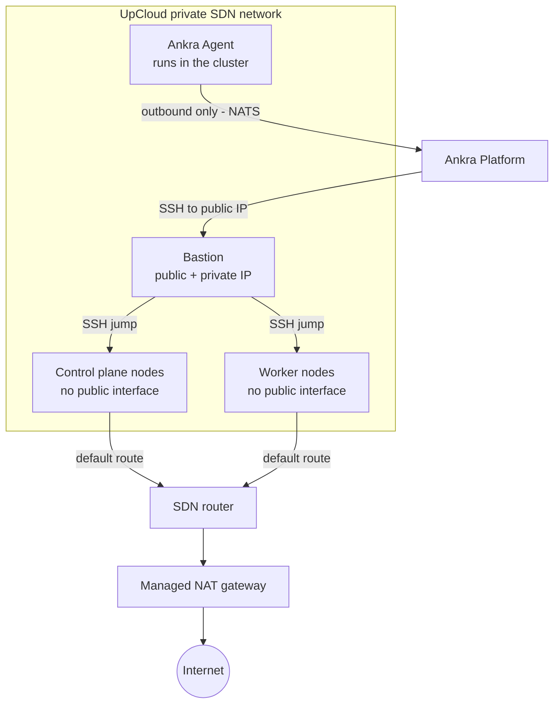

Ankra supports provisioning fully managed Kubernetes clusters on [UpCloud](https://upcloud.com/). You can create clusters with configurable control planes, workers, and networking - then scale workers up or down as needed.

---

## Prerequisites

Before creating an UpCloud cluster, you need two credentials:

<CardGroup cols={2}>
  <Card title="UpCloud API Credential" icon="key">
    An UpCloud API token with read/write permissions. See [UpCloud Credentials](/platform/credentials/upcloud).
  </Card>
  <Card title="SSH Key Credential" icon="lock">
    An SSH public key for server access. You can provide your own or let Ankra generate one. See [SSH Key Credentials](/platform/credentials/ssh-key).
  </Card>
</CardGroup>

---

## Creating an UpCloud Cluster

### Via the Platform UI

A guided wizard walks you through creating an UpCloud cluster - select credentials, pick a datacenter zone, choose server plans, set control plane and worker counts, and launch.

<Steps>
  <Step title="Navigate to Clusters">
    Go to **Clusters** in the Ankra dashboard and click **Create Cluster**.
  </Step>
  <Step title="Select UpCloud">
    Choose **UpCloud** as the provider.
  </Step>
  <Step title="Select Credentials">
    Pick your UpCloud API credential and SSH key credential from the dropdowns. You can also create new credentials directly from the wizard.
  </Step>
  <Step title="Choose Datacenter Zone">
    Select an UpCloud zone (e.g., Helsinki, Frankfurt, Chicago, Amsterdam). Each zone shows the location and country.
  </Step>
  <Step title="Configure Nodes">
    Set your cluster topology:
    - **Bastion** - server plan for the SSH bastion host (e.g., `1xCPU-1GB`)
    - **Control Plane** - count (1 or 3) and plan (e.g., `2xCPU-4GB`)
    - **Workers** - count and plan (e.g., 2x `4xCPU-8GB`)

    The wizard shows vCPUs, RAM, and monthly cost for each plan to help you choose.
  </Step>
  <Step title="Create & Track Progress">
    Click **Create** to start provisioning. A live progress view tracks every step - credential setup, router creation, network creation, gateway setup, SSH key deployment, bastion provisioning, server creation, k3s installation, and Ankra Agent setup. The cluster appears with an **offline** state until provisioning completes, then transitions to **online**.
  </Step>
</Steps>

### Managing from the Dashboard

Once your UpCloud cluster is online, you can manage it directly from the Ankra dashboard:

- **Scale workers** - go to **Cluster Settings** → **General** to scale worker nodes up or down
- **Upgrade Kubernetes** - upgrade the k3s version from cluster settings
- **Deprovision** - delete the cluster and all UpCloud resources from the **Danger Zone** in cluster settings

### Via the CLI

```bash
# Create credentials first
ankra credentials upcloud create --name my-upcloud-token  # securely prompts for token
ankra credentials upcloud ssh-key create --name my-ssh-key --generate

# Create the cluster
ankra cluster upcloud create \
  --name my-cluster \
  --credential-id <upcloud-credential-id> \
  --ssh-key-credential-id <ssh-key-credential-id> \
  --zone fi-hel1 \
  --control-plane-count 1 \
  --control-plane-plan 2xCPU-4GB \
  --worker-count 2 \
  --worker-plan 4xCPU-8GB
```

### Via the API

```bash
curl -X POST https://platform.ankra.app/api/v1/clusters/upcloud \
  -H "Authorization: Bearer $ANKRA_API_TOKEN" \
  -H "Content-Type: application/json" \
  -d '{
    "name": "my-cluster",
    "credential_id": "<upcloud-credential-id>",
    "ssh_key_credential_id": "<ssh-key-credential-id>",
    "zone": "fi-hel1",
    "control_plane_count": 1,
    "control_plane_plan": "2xCPU-4GB",
    "worker_count": 2,
    "worker_plan": "4xCPU-8GB",
    "distribution": "k3s"
  }'
```

Every configuration parameter, the zone list, and server plans are in the [UpCloud Reference](/reference/upcloud).

---

## Node Groups

Node groups let you organize worker nodes into logical groups with independent server plans, counts, labels, and taints. Each group can be scaled, re-planned, and configured independently.

### Via the Platform UI

Navigate to cluster **Settings** > **Nodes** to manage node groups. From this tab you can:

- View all node groups with their server plan, count, labels, and taints
- Add new node groups with a name, server plan, count, and optional labels/taints
- Scale individual groups up or down (0–100 nodes)
- Upgrade the server plan (upgrade only - see [Server Plan Changes](#server-plan-changes))
- Edit labels and taints per group
- Delete a node group and all its nodes

### List Node Groups

<CodeGroup>

```bash CLI
ankra cluster upcloud node-group list <cluster_id>
```

```bash cURL
curl https://platform.ankra.app/api/v1/clusters/upcloud/<cluster_id>/node-groups \
  -H "Authorization: Bearer $ANKRA_API_TOKEN"
```

</CodeGroup>

Response:
```json
{
  "node_groups": [
    {
      "name": "default",
      "instance_type": "4xCPU-8GB",
      "count": 2,
      "min": 0,
      "max": 100,
      "labels": {},
      "taints": []
    }
  ]
}
```

### Add a Node Group

<CodeGroup>

```bash CLI
ankra cluster upcloud node-group add <cluster_id> \
  --name workers-large \
  --instance-type 8xCPU-32GB \
  --count 2
```

```bash cURL
curl -X POST https://platform.ankra.app/api/v1/clusters/upcloud/<cluster_id>/node-groups \
  -H "Authorization: Bearer $ANKRA_API_TOKEN" \
  -H "Content-Type: application/json" \
  -d '{
    "name": "workers-large",
    "instance_type": "8xCPU-32GB",
    "count": 2,
    "labels": {"tier": "backend"},
    "taints": [{"key": "dedicated", "value": "backend", "effect": "NoSchedule"}]
  }'
```

</CodeGroup>

### Scale a Node Group

<CodeGroup>

```bash CLI
ankra cluster upcloud node-group scale <cluster_id> default 4
```

```bash cURL
curl -X PUT https://platform.ankra.app/api/v1/clusters/upcloud/<cluster_id>/node-groups/default/scale \
  -H "Authorization: Bearer $ANKRA_API_TOKEN" \
  -H "Content-Type: application/json" \
  -d '{"count": 4}'
```

</CodeGroup>

Node groups can be scaled to 0 nodes. This keeps the group definition but removes all servers.

### Server Plan Changes

<Warning>
Server plan upgrades are one-way - you cannot downgrade a node group to a smaller plan. To use a smaller plan, create a new node group with the desired plan and delete the old one.
</Warning>

<CodeGroup>

```bash CLI
ankra cluster upcloud node-group upgrade <cluster_id> default 8xCPU-32GB
```

```bash cURL
curl -X PUT https://platform.ankra.app/api/v1/clusters/upcloud/<cluster_id>/node-groups/default/instance-type \
  -H "Authorization: Bearer $ANKRA_API_TOKEN" \
  -H "Content-Type: application/json" \
  -d '{"instance_type": "8xCPU-32GB"}'
```

</CodeGroup>

Each node is powered off, resized, and powered back on. This causes brief downtime for workloads on those nodes.

### Update Labels and Taints

```bash
# Update labels
curl -X PUT https://platform.ankra.app/api/v1/clusters/upcloud/<cluster_id>/node-groups/default/labels \
  -H "Authorization: Bearer $ANKRA_API_TOKEN" \
  -H "Content-Type: application/json" \
  -d '{"labels": {"env": "production", "tier": "backend"}}'

# Update taints
curl -X PUT https://platform.ankra.app/api/v1/clusters/upcloud/<cluster_id>/node-groups/default/taints \
  -H "Authorization: Bearer $ANKRA_API_TOKEN" \
  -H "Content-Type: application/json" \
  -d '{"taints": [{"key": "dedicated", "value": "ml", "effect": "NoSchedule"}]}'
```

### Delete a Node Group

<CodeGroup>

```bash CLI
ankra cluster upcloud node-group delete <cluster_id> workers-large
```

```bash cURL
curl -X DELETE https://platform.ankra.app/api/v1/clusters/upcloud/<cluster_id>/node-groups/workers-large \
  -H "Authorization: Bearer $ANKRA_API_TOKEN"
```

</CodeGroup>

<Warning>
Deleting a node group removes all its servers. Workloads running on those nodes will be evicted.
</Warning>

### Node Group API Reference

All node-group operations are also available via the REST API - see the [UpCloud Node Group API](/reference/upcloud#node-group-api-reference).

---

## Restarting a Node

Restart any node - a control plane node, a worker, or the bastion - as a tracked operation, from cluster **Settings** > **Nodes** in the dashboard, via the CLI, or via the API:

<CodeGroup>

```bash CLI
ankra cluster upcloud nodes list <cluster_id>
ankra cluster upcloud nodes restart <cluster_id> <node_id>
```

```bash cURL
curl -X POST https://platform.ankra.app/api/v1/clusters/upcloud/<cluster_id>/nodes/<node_id>/restart \
  -H "Authorization: Bearer $ANKRA_API_TOKEN"
```

</CodeGroup>

See [Restarting a Node](/guides/hetzner-clusters#restarting-a-node) for the full walkthrough, response shape, and state requirements - identical across providers.

---

## Resizing the Bastion or Gateway

Resize the bastion without recreating the cluster - Ankra powers it off, resizes it, and powers it back on.

<CodeGroup>

```bash CLI
ankra cluster upcloud bastion resize <cluster_id> 2xCPU-4GB
```

```bash cURL
curl -X PUT https://platform.ankra.app/api/v1/clusters/upcloud/<cluster_id>/bastion/instance-type \
  -H "Authorization: Bearer $ANKRA_API_TOKEN" \
  -H "Content-Type: application/json" \
  -d '{"instance_type": "2xCPU-4GB"}'
```

</CodeGroup>

See [Resizing the Bastion or Gateway](/guides/hetzner-clusters#resizing-the-bastion-or-gateway) for the accept/wait contract - identical across providers.

---

## Legacy Worker Scaling

The legacy `scale-workers` and `worker-count` endpoints still work for backward compatibility.

<CodeGroup>

```bash CLI
ankra cluster upcloud workers <cluster_id>
ankra cluster upcloud scale <cluster_id> 4
```

```bash cURL
curl https://platform.ankra.app/api/v1/clusters/upcloud/<cluster_id>/worker-count \
  -H "Authorization: Bearer $ANKRA_API_TOKEN"

curl -X POST https://platform.ankra.app/api/v1/clusters/upcloud/<cluster_id>/scale-workers \
  -H "Authorization: Bearer $ANKRA_API_TOKEN" \
  -H "Content-Type: application/json" \
  -d '{"worker_count": 4}'
```

</CodeGroup>

<Note>
For new clusters, prefer using [Node Groups](#node-groups) for more granular control.
</Note>

---

## Upgrading Kubernetes Version

You can upgrade the Kubernetes (k3s) version on all nodes in an UpCloud cluster. Upgrades are applied to control plane nodes first, then workers.

<Warning>
- Only k3s clusters are supported for version upgrades.
- Downgrades are not supported - k3s downgrades require an etcd snapshot restore.
- You can only upgrade one minor version at a time (e.g., v1.33.x to v1.34.x, not v1.33.x to v1.35.x).
- The cluster must be online with no active operations.
</Warning>

### Via the Dashboard

Go to your cluster → **Settings** → **General** to see the current k3s version and trigger an upgrade.

### Check Current Version

<CodeGroup>

```bash CLI
ankra cluster upcloud k8s-version <cluster_id>
```

```bash cURL
curl https://platform.ankra.app/api/v1/clusters/upcloud/<cluster_id>/k8s-version \
  -H "Authorization: Bearer $ANKRA_API_TOKEN"
```

</CodeGroup>

Response:
```json
{
  "current_version": "v1.34.4+k3s1",
  "distribution": "k3s"
}
```

### Upgrade Version

<CodeGroup>

```bash CLI
ankra cluster upcloud upgrade <cluster_id> v1.35.1+k3s1
```

```bash cURL
curl -X POST https://platform.ankra.app/api/v1/clusters/upcloud/<cluster_id>/upgrade-k8s-version \
  -H "Authorization: Bearer $ANKRA_API_TOKEN" \
  -H "Content-Type: application/json" \
  -d '{"target_version": "v1.35.1+k3s1"}'
```

</CodeGroup>

Response:
```json
{
  "previous_version": "v1.34.4+k3s1",
  "new_version": "v1.35.1+k3s1",
  "nodes_affected": 3
}
```

---

## Stopping and Starting a Cluster

You can stop an UpCloud cluster to release its compute (node servers, the bastion, and the NAT gateway) while keeping its configuration, networking definition, and SSH keys. Starting the cluster re-provisions the compute and reconciles it back to a running state. This is useful for pausing non-production clusters to save cost.

When starting, use `--scope control_plane` to bring up only the control plane first (for example to inspect or repair it), or `--scope all` (the default) to provision the whole cluster.

<CodeGroup>

```bash CLI
ankra cluster upcloud stop <cluster_id>
ankra cluster upcloud start <cluster_id>                       # scope defaults to "all"
ankra cluster upcloud start <cluster_id> --scope control_plane # control plane only
```

```bash cURL
curl -X POST https://platform.ankra.app/api/v1/clusters/upcloud/<cluster_id>/stop \
  -H "Authorization: Bearer $ANKRA_API_TOKEN"

curl -X POST "https://platform.ankra.app/api/v1/clusters/upcloud/<cluster_id>/start?scope=all" \
  -H "Authorization: Bearer $ANKRA_API_TOKEN"
```

</CodeGroup>

<Note>
Stop and start are background operations. A start returns `409` if a stop or terminate operation is still running. The cluster's saved topology is preserved while stopped - `ankra cluster upcloud nodes list` includes the soft-deleted entries that are re-provisioned on the next start.
</Note>

---

## Deprovisioning

Deprovisioning deletes all UpCloud resources (servers, networks, routers, gateways, SSH keys) and removes the cluster from Ankra.

<Warning>
This action is irreversible. All data on the cluster will be permanently deleted.
</Warning>

### Via the Dashboard

Go to your cluster → **Settings** → **General** → **Danger Zone** and click **Deprovision Cluster**. You will be asked to confirm before the operation begins.

### Via CLI or API

<CodeGroup>

```bash CLI
ankra cluster upcloud deprovision <cluster_id>
```

```bash cURL
curl -X DELETE https://platform.ankra.app/api/v1/clusters/upcloud/<cluster_id> \
  -H "Authorization: Bearer $ANKRA_API_TOKEN"
```

</CodeGroup>

---

## Architecture

An UpCloud cluster provisions the following infrastructure:

| Component | Description |
|-----------|-------------|
| **Router** | SDN router the private network and NAT gateway attach to |
| **Private Network** | Isolated SDN network for inter-node communication, with DHCP handing out the default route |
| **NAT Gateway** | Managed gateway on the router - the egress path for all node traffic |
| **Bastion Host** | The only server with a public IP - SSH jump host Ankra uses to provision and manage nodes |
| **Control Plane(s)** | Kubernetes control plane servers (no public interface) |
| **Worker(s)** | Kubernetes worker servers for running workloads (no public interface) |
| **SSH Keys** | Deployed to all servers for access |



All nodes are deployed within a private UpCloud SDN network and have no public interfaces. The managed NAT gateway (attached to the router) handles all outbound traffic; the bastion is an SSH jump host only - no workload or egress traffic flows through it. Ankra connects to the bastion's public IP to provision nodes, install Kubernetes, and run upgrades and reconciliation.

Ankra also deploys an **upcloud-cloud-provider** stack (UpCloud CCM and CSI) after the Ankra Agent is installed, providing `LoadBalancer` services and persistent storage backed by your API credential.

---

## Troubleshooting

### Common Issues

| Issue | Solution |
|-------|----------|
| Cluster stuck in provisioning | Check UpCloud API token permissions and account quota |
| Cannot scale workers | Ensure cluster is online and no operations are running |
| Invalid API token | Re-validate at [UpCloud Control Panel](https://hub.upcloud.com/) |
| Server plan unavailable | Try a different zone or plan |

### UpCloud Account Quotas

UpCloud has default resource limits per account. If provisioning fails, check your quotas in the [UpCloud Control Panel](https://hub.upcloud.com/):
- Servers
- Networks
- Routers
- IP Addresses

Contact UpCloud support to increase limits if needed.
