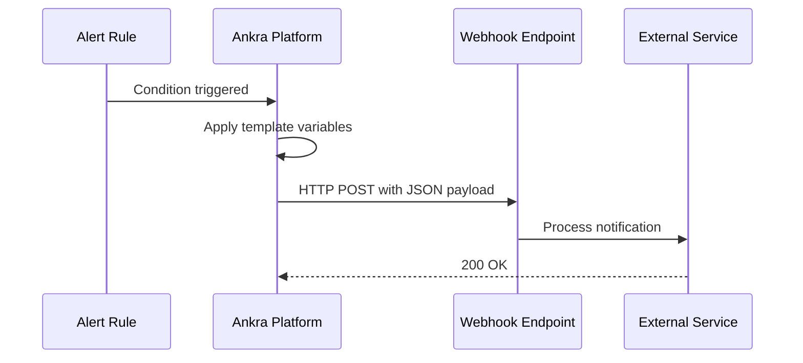

<Note>
Webhooks allow you to send alert notifications to any service that accepts HTTP POST requests - Slack, Microsoft Teams, Discord, PagerDuty, Opsgenie, Datadog, or your own custom endpoints.
</Note>

## What are Webhooks?

Webhooks are HTTP endpoints that receive alert notifications when your alert rules trigger. Ankra sends a POST request with alert details to your configured URL, allowing you to integrate with virtually any notification or incident management system.

Key features:
- **Universal compatibility** - Works with any service accepting webhooks
- **Custom payloads** - Full control over the JSON structure sent to your endpoint
- **Template variables** - Dynamic values like alert name, severity, and resource details
- **Pre-built templates** - Quick setup for popular services

### How Webhooks Work



---

## Home channel

Set an organisation **home channel** and Ankra starts the conversation itself. Whenever something important happens - a deployment or reconcile failure, an agent going offline, a new severe CVE - and **no routing rule matches it**, Ankra posts to the home channel. It is the default destination, so your team hears about important events before anyone wires up a single rule.

<Steps>
  <Step title="Connect Slack">
    Connect a Slack workspace to Ankra from the **Slack integration** in your organisation settings, and invite the Ankra bot to any private channel you want to use.
  </Step>
  <Step title="Pick the home channel">
    Open **AI** → **Settings** → **Workspaces**, find **Ankra's home**, choose a Slack channel, and save.
  </Step>
</Steps>

<Note>
Only **critical** and **warning** events reach the home channel; informational events stay in the in-app inbox. The home is a fallback - when a routing rule already matches an event it goes there instead, and the home is not double-notified. Alerts that already post to their own destinations are left to those destinations.
</Note>

---

## Creating a Webhook

<Steps>
  <Step title="Navigate to Webhooks">
    Go to **Alerts → Integrations → Webhooks** and click **Create Webhook**.
  </Step>
  
  <Step title="Configure Basic Settings">
    - **Webhook Name:** A descriptive name (e.g., "PagerDuty Production")
    - **Webhook URL:** The endpoint URL provided by your integration service
    - **Description:** Optional notes about this webhook's purpose
    - **Enabled:** Toggle to enable/disable the webhook

    For **Slack** and **Microsoft Teams** you can skip the URL entirely: once the Ankra app is installed in your Slack workspace, or the Ankra AI bot has been added to a Microsoft Teams team, the URL field is replaced by a **channel picker** and the Ankra bot posts the alerts itself. Teams channels are listed as *Team / Channel* across every team the bot is in - add the bot to a team first for its channels to appear. See [Connecting Microsoft Teams](/platform/ai-connections#connecting-microsoft-teams) for installing the bot.
  </Step>
  
  <Step title="Select or Create Template">
    Choose a pre-built template for common services, or create a custom JSON payload:
    
    - **Slack** - Rich message blocks with buttons
    - **Microsoft Teams** - Adaptive card format
    - **Discord** - Embed format with fields
    - **Custom JSON** - Any JSON structure for other services
  </Step>
  
  <Step title="Save and Test">
    Save the webhook, then use the **Test** button to send a sample notification and verify your configuration.
  </Step>
</Steps>

---

## Template Variables

Use these variables in your custom templates. They are replaced with actual values when the notification is delivered.

One destination stores one template, and that template renders **every** notification it receives - alert firings, alert resolutions, and the operational notifications a routing rule sends it. The tables below mark which of those a variable carries a value for.

### Notification

| Variable | Description | Example |
|----------|-------------|---------|
| `{{kind}}` | Notification kind identifier | "execution_failed" |
| `{{kind_label}}` | Human label for the kind | "Operation failed" |
| `{{title}}` | Notification headline | "Deployment failed for registry_pull_secret 'harbor-pull'" |
| `{{body}}` | Notification detail text | "Error: chart not found" |
| `{{message}}` | One-line summary - the title, or the alert name for alert firings | "Production Down Alert" |
| `{{name}}` | Destination name | "infra-channel" |
| `{{webhook_name}}` | Destination name, same value as `{{name}}` | "infra-channel" |
| `{{notification_type}}` | "triggered" or "resolved" | "triggered" |
| `{{notification_id}}` | Identifier of the notification | "abc123-def456" |
| `{{recurrence_count}}` | How many times this notification has recurred | "4" |
| `{{source}}` | Delivery pipeline | "alert_trigger", "cluster_notification" |
| `{{data}}` | Producer detail object for the kind, spliced in as JSON | `{"execution_id": "..."}` |
| `{{route_hint}}` | In-app deep link descriptor, spliced in as JSON | `{"name": "ORG_OPERATIONS_DETAIL"}` |

### Alert Information

Alert firings and resolutions carry all of these. Operational notifications carry `{{severity}}` and its two presentation values; the rest are empty for them, except a firing routed by a routing rule, which also carries `{{condition_type}}` and `{{trigger_value}}`.

| Variable | Description | Example |
|----------|-------------|---------|
| `{{alert_name}}` | Name of the alert, falling back to the rule name and then the notification title | "Production Down Alert" |
| `{{alert_id}}` | Unique alert identifier | "abc123-def456" |
| `{{rule_id}}` | Alert rule identifier | "def456-abc123" |
| `{{rule_name}}` | Alert rule name, or the kind label for operational notifications | "Cluster state check" |
| `{{trigger_id}}` | Identifier of this firing | "789abc-123def" |
| `{{severity}}` | Alert severity level | "critical", "warning", "info" |
| `{{severity_color}}` | Hex colour for severity | "#d9534f" |
| `{{severity_style}}` | Adaptive Card container style for severity | "attention", "warning", "accent" |
| `{{condition_type}}` | Condition types that fired, comma-separated | "cluster_state" |
| `{{trigger_value}}` | Observed value that met the condition | "cluster_state=online" |
| `{{trigger_details}}` | Full evaluation detail object, spliced in as JSON | `{"actual": 91, "threshold": 80}` |
| `{{resource_snapshot}}` | Resource state captured when the alert fired, spliced in as JSON | `{"state": "degraded"}` |
| `{{triggered_at}}` | Human-readable trigger time | "2026-08-22 09:15:04 UTC" |
| `{{triggered_at_iso}}` | ISO 8601 timestamp | "2026-08-22T09:15:04Z" |
| `{{resolved_at}}` | When the alert resolved | "2026-08-22T10:02:11Z" |
| `{{resolved_by}}` | Who resolved the alert | "sara@example.com" |
| `{{previous_status}}` | Status the alert held before this notification | "triggered" |

### Resource Information

Every notification kind fills what it has. Where a producer records no finer resource kind, `{{resource_type}}` reads as the thing that went wrong - "operation", "resource", "agent", "insight", "gitops repository", "security report". Agent notifications are about the agent on a cluster, so their `{{resource_name}}` is that cluster's name.

| Variable | Description | Example |
|----------|-------------|---------|
| `{{resource_name}}` | Name of the affected resource | "nginx-deployment" |
| `{{resource_type}}` | Kind of the affected resource | "addon", "manifest", "deployment" |
| `{{namespace}}` | Kubernetes namespace of the affected resource | "production" |
| `{{job_name}}` | Job or operation the notification is about | "deploy-nginx" |
| `{{cluster_id}}` | Cluster identifier | "abc123-def456" |
| `{{cluster_name}}` | Cluster the notification came from | "production-us-east" |

### Action URLs

| Variable | Description |
|----------|-------------|
| `{{alert_url}}` | Direct link to the firing in Ankra, or to the alerts dashboard when the notification has no firing page |
| `{{acknowledge_url}}` | Signed one-click acknowledge link (safe to put behind a button) |
| `{{dashboard_url}}` | Link to the Ankra dashboard |
| `{{snooze_url}}` | Link to the page the alert can be snoozed from |

### Empty values and fallbacks

No notification kind carries a value for every variable - a cluster-level alert has no job, an agent update has no condition. Two things stop that showing up as a column of blank rows in your card:

- **Empty rows are dropped for you.** After substitution Ankra removes the rows whose whole purpose was to show one value: Adaptive Card `FactSet` facts whose value came out empty (and a `FactSet` left with no facts), empty `TextBlock` entries, Slack `section` fields whose `*Label*` has no value under it, and the `{"name", "value"}` rows a Discord embed or a legacy Teams MessageCard carries. All four built-in presets therefore render correctly for every kind with no editing. Containers, columns and action sets are never removed, and a card is never pruned down to nothing.
- **You can supply your own fallback** with `{{variable|text}}`, for example `{{resource_name|not applicable}}`. The fallback is used both when the variable is unknown and when it resolves empty, so it wins over the row being dropped.

A variable name Ankra does not recognise renders as an empty string rather than as literal `{{...}}` text.

---

## Integration Examples

### Slack

Slack webhooks use the Block Kit format for rich messages:

```json
{
  "blocks": [
    {
      "type": "header",
      "text": {
        "type": "plain_text",
        "text": "🚨 Alert: {{alert_name}}"
      }
    },
    {
      "type": "section",
      "text": {
        "type": "mrkdwn",
        "text": "*Severity:* `{{severity}}`\n*Triggered:* {{triggered_at}}"
      }
    },
    {
      "type": "section",
      "fields": [
        { "type": "mrkdwn", "text": "*Resource:*\n{{resource_name}}" },
        { "type": "mrkdwn", "text": "*Cluster:*\n{{cluster_name}}" }
      ]
    },
    {
      "type": "actions",
      "elements": [
        {
          "type": "button",
          "text": { "type": "plain_text", "text": "View Alert" },
          "url": "{{alert_url}}"
        }
      ]
    }
  ]
}
```

<Tip>
Create a Slack webhook at **Your Workspace → Apps → Incoming Webhooks**.
</Tip>

### Microsoft Teams

Microsoft retired Office 365 Connectors, so a Teams channel no longer offers an "Incoming Webhook" — the supported route is a Power Automate (Workflows) flow using the **"Send webhook alerts to a channel"** template, which hands you an HTTP POST URL to paste into Ankra.

Payloads on that route must be **Adaptive Cards** wrapped in a `message` attachment. The legacy MessageCard format is silently degraded: the flow reports success, but Teams drops every `potentialAction` button. Use `{{severity_style}}` for the card colour — Adaptive Cards cannot consume the `{{severity_color}}` hex value:

```json
{
  "type": "message",
  "attachments": [
    {
      "contentType": "application/vnd.microsoft.card.adaptive",
      "contentUrl": null,
      "content": {
        "$schema": "http://adaptivecards.io/schemas/adaptive-card.json",
        "type": "AdaptiveCard",
        "version": "1.4",
        "msteams": { "width": "Full" },
        "body": [
          {
            "type": "Container",
            "style": "{{severity_style}}",
            "bleed": true,
            "items": [
              {
                "type": "TextBlock",
                "text": "{{alert_name}}",
                "weight": "Bolder",
                "size": "Large",
                "wrap": true
              },
              {
                "type": "TextBlock",
                "text": "Severity: {{severity}} | {{triggered_at}}",
                "spacing": "None",
                "isSubtle": true,
                "wrap": true
              }
            ]
          },
          {
            "type": "FactSet",
            "facts": [
              { "title": "Resource", "value": "{{resource_name}}" },
              { "title": "Cluster", "value": "{{cluster_name}}" },
              { "title": "Condition", "value": "{{condition_type}}" }
            ]
          }
        ],
        "actions": [
          { "type": "Action.OpenUrl", "title": "View Alert", "url": "{{alert_url}}" },
          { "type": "Action.OpenUrl", "title": "Acknowledge", "url": "{{acknowledge_url}}" }
        ]
      }
    }
  ]
}
```

<Tip>
The built-in **Microsoft Teams** template in the destination form already uses this Adaptive Card format — pick the Teams preset and adjust from there. For interactive alerts inside Teams without Power Automate, connect the Ankra bot instead: see [AI Connections](/platform/ai-connections).
</Tip>

### Discord

Discord uses the embed format:

```json
{
  "embeds": [
    {
      "title": "🚨 Alert: {{alert_name}}",
      "description": "**Severity:** `{{severity}}`",
      "color": 15158332,
      "fields": [
        { "name": "Resource", "value": "{{resource_name}}", "inline": true },
        { "name": "Cluster", "value": "{{cluster_name}}", "inline": true },
        { "name": "Triggered", "value": "{{triggered_at}}", "inline": false }
      ],
      "footer": { "text": "Ankra Alerts" },
      "timestamp": "{{triggered_at_iso}}"
    }
  ]
}
```

### PagerDuty

PagerDuty Events API v2 format:

```json
{
  "routing_key": "YOUR_INTEGRATION_KEY",
  "event_action": "trigger",
  "dedup_key": "{{alert_id}}",
  "payload": {
    "summary": "{{alert_name}} - {{severity}}",
    "severity": "{{severity}}",
    "source": "{{cluster_name}}",
    "component": "{{resource_name}}",
    "group": "{{resource_type}}",
    "class": "{{condition_type}}",
    "custom_details": {
      "resource_name": "{{resource_name}}",
      "resource_type": "{{resource_type}}",
      "cluster_name": "{{cluster_name}}",
      "triggered_at": "{{triggered_at}}"
    }
  },
  "links": [
    { "href": "{{alert_url}}", "text": "View in Ankra" }
  ]
}
```

<Tip>
Use PagerDuty's Events API v2 endpoint: `https://events.pagerduty.com/v2/enqueue`
</Tip>

### Opsgenie

Opsgenie Alert API format:

```json
{
  "message": "{{alert_name}}",
  "priority": "P1",
  "description": "Severity: {{severity}}\nResource: {{resource_name}}\nCluster: {{cluster_name}}",
  "tags": ["ankra", "{{severity}}", "{{resource_type}}"],
  "details": {
    "alert_id": "{{alert_id}}",
    "resource_name": "{{resource_name}}",
    "cluster_name": "{{cluster_name}}",
    "triggered_at": "{{triggered_at}}"
  }
}
```

### Custom/Generic

For any other service, create a JSON payload that matches their expected format:

```json
{
  "event_type": "alert",
  "alert": {
    "id": "{{alert_id}}",
    "name": "{{alert_name}}",
    "severity": "{{severity}}",
    "triggered_at": "{{triggered_at_iso}}"
  },
  "resource": {
    "name": "{{resource_name}}",
    "type": "{{resource_type}}",
    "cluster": "{{cluster_name}}"
  },
  "links": {
    "alert": "{{alert_url}}",
    "dashboard": "{{dashboard_url}}"
  }
}
```

---

## Testing Webhooks

After creating a webhook, use the **Test** button to:

1. Send a sample alert payload to your endpoint
2. Verify the message appears correctly in your target service
3. Confirm the JSON structure is valid for your integration

Test payloads populate **every** template variable, so a template that renders correctly under Test renders correctly on delivery - the Test button and the delivery pipeline run the same renderer. A real notification only fills the variables its kind has a value for, and the rows for the rest are dropped as described in [Empty values and fallbacks](#empty-values-and-fallbacks).

Testing a **routing rule** (Alerting → Routing rules → Test) sends the same sample through the rule's own kind, so you can check a rule and its destination's template together.

---

## Managing Webhooks

### Enable/Disable

Toggle webhooks on or off without deleting them. Disabled webhooks won't receive any notifications but retain their configuration.

### Edit

Update webhook URLs, templates, or settings at any time. Changes take effect immediately for future alerts.

### Delete

Remove webhooks you no longer need. Alerts using deleted webhooks will no longer send to that destination.

---

## Managing destinations and routes from the CLI

Everything above can be scripted with the `ankra` CLI, using the same personal access token as the rest of the CLI, so alert routing can live in Git and be applied from CI alongside your clusters. `-o json` and `-o yaml` keep the output parseable.

```bash
# Destinations (webhooks and bot channels)
ankra alerts destinations list
ankra alerts destinations create --name "Ops Slack" --url https://hooks.slack.com/services/...
ankra alerts destinations create --name "Platform Teams" --type teams \
  --channel-id "19:...@thread.tacv2" --teams-tenant-id <tenant-id>
ankra alerts destinations channels            # channels the Ankra bot can post to (Slack and Teams)
ankra alerts destinations test <destination-id>
ankra alerts destinations update <destination-id> --description "On-call room"
ankra alerts destinations delete <destination-id>

# Notification routes (which notifications reach which destination)
ankra alerts routes list
ankra alerts routes create --destination-id <destination-id> --kind alert_trigger_fired --severity critical
ankra alerts routes update <route-id> --priority 10 --mode exclude
ankra alerts routes test <route-id>
ankra alerts routes delete <route-id>
```

Updates send only the flags you pass, so the rest of a destination or route stays untouched. The same endpoints are available directly for other tooling under `/api/v1/org/alerts/integrations` and `/api/v1/org/notifications/routes` with a bearer token.

---


## Related

- [Alerts](/guides/alerts) - Configure alert rules that trigger webhook notifications
- [AI Incidents](/platform/ai-incidents) - AI-powered analysis of triggered alerts

---

Still have questions? [Join our Slack community](https://join.slack.com/t/ankra-community/shared_invite/zt-3a5rem8f8-cUho4epX2MoLT83bFf~VSA) and we'll help out.


