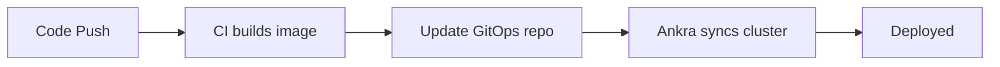

## What is Ankra?

Ankra is a Kubernetes platform that brings together three things teams usually piece together separately: a visual interface for building infrastructure, GitOps automation that plugs into existing pipelines, and AI that actually understands your clusters.

Import any cluster — EKS, GKE, AKS, on-prem, or local — and manage it from one place. Or provision managed clusters on Hetzner, OVHCloud, or UpCloud directly from the platform.

---

## How It Works

<CardGroup cols={3}>
  <Card
    title="Build Your Stack"
    icon="layer-group"
    href="quickstart"
  >
    Use the visual Stack Builder or AI Assistant to compose your Kubernetes environment. Add Helm charts, manifests, dependencies — deploy with one click.
  </Card>
  <Card
    title="Automate with GitOps"
    icon="code-branch"
    href="/essentials/cluster-gitops-multiple"
  >
    Connect your GitHub repo. Your stacks sync automatically. Push to main, your cluster updates. Plug into existing CI/CD without rearchitecting anything.
  </Card>
  <Card
    title="Manage with AI"
    icon="robot"
    href="/essentials/ai-assistant"
  >
    Ask the AI why a pod is crashing. Get proactive insights before incidents happen. Let AI design stacks, analyze root causes, and suggest fixes.
  </Card>
</CardGroup>

---

## Build Your Stack in the UI

Stop copy-pasting YAML between clusters. The Stack Builder gives you a visual canvas to compose Kubernetes environments that are reusable, versioned, and deployed consistently.

- **Visual drag-and-drop** — add Helm charts and manifests, define dependencies, configure values
- **AI-assisted composition** — describe what you need ("monitoring stack with Prometheus, Grafana, and alerting") and the AI recommends components, configurations, and deployment order
- **Variables** — parameterise manifests with organisation, cluster, and stack-level variables using `${{ ankra.variable_name }}` syntax
- **Clone across clusters** — replicate a stack from dev to staging to production in seconds
- **SOPS encryption** — encrypt secrets in your GitOps repository with built-in SOPS support


---

## Automate Through GitOps

Ankra's GitOps engine is designed to slot into your existing workflows, not replace them. Connect a GitHub repository, and your cluster configuration becomes code — versioned, reviewable, and automatically applied.

### Works with existing pipelines

Your CI builds and pushes container images. A commit to the GitOps repo updates the image tag. Ankra detects the change and deploys. No new tooling required.



### Modular repository structure

Split your configuration into files and folders with `include` paths. Different teams own different files. No merge conflicts, no giant config files.

```yaml
apiVersion: v1
kind: ImportCluster
metadata:
  name: my-cluster
spec:
  git_repository:
    provider: github
    credential_name: my-credential
    branch: main
    repository: my-org/my-repo
  stacks:
  - name: platform-stack
    manifests:
    - include: manifests/
    addons:
    - include: addons/
```

### Full audit trail

Every sync is tracked — commit SHA, trigger source, status, and timing. View sync history, monitor progress, and debug failures from the platform or via the API.

---

## Manage and Debug with AI

Ankra's AI isn't a generic chatbot bolted onto a dashboard. It has full context — your pod logs, Kubernetes manifests, stack deployments, resource states, events, and their relationships. This makes it exceptionally good at incident triangulation.

### AI Assistant

Press `⌘+J` from anywhere. The AI is page-aware — open a crashing pod and it already sees the logs, events, and manifest. Ask it anything:

- *"Why is this pod failing?"* — correlates logs, events, and resource state
- *"Create a monitoring stack with Prometheus and Grafana"* — designs and deploys a complete stack
- *"What changed in the last hour that could cause this?"* — cross-references deployment history with symptoms

### Proactive AI Insights

AI Insights scan your clusters on a schedule and surface issues before they become incidents:

- Root cause analysis with remediation commands
- Severity tracking and trend analytics (MTTR, category breakdowns)
- Adaptive scanning — critical issues scanned every 60s, healthy clusters every 10 minutes

### AI Incidents

When alerts trigger, the AI automatically collects pod status, events, logs, and node state — then delivers a structured analysis with root cause, affected resources, and recommended actions.

---

## Everything Else

<CardGroup cols={2}>
  <Card
    title="Resource Browser"
    icon="cubes"
    href="/essentials/kubernetes-workloads"
  >
    Browse pods, deployments, services, secrets, RBAC, storage, CRDs, and Helm releases. Tail logs. Edit configs. No kubectl required.
  </Card>
  <Card
    title="Alerts & Webhooks"
    icon="bell"
    href="/essentials/alerts"
  >
    Configure alerts with AI-powered incident analysis. Send notifications to Slack, webhooks, or any external system.
  </Card>
  <Card
    title="CLI"
    icon="terminal"
    href="/integrations/ankra-cli"
  >
    `ankra clone`, `ankra chat`, `ankra cluster`. Automate everything from your terminal or CI scripts.
  </Card>
  <Card
    title="Terraform Provider"
    icon="code"
    href="/integrations/terraform"
  >
    Manage Ankra resources as Terraform infrastructure-as-code.
  </Card>
  <Card
    title="Managed Clusters"
    icon="server"
    href="/essentials/hetzner-clusters"
  >
    Provision K3s clusters on Hetzner, OVHCloud, or UpCloud with automated networking, bastion access, and NAT gateways.
  </Card>
  <Card
    title="API Reference"
    icon="webhook"
    href="/api-reference/introduction"
  >
    Full REST API for programmatic access to clusters, stacks, insights, and operations.
  </Card>
</CardGroup>

---

## Quick Start

<Steps>
  <Step title="Sign up">
    Create an account at [platform.ankra.app](https://platform.ankra.app)
  </Step>
  <Step title="Add a cluster">
    Import an existing cluster by installing the Ankra agent, or provision a new one on Hetzner, OVHCloud, or UpCloud.
    ```bash
    helm install ankra-agent oci://ghcr.io/ankraio/ankra-agent \
      --set apiKey=YOUR_API_KEY
    ```
  </Step>
  <Step title="Build your first stack">
    Open the Stack Builder or press `⌘+J` and tell the AI what you need:
    *"Set up a monitoring stack with Prometheus, Grafana, and Loki"*
  </Step>
  <Step title="Connect GitOps">
    Link a GitHub repository in cluster settings. Your stacks are now version-controlled and automatically synced.
  </Step>
</Steps>

[Full Getting Started Guide →](quickstart)

---

## Next Steps

<CardGroup cols={3}>
  <Card
    title="Getting Started"
    icon="rocket"
    href="quickstart"
  >
    Step-by-step guide from first cluster to full GitOps pipeline.
  </Card>
  <Card
    title="CI/CD Pipeline Guide"
    icon="code-branch"
    href="/guides/cicd-pipeline"
  >
    Connect your app repos to Ankra GitOps for automated deployments.
  </Card>
  <Card
    title="Join the Community"
    icon="slack"
    href="https://join.slack.com/t/ankra-community/shared_invite/zt-3a5rem8f8-cUho4epX2MoLT83bFf~VSA"
  >
    Get help and share feedback.
  </Card>
</CardGroup>
