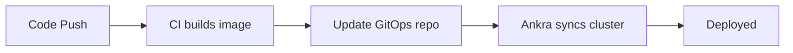

<Info>
  **Are you an AI agent or automating Ankra?** Don't drive the web UI with a
  browser. Connect over the [MCP server](/platform/mcp-server) (recommended) or
  the [CLI](/integrations/ankra-cli) - both give you the same tools the product's
  own AI uses, with scoped read/write access and a full audit trail. Your CI jobs
  can call the CLI directly too - see [Pipeline Agents](/guides/pipeline-agents).
  Setup is in [Connect an AI agent](#connect-an-ai-agent) below.
</Info>

<Frame caption="Ankra Platform Overview">
  <video
    controls
    autoPlay
    muted
    loop
    playsInline
    className="w-full aspect-video rounded-xl"
    src="https://fsn1.your-objectstorage.com/ankra-vod/import-cluster.mp4"
  ></video>
</Frame>

## What is Ankra?

Ankra is one platform to build, deploy, and debug Kubernetes - operated from whichever surface fits the job: the **web UI** for humans, the **CLI** for terminals and scripts, an **AI agent over MCP** for Claude, Cursor, and other MCP clients, or your **CI/CD pipelines**.

Import any cluster - EKS, GKE, AKS, on-prem, or local - and manage it from one place. Or provision managed clusters on Hetzner, OVHCloud, or UpCloud directly from the platform.

All four surfaces share one tool registry: the same 169 tools power the in-product AI Assistant, the MCP server, chat over Slack and Microsoft Teams, and SCM comments - so what you can ask Ankra to do is the same everywhere.

---

## Four Ways to Operate Ankra

<CardGroup cols={2}>
  <Card
    title="Web UI"
    icon="browser"
    href="/get-started/quickstart"
  >
    The visual Stack Builder, the `⌘+J` AI Assistant with Ask, Agentic, and Plan modes, and a full Kubernetes resource browser. Built for humans.
  </Card>
  <Card
    title="CLI"
    icon="terminal"
    href="/integrations/ankra-cli"
  >
    `ankra chat "..." --mode ask|agent` for one-shot AI turns, `ankra cluster apply -f` for declarative cluster operations. Built for terminals, scripts, and CI.
  </Card>
  <Card
    title="MCP for AI Agents"
    icon="plug"
    href="/platform/mcp-server"
  >
    A remote MCP server exposing 169 tools with `mcp:read`/`mcp:write` scopes and OAuth. Built for Claude, Cursor, and any other MCP client.
  </Card>
  <Card
    title="CI/CD & IaC"
    icon="code-branch"
    href="/guides/cicd-pipeline"
  >
    GitHub Actions and GitLab image-bump pipelines, Pipeline Agents (plain CI jobs that call the CLI), and a Terraform provider. Built for your delivery workflows.
  </Card>
</CardGroup>

---

## Connect an AI agent

Ankra is built to be operated by agents, not just people. **No browser needed:
don't scrape the platform or automate the web UI** - connect over MCP or the CLI
instead.

**Fastest path for Claude Code** - register the MCP server once, then authenticate
with `/mcp`:

```bash
claude mcp add --transport http ankra https://platform.ankra.app/api/v1/mcp
```

For Claude desktop/web add Ankra as a custom connector; for Cursor drop the
endpoint into your MCP config. Full setup for every client, token scopes, and the
OAuth flow are in the [MCP Server guide](/platform/mcp-server).

Then teach your editor's agent Ankra's conventions - `ankra skills install`
installs Ankra's curated Agent Skills into Cursor (default) or Claude Code
(`--editor claude-code`).

<CardGroup cols={2}>
  <Card
    title="MCP Tool Reference"
    icon="wrench"
    href="/platform/mcp-tools"
  >
    Every tool the MCP server exposes, the scope it needs, and whether it targets
    a specific cluster.
  </Card>
  <Card
    title="AI Skills"
    icon="robot"
    href="/platform/ai-skills"
  >
    Teach Ankra's AI your conventions with organisation-scoped skills that
    override the platform defaults.
  </Card>
  <Card
    title="Pipeline Agents"
    icon="code-branch"
    href="/guides/pipeline-agents"
  >
    Plain CI jobs that call `ankra chat` and `ankra cluster apply` - PR review,
    deploy watching, health checks. No framework to run.
  </Card>
  <Card
    title="Hermes"
    icon="comments"
    href="/integrations/hermes"
  >
    Ankra's autonomous infrastructure agent, operated from Slack, Discord, or
    Telegram chat.
  </Card>
</CardGroup>

<Tip>
  Start read-only (`mcp:read`) to explore, then grant `mcp:write` when the agent
  should apply changes. Every resolved tool call - including refused ones - is
  written to the organisation audit log.
</Tip>

---

## Build Your Stack in the UI

Stop copy-pasting YAML between clusters. The Stack Builder gives you a visual canvas to compose Kubernetes environments that are reusable, versioned, and deployed consistently.

- **Visual drag-and-drop** - add Helm charts and manifests, define dependencies, configure values
- **AI-assisted composition** - describe what you need ("monitoring stack with Prometheus, Grafana, and alerting") and the AI recommends components, configurations, and deployment order
- **Variables** - parameterise manifests with organisation, cluster, and stack-level variables using `${{ ankra.variable_name }}` syntax
- **Clone across clusters** - replicate a stack from dev to staging to production in seconds
- **SOPS encryption** - encrypt secrets in your GitOps repository with built-in SOPS support


---

## Automate Through GitOps and CI/CD

Ankra's GitOps engine is designed to slot into your existing workflows, not replace them. Connect a GitHub repository, and your cluster configuration becomes code - versioned, reviewable, and automatically applied.

### Works with existing pipelines

Your CI builds and pushes container images. A commit to the GitOps repo updates the image tag. Ankra detects the change and deploys. No new tooling required.



### Modular repository structure

Split your configuration into files and folders with `include` paths. Different teams own different files. No merge conflicts, no giant config files.

```yaml
apiVersion: v1
kind: ImportCluster
metadata:
  name: my-cluster
spec:
  git_repository:
    provider: github
    credential_name: my-credential
    branch: main
    repository: my-org/my-repo
  stacks:
    - name: platform-stack
      manifests:
        - include: manifests/
      addons:
        - include: addons/
```

### Full audit trail

Every sync is tracked - commit SHA, trigger source, status, and timing. View sync history, monitor progress, and debug failures from the platform or via the API.

### Plug in your pipelines

<CardGroup cols={2}>
  <Card
    title="GitHub Actions Pipeline"
    icon="github"
    href="/guides/cicd-pipeline"
  >
    The canonical build → push → image-bump → sync pipeline for GitHub repositories.
  </Card>
  <Card
    title="GitLab Pipeline"
    icon="gitlab"
    href="/guides/gitlab-cicd-pipeline"
  >
    The same pipeline for GitLab CI, using the GitLab Container Registry and CI variables.
  </Card>
  <Card
    title="Pipeline Agents"
    icon="robot"
    href="/guides/pipeline-agents"
  >
    Turn plain CI jobs into infrastructure agents with `ankra chat` and `ankra cluster apply --wait`.
  </Card>
  <Card
    title="Applications (Closed Beta)"
    icon="rocket"
    href="/concepts/applications"
  >
    Repo in, generated Dockerfile, Helm chart, and CI/CD out - shipped as a stack.
  </Card>
</CardGroup>

Prefer infrastructure-as-code? The [Terraform provider](/integrations/terraform) manages clusters, stacks, manifests, and add-ons declaratively.

---

## Manage and Debug with AI

Ankra's AI isn't a generic chatbot bolted onto a dashboard. It has full context - your pod logs, Kubernetes manifests, stack deployments, resource states, events, and their relationships. This makes it exceptionally good at incident triangulation.

### AI Assistant

Press `⌘+J` from anywhere. Choose **Ask** (read-only), **Agentic** (confirm each change), or **Plan** (approve once, then execute). The AI is page-aware - open a crashing pod and it already sees the logs, events, and manifest. Ask it anything:

- *"Why is this pod failing?"* - correlates logs, events, and resource state
- *"Create a monitoring stack with Prometheus and Grafana"* - designs and deploys a complete stack
- *"What changed in the last hour that could cause this?"* - cross-references deployment history with symptoms

### Proactive AI Insights

AI Insights scan your clusters on a schedule and surface issues before they become incidents:

- Root cause analysis with remediation commands
- Severity tracking and trend analytics (MTTR, category breakdowns)
- Adaptive scanning - critical issues scanned every 60s, healthy clusters every 10 minutes

### AI Incidents

When alerts trigger, the AI automatically collects pod status, events, logs, and node state - then delivers a structured analysis with root cause, affected resources, and recommended actions.

---

## Everything Else

<CardGroup cols={2}>
  <Card
    title="Resource Browser"
    icon="cubes"
    href="/platform/kubernetes-workloads"
  >
    Browse pods, deployments, services, secrets, RBAC, storage, CRDs, and Helm releases. Tail logs. Edit configs. No kubectl required.
  </Card>
  <Card
    title="Alerts & Webhooks"
    icon="bell"
    href="/guides/alerts"
  >
    Configure alerts with AI-powered incident analysis. Send notifications to Slack, webhooks, or any external system.
  </Card>
  <Card
    title="Managed Clusters"
    icon="server"
    href="/guides/hetzner-clusters"
  >
    Provision K3s clusters on Hetzner, OVHCloud, or UpCloud with automated networking, bastion access, and NAT gateways.
  </Card>
  <Card
    title="Cloud Cost"
    icon="coins"
    href="/platform/cloud-cost"
  >
    Estimated spend per cluster and across your fleet, broken down by compute, storage, and namespace.
  </Card>
  <Card
    title="Stack Profiles"
    icon="copy"
    href="/concepts/stack-profiles"
  >
    Capture a working stack as a reusable, versioned, parameterised template and roll it out anywhere.
  </Card>
  <Card
    title="kubectl Access"
    icon="terminal"
    href="/guides/kubeconfig"
  >
    Give teammates scoped, SSO-backed `kubectl` access through Ankra's proxy - even to private clusters.
  </Card>
  <Card
    title="Fleet Dashboard"
    icon="map"
    href="/platform/dashboard"
  >
    A world map of every cluster with health and cost rollups across your whole organisation.
  </Card>
  <Card
    title="API Reference"
    icon="webhook"
    href="/api-reference/introduction"
  >
    Full REST API for programmatic access to clusters, stacks, insights, and operations.
  </Card>
</CardGroup>

---

## Quick Start

<Steps>
  <Step title="Sign up">
    Create an account at [platform.ankra.app](https://platform.ankra.app)
  </Step>
  <Step title="Add a cluster">
    Import an existing cluster by installing the Ankra agent, or provision a new one on Hetzner, OVHCloud, or UpCloud.
    ```bash
    helm upgrade --install ankra-agent oci://ghcr.io/ankraio/ankra-agent/ankra-agent \
      --namespace ankra \
      --create-namespace \
      --set config.token="YOUR_UNIQUE_TOKEN"
    ```
  </Step>
  <Step title="Build your first stack">
    Open the Stack Builder or press `⌘+J` and tell the AI what you need:
    *"Set up a monitoring stack with Prometheus, Grafana, and Loki"*
  </Step>
  <Step title="Connect GitOps">
    Link a GitHub repository in cluster settings. Your stacks are now version-controlled and automatically synced.
  </Step>
</Steps>

[Full Getting Started Guide →](/get-started/quickstart)

---

## Next Steps

<CardGroup cols={3}>
  <Card
    title="Getting Started"
    icon="rocket"
    href="/get-started/quickstart"
  >
    Step-by-step guide from first cluster to full GitOps pipeline.
  </Card>
  <Card
    title="Pipeline Agents"
    icon="robot"
    href="/guides/pipeline-agents"
  >
    Turn plain CI jobs into infrastructure agents with the Ankra CLI.
  </Card>
  <Card
    title="Join the Community"
    icon="slack"
    href="https://join.slack.com/t/ankra-community/shared_invite/zt-3a5rem8f8-cUho4epX2MoLT83bFf~VSA"
  >
    Get help and share feedback.
  </Card>
</CardGroup>
