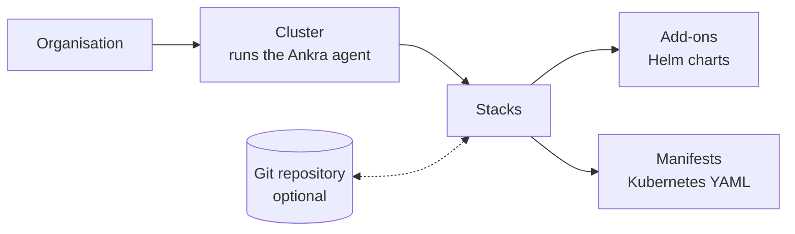

Running Kubernetes well usually means a pile of Helm values, a GitOps tool to babysit, a runbook per failure, and one person who knows how it all fits together. Ankra is the AI platform engineer that takes that pile off your team: you describe what a cluster should run, Ankra deploys it and keeps it in sync, and its AI reads your logs, events and deploy history to tell you why something broke and how to fix it.

It is built for platform engineers and developers who want production Kubernetes without hand-maintaining the machinery around it.

<Frame caption="Connect a cluster and deploy a first Stack">
  <video
    controls
    autoPlay
    muted
    loop
    playsInline
    className="w-full aspect-video rounded-xl"
    src="https://fsn1.your-objectstorage.com/ankra-vod/import-cluster.mp4"
  ></video>
</Frame>

## What you can do with Ankra

<CardGroup cols={2}>
  <Card title="Get a cluster" icon="server" href="/guides/import-cluster">
    Connect the cluster you already run (EKS, GKE, AKS, k3s, on-prem, even minikube) with one helm command, or have Ankra build a new one on your own cloud account.
  </Card>
  <Card title="Deploy what it runs" icon="layer-group" href="/concepts/stacks">
    Compose Helm charts and manifests into a Stack, visually or by asking the AI, and deploy the same Stack to every cluster that needs it.
  </Card>
  <Card title="Find out why it broke" icon="magnifying-glass" href="/platform/ai-assistant">
    Ask "why is this pod failing?" on any page. The AI already has the logs, events, manifests and recent deploys, and proposes a fix you approve.
  </Card>
  <Card title="Automate it" icon="terminal" href="/integrations/ankra-cli">
    Everything in the UI is also available from the `ankra` CLI, from your AI assistant over MCP, and from your CI pipelines.
  </Card>
</CardGroup>

## How it fits together


```mermaid
flowchart LR
    O[Organisation] --> C[Cluster<br/>runs the Ankra agent]
    C --> S[Stacks]
    S --> A[Add-ons<br/>Helm charts]
    S --> M[Manifests<br/>Kubernetes YAML]
    G[(Git repository<br/>optional)] <-.-> S
```

- An **organisation** is your team's account: members, roles, credentials and billing.
- A **cluster** is any Kubernetes cluster running the lightweight [Ankra agent](/concepts/cluster-agent). The agent connects out to Ankra, so it works behind firewalls and NAT.
- A **Stack** is what a cluster should run: [add-ons](/concepts/addons) (Helm charts) and [manifests](/concepts/stacks#manifests) (your own YAML), with [variables](/concepts/variables) for what differs between clusters.
- **Git is optional.** Stacks deploy straight through the agent. Connect a repository when you want every change reviewed and versioned, and edits flow both ways - see [GitOps](/concepts/gitops).

## Start in 15 minutes

The [Quickstart](/get-started/quickstart) takes you from nothing to a connected cluster, a deployed Stack and your first answer from the AI. You do not need a cluster to follow it: the free [playground](/guides/cluster-sandbox) gives you a real one in about two minutes.

<Card title="Open the Quickstart" icon="rocket" href="/get-started/quickstart" horizontal>
  One path, a visible result at every step.
</Card>

## Work from your own tools

The web UI, the CLI, the MCP server and the in-product AI all use the same tools and the same permissions, so anything you can do in one you can do in the others.

<Tabs>
  <Tab title="CLI">
    ```bash
    brew install ankraio/tap/ankra
    ankra login
    ankra chat "why is the payments pod crashing?" --cluster prod
    ```

    See the [Ankra CLI](/integrations/ankra-cli) guide.
  </Tab>
  <Tab title="AI assistants (MCP)">
    Connect Claude, Cursor or any other MCP client to Ankra's remote MCP server. For Claude Code, register it once and sign in with `/mcp`:

    ```bash
    claude mcp add --transport http ankra https://platform.ankra.app/api/v1/mcp
    ```

    Then run `ankra skills install` to teach the assistants on your machine Ankra's conventions. Setup for every client is in the [MCP Server](/platform/mcp-server) guide, and the [MCP Tool Reference](/platform/mcp-tools) lists every tool.
  </Tab>
  <Tab title="CI/CD">
    Your pipeline builds and pushes an image, commits the new tag to your GitOps repository, and Ankra deploys it - [Ship Your App](/guides/deliver-your-app) compares this with letting Ankra build and redeploy on every merge. Plain CI jobs can also call `ankra chat` and `ankra cluster apply` - see [Use the ankra CLI in CI](/guides/pipeline-agents).
  </Tab>
</Tabs>

<Note>
**Automating Ankra or building an agent on it?** Use the [MCP server](/platform/mcp-server) or the [CLI](/integrations/ankra-cli) rather than driving the web UI with a browser. Both use scoped tokens, and every call lands in your organisation's audit log.
</Note>

## Where to go next

<CardGroup cols={3}>
  <Card title="Add a cluster" icon="plus" href="/guides/import-cluster">
    Import one you have, or pick a provider for a new one.
  </Card>
  <Card title="How Stacks work" icon="layer-group" href="/concepts/stacks">
    The model behind everything you deploy.
  </Card>
  <Card title="AI Assistant" icon="robot" href="/platform/ai-assistant">
    What the AI can see, and what it may change.
  </Card>
  <Card title="Security" icon="shield" href="/security/overview">
    What Ankra can access, and how to restrict it.
  </Card>
  <Card title="Cloud Cost" icon="coins" href="/platform/cloud-cost">
    What each cluster, namespace and Stack costs.
  </Card>
  <Card title="API Reference" icon="code" href="/api-reference/introduction">
    The REST API behind every surface.
  </Card>
</CardGroup>

Need a hand? [Contact support](/platform/support) or ask in the [Ankra community Slack](https://join.slack.com/t/ankra-community/shared_invite/zt-3a5rem8f8-cUho4epX2MoLT83bFf~VSA).
