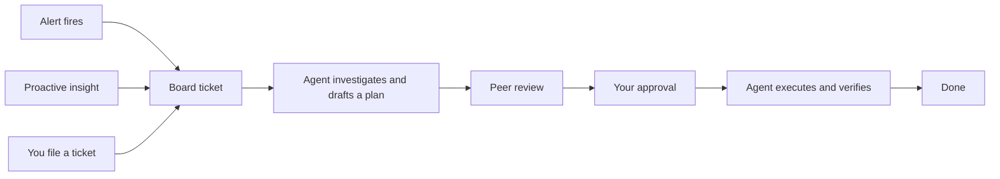

The **AI** entry in the sidebar opens a workspace where Ankra's AI investigates, plans, and fixes things across your fleet while you stay in control of anything risky. This page maps the surfaces inside it and how a piece of work moves between them.

<Info>
The AI section is rolling out per organisation. If you do not see **AI** in the sidebar, ask your Ankra contact to enable it for your organisation.
</Info>

## The surfaces

<CardGroup cols={2}>
  <Card title="Home">
    Mission control: what is waiting on you, what agents are working on, budgets, and the fastest way into everything else.
  </Card>
  <Card title="Board" href="/platform/ai-board">
    Every unit of AI work as a ticket - from triage through plan approval to done.
  </Card>
  <Card title="Chat" href="/platform/ai-assistant">
    Ask the AI Assistant to investigate, deploy, or fix anything, in a conversation.
  </Card>
  <Card title="Inbox">
    The triage stream for humans: approvals to decide, tickets that need you, incidents, insights, and the autonomous-run record.
  </Card>
  <Card title="Alerts" href="/guides/alerts">
    Alert rules and destinations. A firing alert is what feeds auto-remediation and files incident tickets.
  </Card>
  <Card title="Automations" href="/platform/ai-automations">
    Workflows on a canvas: triggers, agent steps, conditions, approval gates, and outputs.
  </Card>
  <Card title="AI Agents" href="/platform/ai-agents">
    The roster of standing agents - your AI team, their triggers, autonomy, and budgets.
  </Card>
  <Card title="Settings" href="/platform/ai-autonomy">
    Organisation-wide controls: models, autonomy, workspaces, connections, memory, and feedback.
  </Card>
</CardGroup>

**Guided setup** lives under Home and walks an admin through the initial configuration - see [Guided setup](/platform/ai-guided-setup).

## How work flows

Everything the AI does converges on the [Board](/platform/ai-board). Work arrives from four directions: a firing alert spawns remediation, a proactive insight is auto-filed, an [automation](/platform/ai-automations) reaches an approval gate, or a person files a ticket by hand.

<Frame>

</Frame>

An agent picks the ticket up, investigates, and drafts a plan. Another agent can peer-review it, then the ticket parks at **Awaiting approval** until a person approves the plan. Approval starts the work; risky individual actions still ask for confirmation in the Inbox as they happen, according to your [autonomy policy](/platform/ai-autonomy).

## Board, Inbox, or Alerts?

The three surfaces overlap in name more than in purpose:

| Surface | It answers | You go there to |
|---------|-----------|-----------------|
| **Board** | What is the AI working on? | Follow a ticket, review a plan, reassign or close work |
| **Inbox** | What needs a human right now? | Approve or deny actions, unblock tickets, scan incidents and insights |
| **Alerts** | What conditions page us? | Create alert rules and route notifications to destinations |

The Inbox pins pending approvals to the top and its sidebar badge counts only those, so an empty badge means nothing is waiting on you.

## Cost controls

Ankra's AI runs on a free monthly allowance funded by the platform, with a daily spend cap on top. When the allowance runs out, you can add your own key and keep going - see [AI Usage](/platform/ai-usage) and [Use your own OpenRouter API key](/guides/openrouter-api-key).

## Getting started

Open [Guided setup](/platform/ai-guided-setup) from AI Home. Five steps - model, guardrails, connections, proactive monitoring, launch - get an organisation from nothing to a working AI team, and every step links to the settings page that owns it.
