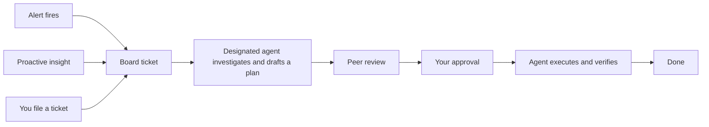

import { CliVersion } from "/snippets/cli-version.jsx";

Ankra's AI investigates problems across your clusters, drafts fixes, and, where you allow it, applies them. Out of the box, nothing that is already running changes until a person approves it: every write the AI proposes stops for confirmation, and you decide how much more it may do on its own - per person, per connection, per agent, and when an alert fires. It runs on Ankra's default models within a free monthly allowance, or on your own provider key.

## What the AI does for you

- **Investigate a problem** - open the failing resource, press `⌘J`, and ask why. The assistant reads its logs, events, manifest and Stack history. See [AI Assistant](/platform/ai-assistant).
- **Build or change a Stack** - describe what you need and it proposes the add-ons, their order and starting values. See [Building a Stack](/concepts/stacks#building-a-stack).
- **Explain a firing alert** - an alert firing gets an AI analysis with the root cause and recommended actions. See [Alert-triggered analysis](/platform/ai-insights#alert-triggered-analysis).
- **Find problems before they page you** - scheduled scans raise findings with a root cause and a fix. See [AI Insights](/platform/ai-insights).
- **Review pull requests** - a verdict and findings on every pull request, and answers to `@ankraai` mentions. See [AI code review](/platform/ai-code-review).
- **Work tickets** - agents pick up tickets, draft a plan, and execute it once a person approves. See [AI Board](/platform/ai-board), [AI Agents](/platform/ai-agents) and [AI Automations](/platform/ai-automations).

## What it can change without asking

Five controls bound what the AI may do, each with a safe default. A chat write that runs without a confirmation card is recorded in the [audit log](/guides/audit-log) with the autonomy setting that allowed it.

| Control | Default | Options | Where it is set |
|---|---|---|---|
| **Chat mode** - what the AI Assistant may do in your own conversations | **Agent**: runs tools and asks before every cluster write | **Ask**: read-only, plus throwaway AI workspaces and PR demos. **Agent**: can act, asks first. **Plan**: you approve a plan before any write (web chat only) | The chat's **AI settings** → **Interaction mode**, or `ankra chat --mode`. Each person sets their own |
| **Chat autonomy** - whether Agent-mode writes stop for your confirmation | **Manual**: every write asks | **Auto**: low-risk, reversible writes and Stack deploys that remove nothing run at once with a receipt; everything else still asks | The chat's **AI settings** → **Autonomy**. Each person sets their own |
| **Connection AI mode** - what the AI may do when talked to from Slack, Teams, or a pull request | **Ask** for Slack and Teams. Source-control connections start with every capability off | **Ask**: read-only, plus throwaway workspaces and PR demos. **Agent**: can act and open fix pull requests; other destructive changes still ask | **AI** → **Settings** → **Connections**, per connection; the default under **Workspaces**. Admins only |
| **Agent autonomy** - what a standing AI agent may do when it runs | **Propose** | **Observe**: never proposes or makes changes. **Propose**: suggests actions, a person approves each. **Autonomous**: low-risk reversible actions run at once, riskier ones wait for approval | **AI** → **Agents**, per agent. Admins only |
| **Remediation policy** - what happens when an alert fires | **Off**. Switched on, it starts at **Propose**, 5 actions per incident, and a 30-minute cooldown before the same alert on the same cluster is picked up again | **Observe only**, **Propose** (every action goes to Slack for approval), **Autonomous** (low-risk reversible actions run, the rest ask). Per-action rules: **Run automatically**, **Ask on Slack**, **Never run** | **AI** → **Settings** → **Autonomy**. Admins only |

Whatever **Auto** or **Autonomous** allows, these always wait for a person:

- **Cluster lifecycle** - creating, scaling, upgrading, stopping, moving or deleting a cluster, its node pools or its control plane.
- **Removals** - a Stack change that would remove or replace a deployed add-on or manifest, or delete a Stack.
- **High-risk and irreversible writes**, and a Stack change whose validation failed.
- **Alert silences** - muting an alert always needs a person.

Writes into protected namespaces (`kube-*`, `ankra-*`, and system namespaces such as `cert-manager` and `vault`) are refused outright in every mode, and Kubernetes Secret values are withheld from the model. The exception to all of this is a remediation per-action rule set to **Run automatically**: that action runs with no approval card, so set it only for an action you would approve every time.

### Stopping the AI

Two organisation-wide stops, from least to most disruptive. Both take effect immediately and need organisation **admin**.

1. **Pause autonomous actions** - chat, diagnosis and read-only investigation keep working, but nothing changes without a person approving it. It switches off the remediation policy and pauses every running agent; resuming restores exactly what it switched off.
2. **Stop all AI** - the emergency stop. It cancels every running AI session and agent run, expires pending approvals, and blocks chat for everyone until an admin resumes it.

Both are on **AI** → **Settings** → **Autonomy**, and in the CLI:

<CliVersion since="0.13.0" />

```bash
ankra ai autonomy pause --reason "investigating a bad deploy"
ankra ai autonomy stop-all --reason "incident in progress"
```

`ankra ai autonomy resume` and `ankra ai autonomy start-all` undo them. See [AI Autonomy](/platform/ai-autonomy).

## Where you can use it

| Where | How | Page |
|---|---|---|
| **Ankra web** | Press `⌘J` (`Ctrl+J` on Windows and Linux) on any page. The assistant starts from what you are looking at | [AI Assistant](/platform/ai-assistant) |
| **Slack** | Mention **@Ankra** in a channel or message it directly | [Connecting Slack](/platform/ai-connections#connecting-slack) |
| **Microsoft Teams** | Mention **@Ankra AI** in a channel or chat | [Connecting Microsoft Teams](/platform/ai-connections#connecting-microsoft-teams) |
| **Pull requests** | Mention `@ankraai` in a GitHub, GitLab or Bitbucket comment | [AI code review](/platform/ai-code-review) |
| **Your editor** | Connect Claude, Cursor or another MCP client to Ankra's MCP server | [MCP Server](/platform/mcp-server) |
| **Terminal** | `ankra chat --mode ask "why is my-app crashing?"` | [`ankra chat`](/reference/cli/chat) |

`ankra chat` accepts `--mode ask` or `--mode agent`; without it, the chat runs in Agent mode. Every surface uses the same tools and the same permission checks, and answers with the permissions of the person asking.

## Models and cost

On Ankra's default models, chat routes each question to one of three tiers: **Expert** (Kimi K3), **Think** (GLM 5.3) and **Quick** (Claude Haiku 4.5). Usage is priced per request and counted against a free monthly allowance per organisation - USD 10 on Free, USD 50 on Startup, USD 200 on Enterprise - and an optional daily spend cap you set yourself under **Billing** → **Overview**. When the allowance runs out, platform-funded AI pauses until the next month, and the rest of Ankra keeps working.

With your own OpenRouter, Anthropic or OpenAI-compatible key, usage bills to your account and never draws on the allowance. See [Models and Cost](/platform/ai-provider) and [Bring your own OpenRouter API key](/guides/openrouter-api-key).

## How work flows

Everything the AI does in the AI section converges on the [Board](/platform/ai-board). Work arrives from four directions: a firing alert spawns remediation, a proactive insight is filed, an [automation](/platform/ai-automations) reaches an approval gate, or a person files a ticket by hand.

<Frame>

```mermaid
flowchart LR
    A[Alert fires] --> T[Board ticket]
    I[Proactive insight] --> T
    H[You file a ticket] --> T
    T --> W[Designated agent investigates and drafts a plan]
    W --> R[Peer review]
    R --> P[Your approval]
    P --> E[Agent executes and verifies]
    E --> D[Done]
```
</Frame>

Nothing works a ticket until an admin designates a board worker under **AI** → **Settings** → **Autonomy**: until then, every ticket the AI files is escalated straight to a person. Once one is designated, it investigates and drafts a plan. The plan waits for a reviewer agent - bind one, or turn the review requirement off, on the same page - and then for a person to approve it. Risky individual actions still ask in the Inbox as they happen.

| Surface | It answers | You go there to |
|---------|-----------|-----------------|
| **Board** | What is the AI working on? | Follow a ticket, review a plan, reassign or close work |
| **Inbox** | What needs a person right now? | Approve or deny actions, unblock tickets, scan incidents and insights |
| **Alerts** | What conditions page us? | Create alert rules and route notifications |

## Get started

Press `⌘J` on a cluster page and ask what needs attention. To set up the rest of the AI section, an admin opens [Guided setup](/platform/ai-guided-setup) from **AI** → **Home**.
