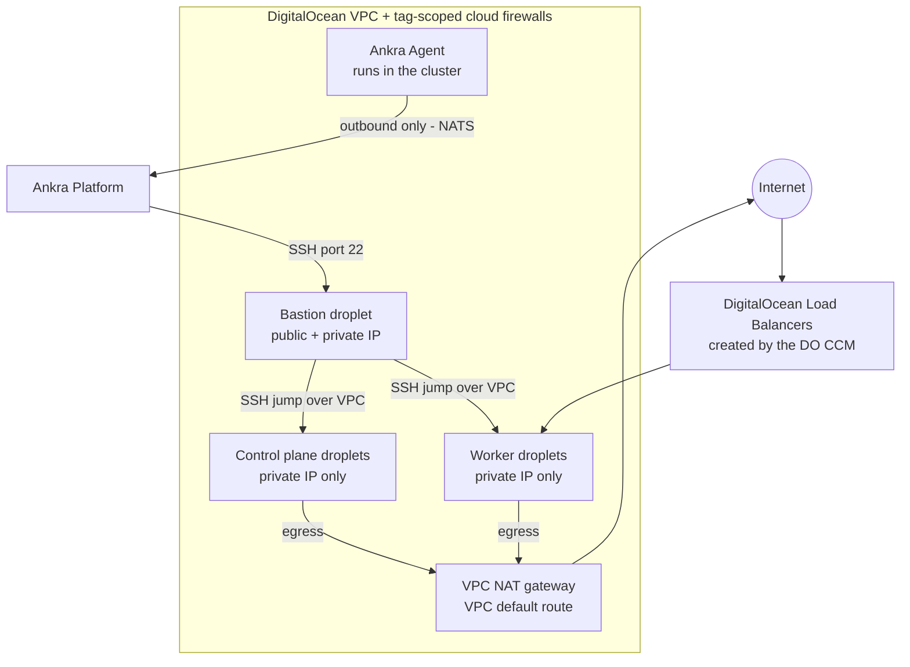

Reference material for [DigitalOcean clusters](/guides/digitalocean-clusters).

---

## Cluster Configuration Options

| Parameter | Default | Description |
|-----------|---------|-------------|
| `name` | *required* | Unique cluster name |
| `credential_id` | *required* | DigitalOcean API credential ID |
| `ssh_key_credential_id` | *required* | SSH key credential ID |
| `region` | *required* | DigitalOcean region slug |
| `network_ip_range` | `10.0.0.0/16` | Private VPC IP range |
| `bastion_size` | `s-1vcpu-1gb` | Droplet size for the bastion host |
| `control_plane_count` | `1` | Number of control plane nodes (1 or 3) |
| `control_plane_size` | `s-2vcpu-4gb` | Droplet size for control planes |
| `worker_count` | `1` | Number of worker nodes (legacy, use `node_groups` instead) |
| `worker_size` | `s-2vcpu-4gb` | Droplet size for workers (legacy, use `node_groups` instead) |
| `node_groups` | | Array of node group definitions; `node_groups` wins when `worker_count` is also given |
| `distribution` | `kubeadm` | Kubernetes distribution (`kubeadm` or `k3s`) |
| `kubernetes_version` | *latest stable* | Kubernetes version (optional) |
| `cni` | `cilium` (kubeadm), `flannel` (k3s) | CNI plugin. Follows the distribution when omitted; kubeadm clusters always use `cilium` |
| `cni_features` | *all off* | CNI feature toggles, fixed at creation. See [Choices fixed at create time](/guides/operate-ankra-managed-clusters#choices-fixed-at-create-time) |
| `etcd_topology` | `stacked` | kubeadm only. `stacked` or `external` (dedicated etcd droplets) |
| `etcd_node_count` | `3` | kubeadm `external` topology only (3 or 5) |
| `etcd_size` | `s-2vcpu-4gb` | kubeadm `external` topology only. Droplet size for etcd nodes |
| `include_networking` | `true` | Deploy the networking stack: Traefik, cert-manager and a `letsencrypt-prod` Let's Encrypt ClusterIssuer |
| `include_dns` | `true` | Give the cluster a delegated subdomain on `ankra.cc` with external-dns wired |

### DigitalOcean Regions

| Region | Location |
|--------|----------|
| `nyc3` | New York 3, United States |
| `sfo3` | San Francisco 3, United States |
| `ams3` | Amsterdam 3, Netherlands |
| `sgp1` | Singapore 1, Singapore |
| `lon1` | London 1, United Kingdom |
| `fra1` | Frankfurt 1, Germany |

<Note>
Available regions and sizes depend on your account. Use `ankra cluster digitalocean regions` and `ankra cluster digitalocean sizes` to list what your credential can deploy.
</Note>

### Common Droplet Sizes

| Size | vCPUs | RAM | Typical use |
|------|-------|-----|-------------|
| `s-1vcpu-1gb` | 1 | 1 GB | Bastion |
| `s-1vcpu-2gb` | 1 | 2 GB | Small workers |
| `s-2vcpu-4gb` | 2 | 4 GB | Control plane, general workers |
| `s-4vcpu-8gb` | 4 | 8 GB | Larger workloads |

---

## Node Group API Reference

| Endpoint | Method | Description |
|----------|--------|-------------|
| `/api/v1/clusters/digitalocean/{id}/node-groups` | GET | List all node groups |
| `/api/v1/clusters/digitalocean/{id}/node-groups` | POST | Add a node group |
| `/api/v1/clusters/digitalocean/{id}/node-groups/{name}/scale` | PUT | Scale a node group (0-100) |
| `/api/v1/clusters/digitalocean/{id}/node-groups/{name}/instance-type` | PUT | Change droplet size |
| `/api/v1/clusters/digitalocean/{id}/node-groups/{name}/labels` | PUT | Update labels |
| `/api/v1/clusters/digitalocean/{id}/node-groups/{name}/taints` | PUT | Update taints |
| `/api/v1/clusters/digitalocean/{id}/node-groups/{name}` | DELETE | Delete a node group |

## Node Actions API

| Endpoint | Method | Description |
|----------|--------|-------------|
| `/api/v1/clusters/digitalocean/{id}/nodes` | GET | List all nodes (control plane, workers, bastion) |
| `/api/v1/clusters/digitalocean/{id}/nodes/{node_id}` | GET | Get a single node's details |
| `/api/v1/clusters/digitalocean/{id}/nodes/{node_id}/restart` | POST | Restart a node (native reboot, falls back to power cycle) |
| `/api/v1/clusters/digitalocean/{id}/bastion/instance-type` | PUT | Resize the bastion instance type |

See [Restart a node](/guides/operate-ankra-managed-clusters#restart-a-node) and [Bastion](/guides/operate-ankra-managed-clusters#bastion) for usage.

---

## Architecture

| Component | Description |
|-----------|-------------|
| **VPC** | Private network for inter-node communication |
| **NAT Gateway** | VPC NAT gateway providing outbound internet access for the private node Droplets |
| **Cloud Firewalls** | Two tag-scoped firewalls providing defence in depth; on clusters created before private-Droplet support they are the only ingress boundary |
| **Bastion Host** | Jump host Ankra uses to provision and manage nodes - the only Droplet reachable on SSH from the internet |
| **Control Plane(s)** | Kubernetes control plane Droplets |
| **Worker(s)** | Kubernetes worker Droplets organised in [node groups](/guides/operate-ankra-managed-clusters#node-groups) |
| **etcd Node(s)** | Dedicated etcd Droplets, only for kubeadm clusters with an `external` [etcd topology](/guides/operate-ankra-managed-clusters#choices-fixed-at-create-time) |
| **SSH Keys** | Deployed to all Droplets for access |
| **Cloud Provider Stack** | DigitalOcean CCM and CSI for load balancers and block storage |

Cluster nodes are private Droplets with no public IP; the bastion is the only Droplet with a public address. Outbound traffic from the nodes (image pulls, package downloads, the Ankra Agent connection) leaves through the VPC NAT gateway. Inter-node and jump traffic stays on the VPC. Ankra deploys the **digitalocean-cloud-provider** stack (CCM and CSI) after the Ankra Agent is installed, backed by your API credential.
