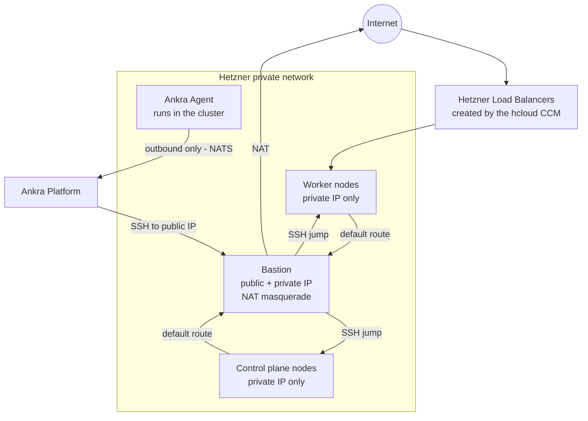

Reference material for [Hetzner clusters](/guides/hetzner-clusters): every configuration parameter, datacenter location, and the details of the infrastructure Ankra provisions.

---

## Cluster Configuration Options

| Parameter | Default | Description |
|-----------|---------|-------------|
| `name` | *required* | Unique cluster name |
| `credential_id` | *required* | Hetzner API credential ID |
| `ssh_key_credential_ids` | *required* | Array of SSH key credential IDs |
| `ssh_key_credential_id` | | Single SSH key credential ID (backward compatible, use `ssh_key_credential_ids` for multiple) |
| `location` | *required* | Hetzner datacenter location |
| `network_ip_range` | `10.0.0.0/16` | Private network IP range |
| `subnet_range` | `10.0.1.0/24` | Subnet range within the network |
| `bastion_server_type` | `cx23` | Server type for the bastion host |
| `control_plane_count` | `1` | Number of control plane nodes |
| `control_plane_server_type` | `cx33` | Server type for control planes |
| `worker_count` | `1` | Number of worker nodes (legacy, use `node_groups` instead) |
| `worker_server_type` | `cx33` | Server type for workers (legacy, use `node_groups` instead) |
| `node_groups` | | Array of node group definitions (see [Node Groups](/guides/hetzner-clusters#node-groups)) |
| `distribution` | `k3s` | Kubernetes distribution |
| `kubernetes_version` | *latest* | Kubernetes version (optional) |
| `include_ingress` | `false` | Deploy the ingress stack (ingress-nginx + cert-manager + Let's Encrypt) |
| `gitops_credential_name` | | GitHub credential name for GitOps integration |
| `gitops_repository` | | GitHub repository for GitOps (e.g., `org/repo`) |
| `gitops_branch` | `master` | Branch for GitOps pushes |

### Hetzner Locations

| Location | Region |
|----------|--------|
| `fsn1` | Falkenstein, Germany |
| `nbg1` | Nuremberg, Germany |
| `hel1` | Helsinki, Finland |
| `ash` | Ashburn, USA |
| `hil` | Hillsboro, USA |
| `sin` | Singapore |

---

## Node Group API

| Endpoint | Method | Description |
|----------|--------|-------------|
| `/api/v1/clusters/hetzner/{id}/node-groups` | GET | List all node groups |
| `/api/v1/clusters/hetzner/{id}/node-groups` | POST | Add a node group |
| `/api/v1/clusters/hetzner/{id}/node-groups/{name}/scale` | PUT | Scale a node group |
| `/api/v1/clusters/hetzner/{id}/node-groups/{name}/instance-type` | PUT | Upgrade instance type |
| `/api/v1/clusters/hetzner/{id}/node-groups/{name}/labels` | PUT | Update labels |
| `/api/v1/clusters/hetzner/{id}/node-groups/{name}/taints` | PUT | Update taints |
| `/api/v1/clusters/hetzner/{id}/node-groups/{name}` | DELETE | Delete a node group |

## Node Actions API

| Endpoint | Method | Description |
|----------|--------|-------------|
| `/api/v1/clusters/hetzner/{id}/nodes` | GET | List all nodes (control plane, workers, bastion) |
| `/api/v1/clusters/hetzner/{id}/nodes/{node_id}` | GET | Get a single node's details |
| `/api/v1/clusters/hetzner/{id}/nodes/{node_id}/restart` | POST | Restart a node (native reboot, falls back to power cycle) |
| `/api/v1/clusters/hetzner/{id}/bastion/instance-type` | PUT | Resize the bastion instance type |

See [Restarting a Node](/guides/hetzner-clusters#restarting-a-node) and [Resizing the Bastion or Gateway](/guides/hetzner-clusters#resizing-the-bastion-or-gateway) for usage examples and response shapes.

## SSH Key API

| Endpoint | Method | Description |
|----------|--------|-------------|
| `/api/v1/clusters/hetzner/{id}/ssh-keys` | GET | List current and available SSH keys |
| `/api/v1/clusters/hetzner/{id}/ssh-keys` | PUT | Update SSH keys on the cluster |
| `/api/v1/clusters/hetzner/{id}/access-info` | GET | Get bastion and control plane IPs |

---

## Architecture

A Hetzner cluster provisions the following infrastructure:

| Component | Description |
|-----------|-------------|
| **Bastion Host** | The only server with a public IP - SSH jump host *and* NAT gateway for all node egress |
| **Private Network** | Isolated network for inter-node communication |
| **Control Plane(s)** | Kubernetes control plane nodes (private IPs only) |
| **Worker(s)** | Kubernetes worker nodes organized in [node groups](/guides/hetzner-clusters#node-groups), each with independent instance types, labels, and taints |
| **SSH Keys** | Deployed to all servers for access (multiple keys supported) |
| **External Cloud Provider** | k3s is configured with `cloud-provider=external` for Hetzner CCM compatibility |



All nodes are deployed within a private Hetzner network and have no public IPs. The bastion host plays two roles:

- **SSH jump host** - Ankra provisions and manages nodes through it, and it is the entry point for `ssh -J` access.
- **NAT gateway** - a network route sends the nodes' default traffic (`0.0.0.0/0`) to the bastion, which masquerades it out through its public IP. All node egress - image pulls, package installs, and the Ankra Agent's outbound connection - flows through the bastion.

<Warning>
Because the bastion is the egress path on Hetzner, stopping or deleting it cuts off internet access for every node in the cluster. This differs from [OVH clusters](/guides/ovh-clusters#architecture), where egress uses a provider-managed gateway and the bastion is only a jump host.
</Warning>

Inbound traffic to workloads does not pass through the bastion: `LoadBalancer` services get Hetzner Load Balancers from the CCM, attached to nodes over the private network.

### Automatic Cloud Integration (hcloud Stack)

Ankra automatically deploys a **hcloud stack** during cluster provisioning. This stack includes:

1. **`hcloud` namespace** - dedicated namespace for Hetzner cloud components
2. **`hcloud-token` secret** - contains your Hetzner API token and network ID, sourced from the credential used to create the cluster
3. **[hcloud-cloud-controller-manager](https://github.com/hetznercloud/hcloud-cloud-controller-manager)** - integrates the cluster with Hetzner Cloud APIs (node metadata, load balancers, node lifecycle)
4. **[hcloud-csi](https://github.com/hetznercloud/csi-driver)** - provides persistent storage using Hetzner Cloud Volumes

The hcloud stack is deployed automatically after the Ankra Agent is installed. The CCM and CSI charts both depend on the `hcloud-token` secret, and Ankra ensures the correct dependency order.

<Note>
You do not need to manually set up the CCM or CSI driver - they are provisioned as part of cluster creation using the same Hetzner API credential you provided.
</Note>

### External Cloud Provider

Hetzner clusters are provisioned with `--kubelet-arg=cloud-provider=external` and `--disable-cloud-controller`. This configures k3s to delegate node initialization to the Hetzner Cloud Controller Manager.

When nodes first join the cluster, they carry a `node.cloudprovider.kubernetes.io/uninitialized` taint that prevents workload scheduling. The CCM removes this taint after initializing each node with its Hetzner provider ID, zone labels, and instance metadata. The Ankra Agent tolerates this taint so it can schedule immediately and begin managing the cluster before the CCM is fully running.

---

## Hetzner Cloud Controller Manager (hcloud-ccm)

The [Hetzner Cloud Controller Manager](https://github.com/hetznercloud/hcloud-cloud-controller-manager) is automatically deployed as part of the hcloud stack and provides:

- **Node metadata** - automatic zone, region, and instance type labels on nodes
- **Load Balancers** - Kubernetes `LoadBalancer` services backed by Hetzner Cloud Load Balancers
- **Node lifecycle** - automatic removal of deleted nodes from the cluster
- **Route management** - pod network routes via Hetzner Cloud Networks

The CCM is deployed in the `hcloud` namespace with 3 replicas and a PodDisruptionBudget. It reads the Hetzner API token from the `hcloud-token` secret that Ankra creates automatically.

### CCM Configuration

The default CCM values configured by Ankra:

```yaml
replicaCount: 3
env:
  HCLOUD_TOKEN:
    valueFrom:
      secretKeyRef:
        name: hcloud-token
  HCLOUD_NETWORK_ROUTES_ENABLED:
    value: "false"
  HCLOUD_LOAD_BALANCERS_ENABLED:
    value: "true"
  HCLOUD_LOAD_BALANCERS_USE_PRIVATE_IP:
    value: "true"
  HCLOUD_LOAD_BALANCERS_DISABLE_PRIVATE_INGRESS:
    value: "true"
  HCLOUD_LOAD_BALANCERS_LOCATION:
    value: "<your-cluster-location>"
networking:
  enabled: true
  clusterCIDR: "10.0.0.0/16"
  network:
    valueFrom:
      secretKeyRef:
        name: hcloud-token
podDisruptionBudget:
  enabled: true
  minAvailable: 1
```

To customize the CCM configuration after creation, edit the `hcloud-cloud-controller-manager` addon in the `hcloud` stack via the Stack Builder.

<Note>
The CCM creates Hetzner Cloud Load Balancers when you create Kubernetes `Service` resources of type `LoadBalancer`. These Load Balancers are managed by Hetzner Cloud, not by Ankra. Delete LoadBalancer services before [terminating the cluster](#terminate-cluster) to avoid orphaned resources and unexpected charges.
</Note>

---

## Hetzner CSI Driver (hcloud-csi)

The [Hetzner CSI Driver](https://github.com/hetznercloud/csi-driver) is automatically deployed as part of the hcloud stack and provides:

- **Dynamic provisioning** - create Hetzner Cloud Volumes on demand via `PersistentVolumeClaim`
- **Volume expansion** - resize volumes without downtime
- **Storage classes** - `hcloud-volumes` StorageClass available out of the box

### CSI Configuration

The default CSI values configured by Ankra:

```yaml
controller:
  replicaCount: 3
  hcloudToken:
    existingSecret:
      name: hcloud-token
  podDisruptionBudget:
    enabled: true
node:
  hostNetwork: true
  hcloudToken:
    existingSecret:
      name: hcloud-token
      key: token
storageClasses:
  - name: hcloud-volumes
    defaultStorageClass: true
    reclaimPolicy: Retain
```

Once deployed, create PersistentVolumeClaims with `storageClassName: hcloud-volumes`:

```yaml
apiVersion: v1
kind: PersistentVolumeClaim
metadata:
  name: my-data
spec:
  accessModes: [ReadWriteOnce]
  storageClassName: hcloud-volumes
  resources:
    requests:
      storage: 10Gi
```

<Note>
The CSI driver creates Hetzner Cloud Volumes when you create PersistentVolumeClaims using the `hcloud-volumes` StorageClass. These Volumes are managed by Hetzner Cloud, not by Ankra. The default `reclaimPolicy` is `Retain`, meaning Hetzner Volumes are **not** deleted when PVCs are removed. Delete PVCs and their backing Hetzner Volumes before [terminating the cluster](#terminate-cluster) to avoid orphaned resources and unexpected charges.
</Note>

---

## Ingress Stack (Optional)

When `include_ingress` is enabled during cluster creation, Ankra deploys an ingress stack alongside the hcloud stack. The ingress stack includes:

1. **[ingress-nginx](https://kubernetes.github.io/ingress-nginx/)** - NGINX-based Ingress controller with a Hetzner Cloud Load Balancer
2. **[cert-manager](https://cert-manager.io/)** - automated TLS certificate management
3. **Let's Encrypt ClusterIssuer** - a `letsencrypt-prod` ClusterIssuer configured for HTTP-01 validation

### Ingress Configuration

The ingress-nginx controller is pre-configured with Hetzner Load Balancer annotations:

```yaml
controller:
  replicaCount: 2
  service:
    annotations:
      load-balancer.hetzner.cloud/location: "<your-cluster-location>"
      load-balancer.hetzner.cloud/use-private-ip: "true"
  podDisruptionBudget:
    enabled: true
    minAvailable: 1
```

cert-manager is deployed with CRDs enabled and 2 replicas:

```yaml
crds:
  enabled: true
replicaCount: 2
podDisruptionBudget:
  enabled: true
  minAvailable: 1
```

### Using Ingress with TLS

Once the ingress stack is deployed, create Ingress resources with automatic TLS:

```yaml
apiVersion: networking.k8s.io/v1
kind: Ingress
metadata:
  name: my-app
  annotations:
    cert-manager.io/cluster-issuer: letsencrypt-prod
spec:
  ingressClassName: nginx
  tls:
    - hosts:
        - app.example.com
      secretName: my-app-tls
  rules:
    - host: app.example.com
      http:
        paths:
          - path: /
            pathType: Prefix
            backend:
              service:
                name: my-app
                port:
                  number: 80
```

<Tip>
Point your DNS record for `app.example.com` to the Hetzner Load Balancer IP (created automatically by ingress-nginx). cert-manager will handle the Let's Encrypt certificate issuance and renewal.
</Tip>
