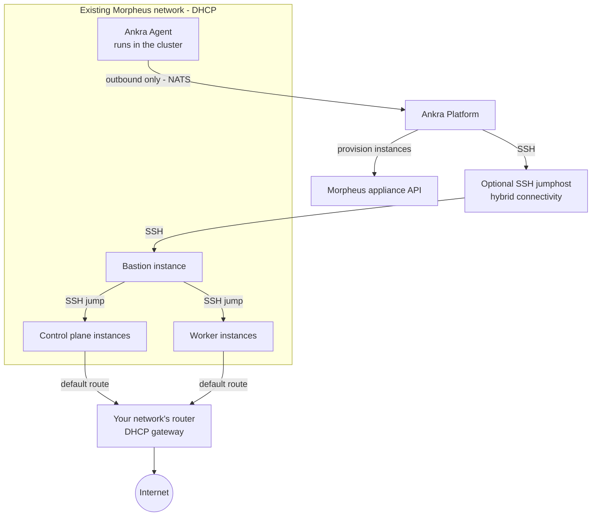

Reference material for [Morpheus clusters](/guides/morpheus-clusters).

<Warning>
Morpheus cluster provisioning is in [closed beta](/guides/morpheus-clusters).
</Warning>

---

## Cluster Configuration Options

All Morpheus IDs are the numeric IDs from your appliance - discover them in the portal's create wizard or with the catalog API routes (groups, clouds, networks, layouts, plans).

| Parameter | Default | Description |
|-----------|---------|-------------|
| `name` | *required* | Unique cluster name |
| `credential_id` | *required* | Morpheus API credential ID |
| `ssh_key_credential_id` | *required* | SSH key credential ID |
| `group_id` | *required* | Numeric ID of the Morpheus group to provision into |
| `cloud_id` | *required* | Numeric ID of the Morpheus cloud to provision into |
| `network_id` | *required* | Numeric ID of the network the instances attach to (must provide DHCP) |
| `layout_id` | *required* | Numeric ID of the instance layout to provision from |
| `virtual_image_id` | | Numeric ID of a virtual image to pin (optional) |
| `bastion_plan_id` | *required* | Numeric service plan ID for the bastion instance |
| `control_plane_count` | `1` | Number of control plane nodes (1, 3, or 5) |
| `control_plane_plan_id` | *required* | Numeric service plan ID for control planes |
| `worker_count` | `1` | Number of worker nodes (legacy, use `node_groups` instead) |
| `worker_plan_id` | *required* | Numeric service plan ID for workers; required even when `node_groups` is given |
| `node_groups` | | Array of node group definitions sized by numeric `plan_id` |
| `distribution` | `kubeadm` | Kubernetes distribution (`kubeadm` or `k3s`) |
| `kubernetes_version` | *latest stable* | Kubernetes version (optional) |
| `cni` | `cilium` (kubeadm), `flannel` (k3s) | CNI plugin. Follows the distribution when omitted; kubeadm clusters always use `cilium` |
| `etcd_topology` | `stacked` | kubeadm only. `stacked` or `external` (dedicated etcd instances) |
| `etcd_node_count` | `3` | kubeadm `external` topology only (3 or 5) |
| `etcd_plan_id` | | kubeadm `external` topology only. Numeric service plan ID for etcd nodes |

<Note>
Cost estimates are not available for Morpheus clusters.
</Note>

---

## Node Group API Reference

| Endpoint | Method | Description |
|----------|--------|-------------|
| `/api/v1/clusters/morpheus/{id}/node-groups` | GET | List all node groups |
| `/api/v1/clusters/morpheus/{id}/node-groups` | POST | Add a node group |
| `/api/v1/clusters/morpheus/{id}/node-groups/{name}/scale` | PUT | Scale a node group (0-100) |
| `/api/v1/clusters/morpheus/{id}/node-groups/{name}/instance-type` | PUT | Change service plan |
| `/api/v1/clusters/morpheus/{id}/node-groups/{name}/labels` | PUT | Update labels |
| `/api/v1/clusters/morpheus/{id}/node-groups/{name}/taints` | PUT | Update taints |
| `/api/v1/clusters/morpheus/{id}/node-groups/{name}` | DELETE | Delete a node group |

## Node Actions API

| Endpoint | Method | Description |
|----------|--------|-------------|
| `/api/v1/clusters/morpheus/{id}/nodes` | GET | List all nodes (control plane, workers, bastion) |
| `/api/v1/clusters/morpheus/{id}/nodes/{node_id}` | GET | Get a single node's details |
| `/api/v1/clusters/morpheus/{id}/bastion/instance-type` | PUT | Resize the bastion instance type |

See [Bastion](/guides/operate-ankra-managed-clusters#bastion) for usage. Node listing and inspection are also available from the CLI (`ankra cluster morpheus nodes list|get`); bastion resize is dashboard and API only. Restarting individual nodes is not yet supported for Morpheus.

---

## Architecture

| Component | Description |
|-----------|-------------|
| **Bastion Instance** | Jump server for SSH access to the cluster nodes |
| **Control Plane(s)** | Kubernetes control plane instances |
| **Worker(s)** | Kubernetes worker instances organised in [node groups](/guides/operate-ankra-managed-clusters#node-groups) |
| **etcd Node(s)** | Dedicated etcd instances, only for kubeadm clusters with an `external` [etcd topology](/guides/operate-ankra-managed-clusters#choices-fixed-at-create-time) |
| **SSH Keys** | Deployed to all instances for access |

All instances are provisioned through your Morpheus appliance into the group, cloud and network you selected, booting from the chosen image with DHCP addressing. Ankra creates no network infrastructure. When an SSH jumphost is configured, Ankra reaches both the Morpheus API and the bastion through it; without one, Ankra connects to the bastion directly.

Morpheus clusters include no cloud controller manager or load balancer integration, and `external_cloud_provider` is not supported.
