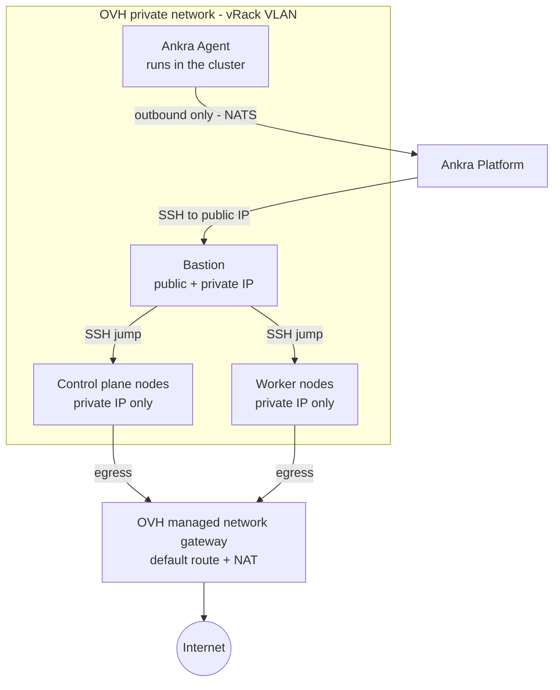

Reference material for [OVH clusters](/guides/ovh-clusters).

---

## Cluster Configuration Options

| Parameter | Default | Description |
|-----------|---------|-------------|
| `name` | *required* | Unique cluster name |
| `credential_id` | *required* | OVH API credential ID |
| `ssh_key_credential_id` | *required* | SSH key credential ID |
| `region` | *required* | OVH Cloud region |
| `network_vlan_id` | `0` | VLAN ID for the private network |
| `subnet_cidr` | `10.0.1.0/24` | Subnet CIDR range |
| `dhcp_start` | `10.0.1.100` | DHCP allocation range start |
| `dhcp_end` | `10.0.1.200` | DHCP allocation range end |
| `gateway_flavor_id` | `c3-4` | Instance flavor for the SSH bastion (the field name predates the bastion rename) |
| `control_plane_count` | `1` | Number of control plane nodes |
| `control_plane_flavor_id` | `b3-16` | Instance flavor for control planes |
| `worker_count` | `1` | Number of worker nodes (legacy, use `node_groups` instead) |
| `worker_flavor_id` | `b3-16` | Instance flavor for workers (legacy, use `node_groups` instead) |
| `node_groups` | | Array of node group definitions (see [Node groups](/guides/operate-ankra-managed-clusters#node-groups)) |
| `distribution` | `kubeadm` | Kubernetes distribution (`kubeadm` or `k3s`) |
| `kubernetes_version` | *latest* | Kubernetes version (optional) |

### OVH Cloud Regions

| Region | Location |
|--------|----------|
| `GRA7` | Gravelines, France |
| `GRA9` | Gravelines, France |
| `GRA11` | Gravelines, France |
| `SBG5` | Strasbourg, France |
| `BHS5` | Beauharnois, Canada |
| `WAW1` | Warsaw, Poland |
| `DE1` | Frankfurt, Germany |
| `UK1` | London, United Kingdom |
| `SGP1` | Singapore |
| `SYD1` | Sydney, Australia |

<Note>
The regions enabled on each OVH project differ. A region that is not enabled on the project's private network fails the reconcile during network setup. List the regions a credential can actually deploy in with `ankra cluster ovh regions --credential-id <credential_id>` before creating a cluster.
</Note>

### OVH Instance Flavors

| Flavor | vCPUs | RAM | Description |
|--------|-------|-----|-------------|
| `b2-7` | 2 | 7 GB | Suitable for the bastion |
| `b2-15` | 4 | 15 GB | General purpose, good for control planes and workers |
| `b2-30` | 8 | 30 GB | Higher performance workloads |
| `b2-60` | 16 | 60 GB | Memory-intensive workloads |

<Note>
Available flavors vary by region. Check the [OVH Cloud catalog](https://www.ovhcloud.com/en/public-cloud/prices/) for your region's offerings.
</Note>

---

## Node Group API Reference

| Endpoint | Method | Description |
|----------|--------|-------------|
| `/api/v1/clusters/ovh/{id}/node-groups` | GET | List all node groups |
| `/api/v1/clusters/ovh/{id}/node-groups` | POST | Add a node group |
| `/api/v1/clusters/ovh/{id}/node-groups/{name}/scale` | PUT | Scale a node group (0 to 100) |
| `/api/v1/clusters/ovh/{id}/node-groups/{name}/instance-type` | PUT | Change instance flavor |
| `/api/v1/clusters/ovh/{id}/node-groups/{name}/labels` | PUT | Update labels |
| `/api/v1/clusters/ovh/{id}/node-groups/{name}/taints` | PUT | Update taints |
| `/api/v1/clusters/ovh/{id}/node-groups/{name}` | DELETE | Delete a node group |

## Node Actions API

| Endpoint | Method | Description |
|----------|--------|-------------|
| `/api/v1/clusters/ovh/{id}/nodes` | GET | List all nodes (control plane, workers, bastion/gateway) |
| `/api/v1/clusters/ovh/{id}/nodes/{node_id}` | GET | Get a single node's details |
| `/api/v1/clusters/ovh/{id}/nodes/{node_id}/restart` | POST | Restart a node (native reboot, falls back to power cycle) |
| `/api/v1/clusters/ovh/{id}/bastion/instance-type` | PUT | Resize the bastion/gateway instance flavor |

See [Restart a node](/guides/operate-ankra-managed-clusters#restart-a-node) and [Bastion](/guides/operate-ankra-managed-clusters#bastion) for how to use them.

---

## Architecture

The managed network gateway (`<cluster>-network-gw`) is the nodes' router and NAT; the bastion (`<cluster>-bastion`, or `<cluster>-gateway` on clusters created before the rename) is an SSH jump host only. See [What Ankra created in your project](/guides/ovh-clusters#what-ankra-created-in-your-project).
