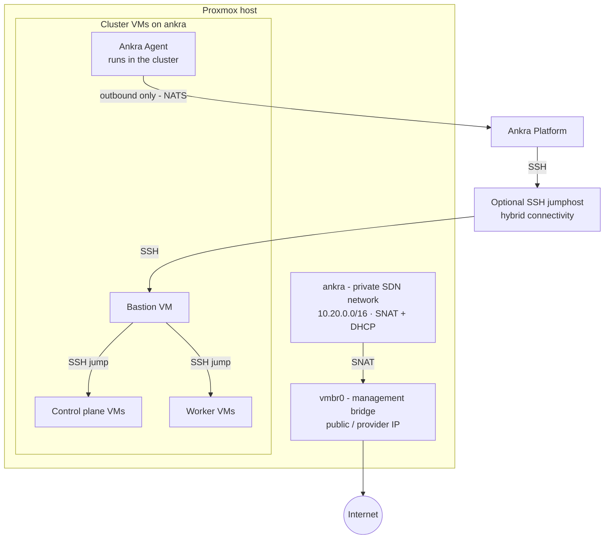

Reference material for [Proxmox VE clusters](/guides/proxmox-clusters).

---

## Cluster Configuration Options

| Parameter | Default | Description |
|-----------|---------|-------------|
| `name` | *required* | Unique cluster name |
| `credential_id` | *required* | Proxmox VE API credential ID |
| `ssh_key_credential_id` | *required* | SSH key credential ID |
| `node` | *required* | Proxmox node that hosts the cluster VMs (and the bastion in host-spread mode) |
| `placement_nodes` | | Two or more Proxmox nodes to spread the Kubernetes VMs across. Requires same-named storage, bridge, and template on every host, plus at least 3 control planes. See [Host-Spread Placement](/guides/proxmox-clusters#host-spread-placement) |
| `bridge` | *required* | Network the VMs attach to: the `ankra` private SDN network (created during credential setup) or a DHCP-served Linux bridge. Credential setup creates `vmbr0` when no bridge exists |
| `storage` | *auto-picked* | Active Proxmox storage for VM disks. Prefers `local-lvm`, then `local` |
| `template` | *auto-picked* | Cloud-init template to clone, by VMID or name |
| `bastion_instance_type` | `px-small` | Instance size for the bastion VM |
| `control_plane_count` | `1` | Number of control plane nodes (1, 3, or 5; at least 3 with `placement_nodes`) |
| `control_plane_instance_type` | `px-medium` | Instance size for control planes |
| `worker_count` | `1` | Number of worker nodes (legacy, use `node_groups` instead) |
| `worker_instance_type` | `px-medium` | Instance size for workers (legacy, use `node_groups` instead) |
| `node_groups` | | Array of node group definitions |
| `distribution` | `kubeadm` | Kubernetes distribution (`kubeadm` or `k3s`) |
| `kubernetes_version` | *latest stable* | Kubernetes version (optional) |
| `cni` | `cilium` (kubeadm), `flannel` (k3s) | CNI plugin (`flannel`, `calico` or `cilium`). Follows the distribution when omitted; kubeadm clusters always use `cilium` |
| `etcd_topology` | `stacked` | kubeadm only. `stacked` or `external` (dedicated etcd VMs) |
| `etcd_node_count` | `3` | kubeadm `external` topology only (3 or 5) |
| `etcd_instance_type` | `px-medium` | kubeadm `external` topology only. Instance size for etcd nodes |

### Instance Sizes

| Size | vCPUs | RAM | Disk | Typical use |
|------|-------|-----|------|-------------|
| `px-small` | 2 | 4 GB | 40 GB | Bastion |
| `px-medium` | 4 | 8 GB | 80 GB | Control plane, general workers |
| `px-large` | 8 | 16 GB | 160 GB | Larger workloads |
| `px-xlarge` | 16 | 32 GB | 320 GB | Heavy workloads |

<Note>
Proxmox VE has no list pricing, so Ankra does not show cost estimates for Proxmox clusters.
</Note>

---

## Node Group API Reference

| Endpoint | Method | Description |
|----------|--------|-------------|
| `/api/v1/clusters/proxmox/{id}/node-groups` | GET | List all node groups |
| `/api/v1/clusters/proxmox/{id}/node-groups` | POST | Add a node group |
| `/api/v1/clusters/proxmox/{id}/node-groups/{name}/scale` | PUT | Scale a node group (0-100) |
| `/api/v1/clusters/proxmox/{id}/node-groups/{name}/instance-type` | PUT | Change instance size |
| `/api/v1/clusters/proxmox/{id}/node-groups/{name}/labels` | PUT | Update labels |
| `/api/v1/clusters/proxmox/{id}/node-groups/{name}/taints` | PUT | Update taints |
| `/api/v1/clusters/proxmox/{id}/node-groups/{name}` | DELETE | Delete a node group |

## Node Actions API

| Endpoint | Method | Description |
|----------|--------|-------------|
| `/api/v1/clusters/proxmox/{id}/nodes` | GET | List all nodes (control plane, workers, bastion) |
| `/api/v1/clusters/proxmox/{id}/nodes/{node_id}` | GET | Get a single node's details |
| `/api/v1/clusters/proxmox/{id}/nodes/{node_id}/restart` | POST | Restart a node (native reboot, falls back to power cycle) |
| `/api/v1/clusters/proxmox/{id}/bastion/instance-type` | PUT | Resize the bastion instance type |

See [Restart a node](/guides/operate-ankra-managed-clusters#restart-a-node) and [Bastion](/guides/operate-ankra-managed-clusters#bastion) for usage. Node listing, inspection, and restart are also available from the CLI (`ankra cluster proxmox nodes list|get|restart`); bastion resize is dashboard and API only.

---

## Architecture

| Component | Description |
|-----------|-------------|
| **Bastion VM** | Jump server for SSH access to the cluster nodes |
| **Control Plane(s)** | Kubernetes control plane VMs |
| **Worker(s)** | Kubernetes worker VMs organised in [node groups](/guides/operate-ankra-managed-clusters#node-groups) |
| **etcd Node(s)** | Dedicated etcd VMs, only for kubeadm clusters with an `external` [etcd topology](/guides/operate-ankra-managed-clusters#choices-fixed-at-create-time) |
| **SSH Keys** | Deployed to all VMs for access |

All VMs are QEMU virtual machines on the Proxmox node (or nodes, with host spread) you selected, attached to the selected network. On `ankra` they receive DHCP addresses from the zone's dnsmasq instance and reach the internet through the host's public interface via SNAT. When an SSH jumphost is configured, Ankra reaches both the Proxmox API and the bastion through it; without one, Ankra connects to the bastion directly.

Proxmox VE clusters include no cloud controller manager or load balancer integration, and `external_cloud_provider` is not supported.
