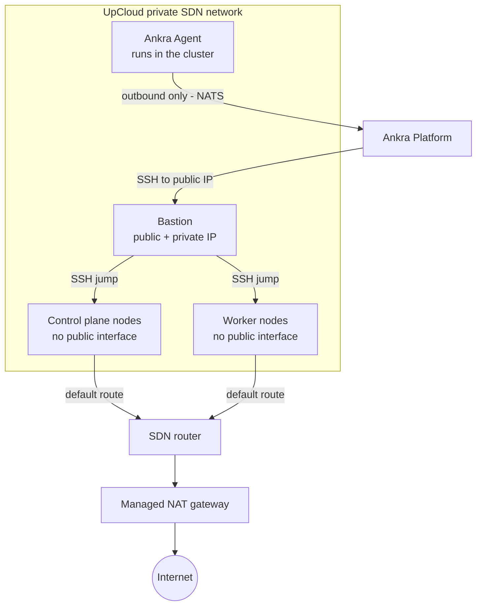

Reference material for [UpCloud clusters](/guides/upcloud-clusters).

---

## Cluster Configuration Options

| Parameter | Default | Description |
|-----------|---------|-------------|
| `name` | *required* | Unique cluster name |
| `credential_id` | *required* | UpCloud API credential ID |
| `ssh_key_credential_id` | *required* | SSH key credential ID |
| `zone` | *required* | UpCloud datacenter zone |
| `zones` | | Zone pool for a multi-zone cluster, must include `zone` (the primary). At least 3 zones and 3 control planes; `kubeadm` only. See [Multi-zone clusters](/guides/upcloud-clusters#multi-zone-clusters) |
| `network_mode` | *derived* | `private_network` or `wireguard_mesh`; `wireguard_mesh` for a pool, and on a single zone it makes the cluster mesh-capable so zones can be added later. On a `wireguard_mesh` cluster the load balancer backends are addressed on the private network rather than the overlay, so `LoadBalancer` Services work unchanged - see [the guide](/guides/upcloud-clusters#loadbalancer-services-on-a-meshed-cluster) |
| `network_ip_range` | `10.0.0.0/24` | Private network IP range. A multi-zone pool takes one consecutive `/24` per zone from this range |
| `bastion_plan` | `STARTER-1xCPU-1GB` | Server plan for the bastion host |
| `control_plane_count` | `1` | Number of control plane nodes (1 or 3) |
| `control_plane_plan` | `PREMIUM-2xCPU-4GB` | Server plan for control planes |
| `worker_count` | `1` | Number of worker nodes (legacy, use `node_groups` instead) |
| `worker_plan` | `PREMIUM-2xCPU-4GB` | Server plan for workers (legacy, use `node_groups` instead) |
| `node_groups` | | Array of node group definitions (see [Node groups](/guides/operate-ankra-managed-clusters#node-groups)) |
| `distribution` | `kubeadm` | Kubernetes distribution (`kubeadm` or `k3s`) |
| `kubernetes_version` | *latest stable* | Kubernetes version (optional) |

### UpCloud Datacenter Zones

| Zone | Location |
|------|----------|
| `fi-hel1` | Helsinki, Finland |
| `de-fra1` | Frankfurt, Germany |
| `us-chi1` | Chicago, United States |
| `nl-ams1` | Amsterdam, Netherlands |
| `uk-lon1` | London, United Kingdom |
| `sg-sin1` | Singapore |
| `au-syd1` | Sydney, Australia |
| `pl-waw1` | Warsaw, Poland |
| `fi-hel2` | Helsinki, Finland (second zone) |
| `se-sto1` | Stockholm, Sweden |
| `es-mad1` | Madrid, Spain |
| `us-nyc1` | New York, United States |
| `us-sjo1` | San Jose, United States |

### UpCloud Server Plans

| Plan | vCPUs | RAM | Monthly Cost |
|------|-------|-----|-------------|
| `1xCPU-1GB` | 1 | 1 GB | $5.00 |
| `2xCPU-4GB` | 2 | 4 GB | $20.00 |
| `4xCPU-8GB` | 4 | 8 GB | $40.00 |
| `8xCPU-16GB` | 8 | 16 GB | $80.00 |

<Note>
Available plans may vary by zone. Check the [UpCloud pricing page](https://upcloud.com/pricing/) for the latest offerings.
</Note>

---

## Node Group API Reference

| Endpoint | Method | Description |
|----------|--------|-------------|
| `/api/v1/clusters/upcloud/{id}/zones` | PUT | Grow a multi-zone cluster's zone pool (`{"zones": [...]}`, primary first; zones are only ever added) |
| `/api/v1/clusters/upcloud/{id}/node-groups` | GET | List all node groups |
| `/api/v1/clusters/upcloud/{id}/node-groups` | POST | Add a node group |
| `/api/v1/clusters/upcloud/{id}/node-groups/{name}/scale` | PUT | Scale a node group (0 to 100) |
| `/api/v1/clusters/upcloud/{id}/node-groups/{name}/instance-type` | PUT | Change server plan |
| `/api/v1/clusters/upcloud/{id}/node-groups/{name}/labels` | PUT | Update labels |
| `/api/v1/clusters/upcloud/{id}/node-groups/{name}/taints` | PUT | Update taints |
| `/api/v1/clusters/upcloud/{id}/node-groups/{name}` | DELETE | Delete a node group |

## Node Actions API

| Endpoint | Method | Description |
|----------|--------|-------------|
| `/api/v1/clusters/upcloud/{id}/nodes` | GET | List all nodes (control plane, workers, bastion) |
| `/api/v1/clusters/upcloud/{id}/nodes/{node_id}` | GET | Get a single node's details |
| `/api/v1/clusters/upcloud/{id}/nodes/{node_id}/restart` | POST | Restart a node (native reboot, falls back to power cycle) |
| `/api/v1/clusters/upcloud/{id}/bastion/instance-type` | PUT | Resize the bastion instance type |

See [Restart a node](/guides/operate-ankra-managed-clusters#restart-a-node) and [Bastion](/guides/operate-ankra-managed-clusters#bastion) for how to use them.

---

## Architecture

The managed NAT gateway on the router carries all node egress; the bastion is an SSH jump host only. On a multi-zone cluster each additional zone gets its own router, private network and NAT gateway, and a WireGuard mesh (`wg0`) joins every node over the account-wide utility network. See [What Ankra created in your account](/guides/upcloud-clusters#what-ankra-created-in-your-account).
